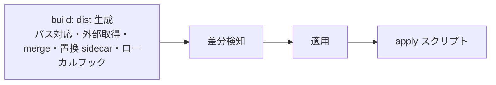

# dotfiles マネージャ spec

`dotfiles/` ツリーから `dist/` ツリーを生成し、dist の内容を home へ差分適用し、その前後でフックを実行するシステムの観測可能な振る舞いを定める。chezmoi を用いない構成における正本であり、読者はこの spec だけを読んで要件を go/no-go するユーザーと、実装・テストの担当者。

- 経路表記: 本文のパスは、build 側はリポジトリルートからの相対パス、差分検知と適用側は home 相対パスとする。
- 用語: home は展開先ディレクトリ（既定は `~`）。適用は dist の内容に home を一致させる処理。差分は dist と home の不一致。フックはライフサイクルの特定のポイントで実行されるリポジトリ内スクリプト。
- dist は home と同じ相対構造を持つ。`.exact`・`.executable`・`.symlink`・`.apply.<拡張子>`・`.apply-machine.<拡張子>` は dist 上の名前のまま残り、差分検知・適用時に解釈される。置換 sidecar は build 時に完成形へ変換され、dist から取り除かれる。`.ignore` で終わるエントリと `node_modules` ディレクトリは build 時に dist へコピーされない。
- chezmoi 命名（`dot_`・`exact_`・`executable_`・`symlink_` の source 名変換）は存在せず、dist に chezmoi の設定ファイル・state も現れない。

## ライフサイクル

`just apply` は次の順でステージを実行する。各ステージの失敗は終了コード非 0 で終了し、後続のステージを実行しない。



build ステージは、内部で次の順に処理する。

1. dist 再構築（コピー時にパス対応表を反映）
2. パス対応表の再適用（入力設定とフックの配置を確定）
3. ローカルフックを一度収集（名前・配置フォルダ・検出時の内容を保存）
4. 外部取得
5. merge 変換
6. 置換 sidecar
7. 保存済みローカルフックの実行

フック完了後はパス対応表・外部取得・merge・置換 sidecar を再実行しない。フックで整形・加工した完成済み dist が、そのまま差分検知の入力になる。パス対応表・外部取得・merge・置換 sidecar が失敗した場合は、フックを実行せず build を異常終了する。

## コマンド

| コマンド | 結果 |
| --- | --- |
| `just apply` | ライフサイクル全体を実行し、home を dist の内容へ更新する |
| `just diff` | build と差分検知までを実行し、差分を表示する。home へ書き込まず、apply スクリプトを実行しない |
| `just managed` | build を実行し、適用対象エントリの home 相対パス一覧を表示する。home を変更しない |

`just apply` / `just diff` / `just managed` はそれぞれ `bun dotfiles-manager <apply|diff|managed>` を呼ぶ。`bun` はディレクトリパスを package.json の `main` で解決するため、エントリファイル名を明示せずに呼べる。内部 CLI は各サブコマンドで後続操作より先に build を実行し、build に失敗すると後続操作を実行せず非 0 で終了する。引数なし、不明なサブコマンド、余分な引数の場合は使用方法を表示して非 0 で終了し、build は実行しない。

内部 CLI の `apply` / `diff` / `managed` では、build の開始に `Build started`、成功時に `Build complete (<秒>s)`、失敗時に `Build failed (<秒>s)` を stdout に表示する。実行する各 build フックの開始には `  Running <path>`、成功時には `  ✓ <path> (<秒>s)`、失敗時には `  ✗ <path> (<秒>s)` を表示する。`<path>` はフックの dist 相対パスであり、フック行の先頭には半角スペースを 2 個置く。build の各フェーズの完了時には `  <フェーズ> (<秒>s)` をフック行と同じインデントで表示する。`<フェーズ>` は dist 再構築の `rebuild dist`、パス対応表の `path map`、外部取得の `externals`、merge 変換の `merge`、置換 sidecar の `replace` であり、行は実行順に現れる。フック自身の stdout / stderr は加工せずに転送し、stdout が改行で終わらない場合は、後続の完了行または失敗行を新しい行に表示する。

build、フック、フェーズの秒数はそれぞれの開始から数え、小数第 2 位まで表示する。後続のコマンド別ステージ（apply / diff / managed）は開始時に `stage <name> start`、成功または失敗時に `stage <name> <success|failure> (<秒>s)` を表示する。最後に `command <name> <success|failure> (<秒>s)` をコマンド開始からの経過秒数とともに stdout に表示する。ログは差分表示や `managed` のパス一覧と同じ stdout に現れる。失敗時のエラー表示先は stderr、終了コードは従来どおりとする。引数が不正な場合は build 前に終了し、経過時間ログを出さない。

内部 CLI は、引数検査の後、build より前に home 単位の排他ロックを取得し、コマンドの終了時に解放する。ロック対象は `<home>/.cache/dotfiles-manager.lock` であり、lockf（fcntl レコードロック）で保持するため、保持プロセスの正常終了・クラッシュ・シグナル終了のいずれでも OS が自動で解放する。別の内部 CLI がロックを保持している間、後続の実行は待機して直列化される。待機の開始時には `Lock held by PID <pid>, waiting...`（保持者の PID をロックファイルから読み取れないときは `Lock held by another session, waiting...`）を stdout に表示し、待機時間に上限を設けず解放を待つ。ロックの競合がなければ待機に関する追加の表示は行わない。待機したコマンドの経過時間ログには待機時間も含まれる。`src/diff.ts` と `src/apply.ts` の直接 CLI はロックを取得しない。Windows では lockf を使えないためロックを取得せず、ロックなしで実行する。

例えば `diff` が成功した場合のログは次の形式になる（差分表示は省略）。

```text
Build started
  rebuild dist (0.31s)
  path map (0.01s)
  externals (0.02s)
  merge (0.00s)
  replace (0.00s)
  Running .config/foo.build.ts
  ✓ .config/foo.build.ts (0.42s)
Build complete (1.20s)
stage diff start
stage diff success (0.08s)
command diff success (1.28s)
```

`bun dotfiles-manager/src/diff.ts [--managed] [--json] [distRoot] [homeRoot]` は build を行わず、指定した dist と home を比較する。引数を省略したときは `dist` と `~` を使う。`--managed` は管理対象の home 相対パスを 1 行ずつ表示し、`--json` より優先する。`--json` は `changed`、`typeMismatches`、`added`、`removedExact`、`removedIgnored` の各分類について home 相対パスの配列を 2 スペースインデントの JSON と末尾改行で出力する。`unchanged` は JSON に含めない。通常の表示は §差分表示 に従う。

`bun dotfiles-manager/src/apply.ts [--dry-run] <distRoot> <homeRoot> [--json]` は build を行わず、指定した dist と home の差分を検知して適用する。`--dry-run` は差分を表示するだけで、home の更新と apply スクリプトの実行を行わない。`--dry-run --json` は `src/diff.ts --json` と同じ分類を出力する。`--json` を単独で指定した通常適用の出力は変わらない。通常適用は差分検知に `diff: <内訳> (<秒>s)`、適用に `apply: <内訳> (<秒>s)`、apply スクリプトの実行に `apply scripts: <数> scripts (<秒>s)` を表示し、`<秒>s` は各処理の開始からの経過秒数である。

`src/diff.ts` と `src/apply.ts` の直接 CLI は成功時に終了コード 0 を返す。必須引数がないとき、位置引数が多すぎるとき（`src/diff.ts`）、dist または home がディレクトリでないとき、または処理に失敗したときは、エラーを stderr に表示して非 0 で終了する。

## build: dist 再構築

dist を削除し、`dotfiles/` をコピーして作り直す。名前が `.ignore` で終わるエントリ（ディレクトリと通常ファイル）、および名前が `node_modules` のディレクトリは、その配下ごと dist へコピーしない。前回実行で dist にあった内容は残らない。コピーは各フォルダの `remap.data.md` を読みながら行い、現行 OS の `-` の key は配下ごとコピーせず、移動先が定まった key は移動先へ直接配置する（§build: パス対応表）。

## build: ローカルフック

`dotfiles/` 以下に、名前が `.build.<拡張子>` または `.build-machine.<拡張子>` で終わる通常ファイルを置くと、同じローカルフックとして扱う。1 フォルダに複数置ける。ローカルフックは、外部取得・merge・置換 sidecar が完了した dist の内容を観測し、対応する dist フォルダ以下の完成エントリを生成・変更・移動・削除できる。処理済みの merge / replace sidecar は消費済みである。生成物の配置はフック自身が決め、生成したエントリや `remap.data.md` への自動の後段パス変換は行わない。フックが生成した external / merge / replace の入力 sidecar を同じ build で処理する構成はサポートしない。

各フックを独立した子プロセスとして実行する。拡張子と runner の規則は §フックシステムに従う。フックは default export した関数として呼び出され、引数に `context` を受け取る。非同期関数の完了を待ってから次のフックへ進む。フックが変更したプロセスの cwd・環境変数・メモリ状態は、別のフックへ引き継がない。

- `cwd`: パス変換後のフック配置に対応する dist 内のフォルダ
- 環境変数: 通常の親プロセス環境をそのまま継承する。追加の環境変数や設定ファイルは提供しない
- フックは `cwd` のフォルダ以下を生成・変更・移動・削除の対象として使う。Bun 実行時の `process.cwd()` はそのフォルダに解決され、`import.meta.dir` から自身の dist 内コピーを参照できる
- `context.resolvePaths(path)`: `path` に `cwd` 相対のファイルパスを渡すと、対応する dist と home の絶対パスを `{ distPath, homePath }` で返す。home 側は §差分検知 の対応関係を使い、親ディレクトリの `.exact`、末尾ファイルの `.executable` / `.symlink` を変換する。現在のファイルの有無にかかわらず解決し、ファイル内容の読み書きや symlink の実体追跡は行わない。`..` を含むパスは dist 内に解決される場合に使える。絶対パス、dist 外に解決されるパス、ファイルを指定しない空パスや末尾が `/`・`.`・`..` のパスはエラーになる。パスの解決はフックの生成・変更・移動・削除の対象範囲を広げない

対応する dist フォルダ以下という生成・変更・移動・削除の範囲はフック作者が守る契約であり、システムはフックの操作先を検証したりサンドボックスで制限したりしない。フック自身は dist へそのまま残り、差分検知と適用の対象外である。

検出と順序:

1. パス対応表の再適用後・外部取得前に、`node_modules/` 以下を除き dist を再帰走査し、上記の名前で終わる通常ファイルの名前・配置フォルダ・内容を保存する。この 1 回だけ検出し、外部取得や別フックが追加した build フックはその build で実行しない。外部取得が既存フックを上書きしても、保存した検出時のスクリプト内容を実行する。現行 OS の対応表で削除される配下のフックは dist に存在しないため検出されない。
2. ルートから順に各フォルダ直下のフックをファイル名の UTF-16 コード単位の昇順で実行し、その後で子フォルダをフォルダ名の UTF-16 コード単位の昇順にたどる。親フォルダのフックは子孫のフックより先に実行する。先頭に来たい処理は、ファイル名の prefix（`01-` など）で制御する。
3. 実行時に保存した配置フォルダがなくなっている場合、そのフックは実行しない。実行時点で配置フォルダが dist 上に残っているフックだけを検出時の順序で実行し、実行の要否はフックを置く場所の選択でフック作者が決める。

フックが終了コード非 0 で終了した、シグナルで終了した、またはエラーが発生したとき、エラーメッセージにフックのパス変換後の dist 相対パスを含めて異常終了する。フックの stdout と stderr は親プロセスの同じ出力へ転送する。エラー発生後は後続のフックを実行しない。dist の rollback と staging による原子的な置換は行わない。

## build: パス対応表

`dotfiles/` 以下の各フォルダに `remap.data.md` を置ける。各フォルダの `remap.data.md` の OS 列は2度適用される。1回目は dist 再構築のコピー時で、dist のルートから親フォルダを子フォルダより先に処理し、`-` の key はコピーせず、移動先が定まった key は移動先へ直接配置する。2回目は dist 再構築後・フック収集前に全表を再適用し、glob key を含む対応を反映して入力設定とフックの配置を確定する。すでに反映済みの key は2回目で変化しない。親の対応表がフォルダを移動したときは、移動後のフォルダで子の対応表を処理する。対応表のないフォルダは変更しない。すべてのパス対応表を終えてから外部取得、merge 変換、置換 sidecar を行う。パス対応自体はローカルフックではなく、フックの実行ログにも現れない。

表の列は `key | linux | windows | macos` の順とし、各行の `key` はその表を置いたフォルダからの相対パス、各 OS 列は次の結果を表す。

| セル | dist での結果 |
| --- | --- |
| 空欄 | 元のパスのまま残す |
| `-` | key に一致するエントリを配下ごと対象外にする。コピー時は配下ごとコピーせず、フック収集前の再適用では配下ごと削除する。`*`・`?`・`[]` を含む key は glob として扱う |
| 相対パス | key のエントリを表の設置フォルダからの相対パスへ配置する。コピー時は移動先へ直接コピーし、フック収集前の再適用では移動先が存在するときに置き換える。key が存在しないときは何もしない |

削除を表の行順に行ってから移動を表の行順に行う。削除の照合では `.exact` ディレクトリの末尾を取り除いたパスと祖先の各パスを照合し、ファイル名の末尾は変換しない。移動先は絶対パスを指定できず、glob key に移動先を指定できない。列・区切り・行が不正な場合、key が空欄または重複する場合は build を異常終了する。`remap.data.md` は dist に残るが、差分検知と適用の対象外である。

たとえば Windows の `vscode` を `AppData/Roaming/Code/User` へ移す場合、`vscode/format-settings.build.ts` は移動先の `dist/AppData/Roaming/Code/User` で実行され、整形済みの `settings.json` が同じフォルダに現れる。macOS で `vscode` を削除する場合、その配下のフックは dist に存在しないため実行されない。先行フックが別のフックの配置フォルダを削除・移動した場合のスキップ規則は §build: ローカルフック に従う。

## build: 外部取得

すべてのパス対応表の適用後、残っている `external.data.yaml` をルートから親フォルダ優先で処理する。`dotfiles/` 以下の各フォルダに置ける。親の対応表で削除された設定は処理せず、移動された設定は移動後のフォルダから読み取る。取得先の `destination` は設定を置いたフォルダからの相対パス。したがって、Linux と Windows では移動後の Rime フォルダへ辞書を取得し、macOS では Rime の設定が削除されるため取得しない。`.agents` が削除される Windows と macOS では skills の外部取得および `run_after` を行わない。

`repos` の各リポジトリは GitHub mirror（既定 `~/mirrors/github.com/<owner>/<repo>`）を使う。mirror がなければ shallow clone し、存在するときは前回の取得から `ttlHours`（既定 6 時間）が経過すると `git pull --ff-only` で更新する。`BUILD_FORCE_PULL=1` は更新を強制する。pull に失敗したときは警告を表示し、手元の mirror を利用する。`entries` のファイルやフォルダを `destination` にコピーし、更新に変更があった場合だけ `run_after` を実行する。`edit` の `.$append` は取得したフォルダ内の対象ファイルに指定テキストを追記する。同じフォルダの `external.data-machine.yaml` があればリポジトリ単位で共有設定を置き換える。このマシン固有ファイルは `dotfiles/` 内の設置階層によらず gitignore の対象となる。失敗時は build を中断する。外部取得はローカルフックの実行ログに現れない。

ルートの `.gitconfig.build.ts` は Linux と Windows で `GitAlias/gitalias` の同じ GitHub mirror・既定 6 時間の更新規則を使い、`gitalias.txt` を dist の `.gitconfig` に追記する。同名の alias が `.gitconfig` に手書きされている場合は手書きの値を有効にする。macOS では追記しない。`.gitconfig` は別ファイルの `.gitconfig.alias` を include しない。

## build: merge 変換

JSON/YAML/TOML/INI の設定ファイルを、home 現状とリポジトリ側レイヤーから build 時に合成し、dist へ完成形を書き出す。

### 入力ファイルの種類

同一ディレクトリ内で、出力ファイル名 `<name>.{json,yaml,toml,ini}` に対し、次の sidecar を使う。

| ファイル | 管理 | 役割 |
| --- | --- | --- |
| `<name>.{json,yaml,toml,ini}` | git | plain base（リポジトリのベース本体。任意） |
| `<name>.merge.{json,yaml,toml,ini}` | git | 共有 merge レイヤー（任意） |
| `<name>.merge-existing.{json,yaml,toml,ini}` | git | 共有の条件付きレイヤー（任意） |
| `<name>.merge-machine.{json,yaml,toml,ini}` | gitignore | マシン固有 merge レイヤー（任意） |
| `<name>.merge-existing-machine.{json,yaml,toml,ini}` | gitignore | マシン固有の条件付きレイヤー（任意） |

上表の sidecar が1つ以上存在するとき、その `<name>.{json,yaml,toml,ini}` は merge ターゲットとなる。上表以外のファイルは sidecar として認識せず、merge ターゲットでないファイルは dist へそのまま残す。

### ターゲット解決

merge ターゲットごとに、次を決める。

- 出力パス: sidecar と同じディレクトリの `<name>.{json,yaml,toml,ini}`
- home パス: 出力パスを、差分検知の対応関係（§差分検知）と同じ規則で home 相対パスへ変換したもの

sidecar 名から出力ファイル名への対応（4形式共通）:

| sidecar | 出力ファイル名 |
| --- | --- |
| `foo.merge.{json,yaml,toml,ini}` | `foo.{json,yaml,toml,ini}` |
| `foo.merge-existing.{json,yaml,toml,ini}` | `foo.{json,yaml,toml,ini}` |
| `foo.merge-machine.{json,yaml,toml,ini}` | `foo.{json,yaml,toml,ini}` |
| `foo.merge-existing-machine.{json,yaml,toml,ini}` | `foo.{json,yaml,toml,ini}` |

入力と出力は同じ拡張子になる。同一出力パスに sidecar が複数あるときは 1 ターゲットにまとめる。

### レイヤーと適用順

`merge-existing` と `merge-existing-machine` を条件付きレイヤーと呼び、解決後の home パスを基準に次の条件で採用する。通常の `merge` と `merge-machine` は home の有無によらず採用する。

| home 対象ファイル | 条件付きレイヤーの扱い |
| --- | --- |
| 存在する（空ファイルを含む） | 存在する条件付き sidecar をパースし、合成に採用する |
| 存在しない | 条件付き sidecar をパースせず、合成に採用しない。不正な内容でもエラーにしない |

合成するターゲットでは、存在し、採用するレイヤーだけを次の順で合成する。合成の起点は `{}`（JSON・TOML・INI。YAML パース結果が null/undefined のときも `{}` 扱い）。

| 順 | レイヤー | ソース |
| --- | --- | --- |
| 1 | home | 上記の home パス。ファイルが存在しない・空のとき `{}` |
| 2 | plain base | 同ディレクトリの `<name>.{json,yaml,toml,ini}`（sidecar ではない本体） |
| 3 | merge | `<name>.merge.{json,yaml,toml,ini}` |
| 4 | merge-existing | `<name>.merge-existing.{json,yaml,toml,ini}` |
| 5 | merge-machine | `<name>.merge-machine.{json,yaml,toml,ini}` |
| 6 | merge-existing-machine | `<name>.merge-existing-machine.{json,yaml,toml,ini}` |

後段レイヤーほど優先される。各レイヤーへの適用は §パッチ適用 に従う。

### dist への出力

merge ターゲットごとに:

1. 採用する sidecar が1つ以上あるとき、合成結果を canonical 形式（§パッチ適用）で `<name>.{json,yaml,toml,ini}` に書き出す。plain base が存在したときは完成形で上書きする。採用する sidecar がないときは合成せず、コピー済みの plain base があれば内容をそのまま残し、なければ出力ファイルを生成しない。
2. ターゲットの全 sidecar を、採用の有無によらず dist から削除する。

### 例

`.agents/config.exact/agents.yaml` + `agents.merge-machine.yaml`（共有 merge なし）:

1. 合成: home → plain base（`agents.yaml`）→ merge-machine
2. 出力: `dist/.agents/config.exact/agents.yaml`。sidecar は削除され、plain base は完成形で上書きされる

`foo.json` と4種類の sidecar が揃い、home に `foo.json` が存在する場合:

1. 合成: home → plain base → merge → merge-existing → merge-machine → merge-existing-machine
2. 出力: `foo.json`。全 sidecar は削除され、plain base は完成形で上書きされる

## build: 置換 sidecar

`<name>.replace.yaml` で、home 現状への正規表現置換の列を宣言する。

```yaml
# dotfiles/<dir>/<name>.replace.yaml
replacements:
  - pattern: "(EnableAutoUpdates)=.*"
    replacement: "${1}=false"
```

merge 変換の後、`<name>.replace.yaml` があるとき次を処理する。

| 条件 | 操作 | 結果 |
| --- | --- | --- |
| home に `<name>` がある | その内容へ replacements を上から順に適用する | 置換結果を dist の `<name>` へ書き出す |
| home に `<name>` がない | 空文字列を入力として replacements を適用する | 置換結果を dist の `<name>` へ書き出す |

- pattern は JavaScript 正規表現、replacement は `${1}` 形式のキャプチャ参照を解釈する。pattern の一致箇所すべてを置換する。
- `<name>` の home パスは、§差分検知 の対応関係規則で完成形の dist 相対パスから解決する。
- どの pattern も一致しない入力は、変化せずそのまま出力になる。
- sidecar 自体は dist から削除され、dist には完成形 `<name>` だけが残る。

## パッチ適用

merge 変換と置換 sidecar の入力となる構造化データ（JSON/YAML/TOML/INI）は、ここで定義する 1 回分のパッチ適用に従う。

### 1 レイヤー内の処理順

1. 操作キー（下記）をレイヤー内の任意の深さから取り除く。
2. 残りのキーをベースへ深くマージする。
3. 取り除いた操作キーを下記の規則でベースへ適用する。

出力に操作キーは残らない。

### 深いマージ（通常キー）

同じキーが両方でプレーンオブジェクトのときだけ再帰し、それ以外（スカラー・配列・オブジェクトと非オブジェクトの組合せ）はレイヤー側の値で丸ごと置き換える。片側にだけあるキーの値は維持する。

### 操作キー（`$append` / `$remove` / `$replace` / `$unset`）

操作キーはレイヤー内の任意のオブジェクトに置ける。キー名が次の形式で、かつ認識条件を満たすものだけが操作キーになる。

```
<local>.$<op>
```

| 部分 | 内容 |
| --- | --- |
| `<local>` | そのオブジェクト内での操作対象の相対パス（例: `bundles`, `provider`） |
| `<op>` | `append` / `remove` / `replace` / `unset` のいずれか |

認識条件:

- `<op>` が上表の 4 種のいずれかである。
- `<local>` が空でない。
- `<local>` に `[` を含まない。

操作キーの `<path>` は、キーを置いたオブジェクトからレイヤーのルートまでの祖先キーを `.` で連結し、`<local>` を末尾に付けたものである。`<path>` に配列インデックス（`[0]` など）は書けない。

認識条件を満たさない `.$` を含むキー（例: `x.$nope`、`a[0].$replace`）は操作キーではなく通常キーとして扱い、深いマージでそのまま出力に残る。

操作キーの値は、その中をさらに走査せず、そのまま操作の値として扱う。

操作キーだけを含むオブジェクトは通常キーのマージに寄与せず、その祖先キーごと欠落として扱う。

### 操作の意味

| キー | `<path>` の値の型 | 値 | 結果 |
| --- | --- | --- | --- |
| `<path>.$append` | 配列 | 要素の配列 | 末尾に追加する。重複していても追加する |
| `<path>.$remove` | 配列 | マッチャの配列 | 一致する要素をすべて削除する（§配列要素の一致） |
| `<path>.$remove` | オブジェクト | キー名の配列 | 列挙されたキーを削除する |
| `<path>.$unset` | 任意 | `true` または値なし | `<path>` が指す値を親から削除する |
| `<path>.$replace` | 任意 | 任意 | `<path>` の値を値で丸ごと置き換える |

`$append` は配列にだけ適用できる。`$remove` は配列とオブジェクトに適用できる。`$replace` と `$unset` は任意の型に適用できる。

### 同一 `<path>` に複数操作があるとき

同じ `<path>` に対して複数の操作キーがあるとき、次の順で適用し、先に適用した結果を次の操作の入力とする。

1. `<path>.$replace` — 存在するとき、`<path>.$unset` / `<path>.$remove` / `<path>.$append` は無視する
2. `<path>.$unset`
3. `<path>.$remove`
4. `<path>.$append`

同じ `<path>.$<op>` のキーが複数あるとき（同一レイヤー内）、値は配列なら要素を連結し、それ以外は後勝ちで上書きする。

### 異なる `<path>` 間の適用順

同一レイヤー内に異なる `<path>` の操作キーが複数あるとき、レイヤー内での出現順に path を 1 つずつ処理し、ある path の操作適用結果を次の path の操作の入力とする。親 path と子 path の両方に操作を書いたとき、出力はレイヤー内での出現順に依存する。

### 配列要素の一致（`$remove` の削除対象）

マッチャと配列要素が次を満たすとき一致する。

| 配列要素の型 | 一致条件 |
| --- | --- |
| 文字列・数値・真偽・null | 値が等しい |
| 配列 | 長さが等しく、同じ位置の要素が一致する |
| オブジェクト | キー集合が等しく、各キーの値が一致する（キーの並びは問わない） |

### 出力形式（canonical）

merge ターゲットの完成形は、毎回同一形式で書き出す。

| 形式 | 規則 |
| --- | --- |
| JSON | 2 スペースインデント、末尾改行 1 つ、改行コード LF |
| YAML | YAML 形式、改行コード LF |
| TOML | TOML 形式、末尾改行 1 つ、改行コード LF |
| INI | UTF-8 / BOM なし、末尾改行 1つ、改行コード LF。値の規則は §INI の操作と出力 |

JSON 数値は、採用する各レイヤーにある有効な JSON 数値トークンを保持する。ネストしたオブジェクト・配列要素・`$replace` / `$append` の更新値も同様とし、小数末尾のゼロ・指数表記・負のゼロ・整数表記を維持する。後段で上書きした値は後段の表記を採用し、`$remove` の一致は表記によらず従来の値で判定する。

JSON の各 merge sidecar および plain base の JSON 入力にはコメント（JSONC）を書ける。TOML の各 merge sidecar および plain base の TOML 入力にはコメントを書ける。

### INI の入力と値

INI はルートのキーと1段のセクションを持ち、値をすべて文字列として扱う。各レイヤーに同じ読み書き規則を適用する。

| 入力 | 読み取り結果 |
| --- | --- |
| UTF-8、先頭の UTF-8 BOM、LF / CRLF | BOM・物理改行を値に含めず受理する |
| 空行、行頭空白後の `#` 行 | 読み飛ばす |
| `[Section]` | 大小文字を区別した単一セクション。名前内の点は文字通り扱う |
| `Key=Value` | 最初の `=` を区切りとし、残りを値とする。行頭のスペース・タブは装飾として扱う |
| 値の前後空白、引用符、`=` / `#` / `;`、数値・真偽値・`null` の表記 | 型変換・引用符除去・コメント除去をせず文字列として保持する |
| 値の `\\` / `\r` / `\n` | それぞれバックスラッシュ1文字・CR・LFへ復号する。それ以外のバックスラッシュ列と末尾バックスラッシュは保持する |
| `Key=` | 空文字列 |

受理する名前は空でなく、前後空白と NUL / CR / LF を含まない。セクション名は角括弧を含まず、ヘッダーの後にはスペース・タブだけを置ける。キー名は `=` を含まず、先頭が `[` / `#` ではない。キー名の点・`[]`・引用符・`;` は通常文字として扱う。

名前と操作対象の各名前について、`Object.prototype` が持つプロパティ名（`__proto__` / `constructor` / `toString` など）と `prototype` は予約名として異常終了する。

同一入力内の通常キー重複・セクション重複は異常終了する。ルート通常キーとセクションが同じ名前になる入力、およびレイヤー間の通常マージで同じルート名が文字列とセクションの両方になる場合も異常終了する。明示的な操作によるセクションの置換・削除は操作規則に従う。

不正 UTF-8、NUL、裸の CR、正しくないヘッダー、通常の裸キー（`=` なし）、上記の名前違反は異常終了する。入力エラーは対象の home 相対パスと、行番号または名前を含む。物理的な多行値は使わず、値内の改行を `\r` / `\n` で記述する。

### INI の操作と出力

INI でも一般の操作キー認識条件・操作順・対象がない場合の規則を適用する。ルートでは単一名を対象とし、セクション内ではそのセクションの単一キーを対象にする。認識された操作の対象名、または操作を置くセクション名に点がある場合は、通常名とパスの区切りが曖昧になるため異常終了する。通常キーとセクション名の点は保持する。

| 記述 | 操作値と結果 |
| --- | --- |
| `Key.$replace=Value` | 文字列で既存の値を置換する |
| `Key.$unset=true` / `Key.$unset=` / 裸の `Key.$unset` | 対象を削除する。実行対象の unset が他の値を持つ場合は異常終了する |
| `Key.$append=...` / `Key.$remove=...` | 値は文字列なので、実行時に配列値必須エラーになる |

新規キーは操作キーではなく通常代入で作成する。replace により無視される unset の値は検証しない。空セクションは保持する。

出力はルートのキーを全セクションより前に置き、それぞれのマップ内では JavaScript のプロパティ列挙順に書く（整数インデックス名は昇順）。セクションを `[Section]`、値を `Key=Value` と書き、値のバックスラッシュ・CR・LFを入力規則の逆にエスケープする。値の引用符・空白は値の一部として保持し、追加の引用符を付けない。コメント・インデント・装飾空白・空行は保持しない。空の合成結果は LF 1つとする。

例: `basic.merge.ini`

```ini
[Output]
Mode=Advanced
[AdvOut]
RecFormat2=mp4
RecRB=true
RecRBTime=1800
OldSetting.$unset=true
```

### 記述例

共有レイヤーで package を追加:

```jsonc
// settings.merge.json
{
  "packages.$append": [
    {
      "source": "https://github.com/makenotion/skills",
      "skills": ["skills/notion-cli"],
      "extensions": [],
      "prompts": [],
      "themes": [],
    },
  ],
}
```

マシン固有で tiers を上書き:

```yaml
# config.merge-machine.yaml
tiers:
  high:
    - provider: cursor
      model: grok-4.6:slow
```

ネストで操作キーを書く。次の 2 つは等価である:

```yaml
# config.merge-machine.yaml
dsh:
  profile:
    "bundles.$replace":
      - provider: cursor
```

```yaml
# config.merge-machine.yaml
"dsh.profile.bundles.$replace":
  - provider: cursor
```

TOML では `$` を含むキー名を quoted key で書く。次の 2 つは等価である:

```toml
# config.merge-machine.toml
[dsh.profile]
"bundles.$replace" = [{ provider = "cursor" }]
```

```toml
# config.merge-machine.toml
dsh.profile."bundles.$replace" = [{ provider = "cursor" }]
```

## 差分検知

dist を再帰走査し、home の対応するエントリと対照する。エントリの対応関係は、dist の相対パスを次の規則で home 相対パスへ変換したものとする。

| dist 上の名前 | 対応する home 相対パス |
| --- | --- |
| 通常の名前 | そのままの名前 |
| `<name>.exact`（ディレクトリ） | `<name>`（`.exact` を除いた名前） |
| `<name>.executable` | `<name>` |
| `<name>.symlink` | `<name>` |

内容の比較は次の規則に従う。通常ファイルは、両方の内容が厳密に UTF-8 として復号でき、NUL を含まないときにテキストとして扱う。それ以外はバイナリとして扱う。

- テキスト比較のとき、CR を除去し、末尾の LF を 1 個除去して比較する。CRLF と LF、末尾改行 1 個の有無は同一視する。JSON/JSONC の空白・末尾カンマは通常の内容差として扱う。
- バイナリ比較のとき、バイト列が一致するかを比較する。
- symlink は、リンク先（末尾改行 1 つを除いた内容）を比較する。
- 実行権は、linux と darwin で owner 実行権の有無を比較する。windows では実行権を比較しない。

dist の相対パスの各要素が `.build` で始まるエントリ、名前に `.data.` を含むエントリ、名前が `external.data-machine.yaml` のエントリ、および名前が `.build.<拡張子>`、`.build-machine.<拡張子>`、`.apply.<拡張子>`、`.apply-machine.<拡張子>` で終わるファイルは、差分検知と適用の対象外である。`external.data.machine.yaml` は `.data.` を含むため同じく対象外となる。`.data.` は build ステージのデータファイルのための予約名であり、`.build` 接頭辞はリネーム前のデータファイル名との互換のために残す。フックが生成した `node_modules/` は通常のエントリと同じく差分検知・適用の対象になる。`<name>.machine.{json,yaml,toml,ini}` と `.edit.ts` は、上記の除外条件に当たらなければ通常のエントリとして差分検知・適用される。`.edit.ts` は build フックとして実行されない。

| dist | home | 分類 |
| --- | --- | --- |
| あり | あり・同種・内容と実行権が同一 | 変更なし |
| あり | あり・同種・内容または実行権が異なる | 変更 |
| あり | あり・種別が異なる（ファイル⇔ディレクトリ⇔symlink） | 種別不一致 |
| あり | なし | 追加 |
| なし | あり | 余剰 |

## 差分表示

`just diff` と直接 CLI の通常表示は、変更・種別不一致・追加・余剰（exact 対象）の各エントリごとに、色付きの 2 入力比較を表示する。

| 条件（両ファイルの内容） | 表示 |
| --- | --- |
| テキストの行末の違いのみが異なる | 出力しない |
| それ以外の内容差分がある | diff を表示する |

- 通常ファイルの表示要否は §差分検知 と同じテキスト・バイナリ判定で決める。テキストでは CR を除去し、末尾の `\n` を 1 個除去して比較する。行末だけが異なる場合は表示しない。他の内容差がある場合は元の入力を比較して表示するため、行末差も diff に現れ得る。バイナリではバイト列が異なれば表示する
- 両入力がテキストファイルで、JSON/JSONC 以外かつ `difft` が PATH にあるときは `difft --color=always --display=inline --skip-unchanged --strip-cr=on --syntax-highlight=on` で表示する。テキストでそれ以外の場合は `git diff --no-index --ignore-cr-at-eol --color=always`、バイナリの場合は `git diff --no-index --color=always` で表示する
- 追加エントリは dist 側を、削除エントリは home 側を、それぞれ空の入力として比較する
- diff ツールの終了コード（差分ありを表す 1 を含む）は `just diff` の終了コードに影響しない

## 適用

分類ごとに次の操作を行う。操作順序は、削除伝播・種別不一致の解消を先に行い、その後ツリー順に追加・変更を適用する。

| 分類 | 操作 | 結果 |
| --- | --- | --- |
| 追加 | 親ディレクトリを必要に応じて作成し、エントリを配置する | home に dist と同じ内容のエントリが現れる |
| 変更（内容） | 一時ファイルへ書き出した後、rename で置換する | home の内容が dist と一致する。書き込み途中の状態が home に現れない |
| 変更（実行権） | 実行権を設定する | home の実行権が dist の規則と一致する |
| 変更（symlink のリンク先） | 既存リンクを削除し、改めて symlink を作成する | リンク先が一致する |
| 種別不一致 | home 側エントリを削除し、追加として処理する | home に dist と同種のエントリが現れる |
| 余剰（各 `.exact` ディレクトリに対応する home ディレクトリの直下） | 削除する | home から消える |
| 余剰（それ以外） | 何もしない | home に残る |

適用処理の間、エラーが発生したときは後続のエントリを適用せず、終了コード非 0 で終了する。既に適用したエントリを元に戻さない。

### `.exact` の解釈

dist の `<name>.exact` ディレクトリは、home の `<name>` ディレクトリに対応し、直下の余剰エントリを常に削除する。余剰がディレクトリのときはその配下ごと消える。通常の子ディレクトリの内部は余剰管理の対象外であり、home 側だけのファイルは残る。子ディレクトリも `.exact` なら、その直下の余剰エントリも削除する。

### `.symlink` の解釈

dist の `<name>.symlink` ファイルは、home の `<name>` へ symlink として配置する。リンク先はファイル内容（末尾改行 1 つを除く）で、相対パスはリンクが置かれるディレクトリから解決する。既存 symlink のリンク先が一致するとき、再作成しない。

### `.executable` の解釈

dist の `<name>.executable` ファイルは、home の `<name>` に owner 実行権を付けて配置する。windows では実行権の処理を行わず、ファイル名はそのまま使う。

## フックシステム

フックはフォルダ置き型で、ポイントごとに決まった名前のファイルを `dotfiles/` の任意のフォルダへ置くことで宣言する。

| ポイント | 宣言ファイル | 実行タイミング | 標準入力 | 失敗時の結果 |
| --- | --- | --- | --- | --- |
| build | `*.build.<拡張子>`、`*.build-machine.<拡張子>` | 外部取得・merge・置換 sidecar の完了後（§build: ローカルフック のとおり） | なし | dist 生成を中断する |
| apply | `*.apply.<拡張子>`、`*.apply-machine.<拡張子>` | 適用の後（§apply スクリプト のとおり） | なし | 後続の apply スクリプトを実行せず、非 0 で終了する |

build / apply のフックは `.ts` ファイルだけをサポートし、Bun で実行する。`.sh`、`.bash`、`.ps1` を含むその他の拡張子は未対応である。shebang の有無や内容は runner の選択に影響しない。未対応拡張子はエラーにし、build ではパス変換後の dist 相対パス、apply では dist 相対パスをエラーメッセージに含める。

## apply スクリプト

| 条件 | 操作 | 結果 |
| --- | --- | --- |
| dist に `.apply.<拡張子>` または `.apply-machine.<拡張子>` で終わるファイルがある | home へ配置せず、適用の後で実行する | スクリプトの副作用が生じる |
| 実行のたび | 実行ディレクトリは、そのファイルの位置（`.exact` を除いた名前）に対応する home ディレクトリである | 対応する home ディレクトリを cwd としてスクリプトが動く |
| 実行が非 0 で終了する | 後続の apply スクリプトを実行せず、非 0 で終了する |  |

実行対象は適用前に一度収集し、検出時のスクリプト内容を実行する。実行順序は dist 相対パス全体の UTF-16 コード単位の昇順とする。先行スクリプトが検出済みスクリプトを移動または削除しても、収集時の順序と内容で実行する。スクリプトは元の dist 相対パスを基準に読み込み、cwd はそのパスに対応する home ディレクトリとする。apply スクリプトの実行は適用の後の apply ライフサイクルの一部であり、`just diff` では実行しない。

## エラーと終了コード

| ステージ | 失敗時の結果 |
| --- | --- |
| build（ローカルフック・パス対応表・外部取得・merge・置換 sidecar を含む） | 非 0 で終了する。後続ステージを実行しない |
| 差分検知 | 非 0 で終了する。適用しない |
| 適用 | 後続のエントリを適用せず非 0 で終了する。既に適用した分を戻さない |
| apply スクリプト | 後続を実行せず非 0 で終了する |

build 内のデータ変換エラーのメッセージと振る舞い:

| 条件 | 振る舞い |
| --- | --- |
| `<path>.$append` の `<path>` が配列でない | `merge append requires array at path: <path>` を出力して異常終了 |
| `<path>.$remove` の `<path>` が配列でもオブジェクトでもない | `merge remove requires array or object at path: <path>` を出力して異常終了 |
| `<path>.$append` / `<path>.$remove` の値が配列でない | `merge <op> value must be array: <path>.$<op>` を出力して異常終了 |
| `<path>.$remove`（オブジェクト）の値の要素が文字列でない | `merge remove object keys must be strings: <path>.$<op>` を出力して異常終了 |
| `<path>` がベースに存在しない（`$unset` / `$remove` / `$replace`） | 何もしない（エラーにしない） |
| `<path>` がベースに存在しない（`$append`） | `merge append path not found: <path>` を出力して異常終了 |

エラーメッセージには、失敗したフックの相対パスまたはエントリの home 相対パスを含める。エラー発生後は後続の処理を行わず、dist の rollback は行わない。
