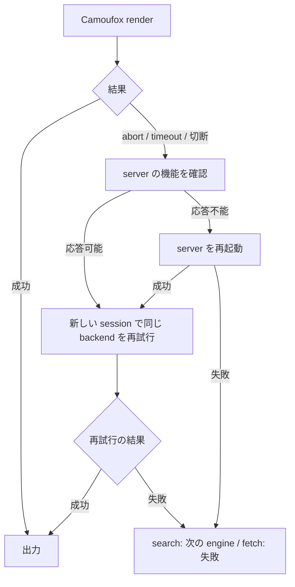

# browse CLI spec

コマンド `browse` の仕様。サブコマンド `search` / `fetch` / `server` / `display` を持ち、人間とコーディングエージェントが、Web 検索と URL フェッチと camoufox server の管理をコマンドラインから実行するための CLI。

usage:

```
usage: browse search "<query>" [--lang <code>] [--json]
       browse fetch <url> [--json]
       browse login twitter
       browse server start
       browse server restart
       browse display show
       browse display hide
```

## 前提と依存

- SERP 解析は openserp（既定 `http://127.0.0.1:7000`）に依存し、ブラウザ描画は camoufox（既定 `ws://127.0.0.1:9378/camoufox`）に依存する
- YouTube のメタデータ・字幕取得は yt-dlp に依存する。PATH 上の yt-dlp を使い、無いときは `uvx yt-dlp@latest` で実行する。uv も無いときは YouTube backend が失敗し、後続の backend へ進む
- Twitter のタイムライン・検索・リプライ取得は同梱の Python スクリプト `scripts/twikit_client.py`（twifork パッケージ）に依存し、`uv run --no-project` で起動する。cookie は `<XDG_CACHE_HOME または ~/.cache>/pi/web-search/twitter-cookies.json` に保存する
- GitHub API は `GITHUB_TOKEN` または `GH_TOKEN` 環境変数があれば認証付きで呼ぶ。discussions の GraphQL は token が必須で、無いときは GitHub backend が失敗する
- `OPENSERP_BASE_URL` / `CAMOUFOX_BASE_URL` 環境変数で接続先を変更できる
- openserp が未起動のときは `openserp serve` をバックグラウンド起動し、`/ready` 応答を 250ms 間隔で待ち、15 秒で断念する
- camoufox server は `browse` 自身の内部サーバーモード（`browse __server`。usage には出ない）として起動する。server が未接続のときは `browse server start` をバックグラウンド起動し、websocket 接続（1 接続 1 秒上限）で healthy を判定し、250ms 間隔で再プローブして 15 秒で断念する
- camoufox server と `browse server start` のログは `<XDG_CACHE_HOME または ~/.cache>/pi/web-search/` 配下の `camoufox-server.log` へ、Xvfb と x11vnc の出力は同じディレクトリの `xvfb.log`・`x11vnc.log` へ追記する
- camoufox server は起動してポートの待受を確立した時点で、自身の PID を `<XDG_CACHE_HOME または ~/.cache>/pi/web-search/camoufox-server.pid` へ書く
- playwright-cli のブラウザは firefox で、remote endpoint に camoufox を使う。セッションキーは検索が `web-search-<n>`、フェッチが `web-fetch-<n>`、server の機能ヘルスチェックが `web-health-<n>`（`<n>` は render スロット番号。`flock(1)` が無い環境ではプロセスの PID）で、同時に走る render と機能ヘルスチェックが同じセッションを共有しない。各実行の冒頭と終了時にセッションを閉じる
- camoufox を使う `search` と `fetch` は、render スロットセマフォ（既定 4 スロット）で並列実行する。スロットは `flock(1)` に依存し、利用できない環境では待ち合わせせずに実行する。スロットの獲得は、コマンド自身を内部サブコマンド `__locked`（usage には出ない）付きで空いているスロットの `flock(1)` の下へ再実行することで行う。4 スロットすべてが埋まっていれば待つ。待機中と獲得の直後には restart ロックの保持を探知し、server 再起動（`browse server restart`・render 復旧のいずれか）が進行していれば、まだ render を開始していない分はその完了まで让位する。これにより再起動はスロット待ちの先頭に割り込み、完了後、让位した待機がスロットを取り直す。`__locked` が直接渡された実行はスロットを取得せずにコマンド本体を実行する。この再入は、スロット保持中の search / fetch が detached で server 起動を依頼するときにも使う
- `browse server restart` は restart ロックと 4 つすべての render スロットを `flock(1)` で獲得してから再起動する。実行中の render は完了まで、新規の render は再起動完了まで待たされる。`flock(1)` が無い環境では獲得せずに再起動する
- render 復旧に伴う server 再起動は restart ロックで仲裁する。restart ロックを獲得した側は、自分の render スロット以外を獲得してから再起動する（自身のスロットは呼び出し元が保持中のため、4 スロットすべてが再起動中に排除される）。獲得できなかった側は再起動を申請せず、server の healthy を 15 秒まで待つ
- Reddit / StackOverflow / YouTube / Twitter / Hacker News / Wikipedia / arXiv の専用経路と `server start` は render スロットを取得しない。GitHub は camoufox へのフォールバックを持つため取得する

## 共通の振る舞い

| 条件・状態 | 操作 | 結果 |
| --- | --- | --- |
| `--json` がある | 成功時 | 単一の JSON を stdout へ出力する（jq でパース可能） |
| `--json` がない | 成功時 | markdown を stdout へ出力する |
| すべての backend が失敗した | 実行 | `All <operation> backends failed: <backend>: <error>; ...`（`<operation>` は `web search` または `web fetch`）を 1 行 stderr へ出力し、終了コード 1 で終わる |
| render が abort される | 実行 | ページopen・closeによる機能ヘルスチェックを行い、応答不能ならserverを自動再起動して同じbackendを再試行する。自動復旧後も全backendが失敗した場合は、`All ... failed` 行の次行へ `Hint: ...` 形式で手動の `browse server restart` を案内する |
| challenge / captcha を検出した | 実行 | 同一 backend を1回だけ新しいsessionで再試行し、それでも失敗したら次のbackendへ進む |
| Camoufoxのrenderがabort・timeout・切断した | 実行 | serverの機能ヘルスチェックを行う。応答不能ならserverを再起動してから新しいsessionで同じbackendを再試行する。再起動はrestartロックで仲裁し、自分以外のrenderスロットの完了を待って再起動する。仲裁に負けた側は再起動を申請せず、再起動の完了を15秒まで待つ。1コマンド全体のserver復旧再試行は1回までとし、失敗後は次のbackendへ進む |
| `search` または camoufox 経路の `fetch` が同時に起動された | 実行 | 空いている render スロットで並列実行する（上限 4）。すべてのスロットが埋まっていたら先に開始した実行の完了を待つ。待機中に server 再起動が進行を始めたら、未開始の待機は再起動に让位する（再起動が待ち行列の先頭に割り込む。render 開始済みの分は完了を待つだけ）。Reddit / StackOverflow / YouTube / Twitter / Hacker News / Wikipedia / arXiv の専用経路はスロットを取得せず待ち合わせない。`login` は camoufox を使うためスロットを取得する |
| サブコマンドがない・未知のサブコマンドを渡した | 実行 | usage を stderr へ出力し、終了コード 1 で終わる |
| 未知のフラグを渡した | 実行 | 対象サブコマンドの usage 行を stderr へ出力し、終了コード 1 で終わる |
| 必須引数が不足している（位置引数 0 個） | 実行 | 対象サブコマンドの usage 行を stderr へ出力し、終了コード 1 で終わる |
| 位置引数が 2 つ以上ある | 実行 | 対象サブコマンドの usage 行を stderr へ出力し、終了コード 1 で終わる |
| 値を要求するフラグが引数の末尾にあり、値を取れない | 実行 | 対象サブコマンドの usage 行を stderr へ出力し、終了コード 1 で終わる |
| 値を要求するフラグの直後の引数 | 扱い | `--` 始まりかどうかを検査せず、そのまま値として使う |
| 単一ダッシュで始まる引数（`-` を含む） | 扱い | フラグではなく位置引数として扱う |
| `server` の action がない・未知の action を渡した・余分な引数を渡した | 実行 | `browse server` の usage を stderr へ出力し、終了コード 1 で終わる |
| `display` の action がない・未知の action を渡した・余分な引数を渡した | 実行 | `browse display` の usage を stderr へ出力し、終了コード 1 で終わる |

| 対象 | タイムアウト |
| --- | --- |
| server 起動待ち・セッション close・restart ロック競合時の再起動完了待ち | 15 秒 |
| `browse server restart` の停止待ち（SIGTERM を送ってから SIGKILL に上げるまで） | 10 秒 |
| ページ open・ナビゲーション・DOM 取得 | 30 秒 |
| openserp パース・trafilatura 変換・Reddit の各要求・StackOverflow の各要求・GitHub API の各要求・Hacker News / Wikipedia / arXiv / RSS / fxtwitter の各要求 | 15 秒 |
| yt-dlp による YouTube メタデータ・字幕の取得 | 60 秒 |
| `twikit_client.py` の実行（login・ツイート・タイムライン・検索） | 120 秒 |
| challenge 検出待ち | networkidle 待ち 5 秒・上限 5 秒（250ms 間隔で DOM ポーリング） |
| server機能ヘルスチェック | ページopen・closeを含めて5秒 |
| 再試行 | 1コマンドあたりserver復旧を伴う再試行は1回。challengeの再試行はbackendごとに1回 |

challenge / captcha の検出は、Cloudflare 系シグナルと Google 固定ページ（CAPTCHA/sorry、JS リトライのみの soft block）の構造シグナルで行い、ロケール依存の文言は使わない。

## fallback / retry の流れ

Camoufox の render failure には自動復旧を適用する。Reddit / StackOverflow の専用経路には適用しない。challenge / captcha の再試行は共通の振る舞い表に従う。

| 経路 | 取得方法 | render failure 時の扱い |
| --- | --- | --- |
| `search` | Google → DuckDuckGo → Bing | 同じ engine の再試行後、次の engine へ進む |
| `fetch` の Reddit | 専用経路（RSS → embed → oEmbed） | Camoufox を使わない |
| `fetch` の StackOverflow | 専用経路（StackExchange API → 質問フィード） | Camoufox を使わない |
| `fetch` のその他 URL | Camoufox → trafilatura | 次の図に従う |

### Camoufox render failure



server の復旧を伴う再試行は1コマンド全体で1回までとする。詳細な timeout、stderr、JSON 出力は各コマンドの表に従う。

## `browse server start`

camoufox server の起動を保証する冪等なサブコマンド。CLI 内部（search / fetch の server 確保）と共通 startup script の priming の両方が、このサブコマンドを detached に起動する。

| 条件・状態 | 操作 | 結果 |
| --- | --- | --- |
| camoufox server が起動済み（websocket 接続が成功する） | 実行 | 何もせず終了コード 0 で終わる |
| camoufox server が未起動 | 実行 | 内部サーバーモードをバックグラウンド起動し、websocket 接続が成功するまで 250ms 間隔で待ち、終了コード 0 で終わる |
| 待ちが 15 秒に達した | 実行 | エラー 1 行を stderr へ出力し、終了コード 1 で終わる |
| 起動に失敗した server がポートを占有している | 実行 | 2 番目以降の server はポート衝突で終了する（先の server が serve を続けるため無害） |

## `browse server restart`

hang した camoufox server の復旧用に、実行中の server を停止して起動し直す。

| 条件・状態 | 操作 | 結果 |
| --- | --- | --- |
| 実行 | 排他 | restart ロックと 4 つすべての render スロットを `flock(1)` で獲得してから再起動する。`flock(1)` が無い環境では獲得せずに再起動する |
| 実行 | 停止 | 停止対象は常に「PID ファイルの対象（Linux では `/proc/<pid>/cmdline` で実行中のbrowseスクリプトと `__server` 引数を検証する）」と「`pgrep -f <browse スクリプト> __server` 掃引」の和集合である。対象へ SIGTERM を送り、10 秒以内に終了しなければ SIGKILL する |
| 停止後 | 実行 | `browse server start` と同じ手順で起動し直し、ready を待つ |
| 実行中の server が無い | 実行 | 停止を飛ばして `browse server start` の手順で起動する |

## `browse login twitter`

共有 camoufox ブラウザで X (Twitter) に人間がログインし、後続の Twitter 取得用に cookie を保存するサブコマンド。X がパスワードログイン flow を廃止したため、CLI は認証情報を受け取らず人間のブラウザ操作に頼る。利用には X アカウントが必要で、スクレイピングはアカウント凍結リスクを伴うため捨てアカウントの使用を推奨する。

| 条件・状態 | 操作 | 結果 |
| --- | --- | --- |
| 実行 | 準備 | render スロットを取得した上で camoufox server を確保し、session `twitter-login` で `https://x.com/login` を開く。x11vnc が利用可能なら VNC 接続受付を開く（`display show` と同じ要求。失敗時は無視して続行する） |
| 準備後 | 待ち合わせ | 「ログイン待ち」である旨と `browse display show` の案内を stderr へ出力し、x.com / twitter.com の cookie に `auth_token` が現れるまで poll する。poll 間隔 5 秒、上限 10 分 |
| `auth_token` を確認したら | 保存 | x.com / twitter.com の cookie を `twifork` の `load_cookies` が受け付ける `{name: value}` の flat JSON に変換し、`<XDG_CACHE_HOME または ~/.cache>/pi/web-search/twitter-cookies.json` に保存する |
| 保存成功 | 終了 | `Logged in. Cookies saved to <path>` を1行 stdout へ出力し、終了コード 0 で終わる |
| 上限の 10 分を過ぎた | 実行 | エラー 1 行を stderr へ出力し、終了コード 1 で終わる |
| 実行の冒頭と終了 | 実行 | `twitter-login` session を閉じる（cookie / ページ状態の持ち越し防止。冒頭の閉鎖失敗は無視） |

## `browse display show` / `browse display hide`

Xvfb `:99` 上の headed browser を VNC で人間へ引き継ぐための接続受付を切り替える。ブラウザ、ページ、cookie、playwright-cli セッションは再起動しない。headless browser そのものを headed に変更する操作ではない。

| 条件・状態 | 操作 | 結果 |
| --- | --- | --- |
| `browse display show` を実行し、稼働中の x11vnc を制御できる | `:99` の VNC 接続受付を開く | 新しい VNC 接続を受け付け、終了コード 0 で終わる |
| `browse display hide` を実行し、稼働中の x11vnc を制御できる | 新しい VNC 接続を拒否し、接続中のクライアントを切断する | 画面を非公開にし、終了コード 0 で終わる |
| x11vnc が未導入、VNC server が未起動、または `:99` を制御できない | 実行 | エラー 1 行を stderr へ出力し、終了コード 1 で終わる |

## camoufox server のモード

内部サーバーモード（`browse __server`）の表示モード、補助プロセス、実行環境、終了時の振る舞い。依存パッケージ（`xvfb`・`x11vnc`）は dotfiles bootstrap が導入する。

表示モードは次の条件で決まる:

| 条件 | 表示モード |
| --- | --- |
| `CAMOUFOX_HEADLESS=1` | headless |
| `CAMOUFOX_HEADLESS=0` | headed |
| それ以外（未指定・1 と 0 以外の値） | Windows は headless、Windows 以外の OS は headed |

headless のときは Xvfb も x11vnc も起動しない。headless と headed の両方で Firefox の content・GMP・RDD・socket process sandbox を有効に保つ。headed のとき、server は起動時に次のとおり補助プロセスを整える:

- ディスプレイの socket（`/tmp/.X11-unix/X99`。ファイルシステム socket または Linux abstract socket）が存在しなければ `Xvfb :99` をバックグラウンドで起動し、socket が出現するのを待ってからブラウザを起動する。10 秒以内に出現しなければ起動を断念し、server はエラーメッセージを出力して終了コード 1 で終わる
- ブラウザは起動時に `DISPLAY=:99` と Wayland の無効化（`MOZ_ENABLE_WAYLAND=0`）を与えられ、ウィンドウは Xvfb の :99 へ出る。`WAYLAND_DISPLAY` がある環境（WSLg など）でも、実画面（Wayland・XWayland を含む）にはウィンドウを表示しない
- x11vnc が PATH に存在しポート 5900 ですでに待ち受けていなければ、`-deny_all`（既定は誰も接続できない）付きでバックグラウンド起動して、人間が VNC でページを引き取れる状態にする。x11vnc が PATH に無ければ警告をログへ出して続行する（画面の引き取りだけが使えない）
- Xvfb と x11vnc は server より長生きする detached プロセスで、server は起動のたびに両者の存在を再確認し、無いときだけ起動する

画面の公開はブラウザの再起動を伴わない。VNC 接続の受付は `browse display show` / `browse display hide` で切り替える。

server の実行環境は環境変数で上書きできる:

| 変数 | 上書き対象 | 未指定時の解決 |
| --- | --- | --- |
| `CAMOUFOX_EXECUTABLE_PATH` | camoufox ブラウザの実行ファイル | `~/.cache/camoufox/camoufox-bin` |
| `CAMOUFOX_PLAYWRIGHT_CORE` | server が使う playwright-core | playwright-cli 内蔵の playwright-core（PATH 上の `playwright-cli` の場所から解決） |

fingerprint 生成に使う camoufox-js は、候補ディレクトリ（`~/.dsh/plugins/web-search`・`~/.pi/agent`）から順に解決する。

server は SIGINT / SIGTERM を受け取ったとき、PID ファイルから自身の PID を清除して browser server を close し、終了コード 0 で終わる。Xvfb と x11vnc はこの時点で停止せず、次回の server 起動で再利用される。

## `browse search "<query>"`

| 条件・状態 | 操作 | 結果 |
| --- | --- | --- |
| 引数あり | 検索実行 | engine を google → duckduckgo → bing の順で試行し、最初に成功した engine の結果上位 10 件を出力する |
| google の結果の `url` が相対参照（ルート相対・パス相対・query・fragment・protocol-relative） | 検索結果を出力 | 検索ページの URL を基準に絶対 URL へ補完する。例: `/goto?url=…` は `https://www.google.com/goto?url=…`。転送先確認を含め、補完のための追加リクエストは行わない |
| 結果の `url` が絶対 URL・空文字列・欠損、または engine が google 以外 | 検索結果を出力 | URL の補完を行わず、前後の空白を除いた URL を出力する。空文字列・欠損の URL は出力を省略する |
| `--lang <code>` がある | 検索実行 | `<code>` を小文字へ正規化する。google は `hl` へ常に設定し、`gl` は対応表にある lang のみ設定する。bing の `mkt`・duckduckgo の `kl` も対応表にある lang のみ設定する。対応表にない lang では `gl`・`mkt`・`kl` を付与せず、google の `hl` のみ設定される |
| engine が空結果・captcha・challenge で失敗した | 検索実行 | 次の engine へ進む |
| engine のrenderがabort・timeout・切断した | 検索実行 | 同一engineを新しいsessionで再試行する。server復旧再試行を既に消費している場合は再試行せず、次のengineへ進む |
| すべての engine が失敗した | 検索実行 | 共通の全 backend 失敗の振る舞いに従う |

markdown 出力の構造: 1 行目に `**Query:** "<query>" - **Engines:** <engine> - **Took:** <秒>s` を置き、続いて結果ごとに `### <番号>. <title>`、`**<display_url>** - <type>`、スニペット、`-> <url>` の順のブロックを置く。欠損フィールドの行は省略し、タイトル欠損は URL、それも無ければ `(no title)` とする。`type` 欠損の結果は `organic` と表示し、`display_url` 欠損の結果は `**<display_url>** - <type>` 行を出力しない。

`--json` のフィールド: `query`、`engine`、`tookMs`、`results`（各要素は `rank`、`title`、`url`、`display_url`、`type`、`snippet`。欠損フィールドは省略し、markdown 出力の `type` 既定値 `organic` は補わない）。

`**Took:** <秒>s`（小数第 1 位まで）と `tookMs`（ミリ秒）は、成功した backend の最終試行 1 回の所要時間とする。失敗した先行 backend と同一 backend への再試行に要した時間は含まない。

## `browse fetch <url>`

| 条件・状態 | 操作 | 結果 |
| --- | --- | --- |
| 引数が絶対 URL でない | 実行 | エラー 1 行を stderr へ出力し、終了コード 1 で終わる |
| Reddit 投稿パーマリンク | フェッチ | RSS（コメント上限 500）→ embed → oEmbed の順で取得し、投稿本文とコメントを markdown で出力する（camoufox を使わないため render スロットも取得しない） |
| StackOverflow 質問パーマリンク | フェッチ | StackExchange API（投票順・1 ページ 100 件で最大 500 件・`backoff` 指定時は指定秒待機）→ 質問フィードの順で取得し、質問と回答を markdown で出力する（camoufox を使わないため render スロットも取得しない） |
| YouTube 動画 URL（`youtube.com/watch`・`youtu.be/<id>`・`/shorts/<id>`） | フェッチ | yt-dlp でメタデータと字幕 URL（手動字幕を優先し自動字幕にフォールバック。ja → en の順で利用可能なもの）を取得し、字幕 VTT を plain text 化して description とともに markdown で出力する（camoufox を使わないため render スロットも取得しない） |
| ツイート URL（`x.com/<user>/status/<id>` と twitter.com 同等形） | フェッチ | fxtwitter API（`api.fxtwitter.com/status/<id>`、ログイン不要）で本文・統計・メディア・引用ツイートを markdown で出力する。失敗したら twikit backend（cookie があればリプライも含む）を試す（render スロットを取得しない） |
| ツイート URL で fxtwitter が失敗し cookie がある | フェッチ | twikit backend が `scripts/twikit_client.py tweet <id>` を実行し、本文とリプライを markdown で出力する |
| Twitter ユーザーページ（`x.com/<user>`）・検索 URL（`x.com/search?q=<query>`） | フェッチ | twikit backend が `scripts/twikit_client.py user` / `search` を実行し、ツイート一覧を markdown で出力する。cookie が無いときはエラーになり後続 backend へ進む |
| GitHub リポジトリ（`<owner>/<repo>`） | フェッチ | GitHub API でメタデータと README（base64 デコード）を markdown で出力する（camoufox へのフォールバックを持つため render スロットを取得する） |
| GitHub issues / pull request URL | フェッチ | GitHub API で本文（issue comments、PR は review comments も含む）を markdown で出力する |
| GitHub discussions URL | フェッチ | `GITHUB_TOKEN` / `GH_TOKEN` があれば GraphQL で本文とコメントを markdown で出力する。token が無いときは GitHub backend が失敗する |
| GitHub 以外の GitHub URL（コード・リリース等） | フェッチ | GitHub backend は判別せず失敗し、camoufox 経路へ進む |
| Hacker News アイテム URL | フェッチ | Algolia API（`hn.algolia.com/api/v1/items/<id>`）でタイトル・ポイント・コメントツリーを markdown で出力する（camoufox を使わないため render スロットも取得しない） |
| Wikipedia 記事 URL（`<lang>.wikipedia.org/wiki/<title>`） | フェッチ | MediaWiki action API で plain text の本文を markdown で出力する（camoufox を使わないため render スロットも取得しない） |
| arXiv abs URL（`arxiv.org/abs/<id>`） | フェッチ | arXiv API でタイトル・著者・カテゴリ・abstract を markdown で出力する（camoufox を使わないため render スロットも取得しない） |
| その他の URL | フェッチ | render スロットを取得した上で、まず RSS backend が直接 fetch して RSS / Atom / RDF としてパースできるか試し、フィードとして成立すれば記事情報を markdown で出力する。成立しなければ camoufox で描画し、trafilatura で markdown 化して出力する。renderがabort・timeout・切断した場合は、機能ヘルスチェックと必要なserver再起動を行った後、新しいsessionで同じURLを1回だけ再試行する |
| Reddit / StackOverflow で全取得経路が失敗した | フェッチ | 共通の全 backend 失敗の振る舞いに従う。`<error>` は Reddit では `Unable to fetch Reddit post <postId> (RSS <status>)`（`<status>` は RSS 要求の HTTP status 番号。要求自体が失敗したときはそのエラー文言）、StackOverflow では `Unable to fetch StackOverflow question <questionId>` |

markdown 出力の構造（Reddit）: `# <title>`、`- Author:`、`- Permalink:`、`- Updated:`（feed の更新日時を取得できたときのみ出力）、`- Comments:`（常に出力。feed を取得できたときは `<n> fetched` または `<n> fetched / <m> displayed`、取得できなかったときは `unavailable`（embed から表示コメント数が取れるときは `unavailable (Reddit displays <m>)`））、`## Post`、`## Comments (<n> retrieved)`（feed を取得できたときのみ）、コメントは `### <番号>. <author>`。コメントのスコアと返信階層は RSS に無い旨の注記を入れる。

markdown 出力の構造（StackOverflow）: `# <title>`、`- Author:` `- Permalink:`（API 成功時は `- Score:` `- Answers: <n> retrieved / <total> total` `- Tags:`）、`## Question`、`## Answers (<n> retrieved)`、回答は `### <番号>. <author> (accepted, score <n>)`。フィードのみで取得したときは、score・accepted・投票順が取れない旨の注記を入れる。

markdown 出力の構造（StackOverflow）: `# <title>`、`- Author:` `- Permalink:`（API 成功時は `- Score:` `- Answers: <n> retrieved / <total> total` `- Tags:`）、`## Question`、`## Answers (<n> retrieved)`、回答は `### <番号>. <author> (accepted, score <n>)`。フィードのみで取得したときは、score・accepted・投票順が取れない旨の注記を入れる。

markdown 出力の構造（YouTube）: `# <title>`、`- Channel:`、`- URL:`、`- Published:`（upload_date が取れたときのみ）、`- Duration:`、`- Views:`（取れたときのみ）、`## Description`、`## Transcript`（字幕がないときは `No subtitles available`）。

markdown 出力の構造（ツイート）: `# <author name> (@<screen_name>)`、`- Posted:`（ISO 8601、取れたときのみ）、`- URL:`、`- Stats:`（likes・retweets・replies のうち取れたものを `, ` で連結）、`## Tweet`、メディアがあるときは本文の後に `- Media: <url>` を1行ずつ、投票があるときは `## Poll` に選択肢と票数、引用ツイートがあるときは `## Quoted tweet` に著者と本文。twikit backend のときは `## Replies (<n> retrieved)` と `### <番号>. <author> (@<screen_name>)` が続く。

markdown 出力の構造（Twitter ユーザーページ・検索）: `# <header>`（ユーザーは `<name> (@<screen_name>)`、検索は `Twitter search: <query>`）、`- URL:`、cookie から取得した情報があれば補足、`## Tweets (<n> retrieved)`、ツイートは `### <番号>. <author> (@<screen_name>)` と本文、メディア URL があるときは `- Media: <url>`。

markdown 出力の構造（GitHub リポジトリ）: `# <owner>/<repo>`、`- Author:`（owner login）、`- URL:`、`- Description:`（あれば）、`- Stars: <n>`、`- Language:`（あれば）、`## README`（raw README。無いときは `No README found`）。

markdown 出力の構造（GitHub issues / pull request）: `# <title>`、`- Author:`、`- URL:`、`- State:`（PR は `open` / `closed` / `merged`）、`- Labels:`（あれば）、`## Body`、`## Comments (<n> retrieved)`、コメントは `### <番号>. <author>`。コメントは issue comments が先で、PR はその後に review comments が続く。discussions は `## Body` と `## Comments (<n> retrieved)` の構造を共通にする。

markdown 出力の構造（Hacker News）: `# <title>`、`- Author:`、`- URL:`（リンク投稿のみ）、`- Points: <n>`、`- Comments: <n>`、`## Comments (<n> retrieved)`、コメントは `### <番号>. <author>` と本文。返信は `> ` の前置で1段ごとにインデントする。

markdown 出力の構造（Wikipedia）: `# <title>`、`- URL:`、`- Summary:`（最初の段落、extract が取れたときのみ）、`## Article`（plain text 本文）。

markdown 出力の構造（arXiv）: `# <title>`、`- Authors:`、`- URL:`、`- Published:`、`- Updated:`、`- Categories:`、`- Comments:`（あれば）、`## Abstract`。

markdown 出力の構造（RSS）: `# <feed title>`、`- URL:`、`- Entries: <n> retrieved`、`## Entries (<n> retrieved)`、エントリは `### <番号>. <title>`、`- Author:`（あれば）、`- Published:`（あれば）、`- Link:`、本文（summary / content）。エントリは最大 20 件とする。

`--json` のフィールド: `url`（Reddit / StackOverflow / ツイート / GitHub issues・pull / Hacker News / Wikipedia / arXiv は permalink に正規化）、`backend`、`title`、`body`（markdown）、`tookMs`、`fallbacks`（先行試行が失敗したときだけ、`backend` と `error` の配列）。`title` は `body` の markdown 見出しから抽出する: 最初の `# <text>` 見出し、なければ最初の `## <数字>. <text>` / `### <数字>. <text>` 見出しのテキスト（前後の空白を除去）を使い、該当する見出しが無ければ `title` を省略する。`fallbacks` は同一 backend の再試行失敗と後続 backend の失敗を試行順に含み、成功した最終試行は含めない。
