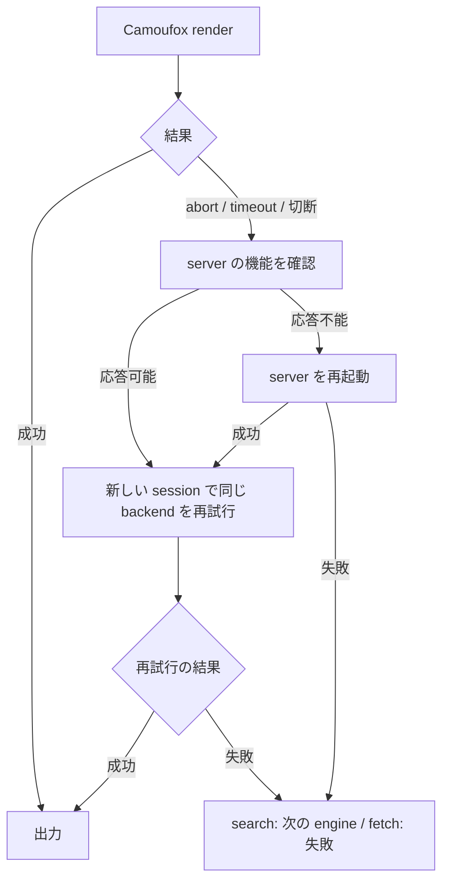

# browse CLI spec

コマンド `browse` の仕様。サブコマンド `search` / `fetch` / `start` / `restart` / `display` を持ち、人間とコーディングエージェントが、Web 検索と URL フェッチと camoufox server の管理をコマンドラインから実行するための CLI。

usage:

```
usage: browse search "<query>" [--lang <code>] [--json]
       browse fetch <url> [--json]
       browse start
       browse restart
       browse display show
       browse display hide
```

## 前提と依存

- SERP 解析は openserp（既定 `http://127.0.0.1:7000`）に依存し、ブラウザ描画は camoufox（既定 `ws://127.0.0.1:9378/camoufox`）に依存する
- `OPENSERP_BASE_URL` / `CAMOUFOX_BASE_URL` 環境変数で接続先を変更できる
- openserp が未起動のときは `openserp serve` をバックグラウンド起動し、`/ready` 応答を 250ms 間隔で待ち、15 秒で断念する
- camoufox server は `browse` 自身の内部サーバーモード（`browse __server`。usage には出ない）として起動する。server が未接続のときは `browse start` をバックグラウンド起動し、websocket 接続（1 接続 1 秒上限）で healthy を判定し、250ms 間隔で再プローブして 15 秒で断念する
- camoufox server と `browse start` のログは `<XDG_CACHE_HOME または ~/.cache>/pi/web-search/` 配下の `camoufox-server.log` へ、Xvfb と x11vnc の出力は同じディレクトリの `xvfb.log`・`x11vnc.log` へ追記する
- camoufox server は起動してポートの待受を確立した時点で、自身の PID を `<XDG_CACHE_HOME または ~/.cache>/pi/web-search/camoufox-server.pid` へ書く
- playwright-cli のブラウザは firefox で、remote endpoint に camoufox を使う。セッションキーは検索が `web-search`、フェッチが `web-fetch` で、各実行の冒頭と終了時にセッションを閉じる
- `search`・`fetch`・`start`・`restart` のCamoufox操作は共有ロックで直列化する。ロックは `flock(1)` に依存し、利用できない環境では待ち合わせせずに実行する

## 共通の振る舞い

| 条件・状態 | 操作 | 結果 |
|---|---|---|
| `--json` がある | 成功時 | 単一の JSON を stdout へ出力する（jq でパース可能） |
| `--json` がない | 成功時 | markdown を stdout へ出力する |
| すべての backend が失敗した | 実行 | `All <operation> backends failed: <backend>: <error>; ...`（`<operation>` は `web search` または `web fetch`）を 1 行 stderr へ出力し、終了コード 1 で終わる |
| render が abort される | 実行 | ページopen・closeによる機能ヘルスチェックを行い、応答不能ならserverを自動再起動して同じbackendを再試行する。自動復旧後も全backendが失敗した場合は、`All ... failed` 行の次行へ `Hint: ...` 形式で手動の `browse restart` を案内する |
| challenge / captcha を検出した | 実行 | 同一 backend を1回だけ新しいsessionで再試行し、それでも失敗したら次のbackendへ進む |
| Camoufoxのrenderがabort・timeout・切断した | 実行 | serverの機能ヘルスチェックを行う。応答不能ならserverを1回だけ再起動してから新しいsessionで同じbackendを再試行する。1コマンド全体のserver復旧再試行は1回までとし、失敗後は次のbackendへ進む |
| `search` または `fetch` が同時に起動された | 実行 | Camoufoxを使う処理を共有ロックで直列化し、先に開始した実行の完了を待つ。Reddit / StackOverflowの専用経路もコマンド単位では待ち合わせる |
| サブコマンドがない・未知のサブコマンドを渡した | 実行 | usage を stderr へ出力し、終了コード 1 で終わる |
| 未知のフラグを渡した | 実行 | 対象サブコマンドの usage 行を stderr へ出力し、終了コード 1 で終わる |
| 必須引数が不足している（位置引数 0 個） | 実行 | 対象サブコマンドの usage 行を stderr へ出力し、終了コード 1 で終わる |
| 位置引数が 2 つ以上ある | 実行 | 対象サブコマンドの usage 行を stderr へ出力し、終了コード 1 で終わる |
| 値を要求するフラグが引数の末尾にあり、値を取れない | 実行 | 対象サブコマンドの usage 行を stderr へ出力し、終了コード 1 で終わる |
| 値を要求するフラグの直後の引数 | 扱い | `--` 始まりかどうかを検査せず、そのまま値として使う |
| 単一ダッシュで始まる引数（`-` を含む） | 扱い | フラグではなく位置引数として扱う |
| `start` / `restart` に余分な引数を渡した | 実行 | usage を stderr へ出力し、終了コード 1 で終わる |
| `display` の action がない・未知の action を渡した・余分な引数を渡した | 実行 | `browse display` の usage を stderr へ出力し、終了コード 1 で終わる |

| 対象 | タイムアウト |
|---|---|
| server 起動待ち・セッション close | 15 秒 |
| `browse restart` の停止待ち（SIGTERM を送ってから SIGKILL に上げるまで） | 10 秒 |
| ページ open・ナビゲーション・DOM 取得 | 30 秒 |
| openserp パース・trafilatura 変換・Reddit の各要求・StackOverflow の各要求 | 15 秒 |
| challenge 検出待ち | networkidle 待ち 5 秒・上限 5 秒（250ms 間隔で DOM ポーリング） |
| server機能ヘルスチェック | ページopen・closeを含めて5秒 |
| 再試行 | 1コマンドあたりserver復旧を伴う再試行は1回。challengeの再試行はbackendごとに1回 |

challenge / captcha の検出は、Cloudflare 系シグナルと Google 固定ページ（CAPTCHA/sorry、JS リトライのみの soft block）の構造シグナルで行い、ロケール依存の文言は使わない。

## fallback / retry の流れ

Camoufox の render failure には自動復旧を適用する。Reddit / StackOverflow の専用経路には適用しない。challenge / captcha の再試行は共通の振る舞い表に従う。

| 経路 | 取得方法 | render failure 時の扱い |
|---|---|---|
| `search` | Google → DuckDuckGo → Bing | 同じ engine の再試行後、次の engine へ進む |
| `fetch` の Reddit | 専用経路（RSS → embed → oEmbed） | Camoufox を使わない |
| `fetch` の StackOverflow | 専用経路（StackExchange API → 質問フィード） | Camoufox を使わない |
| `fetch` のその他 URL | Camoufox → trafilatura | 次の図に従う |

### Camoufox render failure



server の復旧を伴う再試行は1コマンド全体で1回までとする。詳細な timeout、stderr、JSON 出力は各コマンドの表に従う。

## `browse start`

camoufox server の起動を保証する冪等なサブコマンド。CLI 内部（search / fetch の server 確保）と共通 startup script の priming の両方が、このサブコマンドを detached に起動する。

| 条件・状態 | 操作 | 結果 |
|---|---|---|
| camoufox server が起動済み（websocket 接続が成功する） | 実行 | 何もせず終了コード 0 で終わる |
| camoufox server が未起動 | 実行 | 内部サーバーモードをバックグラウンド起動し、websocket 接続が成功するまで 250ms 間隔で待ち、終了コード 0 で終わる |
| 待ちが 15 秒に達した | 実行 | エラー 1 行を stderr へ出力し、終了コード 1 で終わる |
| 起動に失敗した server がポートを占有している | 実行 | 2 番目以降の server はポート衝突で終了する（先の server が serve を続けるため無害） |

## `browse restart`

hang した camoufox server の復旧用に、実行中の server を停止して起動し直す。

| 条件・状態 | 操作 | 結果 |
|---|---|---|
| 実行 | 停止 | 停止対象は常に「PID ファイルの対象（Linux では `/proc/<pid>/cmdline` で実行中のbrowseスクリプトと `__server` 引数を検証する）」と「`pgrep -f <browse スクリプト> __server` 掃引」の和集合である。対象へ SIGTERM を送り、10 秒以内に終了しなければ SIGKILL する |
| 停止後 | 実行 | `browse start` と同じ手順で起動し直し、ready を待つ |
| 実行中の server が無い | 実行 | 停止を飛ばして `browse start` の手順で起動する |

## `browse display show` / `browse display hide`

Xvfb `:99` 上の headed browser を VNC で人間へ引き継ぐための接続受付を切り替える。ブラウザ、ページ、cookie、playwright-cli セッションは再起動しない。headless browser そのものを headed に変更する操作ではない。

| 条件・状態 | 操作 | 結果 |
|---|---|---|
| `browse display show` を実行し、稼働中の x11vnc を制御できる | `:99` の VNC 接続受付を開く | 新しい VNC 接続を受け付け、終了コード 0 で終わる |
| `browse display hide` を実行し、稼働中の x11vnc を制御できる | 新しい VNC 接続を拒否し、接続中のクライアントを切断する | 画面を非公開にし、終了コード 0 で終わる |
| x11vnc が未導入、VNC server が未起動、または `:99` を制御できない | 実行 | エラー 1 行を stderr へ出力し、終了コード 1 で終わる |

## camoufox server のモード

内部サーバーモード（`browse __server`）の表示モード、補助プロセス、実行環境、終了時の振る舞い。依存パッケージ（`xvfb`・`x11vnc`）は dotfiles bootstrap が導入する。

表示モードは次の条件で決まる:

| 条件 | 表示モード |
|---|---|
| `CAMOUFOX_HEADLESS=1` | headless |
| `CAMOUFOX_HEADLESS=0` | headed |
| それ以外（未指定・1 と 0 以外の値） | Windows は headless、Windows 以外の OS は headed |

headless のときは Xvfb も x11vnc も起動しない。headed のとき、server は起動時に次のとおり補助プロセスを整える:

- ディスプレイの socket（`/tmp/.X11-unix/X99`。ファイルシステム socket または Linux abstract socket）が存在しなければ `Xvfb :99` をバックグラウンドで起動し、socket が出現するのを待ってからブラウザを起動する。10 秒以内に出現しなければ起動を断念し、server はエラーメッセージを出力して終了コード 1 で終わる
- ブラウザは起動時に `DISPLAY=:99` と Wayland の無効化（`MOZ_ENABLE_WAYLAND=0`）を与えられ、ウィンドウは Xvfb の :99 へ出る。`WAYLAND_DISPLAY` がある環境（WSLg など）でも、実画面（Wayland・XWayland を含む）にはウィンドウを表示しない
- x11vnc が PATH に存在しポート 5900 ですでに待ち受けていなければ、`-deny_all`（既定は誰も接続できない）付きでバックグラウンド起動して、人間が VNC でページを引き取れる状態にする。x11vnc が PATH に無ければ警告をログへ出して続行する（画面の引き取りだけが使えない）
- Xvfb と x11vnc は server より長生きする detached プロセスで、server は起動のたびに両者の存在を再確認し、無いときだけ起動する

画面の公開はブラウザの再起動を伴わない。VNC 接続の受付は `browse display show` / `browse display hide` で切り替える。

server の実行環境は環境変数で上書きできる:

| 変数 | 上書き対象 | 未指定時の解決 |
|---|---|---|
| `CAMOUFOX_EXECUTABLE_PATH` | camoufox ブラウザの実行ファイル | `~/.cache/camoufox/camoufox-bin` |
| `CAMOUFOX_PLAYWRIGHT_CORE` | server が使う playwright-core | playwright-cli 内蔵の playwright-core（PATH 上の `playwright-cli` の場所から解決） |

fingerprint 生成に使う camoufox-js は、候補ディレクトリ（`~/.dsh/plugins/web-search`・`~/.pi/agent`）から順に解決する。

server は SIGINT / SIGTERM を受け取ったとき、PID ファイルから自身の PID を清除して browser server を close し、終了コード 0 で終わる。Xvfb と x11vnc はこの時点で停止せず、次回の server 起動で再利用される。

## `browse search "<query>"`

| 条件・状態 | 操作 | 結果 |
|---|---|---|
| 引数あり | 検索実行 | engine を google → duckduckgo → bing の順で試行し、最初に成功した engine の結果上位 10 件を出力する |
| `--lang <code>` がある | 検索実行 | `<code>` を小文字へ正規化する。google は `hl` へ常に設定し、`gl` は対応表にある lang のみ設定する。bing の `mkt`・duckduckgo の `kl` も対応表にある lang のみ設定する。対応表にない lang では `gl`・`mkt`・`kl` を付与せず、google の `hl` のみ設定される |
| engine が空結果・captcha・challenge で失敗した | 検索実行 | 次の engine へ進む |
| engine のrenderがabort・timeout・切断した | 検索実行 | 同一engineを新しいsessionで再試行する。server復旧再試行を既に消費している場合は再試行せず、次のengineへ進む |
| すべての engine が失敗した | 検索実行 | 共通の全 backend 失敗の振る舞いに従う |

markdown 出力の構造: 1 行目に `**Query:** "<query>" - **Engines:** <engine> - **Took:** <秒>s` を置き、続いて結果ごとに `### <番号>. <title>`、`**<display_url>** - <type>`、スニペット、`-> <url>` の順のブロックを置く。欠損フィールドの行は省略し、タイトル欠損は URL、それも無ければ `(no title)` とする。`type` 欠損の結果は `organic` と表示し、`display_url` 欠損の結果は `**<display_url>** - <type>` 行を出力しない。

`--json` のフィールド: `query`、`engine`、`tookMs`、`results`（各要素は `rank`、`title`、`url`、`display_url`、`type`、`snippet`。欠損フィールドは省略し、markdown 出力の `type` 既定値 `organic` は補わない）。

`**Took:** <秒>s`（小数第 1 位まで）と `tookMs`（ミリ秒）は、成功した backend の最終試行 1 回の所要時間とする。失敗した先行 backend と同一 backend への再試行に要した時間は含まない。

## `browse fetch <url>`

| 条件・状態 | 操作 | 結果 |
|---|---|---|
| 引数が絶対 URL でない | 実行 | エラー 1 行を stderr へ出力し、終了コード 1 で終わる |
| Reddit 投稿パーマリンク | フェッチ | RSS（コメント上限 500）→ embed → oEmbed の順で取得し、投稿本文とコメントを markdown で出力する（camoufox を使わない） |
| StackOverflow 質問パーマリンク | フェッチ | StackExchange API（投票順・1 ページ 100 件で最大 500 件・`backoff` 指定時は指定秒待機）→ 質問フィードの順で取得し、質問と回答を markdown で出力する（camoufox を使わない） |
| その他の URL | フェッチ | camoufox で描画し、trafilatura で markdown 化して出力する。renderがabort・timeout・切断した場合は、機能ヘルスチェックと必要なserver再起動を行った後、新しいsessionで同じURLを1回だけ再試行する |
| Reddit / StackOverflow で全取得経路が失敗した | フェッチ | 共通の全 backend 失敗の振る舞いに従う。`<error>` は Reddit では `Unable to fetch Reddit post <postId> (RSS <status>)`（`<status>` は RSS 要求の HTTP status 番号。要求自体が失敗したときはそのエラー文言）、StackOverflow では `Unable to fetch StackOverflow question <questionId>` |

markdown 出力の構造（Reddit）: `# <title>`、`- Author:`、`- Permalink:`、`- Updated:`（feed の更新日時を取得できたときのみ出力）、`- Comments:`（常に出力。feed を取得できたときは `<n> fetched` または `<n> fetched / <m> displayed`、取得できなかったときは `unavailable`（embed から表示コメント数が取れるときは `unavailable (Reddit displays <m>)`））、`## Post`、`## Comments (<n> retrieved)`（feed を取得できたときのみ）、コメントは `### <番号>. <author>`。コメントのスコアと返信階層は RSS に無い旨の注記を入れる。

markdown 出力の構造（StackOverflow）: `# <title>`、`- Author:` `- Permalink:`（API 成功時は `- Score:` `- Answers: <n> retrieved / <total> total` `- Tags:`）、`## Question`、`## Answers (<n> retrieved)`、回答は `### <番号>. <author> (accepted, score <n>)`。フィードのみで取得したときは、score・accepted・投票順が取れない旨の注記を入れる。

`--json` のフィールド: `url`（Reddit / StackOverflow は permalink に正規化）、`backend`、`title`、`body`（markdown）、`tookMs`、`fallbacks`（先行試行が失敗したときだけ、`backend` と `error` の配列）。`title` は `body` の markdown 見出しから抽出する: 最初の `# <text>` 見出し、なければ最初の `## <数字>. <text>` / `### <数字>. <text>` 見出しのテキスト（前後の空白を除去）を使い、該当する見出しが無ければ `title` を省略する。`fallbacks` は同一 backend の再試行失敗と後続 backend の失敗を試行順に含み、成功した最終試行は含めない。
