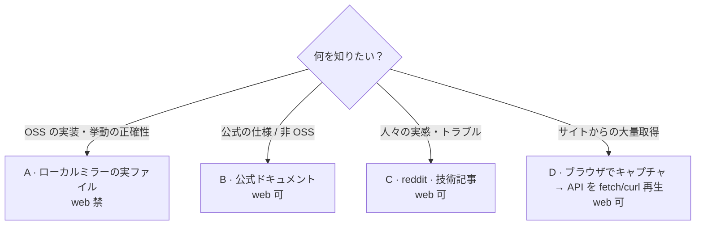
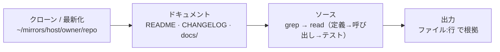

# Research Strategy

## 目的と手段の整合

目的ごとに手段と web の可否を切り分ける。実リポジトリで追うべきものをウェブ検索の「たぶん」で済ませず、口コミが必要なものを公式ドキュメントだけで済ませない。

## 既存アプリ・OSSの選定

既存アプリやOSSを提案するときは、要件適合と併せて、採用実績・成熟度・継続性を評価する。同一カテゴリ・用途の候補との相対比較を基本とし、次の項目は比較上のマイナス要素として扱う。固定閾値による足切りは行わず、該当したことだけで候補を除外しない。

- GitHub Starsが同種候補と比べて少ない
- 公開後の運用期間が同種候補と比べて短い
- 安定版のリリース実績が同種候補と比べて乏しい
- リリース、コミット、issue/PRへの応答などのメンテナンス活動が同種候補と比べて少ない、または不安定
- 利用者、導入事例、依存プロジェクト、ダウンロード数などの採用根拠が同種候補と比べて乏しい

Starsだけで成熟度を断定せず、複数の採用シグナルで評価する。GitHub以外のアプリでも、同等の採用・継続性の根拠を調べる。比較対象がない情報を推測で補わず、不明な項目は懸念点として明示する。

候補を提案するときは、候補ごとに比較対象、根拠URL、確認日を示す。

- 要件適合
- 成熟度
- 採用実績
- 継続性
- 懸念点

## ローカルミラー

OSS の実装・挙動は、ドキュメントとソースを横断して実ファイルから確認する。ウェブのドキュメントサイトでは定義、呼び出し元、テスト、CHANGELOG、ドキュメントを一意に往復できない。

ミラーは URL から `~/mirrors/<host>/<owner>/<repo>` に配置する。ホストで分けることで同名リポジトリの衝突を防ぐ。

```
~/mirrors/<host>/<owner>/<repo>
# 例: ~/mirrors/github.com/tiangolo/fastapi
#     ~/mirrors/gitlab.com/gitlab-org/gitlab
```

## 手段の選択



| 目的 | 手段 | web | 欲しいもの |
|---|---|---|---|
| OSS の実装・挙動 | ローカルミラーの実ファイル | 禁 | 正確な挙動・根拠 |
| 公式情報（仕様・非OSS） | 公式ドキュメント | 可 | 仕様・API・保証 |
| 人々の実感・トラブル | reddit・技術記事・issue | 可 | 落とし穴・比較・実感 |
| サイトからの大量取得 | ブラウザでキャプチャ → API を fetch/curl 再生 | 可 | 構造化データの安定取得 |

## OSS の実装・挙動

実リポジトリを `~/mirrors` にクローン（既存なら fetch）し、**ドキュメントもソースも実ファイルとして**追う。web_fetch / web_search は一切使わない。

### 作業フロー



### クローンまたは最新化

```bash
DEST=~/mirrors/github.com/owner/repo

if [ -d "$DEST/.git" ]; then
  git -C "$DEST" fetch --all --prune      # 既存なら最新化
else
  mkdir -p "$(dirname "$DEST")"
  git clone https://github.com/owner/repo.git "$DEST"
fi
```

特定バージョンを見たい場合は最新化のうえチェックアウトする:

```bash
git -C "$DEST" checkout <tag-or-branch>
```

### ドキュメント

クローン先の実ファイルだけを読む。web は使わない。

```
read $DEST/README.md
read $DEST/CHANGELOG.md
ls  $DEST/docs          # docs/, doc/, wiki 等の配置を確認
```

確認する:

- 求めている挙動が既にドキュメント・CHANGELOG に明記されていないか
- 対象バージョンの API・振る舞い
- 既知の制限・非推奨・breaking change

### ソース

grep で入り口を特定し、read で実装を追う。

```bash
rg -n "<function-or-symbol>" "$DEST"
rg -n "class <Name>"        "$DEST/src"
```

- 定義 → 呼び出し元 → テスト を往復して挙動を確定する。
- テスト（`test/`, `tests/`, `*_test.*`）は期待挙動の仕様書として使う。
- 型定義（`.d.ts`, `.pyi`, stubs）も実装の補強情報として読む。

## 公式情報

OSS の実装ではなく仕様・公式の挙動を知りたいとき、またはクローン対象ではないプロプライエタリ・SaaS 等を調べるときは公式ドキュメントを読む。

- 公式ドキュメントサイト・README・リファレンス・仕様書を一次情報にする。
- web_fetch / web_search を使ってよい。ただし一次ソースに当たる。
- バージョン・公開日を確認し、手元の環境と合致するかを見る。

## 人々の実感・トラブル

公式情報では分からない「実際どうなのか」を知りたいときは、コミュニティの声を当たる。実装の正確性は出ない代わり、運用上の落とし穴・比較・実感が手に入る。

| 情報源 | 得られるもの |
|---|---|
| reddit（r/&lt;lang&gt;, r/&lt;framework&gt;） | 生の感想・比較・不満 |
| 技術ブログ（Zenn・Qiita・dev.to・Medium） | ハマりどころ・工夫 |
| GitHub Issues / Discussions | 同じ問題に遭った人・公式回答 |
| Stack Overflow | Q&A・解決策 |

- 一次情報で確定できることは OSS の実装・挙動または公式情報で終わらせ、この節は補完に使う。
- 口コミ単体で結論を出さず、複数ソースの傾向として読む。
- 日付・バージョンを確認し、現行バージョンと乖離していないか見る。

## サイトからの大量取得（capture-first）

bot 対策（Akamai 等）のあるサイトをブラウザで開く目的は通信キャプチャである。SPA は内部 API で動いているため、最初に成功したページで必ず `playwright-cli requests` を確認し、目的のデータを返す API を特定する。初回の requests を撮り逃すと、以後は API を逆推測する遠回りになる。

大量取得は「API キャプチャ → fetch/curl 再生」を DOM スクレイピングより優先する。API は検索キーワードやページ番号を param に渡して再生でき、1 リクエストで構造化データが得られる。

### bot ブロック時の打ち手

Access Denied 等でブロックされたら、順に試す。

1. `goto` の再試行をしない。ページ遷移が最もスコアリングされる
2. 同セッション内の in-page fetch（`eval` で `fetch()` を呼ぶ）を試す。遷移だけがブロック対象のケースがある
3. 待つのは純 sleep の合計 5 分が目安の上限。超えたら打ち切り、取得済みの内容と未達範囲を報告する

## 出力

確認したファイルパス・シンボルを行番号付きで明示し、実コードを根拠に結論を述べる。「たぶん」でなく、実リポジトリの実ファイルを根拠にする。
