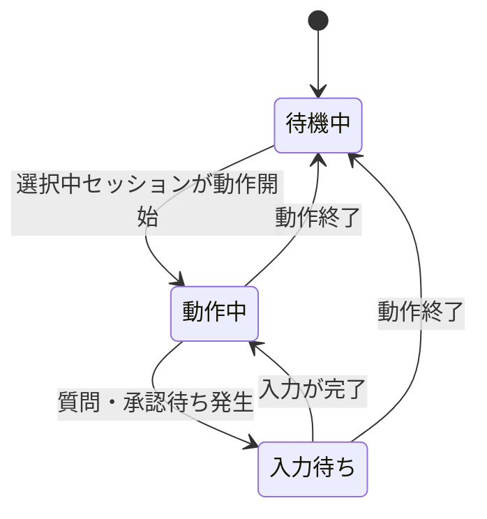

# dsh-titlebar

## 目的

エージェントの動作状態に合わせて、web UI のタイトル（ブラウザタブの `document.title`）に状態マークを前置する。dsh に TUI 形態・ターミナルタイトル相当 API はないため、web UI のタイトルを制御対象とする。

## 基準

- 基準とする stock 機能: dsh 本体 web UI の `DocumentTitle` コンポーネント（package `@deepseek-ai/dsh-client-ui-layout` の `src/client/DocumentTitle.tsx`。`AppFrame` が配置する）。`document.title` の所有者で、選択中セッションのタイトルを `{product title}` と組み合わせて書く
- 本 SPEC に明記しない限り、基準 stock の振る舞いは変更されない
- 無効化・置換する stock 構成: なし。`DocumentTitle` を無効化・置換せず、その書いたタイトルの先頭にマークを前置する
- 本 plugin はタイトル本体を独自に組み立てない。本体には `DocumentTitle` が最後に書いた文字列をそのまま用いる

## 変更

`document.title` の先頭に、選択中セッションの状態マークを前置する。タイトルの制御は web client で動作し、**現在選択中のセッション**（`ctx.sessions.list` の `current`）の状態のみを反映する。セッションが未選択のとき、および他セッションの状態は表示に影響しない。

| 状態 | 表示内容 | アニメーション |
| --- | --- | --- |
| 待機中 | マークなし。stock が書いたタイトルがそのまま表示される | なし |
| 動作中 | 先頭に `{スピナー} ` を前置し、以降は stock どおり | スピナー |
| 入力待ち | 先頭に `⏸ ` を前置し、以降は stock どおり | なし |

### スピナー

動作中、タイトル先頭に点字ブロックの `⠋` `⠙` `⠹` `⠸` `⠼` `⠴` `⠦` `⠧` `⠇` `⠏` の 10 文字を 0.1 秒間隔でこの順で循環させ、エージェントが処理中であることを示す。

### 入力待ち

選択中セッションに未回答の pending interaction（ユーザー質問・plan review・承認 panel）がある間、タイトルは `⏸` を先頭に付けた静止表示へ切り替わる。プロンプトの種別は表示しない。dsh は質問待ち中も `running: true` を保つため、入力待ちは動作中より優先する。入力が完了すると動作中のスピナーへ戻る。

### セッション切替・後片付け

- 選択セッションを切り替えたとき、新しい選択セッションの状態でタイトルを付け直す
- plugin 無効化（profile からの除外）・client 再読み込みの際は、マークを外した素のタイトルへ戻す
- dsh 本体（`DocumentTitle`）がタイトルを再書き込みした場合も、次の状態更新（マーク表示中は最大 0.1 秒後）でマークを付け直す
- マークの剥がしは plugin 自身が書き込んだタイトルに限定する。セッションタイトル自体が「マーク文字 + スペース」で始まる場合も、その先頭は変更しない

## 設定

ON/OFF の設定ファイルは設けない。profile から plugin を除外することで全体を無効化する。
