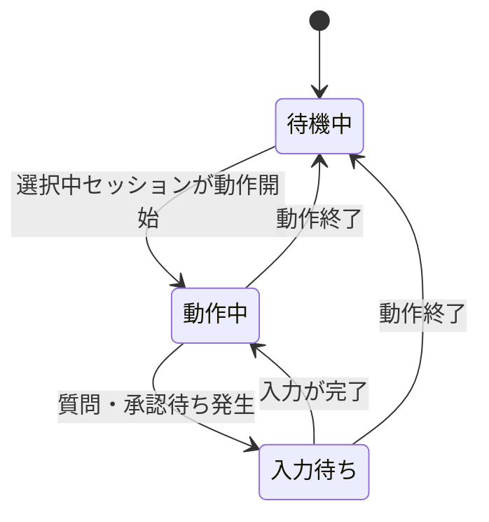

# dsh-titlebar

## 目的

エージェントの動作状態に合わせて、web UI のタイトル（ブラウザタブの `document.title`）を切り替える。pi extension `titlebar`（`dotfiles/.pi/agent/extensions.exact/titlebar`）と同等の機能を dsh へ移行したものである。dsh に TUI 形態・ターミナルタイトル相当 API はないため、web UI のタイトルを制御対象とする。

## 実行条件（スコープ）

タイトルの制御は web client で動作し、**現在選択中のセッション**（`ctx.sessions.list` の `current`）の状態のみを反映する。セッションが未選択のとき、および他セッションの状態は表示に影響しない。

## タイトルの状態遷移

## 各状態のタイトル表示

タイトルの本体（`{セッションタイトル} — {product title}`）は dsh 本体の `DocumentTitle` が所有し、本 plugin はその先頭に状態マークを前置するだけである。

| 状態 | 表示内容 | アニメーション |
| --- | --- | --- |
| 待機中 | `{セッションタイトル} — {product title}`（マークなし） | なし |
| 動作中 | `{スピナー} {セッションタイトル} — {product title}` | スピナー |
| 入力待ち | `⏸ {セッションタイトル} — {product title}` | なし |

## スピナー

動作中、タイトル先頭に点字ブロックの `⠋` `⠙` `⠹` `⠸` `⠼` `⠴` `⠦` `⠧` `⠇` `⠏` の 10 文字を 0.1 秒間隔でこの順で循環させ、エージェントが処理中であることを示す。

## 入力待ち

選択中セッションに未回答の pending interaction（ユーザー質問・plan review・承認 panel・directory picker）がある間、タイトルは `⏸` を先頭に付けた静止表示へ切り替わる。プロンプトの種別は表示しない。dsh は質問待ち中も `running: true` を保つため、入力待ちは動作中より優先する。入力が完了すると動作中のスピナーへ戻る。

## セッション切替・後片付け

- 選択セッションを切り替えたとき、新しい選択セッションの状態でタイトルを付け直す
- plugin 無効化（profile からの除外）・client 再読み込みの際は、マークを外した素のタイトルへ戻す
- dsh 本体がタイトルを再書き込みした場合も、次の状態更新（動作中は最大 0.1 秒後）でマークを付け直す

## 設定

ON/OFF の設定ファイルは設けない。profile から plugin を除外することで全体を無効化する。
