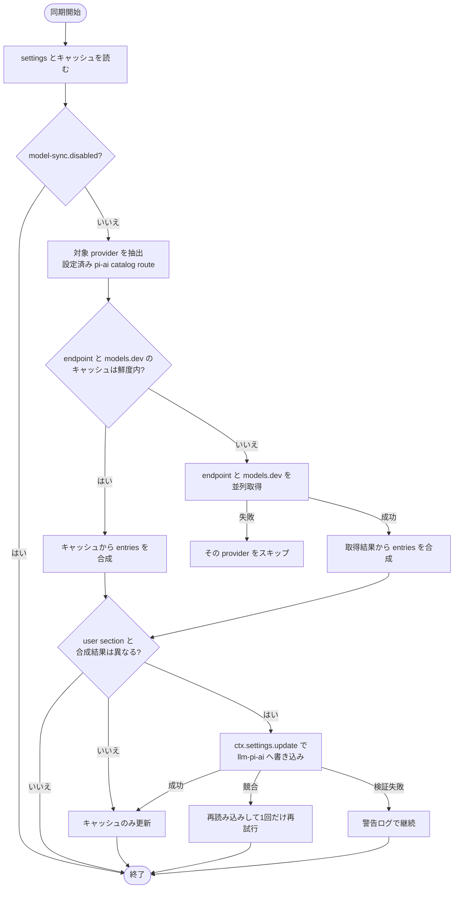

# model-sync plugin Spec

dsh web プロファイルで、設定済みの pi-ai catalog provider のモデル一覧を models.dev と provider の models endpoint から動的に取得し、settings の `llm-pi-ai:` セクションへ反映する dsh bundle plugin。

pi の model-sync extension と同じ目的（静的カタログの更新遅延を、models.dev 等からの動的取得で解消する）を持つ。pi-ai の installed catalog は pi 本体と同じ generated JSON で、新モデルはライブラリ更新まで `UNKNOWN_MODEL` になる。本 plugin はその緩和を settings の `models` リスト更新で行う。

## 同期の全体フロー



失敗時とキャッシュの詳細は「失敗時の扱い」「キャッシュ」で定める。

## 対象 Provider

`llm-pi-ai.providers` に profile を持つ route のうち、次のすべてを満たす id。

- pi-ai の installed catalog（`@earendil-works/pi-ai/providers/all` の `getBuiltinProviders()`）に存在する
- wire protocol（`profile.api`、未設定なら installed catalog の共通 api）が `openai-completions` / `openai-responses` / `anthropic-messages` のいずれか、または未確定（openai 互換として扱う）
- `apiKeyEnv` が設定され、`ctx.credentials.resolve` で値に解決できる

hand-declared route（カタログ外 id）は対象外。ユーザーが models を明示定義しており、models.dev の id も対応しないため。

wire 非対応の catalog api（`google-generative-ai`、`bedrock-converse-stream` など）に解決される route も対象外で、`/model-sync` の結果行にも現れない。

`model-sync.disabled: true`（本 plugin 固有 settings namespace）のときは同期もコマンドも何もしない。

## 同期の起点

| 起点 | 動作 |
| --- | --- |
| profile boot（plugin apply） | キャッシュを読み、鮮度内なら合成して直ちに反映する。endpoint または models.dev のキャッシュが無い、または 12 時間より古い場合は、バックグラウンドで取得してから反映する |
| 12 時間ごとの timer | 各取得時刻を判定し、古いものだけ再取得して反映する |
| `/model-sync` コマンド | キャッシュ鮮度にかかわらず network 同期を実行し、完了を待って provider ごとに結果行を返す |

## ネットワーク取得

### models.dev

- `GET https://models.dev/api.json`（認証なし）
- provider id はそのまま（zai → `zai`）

### provider endpoint

endpoint URL と認証は route の wire protocol（`profile.api`、未設定なら installed catalog の共通 api）で決める。

| protocol | URL | 認証ヘッダー |
| --- | --- | --- |
| `openai-completions` / `openai-responses` | `<baseURL>/models` | `Authorization: Bearer <key>` |
| `anthropic-messages` | `<baseURL>`（末尾 `/v1` を正規化）`/v1/models?limit=1000` | `x-api-key: <key>` ＋ `anthropic-version: 2023-06-01`。key が `sk-ant-oat` で始まる場合は代わりに `Authorization: Bearer` ＋ `anthropic-beta: oauth-2025-04-20` |

- `baseURL` は `profile.baseURL`、未設定なら installed catalog の当該 provider の baseUrl。catalog 内で baseUrl の綴りが混在するときは、URL path が最も深いものを選ぶ（例: openrouter は `…/api` と `…/api/v1` が混在するため `…/api/v1`。pi 版の固定表が持つ `https://openrouter.ai/api/v1` と同じ endpoint になる）。URL path の深さが同じときは catalog の先頭を採用する
- API key は `profile.apiKeyEnv` を `ctx.credentials.resolve` で解決する。settings に `apiKeyEnv` が無い、解決できない、名前が reference 文法に合わない、のいずれかの provider は endpoint を呼ばない（`no auth` 扱い）
- 1 リクエストのタイムアウトは 15 秒。応答本文は 10 MiB を超えたら失敗扱い。provider 間は並列に実行する

## モデル一覧の抽出

| 応答形式 | 配列 | model ID | provider 側メタデータ |
| --- | --- | --- | --- |
| OpenAI | `data[]` | `id` | OpenRouter のみ次節のフルセット、他は `name`（あれば） |
| Anthropic | `data[]` | `id` | `display_name`（表示名として使用） |

### チャットモデルのフィルタ

抽出後、モデル ID（小文字比較）に次の文字列を含むモデルを除外する。

```text
embed, whisper, tts, dall-e, gpt-image, imagen, sora, flux,
stable-diffusion, diffusion, moderation, guardrail, rerank,
babbage, davinci, transcribe, asr, ocr, speech
```

フィルタ後のモデルが 0 件になった provider は失敗扱いとし、反映をスキップする。

### OpenRouter の endpoint メタデータ

`supported_parameters` に `reasoning` または `include_reasoning` が含まれるなら `reasoning`、`architecture.input_modalities` に `image` を含むなら `input: ["text","image"]`、`context_length` → `contextWindow`、`top_provider.max_completion_tokens` → `maxTokens`、`pricing`（per-token 文字列を per-million 数値へ変換し小数第 4 位で丸める。`prompt`→`input`、`completion`→`output`、`input_cache_read`→`cacheRead`、`input_cache_write`→`cacheWrite`）。

## エントリ合成

provider ごとに、settings の `providers.<id>.models` に書く entry の配列を組み立てる。入力は次の 4 つ。

- endpoint から抽出した remote のモデル一覧
- models.dev の当該 provider のメタデータ（`models.<modelId>` の `name` / `reasoning` / `modalities.input` / `limit.context` / `limit.output`）
- pi-ai の installed catalog（`getBuiltinModels(provider)`。同名 id の継承元と新規 entry の既定に使う）
- settings の現在の user section の `models` 配列と、前回 plugin が書いた entry（キャッシュの `written`）

### 各フィールドの値

entry には remote または models.dev 由来の値があればそれを書く。installed catalog に同名 id があり、新しい値が無いフィールドは**書かない**（catalog の値が継承される）。installed catalog に無い id（新規）は、新しい値が無いフィールドを既定値で書く。

| フィールド | 優先順 | 既定値（新規 id のみ書く） |
| --- | --- | --- |
| `name` | endpoint の `name` ＞ models.dev の `name` ＞ catalog の `name` ＞ model ID | model ID |
| `contextWindow` | endpoint ＞ models.dev `limit.context` ＞ catalog | `128000` |
| `maxTokens` | endpoint ＞ models.dev `limit.output` ＞ catalog | `16384` |
| `input` | endpoint（OpenRouter）＞ models.dev `modalities.input`（`image` を含むなら `["text","image"]`）＞ catalog | `["text"]` |
| `reasoningEfforts` | 書かない（catalog の capability を継承）。新規 id で models.dev の `reasoning: true` のときだけ、同 provider の reasoning 済み catalog entry の `thinkingLevelMap` から `{level: wire}` を移植する | — |
| `api` | 書かない（catalog の共通 api が継承される）。ただし catalog の api が混在していて新規 id の場合のみ、先頭の catalog entry の api を書く | — |

`cost` / `compat` / `thinkingLevelMap` は settings の schema に書けない（同名 id は catalog から継承、新規 id は pi-ai の既定 detection に任せる）。

### 所有権と追加・削除

- 現在の user `models` 配列の各 entry について:
  - **plugin 所有**（前回 plugin が書いた entry と同一、または user `models` 配列自体が無い）→ 今回の合成 entry で置き換える
  - **user 所有**（上記以外）→ 値を保持し、更新も削除もしない
  - remote 一覧に無い entry のうち、plugin 所有かつ installed catalog に無い id → 削除する（remote から消えた新規モデル）
  - それ以外の remote 無き entry → 保持する（installed catalog 由来の id は endpoint に列挙が無くても残す）
- remote にあって user `models` に無い id → 末尾に追加する
- user `models` 配列が無い provider では、installed catalog 全 id を対象に合成を開始する

## settings への書き込み

- 変更があった provider だけを 1 回の `ctx.settings.update('llm-pi-ai', { providers: { <id>: { models } } })` にまとめて書く。patch は object を再帰 merge し配列を置換するため、`apiKeyEnv` など他の field は保たれる
- `describe()` で得た `llm-pi-ai` の `revision` を `expectedRevision` に渡す。`SETTINGS_CONFLICT` が返ったら user section を読み直して合成から 1 回だけやり直す
- 書き込みの schema・serviceable 検証は dsh 側が行う。検証に失敗したらその provider の反映を諦めて警告ログを出し、他の処理は続行する

## キャッシュ

キャッシュは `$DSH_HOME/model-sync-cache.json`（`DSH_HOME` 未設定なら `~/.dsh/model-sync-cache.json`）に保存する。内容:

- `providers.<id>`: endpoint URL の baseUrl、取得時刻、抽出済みモデル一覧
- `modelsDev`: 取得時刻と provider メタデータ全体
- `written.<id>`: 前回 settings に書き込んだ entry の配列（所有権判定用）

endpoint と models.dev はそれぞれの取得時刻で鮮度（12 時間）を判定する。更新に失敗したデータは上書きせず、次の同期で再試行する。`written` は settings 書き込みに成功した provider だけ更新する。キャッシュの書き込みは同じ directory の一時ファイルを rename して原子的に行う。読み取り・検証に失敗したらキャッシュは無いものとして扱う。

## `/model-sync` コマンド

キャッシュ鮮度にかかわらず network 同期を実行して完了を待ち、provider ごとに 1 行ずつ結果を返す。

| 状態 | 行 |
| --- | --- |
| 成功 | `✓ <provider>: <モデル数> models (<新規数> new)` |
| 認証解決できずスキップ | `- <provider>: no auth` |
| 失敗 | `✗ <provider>: <エラーメッセージ>` |
| `model-sync.disabled` | `model-sync: disabled` で終了 |
| 対象 provider なし | `model-sync: no configured pi-ai catalog providers` で終了 |

## 起動時・timer 起点の表示

pi 版の footer status 相当は dsh web client に実装しない。起動時・timer 起点の同期は通知せず、失敗時のみ host の標準出力へ warning を出す。

## 失敗時の扱い

| 状況 | 扱い |
| --- | --- |
| provider の endpoint 取得失敗（HTTP エラー・タイムアウト・JSON パース失敗・フィルタ後に 0 件） | その provider の反映をスキップする。settings の既存内容とキャッシュは維持する |
| models.dev の取得失敗 | 同期を続行し、メタデータは models.dev キャッシュ（期限切れも可）→ 既定値の順で補完する |
| settings 書き込みの検証失敗 | 警告ログを出して継続する。`written` は更新しない |
| キャッシュの読み取り・検証失敗 | キャッシュは無いものとして扱い、network 同期する |
| キャッシュの書き込み失敗 | settings への反映は維持する。警告ログを出す |

## pi 版との差分

| 項目 | pi extension | dsh plugin |
| --- | --- | --- |
| 反映先 | ModelRegistry への動的登録（メモリ、pi 再起動で消失） | settings の `llm-pi-ai.providers.<id>.models`（永続） |
| 対象 | 固定表 26 provider のうち認証解決できたもの | 設定済み pi-ai catalog route（認証解決できるもの） |
| endpoint baseURL | 固定表の `defaultBaseUrl`（provider ごとに手維持） | catalog の baseUrl から URL path が最も深いものを選択（固定表なし。混在時の規則は「ネットワーク取得」節） |
| cost | 登録モデルに cost を設定 | settings schema に cost が無いため反映しない（同名 id は catalog の cost、新規 id は 0） |
| google・amazon-bedrock など wire 非対応 provider | 対応 | dsh の wire protocol に無い catalog api へ解決される route は同期対象外（「対象 Provider」節） |
| footer status / 通知 | あり（`syncing…`、全失敗で warning） | なし。`/model-sync` の結果行のみ |
| models.json 相当の保護 | `models.json` のカスタム定義を最優先 | user section の entry を最優先（所有権規則） |
| 新規取得の起点 | pi 起動（session_start）ごと | profile boot、12 時間 timer、コマンド |
