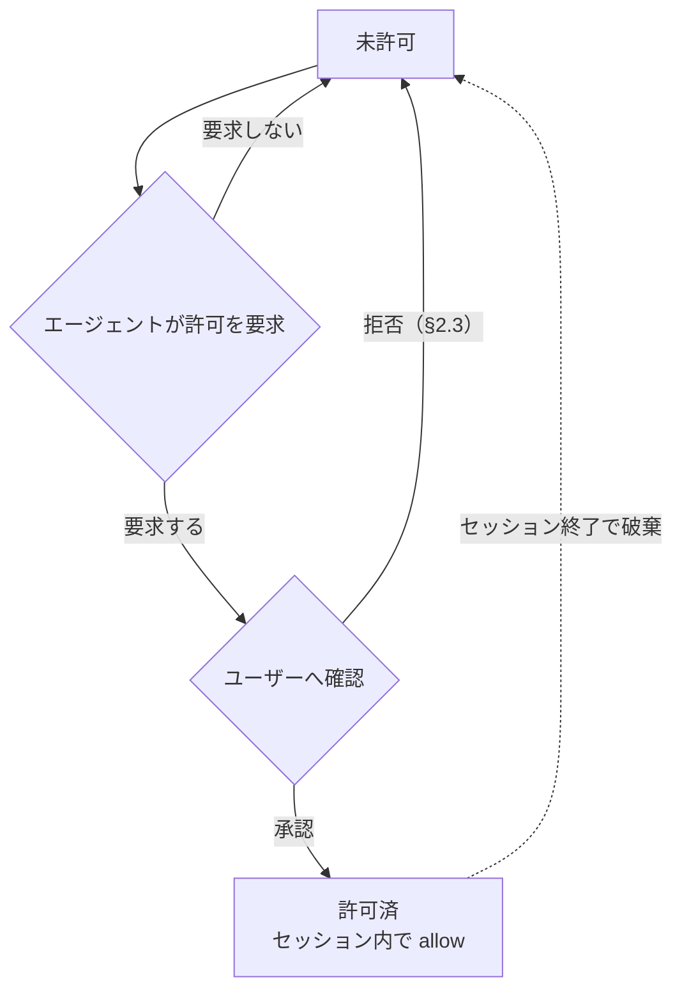

# sandboxed-tools plugin — 仕様書

dsh のモデル向け fs・bash ツール（`read` `write` `edit` `glob` `grep` `ls` `bash`）を置き換えて `read_image` を廃止し、画像読み取りを `read` に統合した上で、**パスの読み書きを `allow` / `deny` / `ask` で、bash コマンドを `allow` / `deny` / `ask` / `ask_with_reason` で制限**しつつ、network 系は自由に使う host bundle plugin。設定は `sandbox.yaml`（§6）が唯一の制御ソースで、dsh 本家の sandbox mode（permission presets の切り替え等）は本 plugin の挙動に影響しない。

---

## 1. 構成とツールごとの扱い

本 plugin を web プロファイルに組み込むとき、プロファイルは本家 `dsh-tool-fs`、`dsh-tool-fs-search`、`dsh-tool-bash`、`dsh-fs-observation-policy` の各 plugin 行を無効化する。本 plugin が次のツールを登録し、モデルには本 plugin のツールだけが見える。`ls` と `ask_permission` は本 plugin が新規に定義する。

| ツール                                          | 本 plugin での扱い | fs 読み書き制限 | network             |
| ----------------------------------------------- | ------------------ | --------------- | ------------------- |
| `read` `write` `edit` `glob` `grep` `ls` `bash` | 置き換え           | あり            | bash 内は開放（§5） |
| `ask_permission`                                | 追加               | あり            | —                   |
| `ask_user_question`・web 系ツールなど上記以外   | 対象外（そのまま） | —               | 開放                |

本 plugin は `read_image` を登録しない。dsh-agents plugin の画像経路置換（image 非対応経路での `read_image` の scoped 登録）は、global に `read_image` が存在することが発火条件のため、本 plugin のプロファイルでは適用されない。画像経路の判定は本 plugin の `read`（§2.1）が単独で担い、画像の自動委譲は行わない。画像入力非対応の経路では `read` のエラーが `vision` への委譲を促す。

### 各ツールの入出力

置き換えたツールの引数名と結果の形式は dsh 本家のツール定義に合わせる。認可（§2〜§4）を通った呼び出しは、§7 の sandbox 内で IO を実行する。引数の相対パスは呼び出し元 agent のセッション cwd を基準に解決する。`glob`・`grep` の結果パスは検索基準ディレクトリからの相対パスで返す。

| ツール           | 引数                                                    | IO の内容                                                                                                                                                                                                               |
| ---------------- | ------------------------------------------------------- | ----------------------------------------------------------------------------------------------------------------------------------------------------------------------------------------------------------------------- |
| `read`           | `file_path`、`offset?`（1-based）、`limit?`             | 行番号付きの UTF-8 テキスト。画像ファイルのときは §2.1 のとおり画像入力として返す。`limit` は既定・上限とも 2000 行、1 行あたり 2000 文字で切り詰める。続きの行があるときは次の `offset` を示す行を含む                 |
| `write`          | `file_path`、`content`                                  | ファイルの作成または全体置換。親ディレクトリが無ければ作成する。結果は `Created file` または `Updated file` の確認文で返す                                                                                              |
| `edit`           | `file_path`、`old_string`、`new_string`、`replace_all?` | リテラル置換。`replace_all` が無いときは一致が一意でなければエラー                                                                                                                                                      |
| `glob`           | `pattern`、`path?`                                      | ファイル名検索。`/` を含まない `pattern` は任意の深度の basename に一致する。修正時刻の新しい順に並べ、隠しファイル・ignore 済みファイルを含み VCS メタデータを除く。100 件を超えたら切り詰める                         |
| `grep`           | `pattern`、`path?`、`include?`                          | ファイル内容の正規表現検索。`include` は正の glob 1 個だけを渡せ、カンマ区切りリストと否定は引数検証で拒否する。一致はファイルごとに `Line N: <preview>` 形式、250 件を超えたら切り詰める。検索のタイムアウトは 30 秒   |
| `ls`             | `path?`（既定 `.`）、`limit?`（既定 500）               | ディレクトリのエントリ一覧。大文字小文字を無視したアルファベット順、ディレクトリは末尾に `/`、dotfile を含む。500 件または 50KB のどちらかに達したら切り詰め、その旨の行を付ける。空のときは `(empty directory)` を返す |
| `bash`           | `command`、`description`、`timeoutMs?`、`workdir?`      | §4                                                                                                                                                                                                                      |
| `ask_permission` | `path?`、`command?`、`reason`（§3）                     | §3                                                                                                                                                                                                                      |

---

## 2. パスのアクセス結果（通常の fs ツール共通）

`read` `glob` `grep` `ls` の各呼び出しは `read` のアクションを、`write` は `write` のアクションを解決し（§3）、結果が決まる。`edit` は対象パスに対して `read` と `write` の両方を確認する。許可された画像ファイルの `read` は §2.1 に従う。`credentials` に指定されたパスは §2.2 の例外に従う。

| パスのアクション   | 結果                                                                                             |
| ------------------ | ------------------------------------------------------------------------------------------------ |
| `allow`            | 成功                                                                                             |
| `ask`              | ユーザー確認（§2.3 のダイアログ）。承認で成功（`write`・`edit` の承認ノートは §2.3）、拒否で失敗 |
| `deny`（明示）     | 拒否。許可要求も不可                                                                             |
| 未設定（= `deny`） | 拒否。ただし agent は許可要求を出せる（§3）                                                      |

- 秘密ファイル（`~/.ssh`, `~/.aws`, `~/.gnupg` 等）は `allow` に入れないことで読み出しを制限する。
- web 系ツールは fs 制限の対象外。
- 複数のツール呼び出しが並行して確認を要求するときも、確認は一度に1つずつ表示して順に解決する。待機中に他の呼び出しの承認で動的許可（§3）が追加されたパスは、あらためて確認しない。このとき確認なしで通った呼び出しの結果には、承認ノート（§2.3）を付けない。

### 2.1 画像ファイル（`read`）

画像ファイルは PNG・JPEG・WebP・GIF である。形式はファイルシグネチャで判定し、拡張子は補助として使う。`read` はテキストファイルと画像ファイルの両方を受け付ける単一のツールで、画像ファイルに対しては、パスのアクセス制御（§2・§3）を通った後に、ファイルの中身を sandbox 内（§7）で読み、画像入力として現在のモデルへ返す。画像のダウンスケール等の正規化は dsh 本家の `read_image` と同じに行い、`offset` / `limit` は画像には適用しない。画像は `read` を呼んだ agent のツール結果とそのセッションの記録にだけ含める。本 plugin は `read_image` という名前のツールを登録しない。

現在の経路のモデルが画像入力に対応していない場合、画像の読み取りを `vision` class の子 agent へ委譲することを促すエラーを返す。画像データはモデルへ渡さず、添付としても保存しない。エラーの返る時点は、画像の拡張子を持つパスでは sandbox 実行（§7）の前（パスを開かない）で、拡張子を持たずシグネチャでのみ画像と判定されるパスでは sandbox 内での読み取りと判定の後である。拡張子による経路判定はシグネチャ判定に先行するため、画像の拡張子を持つテキストファイルも、画像入力非対応の経路では委譲エラーになる。エラー文言には、`subagent` ツールで `vision` へ委譲すること、子 agent が `read` で画像を読み観察結果をテキストで報告すること、委譲できない場合に依頼元へ画像読み取りの必要性を報告することを含める。文言の正本は実装が持つ。現在の経路が解決できない場合も、画像入力非対応の場合と同じ委譲エラーを返す。

| 操作・状態                                                                    | 結果                                                      |
| ----------------------------------------------------------------------------- | --------------------------------------------------------- |
| `read` に画像ファイルと判定できないパスを渡す                                 | 既存の `read` の結果を返す（UTF-8 テキストとして読む）    |
| `read` に許可されないパス（画像ファイルを含む）を渡す                         | §2 のとおり拒否する                                       |
| `read` に許可されたパスを渡し、画像ファイルと判定、現在の経路が画像入力対応   | 画像を画像入力として返す。`offset` / `limit` は適用しない |
| `read` に許可されたパスを渡し、画像ファイルと判定、現在の経路が画像入力非対応 | `vision` への委譲を促すエラーを返す。画像の拡張子を持つパスは sandbox 実行の前に、それ以外のパスは sandbox 内での判定の後にエラーになる |

`read` の説明文には、画像ファイルを画像入力として読めること、画像入力非対応の経路では `vision` への委譲が必要であることを明記する。

### 2.2 credentials の例外

`credentials` は、bash コマンドが利用する必要はあるが、fs ツールからは扱わせないファイルパスパターンを指定する。

- `credentials` のパスは bash の sandbox に read-only で bind される。bash からの読み取りは `commands` のアクションに従う。
- `read` `write` `edit` `glob` `grep` `ls` からは常に拒否される。`read` / `write` の解決結果が `allow` または動的許可になっていても、この拒否を上書きできない。
- `credentials` のパスは `read` / `write` のアクション判定および動的許可の対象外とする。
- `credentials` に glob を指定した場合の絶対パス解決・セッション開始時展開は、`read` / `write` と同じ規則（§3）に従う。
- `credentials` は秘密情報を agent から秘匿する機能ではない。bash は読み取った内容を標準出力や network 経由で漏洩させられる。

### 2.3 確認ダイアログと拒否理由

ユーザー確認（§2 の `ask`、§3 の許可要求、§4 の `ask`）は、ブラウザの質問 UI（userQuestions seam）で行う。選択肢は次の通り。質問のキャンセル・回答の中断も拒否として扱う。

| 確認対象             | 選択肢                                                         |
| -------------------- | -------------------------------------------------------------- |
| read と commands     | `Yes, allow` / `No, deny (reason next)`                        |
| write                | `File only` / `Directory (subtree)` / `No, deny (reason next)` |
| ask_permission（§3） | `Yes, allow` / `No, deny (reason next)`                        |

質問の表示は、問いかけ、確認対象（パスまたはコマンド）、`reason: <理由>` の行（`ask_permission`（§3）のみ）、設定パターンの行の順とする。質問には確認対象に続けて確認の原因となった設定パターンを示す行を表示する。`ask` のパターンに一致したときは `matched: <一致したパターン>`、設定に一致するパターンがなく未設定（= deny）による許可要求のときは `no matching pattern (default ask)` を表示する。パスは glob 展開後の絶対パスを、コマンドは設定されたパターンを表示する。複合コマンドで ask になったときは、ask と判定されたセグメントのパターンを示す。

`ask_permission`（§3）の確認の問いかけは、パスのとき `Allow write access to directory subtree?`、コマンドのとき `Allow command execution?` とし、確認対象に続けて agent が指定した要求理由を `reason: <理由>` の行で表示する。

拒否を選択・キャンセルしたとき、続けて拒否理由の入力を求める自由記述の質問を表示する。入力は任意で、空欄またはキャンセルなら理由なしとして扱う。理由が入力されたときは、拒否のエラーメッセージ（`Access denied by user: <path>` / `Command denied by user: <command>`）に `User reason: <入力>` の行を追記して agent へ返す。

承認を選択したときは、承認の事実を agent へ伝える。承認された確認ごとに、そのツール呼び出しの最終結果の最終行へ承認ノートを1行追記して返す。ノートを付けるのは `write` / `edit` / `bash` の呼び出しに限り、`read` / `glob` / `grep` / `ls` の呼び出しと read の許可の承認にはノートを付けない。ノートは最終結果のみに付き、ヒント文（§4）など他の追記文があるときは、その後に追記する。ノートの形式は確認対象ごとに次のとおり（`<path>` は許可されたパス）。

| 確認対象                         | 承認ノート                                                                                                                                        |
| -------------------------------- | ------------------------------------------------------------------------------------------------------------------------------------------------- |
| write の許可（ファイル単体）     | `User approved write access via confirmation (scope: file <path>); writable for the rest of the session, including via bash.`                     |
| write の許可（ディレクトリ配下） | `User approved write access via confirmation (scope: directory <path>); the subtree is writable for the rest of the session, including via bash.` |
| コマンドの実行                   | `User approved this command via confirmation.`                                                                                                    |
| read の許可                      | なし                                                                                                                                              |

質問 UI（userQuestions seam）を利用できない環境では、確認を行えない `ask` は拒否として扱う。確認・理由入力の質問は §2 の直列化に従う。

### 2.4 未読みファイルへの書き込み・編集

`edit` は、同一セッションで本 plugin の `read` により当該パスを読んでいるときだけ成功する。`write` は対象ファイルが既存のとき読み済みを要求し、存在しないときは読まずに作成する。ただし、承認（§2.3）の実在保証（§6.1）が作成した空ファイルへの初回 `write` は、未読みでも作成（`create`）として成功する。

| 呼び出し時の状態                                            | 結果                                                                                 |
| ----------------------------------------------------------- | ------------------------------------------------------------------------------------ |
| `edit` で未読みのパスを指定                                 | エラー: `cannot modify "<path>": file has not been read — read the file, then retry` |
| `write` で未読みの既存ファイルを指定                        | 同上                                                                                 |
| 読み取り後にファイルが変わっている（bash 経由の変更を含む） | 再読み込みを求めるエラー。文言の正本は実装が持つ                                     |

読み取りの観察は本 plugin の `read` によるものだけを対象とし、セッションをまたいで保持しない。画像ファイルの `read`（§2.1）は観察の対象にならず、画像を読んでも当該パスは読み済みにならない。

---

## 3. パスの解決

### ツール引数パスの正規化（authorize 前）

fs 系ツールと `ask_permission` が引数に受け取るパスは、アクション判定（authorize）の前に正規化する。承認（§2.3 の確認）と実行（§7 の sandbox 内で IO に渡すパス）は同一の正規化結果を用い、審査したパスと実行するパスを一致させる。

| 引数の記述   | 正規化                                      |
| ------------ | ------------------------------------------- |
| `~`・`~/...` | ホームディレクトリへ展開する                |
| 相対パス     | セッションの cwd を起点に絶対パスへ解決する |

### パス文字列の解決

`sandbox.yaml` の `read` / `write` の要素のパターンと `credentials` のエントリは以下の規則で絶対パスに解決する。`read` / `write` はそれぞれの設定でアクション判定を行い、`read` / `write` と `credentials` は bwrap の bind 対象（§6.1）とする。

| 記述                             | 解決先                                                                               |
| -------------------------------- | ------------------------------------------------------------------------------------ |
| `${GIT_MAIN_WORKTREE_PATH}`      | cwd を含む Git repository の main worktree の絶対パス                                |
| `${REPOSITORY_NAME}`             | cwd を含む Git repository のリポジトリ名。main worktree の basename                  |
| `${XDG_RUNTIME_DIR}`             | ユーザーのランタイムディレクトリ（`$XDG_RUNTIME_DIR`、未設定なら `/run/user/<uid>`） |
| 相対パス（`.` `./...` `../...`） | セッションの cwd を起点                                                              |
| `~`                              | ホームディレクトリ                                                                   |
| それ以外                         | 絶対パス（そのまま）                                                                 |

3つの変数はいずれもパスエントリ内の任意の位置に記述できる。`${GIT_MAIN_WORKTREE_PATH}` と `${REPOSITORY_NAME}` は、セッション cwd が linked worktree でも main worktree（`git worktree list` の最初のエントリ）基準で解決し、アクション判定と bind のそれぞれの機会に解決し直す。Git repository 外では、これらの変数を含むエントリはパスを許可・bind・作成しない。

`${REPOSITORY_NAME}` は `~/.agents/worktrees/${REPOSITORY_NAME}` のように記述でき、展開後のパス配下だけが `write` の allow および read-write bind の対象となる。`${XDG_RUNTIME_DIR}` は UID がユーザー・マシンごとに異なるため `/run/user/1000` のような固定パスの代わりに使う。ランタイムディレクトリはセッションマネージャーが管理するため、§6.1 の `mkdir -p` の対象外とし、実在しなければ bind しない。

### glob パターン

`read` / `write` と `credentials` のエントリに glob（`*` `?` `**` `[...]`）を含められる。パターンは変数展開と絶対パス解決（上記）の後に展開する。`read` / `write` はマッチした実パスそれぞれを対応する操作のアクション判定・bind 対象とし、`credentials` は bind 対象とする。

| パターン                             | 意味                                                                                               |
| ------------------------------------ | -------------------------------------------------------------------------------------------------- |
| `*`                                  | パス区切り（`/`）以外の任意文字列                                                                  |
| `**`                                 | パス区切りを含む任意文字列（再帰）                                                                 |
| `?`                                  | 任意1文字                                                                                          |
| `[...]`                              | 文字クラス                                                                                         |
| `{a,b}`                              | カンマ区切りの選択肢のいずれかに展開（ブレース展開）                                               |
| `"*"` 単体（`read` の `allow` のみ） | すべてのパスにマッチする。全パスの read を許可し、ルート全体を read-only bind の対象とする（§6.1） |

例: `~/.cache/*` → `~/.cache/uv` `~/.cache/pip` `~/.cache/go-build` ... に展開される。`~/.config/{git,npm}` → `~/.config/git` `~/.config/npm` に展開される。

glob はセッション開始時に既存パスへ展開され、セッション中の新規パスは対象外。§6.1 の `mkdir -p` は固定パスのみで、glob には適用しない。

### アクションの決定

`sandbox.yaml`（§6）の `read` / `write` のリストを上から順に走査し、パスがマッチした要素のアクションで解決結果を上書きする（後勝ち）。最後にマッチした要素のアクションが確定し、マッチする要素がなければ未設定（= `deny`）。

### 動的拡張のライフサイクル

未設定パスは `deny` だが、agent がユーザーへ許可要求を出せる（明示 `deny` は不可）。承認されると、承認した操作（`read` または `write`）についてセッション内で `allow` になり、セッション終了で破棄される。`read` と `write` の動的許可は別々に管理する。



動的許可はパスと操作（`read` / `write`）の組み合わせで管理し、次の規則に従う。

- 許可パスがディレクトリのときは配下のパスにも適用される（ファイルのときはそのファイル単体）。
- 明示 `deny` は動的許可より優先する。
- `write` の許可要求では、スコープを「ファイル単体 / 親ディレクトリ配下」から選択できる。
- `write` の許可パスは §6.1 の実在保証の対象とする（承認時にフェンス外で作成する）。`read` の許可でパスは作成しない。

### 許可要求ツール

agent は `ask_permission` ツールで、指定パス配下への `write` 許可、または `ask_with_reason` でゲートされたコマンドの実行承認をユーザーへ要求できる。read の許可はこのツールで要求しない。

パラメータ `path` と `command` は排他で、どちらか一方だけを指定する。スキーマは排他を anyOf（union 分岐）で定義しない。anyOf はモデルによって引数生成が成立しないため（GLM-5.3-Flash で引数が空の呼び出しが繰り返された実績がある）、単一のオブジェクトで `path` と `command` を任意、`reason` を必須として定義する。両方の指定、またはどちらも指定しない呼び出しは、期待する引数形式を伝えるエラーになる。

パラメータ `path` は「ツール引数パスの正規化」と同じ規則で正規化し、セッションの cwd 基準の絶対パスへ解決する。許可スコープは `path` 配下一択で、ファイル単体の選択肢は出さない（ファイル単体は `write` / `edit` の確認に任せる）。`path` が実在するファイルパスのときは、その親ディレクトリ配下をスコープとする（存在しないパスはそのパス配下）。

パラメータ `reason` は必須で、`path` 配下への書き込みが必要な理由をユーザーが承認・拒否を判断するためのヒントとして指定する。確認では §2.3 のとおり `reason: <理由>` の行として表示される。

| `ask_permission`（`path`）呼び出し時の状態               | 結果                                 |
| -------------------------------------------------------- | ------------------------------------ |
| `write` の解決結果が `deny`（明示 deny）                 | エラー。要求不可                     |
| `credentials` に一致（§2.2 の対象外）                    | エラー。要求不可                     |
| `write` の解決結果が `allow`、または動的許可で書き込み可 | 確認なし。ツール結果に許可済みを返す |
| `write` の解決結果が `ask`、または未設定                 | 確認（§2.3）                         |
| 質問 UI（userQuestions seam）を利用できない              | エラー                               |

確認での承認は `write` の動的許可（ディレクトリスコープ）と同じ効果を持つ: `path` 配下がセッション内で書き込み可（bash 経由の書き込みも可）になり、bind 対象に追加され、実在保証は §6.1 に従う。ツール結果には承認・拒否・許可済みのいずれかが判別できるテキストを返し、承認のときは `path` 配下がセッション内（bash を含む）で書き込み可能になったことを伝える。拒否はエラーではなく、以降の `write` / `edit` は従来どおり個別に確認される。

`ask_permission` の説明文には、編集を伴う作業の着手前に作業場所（worktree 作成先やその親ディレクトリ）の書き込み許可をユーザーへ要求するために使う旨と、bash が理由必須でコマンドを差し戻したときにそのコマンドと理由を添えて承認を求めるために使う旨を含める。

`command` の確認での承認は1回限りの実行承認で、コマンドはその場では実行されない。承認後、agent が `bash` で同じコマンド（引用の付け方の違いを除く）を再送すると、確認なしで実行され、承認は消費される。コマンドの一部分だけが一致する別のコマンドには使えない。ツール結果には承認・拒否・許可済みのいずれかが判別できるテキストを返し、承認のときは同じコマンドを `bash` で再送すれば実行できることを伝える。拒否はエラーではなく、以降の当該コマンドの `bash` は `ask_with_reason` の差し戻し（§4）を引き続き受ける。

| `ask_permission`（`command`）呼び出し時の状態       | 結果                                                            |
| --------------------------------------------------- | --------------------------------------------------------------- |
| `commands` の解決結果が `deny`（明示 deny・未設定） | エラー。要求不可                                                |
| `commands` の解決結果が `allow`                     | 確認なし。ツール結果に許可済みを返す                            |
| `commands` の解決結果が `ask`                       | エラー。bash 実行時に確認されるコマンドのため、事前承認の対象外 |
| `commands` の解決結果が `ask_with_reason`           | 確認（§2.3）                                                    |
| 質問 UI（userQuestions seam）を利用できない         | エラー                                                          |

---

## 4. bash コマンドの実行結果

`bash` の `command` は `sandbox.yaml`（§6）の `commands` からアクションを解決する（走査・未設定の扱いは §3 と同じ）。

複合コマンドは、`;` `&&` `||` `|` `|&` `&` `;;` 改行で区切られた各コマンドと、サブシェル `()`・コマンド置換 `$(...)`・プロセス置換 `<(...)` / `>(...)` の中身それぞれを判定する。全体には最も厳しいアクション（`deny` > `ask_with_reason` > `ask` > `allow`）を適用する。heredoc の本文とコメントはコマンドとして判定しない。先頭の `env` と `VAR=value` 形式の語はコマンド名の判定から読み飛ばす。

| コマンドのアクション | 結果                                                                                                                                                                                                                                                                                                                                    |
| -------------------- | --------------------------------------------------------------------------------------------------------------------------------------------------------------------------------------------------------------------------------------------------------------------------------------------------------------------------------------- |
| `allow`              | そのまま実行                                                                                                                                                                                                                                                                                                                            |
| `ask`                | 実行前のユーザー確認（§2.3 のダイアログ）。承認で実行（承認ノートは §2.3）、拒否でブロック                                                                                                                                                                                                                                              |
| `ask_with_reason`    | 実行を差し戻す。エラーとして、このコマンドには理由が必要なこと、`ask_permission` にこのコマンドと理由を渡して承認を求めること、ゲートを回避するためのコマンドの書き換えをしないことを伝える。`ask_permission` での事前承認（§3）と同じコマンド（引用の付け方の違いを除く）のときは確認なしで実行し（承認ノートは §2.3）、承認を消費する |
| `deny` / 未設定      | ブロック（実行されない）                                                                                                                                                                                                                                                                                                                |

`ask` の確認も一度に1つずつ表示する（§2 と同じ直列化）。事前承認の照合はコマンド全体の同一性で判定し、コマンドの一部分だけの一致では使えない。承認は1回の実行で消費される。

### 実行と結果テキスト

コマンドは毎回新規の非ログインシェル `bash -c <command>` で、§7 の sandbox 内で実行する。セッションの状態は持ち越さない。`workdir` はセッションの cwd 基準で解決し（未指定はセッションの cwd）、`timeoutMs` は既定 120000・上限 600000 とする。

結果のテキストは、stdout、stderr があるときの `[stderr]` セクション、`[output truncated; full output: <path>]`、`[timed out after <n>ms]`、`[killed by signal: <s>]`、`[exit code: <n>]` の行で構成する。出力が無いときは `(no output)` を返す。非ゼロ終了はエラーではなく `[exit code: N]` 行で報告する。stdout と stderr の合計は 64000 バイトで切り詰め、超過分はスポイルファイルへ保存してそのパスを `<path>` に示す。

`bash` のツール結果（stdout/stderr）に `Read-only file system` が含まれるとき、結果の末尾に `ask_permission` での許可要求へ誘導するヒント文を追記してモデルへ返す。`bash` の説明文には、書き込み失敗（read-only file system）時に `ask_permission` での許可要求へ誘導する文と、理由必須ゲート（`ask_with_reason`）で差し戻されたときに `ask_permission` での承認要求へ誘導する文を含める。

---

## 5. network

network は開放。fs 制限の対象外。

| 経路                        | network |
| --------------------------- | ------- |
| `bash` 内のネットワーク操作 | 開放    |
| web 系ツール                | 開放    |
| LLM API / dsh プロセス本体  | 開放    |

---

## 6. 設定（`sandbox.yaml`）

ユーザーが `$DSH_HOME/config/sandbox.yaml`（`DSH_HOME` 未設定なら `~/.dsh/config/sandbox.yaml`）で制御する。通常のパスは `allow` / `deny` / `ask` の3アクション、コマンドは `ask_with_reason` を加えた4アクションで指定し、bash 専用パスは `credentials` で指定する。形式は pi 版 sandbox.yaml と同一で、実値（既定エントリ）は設定ファイルを参照。

| 項目          | 意味                                                                                                                                                                            |
| ------------- | ------------------------------------------------------------------------------------------------------------------------------------------------------------------------------- |
| `read`        | read / glob / grep / ls のパスアクション（§2・§3）。パスの記述形式は §3（相対パスはセッション cwd から解決）                                                                    |
| `write`       | write / edit のパスアクション（§2・§3）。`allow` の固定パスはセッション開始時に作成される（§6.1）                                                                               |
| `credentials` | bash の sandbox に read-only で bind するパスパターン。`read` `write` `edit` `glob` `grep` `ls` からは常に拒否され、read / write のアクション判定・動的許可の対象外（§2.2・§3） |
| `commands`    | コマンドのアクション（§4）。パターンは正規表現（JavaScript `RegExp`）として評価する                                                                                             |

- `read` / `write` / `commands` は、アクション別の3リストではなく `{action: pattern}` または `{action: [patterns...]}` の要素からなるフラットなリストで書く。`action` は read・write では `allow` / `ask` / `deny` のいずれか、commands では `ask_with_reason` も使える4値のいずれかで、要素ごとに1つだけ宣言する。パターンの記法は read / write が glob（§3）、commands が正規表現である。
- 各リストは要素を上から順に走査し、マッチした要素のアクションで解決結果を上書きする（後勝ち）。最後にマッチした要素のアクションが確定アクションになる。マッチする要素がなければ未設定（= `deny`）。
- `read` / `write` / `commands` のセクションがリストでない、要素がマッピングでない、要素が複数のアクションを宣言する、アクション名が read・write では `allow` / `ask` / `deny` 以外・commands では `allow` / `ask` / `ask_with_reason` / `deny` 以外、パターンが文字列でも文字列のリストでもない場合、`sandbox.yaml` の読み込みは失敗し、全セクションが未設定（= `deny`）として動作する。パターンリスト内の非文字列要素は無視される。
- `commands` のパターンが正規表現として解釈できないとき、そのパターンのみが無視され（マッチしない）、dsh ホストのログに無効だったパターンを列挙した警告を出す。読み込み自体は成功し、他のセクション・パターンの動作は変わらない。

本 plugin は読み込み時と各セッションの開始時に `sandbox.yaml` を読み込み、変数展開・glob 展開・実在保証（§6.1）をやり直す。

記法の例（`commands`）:

```yaml
commands:
  - { allow: ".*" }
  - { ask: ['^git push\b', '^gh pr create\b'] }
  - { ask_with_reason: ['^sudo\b', '^chmod -R\b'] }
  - { ask: '^systemctl\b' }
  - { allow: "^systemctl (status|show)" }
  - { deny: "^systemctl (reboot|poweroff|halt|shutdown)" }
```

> パスの glob 照合ルール（§3）とコマンド正規表現の評価対象（セグメントの切り方等）は実装で決定する。本 spec は「何が設定可能か」のみを規定する。

### 6.1 bind とパスの実在保証

`read` / `write` の `allow` アクションのパスは bwrap で bind するため実在が必須。ホワイトリスト方式（§2）なので未 bind のパスはサンドボックス内に存在せず、PM がキャッシュディレクトリを自前作成できない。よってセッション開始時に dsh プロセス本体（フェンス外）が、`write` セクションで `allow` を宣言した要素の固定パスを `mkdir -p` し、bwrap は `--bind-try` で存在を気にせず bind する。作成は宣言ベースであり、後続の要素が同じパスを `ask`・`deny` に上書きしていても作成する。`${GIT_MAIN_WORKTREE_PATH}` と `${REPOSITORY_NAME}` を含むエントリも、Git repository 内で解決できたとき `mkdir -p` の対象とする（`~/.agents/worktrees/${REPOSITORY_NAME}` のような worktrees ディレクトリをこれから作るため）。リポジトリ外では作成しない。`${XDG_RUNTIME_DIR}` を含むエントリは作成対象外とする（ランタイムディレクトリはセッションマネージャーの管理下にあり、dsh が `/run/user/<uid>` を作らない。実在しなければ `--bind-try` がスキップする）。

`write` の動的許可パスも同じ実在保証の対象とし、承認時にフェンス外で作成する（ファイル単体スコープは親ディレクトリの `mkdir -p` と空ファイル作成、ディレクトリスコープは対象ディレクトリの `mkdir -p`）。空ファイル作成は、書き込み可能 bind の対象に実在を要するためである。作成した空ファイルへの初回 `write` は §2.4 の読み済み要求の対象外で、作成（`create`）として扱う。実在保証に成功した許可だけを動的許可と bind 対象に追加する。作成に失敗した許可要求はエラーを返し、後続のツール呼び出しの動作を変えない。`read` の動的許可でパスは作成しない。

`credentials` のパスは bash の sandbox にのみ `--ro-bind` する。credentials のファイル自体や glob のマッチ先は作成せず、存在するパスだけをセッション開始時に bind する。

書き込み可能 bind の対象は、`write` セクションで `allow` を宣言したパターンの展開パス（§3）と、動的許可（§3）のパスである。対象の判定も宣言ベースであり、後勝ち走査で `ask` に上書きされた `allow` 宣言パスは書き込み可能 bind のまま残る。fs ツールは当該パスの `write` を呼び出しごとに確認するが、bash からは確認なしに書き込める。`ask` に確定したパスは read-only には再 bind しない。セッションの cwd は、`read`・`write` の設定または動的許可が一致しない限り bind 対象にならない（ホワイトリスト方式）。

bash の sandbox では、`write` の deny に確定したパス（§3 の後勝ち走査で最後にマッチした要素が deny）のうち、書き込み可能 bind（`write` の allow・動的許可）のパスと同一またはその配下にあるものを、書き込み可能 bind より後に read-only bind し直す。bwrap は後続のマウントで上書きするため、許可された祖先ディレクトリ配下でも書き込みは `Read-only file system` で失敗し、fs ツールが呼び出しごとに hard deny するパスと同じ保護が bash 経由でも強制される。存在しないパスと書き込み可能 bind の対象外のパスには bind しない（deny 宣言だけでパスは作成しない）。

### fs sandbox での deny パス・credentials パスの隠蔽

fs 系ツール（`read` `write` `edit` `glob` `grep` `ls`）用の sandbox では、`read` で `deny` アクションを宣言した要素のパターンに展開される実在パスと、`credentials` のパス（glob 展開後・実在するもののみ）は実体が見えないようマスクされる。マスクは宣言ベースであり、後勝ちの走査で最終的に `allow` へ確定したパスでも、`deny` 宣言要素のパターンに展開される実在パスには適用される。

| 対象パスの種類 | fs sandbox 内での見え方                       |
| -------------- | --------------------------------------------- |
| ディレクトリ   | 空のディレクトリ（tmpfs マウント）            |
| ファイル       | 空のファイル（`/dev/null` を read-only bind） |

bash コマンドの sandbox ではこのマスクを行わない。`credentials` のパスは §2.2 のとおり read-only で bind される。`write` の deny に確定したパスは、書き込み可能 bind の配下にあるとき §6.1 のとおり read-only で bind し直される。

---

## 7. sandbox 実行

認可（§2〜§4）を通った fs・bash ツール呼び出しは、ツールごとに 1 回の bwrap 起動で IO 全体を実行する。sandbox 内のヘルパーが tool call の引数の JSON を stdin で受け取り、ツールの IO（行番号付け・置換・検索・shell 実行と timeout・結果の切り詰め）を行い、stdout にツール結果の JSON（`ok: true` なら `result`、`ok: false` なら `error`）を返す。ヘルパーが非 0 で終了したときは呼び出しは失敗として扱う。実行中の stdout・stderr の行単位の逐次表示（進行の可視化）は行わない。両ストリームはツール呼び出しの完了時にまとめて結果へ返す。

`write` / `edit` の説明文には、未許可パスへの書き込みで確認が出て承認後にセッション内（bash を含む）で書き込み可能になる旨を含める。

### sandbox 実行の同時数の上限

本 plugin のツール呼び出しのうち、1 つの dsh プロセス内で同時に実行される sandbox プロセス（bwrap 起動）は最大 4 つである。1 回の応答に含まれる複数のツール呼び出しが並行して実行されるとき、上限を超えた呼び出しは、実行中の sandbox の終了で空いた枠から開始順に始まる。待機の有無は各ツール呼び出しの実行内容と結果を変えない。

### bwrap 起動

各ツール呼び出しは次の構成で `bwrap` を起動する。

1. `--die-with-parent`、`--proc /proc`、`--dev /dev` を設定する。
2. 設定済みの allow パスを `--bind-try`、read-only パスと credentials を `--ro-bind-try` で bind する。bash では、`write` の deny に確定したパスのうち書き込み可能 bind と同一・配下にあるものを、それらより後に `--ro-bind-try` で bind し直す（§6.1）。
3. NixOS でヘルパーの実行ファイル・共有ライブラリを解決できるよう `/nix` 等の runtime path（`~/.nix-profile` を含む）を read-only で bind する。
4. network namespace は分離しない。
5. abort は bwrap ごと child process を停止する。`bash` の timeout は sandbox 内のヘルパーが処理する。
