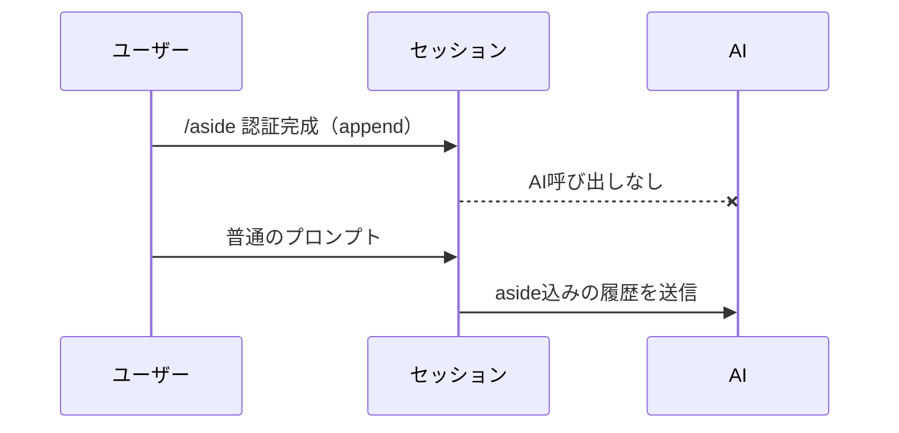

# aside 拡張機能 Behaviors

pi に **AI 応答を起こさずにメッセージを履歴に追記する** `/aside` コマンドを1つ追加する。本質は **LLM context に参加するメッセージを履歴に append する**動作と同じで、打鍵した瞬間に AI 応答を起こさない点だけが異なる。append されたメッセージは次回以降の AI 呼び出しにも履歴順で通常メッセージとして送られ続ける。

## コマンド

```
/aside [テキスト]
```

| 入力            | 意味                              |
| --------------- | --------------------------------- |
| `/aside 認証完成` | `認証完成` を履歴に append |
| `/aside`         | 空テキストを append（許可）        |

テキストは自由文。空でもよい。

コマンド一覧では、`/aside` に説明文「Append a message to the session history without triggering an AI response.」が表示される。

## 振る舞い

`/aside` を打つと、テキスト（空も可）を LLM context に参加するメッセージとしてセッション履歴に append する。AI 応答は起こさない（LLM を呼ばないのでトークン消費ゼロ）。セッションはそのまま継続する。

**メッセージの形式**: append されるメッセージは `role:"custom"` のメッセージ（`customType` は `aside`）として履歴に格納され、`role:"user"` の通常メッセージと同じく LLM context に参加する。append したメッセージはセッション画面にも表示される。

| 操作            | 履歴への影響             | AI 応答                      |
| --------------- | ------------------------ | ---------------------------- |
| `/aside 認証完成` | `認証完成` が append される | なし                         |
| 普通のプロンプト | プロンプトが append される | あり（直前の aside 込みの履歴を送信） |

**送信される**: append されたメッセージは次回以降の AI 呼び出しに履歴の一部として（履歴順で）送られ、以後も消えない（通常メッセージと同じ）。

**複数 append**: `/aside A` → `/aside B` と打つと A・B がこの順で履歴に並ぶ。次の AI 呼び出しでは両方が履歴順で送られる。



## スコープ外（やらないこと）

- **AIによるメッセージ生成**はしない。メッセージは常にユーザーがタイプする。
- **消費後の削除**はしない。一度 append したメッセージは以後も履歴に残り続ける（次回1回限りで消える挙動は取らない）。
