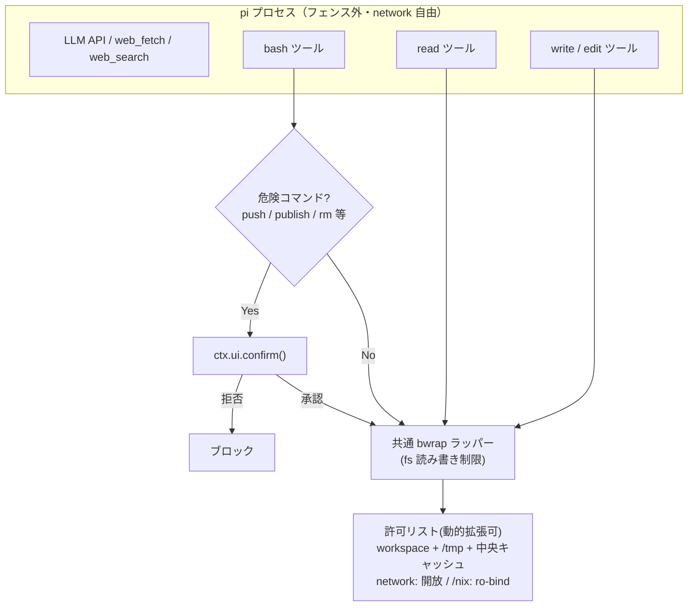

# ADR: bwrap-tools — サンドボックス方針

| | |
|---|---|
| **Status** | Proposed |
| **Date** | 2026-08-12 |
| **Subject** | pi のデフォルト fs アクセスツールをリプレイスし、ファイルパスの読み書きアクセス制御を行う拡張機能 |

---

## 目的

pi の bash / read / write / edit を安全に回しつつ、network 系は自由に使う。スコープは自分のマシン・自分のリポジトリ（信頼できないコードは今は扱わない）。

| 区分 | 要件 |
|---|---|
| **守る** | workspace 外への **読み書き** を機械的に制限（bash も read/write/edit も） |
| **守る** | push / publish 等の破壊的・外部公開操作に確認ゲート |
| **守る** | 秘密ファイル（`~/.ssh`, `~/.aws` 等）の読み出しを制限 |
| **自由** | web_fetch / web_search（network は開放） |
| **自由** | bash コマンドの実行自体 |
| **運用** | セッション中の動的許可拡張（ユーザー主導・エージェントからは不可） |

**対象スコープ**: 自分のマシン・自分のリポジトリ（信頼できないコードは今は扱わない）

---

## サンドボックスツールの比較（どの技術を使うか）

欲しいのは「fs 制限あり ＋ network 開放」。**srt だけが network 強制隔離(allow-only・全許可なし)で外れる。** 他は network 開放でき、軽量・標準・NixOS 標準の点で bwrap を選ぶ。

| 手法 | fs 制限 | network | 重さ | 備考 | 判定 |
|---|---|---|---|---|---|
| **bwrap** | ✓ | 開放(`--unshare-net` 省略) | 軽 | NixOS 標準 | **✓ 採用** |
| firejail | ✓ | 開放(デフォルト) | 軽 | bwrap と同質・勝点なし | ✗ |
| landlock(LSM) | ✓ | 無干渉(fs のみの概念) | 最軽 | ツール整備が未成熟 | ✗ |
| container(nspawn/docker) | ✓ | 開放可(`--network=host`) | 重 | 環境分離が過剰 | ✗ |
| VM | ✓ | 開放可 | 最重 | 別カーネル・大幅過剰 | ✗ |
| srt | ✓ | **強制隔離(allow-only)** | 中 | network 開放できず | ✗ |

---

## 検討したアプローチ（何をどうフェンスするか）

壁打ち(2026-08-11〜12)で検討した 4 案。比較軸は「動的許可」「許可リスト管理」「網羅性」「読み書き両方の制限」。

| # | アプローチ | 判定 | 実現できる | 実現できない / 課題 |
|---|---|---|---|---|
| A | pi全体を sandbox で包む | **✗** | 全 fs 経路（読み書き）を1つの境界でフェンス、許可リスト1箇所、網羅性は自動 | 動的許可不可（bwrap は起動時に namespace 固定・再起動 + resume が必要）。pi 内部パス(`~/.pi`, sessions, 拡張の `node_modules`, provider endpoint)の列挙が必要 |
| B | bash のみ srt で包む | **✗** | bash 経路（読み書き）を隔離 | srt は network 強制隔離で開放不可。read/write/edit 等は制限なし（bash と別管理） |
| C | ハイブリッド(bash=bwrap / read・write・edit=パスチェック) | **△** | bash=bwrap で確実、read/write/edit=パスチェックで動的許可・読み書き制限とも ○、network 開放 | 許可リストが2系統（bwrap 用 ＋ パスチェック用）で二重管理、実現手段も2種類。網羅性は手動担保。bash のパス制限は文字列マッチでは原理的に無理（cd / 変数展開 / サブシェルで抜かれる）→ 結局 bash は bwrap 必須 |
| D | 全 fs ツールを bwrap 経由にリプレイス | **✓ 採用** | 許可リスト1箇所（共通ラッパー）で二重管理が完全解消。実現手段1種類で統一・シンプル。動的許可・network 開放・読み書き両制限とも ○ | 網羅性は手動だが、共通 bwrap ラッパーに集約して軽減。新ツールをラッパーに繋ぎ込まないと抜け道 |

> **帰結**: 「動的に許可を広げたい」かつ「二重管理を避けたい」かつ「読み書き両方制限したい」なら、fs アクセスツールを全部同じ bwrap ラッパーに通すしかない。

---

## 決定

> **全 fs アクセスツール(read / write / edit / bash)を独自拡張でリプレイスし、fs 読み書きを共通の bwrap ラッパーで制限する。** network は開放。

```
pi プロセス本体            ── フェンスしない(fetch・API は自由)
read / write / edit / bash ── 独自拡張でリプレイス、fs 読み書きは共通 bwrap ラッパー経由
許可リスト                 ── 拡張内に1箇所・ユーザー承認で動的拡張可
```

- **read**: offset/limit 等のロジックは pi プロセス内で組み立て、最終 fs 読み込みだけ bwrap 経由
- **bash**: コマンド実行全体を bwrap で包む（bind 外は読めないし書けない）
- **write/edit**: アンカー処理等のロジックは pi プロセス内に残し、最終的な fs 書き込みだけ bwrap 経由
- **web_fetch / web_search**: network 系なので fs 制限の対象外・そのまま

---

## 構成



---

## トレードオフ / 既知のギャップ

| | 項目 |
|---|---|
| ✓ | fetch が自由 |
| ✓ | workspace 外の読み書きを機械的に弾く（bash も read/write/edit も）|
| ✓ | push/publish に承認を挟む |
| ✓ | 秘密ファイルの読み出しを制限 |
| ✓ | セッション中の動的許可拡張(ユーザー主導) |
| ✓ | 許可リスト1箇所で DRY |
| ✗ | 網羅性の手動担保: 新ツールを共通 bwrap ラッパーに繋がないと抜け道 |
| ✗ | 確認済み global install の postinstall は network 開放・実質フェンス外で走る(network は YAGNI で開放) |
| ✗ | 文字列マッチは境界ではない(hostile に抜かれる) |
| ✗ | Linux は EPERM で黙って失敗(strace で追う) |
| ✗ | 読んだ秘密の network 送信は防げない(network 開放) — 脅威C(スコープ外)由来 |

---

## 実装時にやること

1. 共通の許可リストを設計
   - workspace ＋ ~/.pi ＋ ~/.config ＋ /tmp ＋ PM 中央キャッシュ
   - 全 fs ツールがこのリストを参照(単一ソース・bwrap の bind 設定へ展開)

2. 全 fs アクセスツールをリプレイス（共通 bwrap ラッパー経由）
   - read → offset/limit 等は pi プロセス内で組み立て、最終 fs 読み込みだけ bwrap 経由
   - bash → コマンド実行全体を bwrap で包む
   - write/edit → アンカー処理等は pi プロセス内で組み立て、最終 fs 書き込みだけ bwrap 経由

3. 動的拡張の承認フロー
   - ユーザー承認で許可リストへパス追加(エージェントからは不可)

4. 許可リストのパスは起動時に mkdir -p で実在させる(推測しない)
   - PM 中央キャッシュはデフォルトパスを静的に列挙(npm/bun/pnpm/yarn/uv/pip/cargo/go/vp)
   - pi プロセス本体(フェンス外)で mkdir -p → bwrap の --bind-try で bind

5. NixOS なので /nix の ro-bind が必須
   - 実行ファイルが /nix/store を指すため、ro で見せないと動かない

6. ゲートのキーワードを確定(bash のみ)
   - git push / npm publish / gh / rm -rf / sudo / > / tee / global install 系
