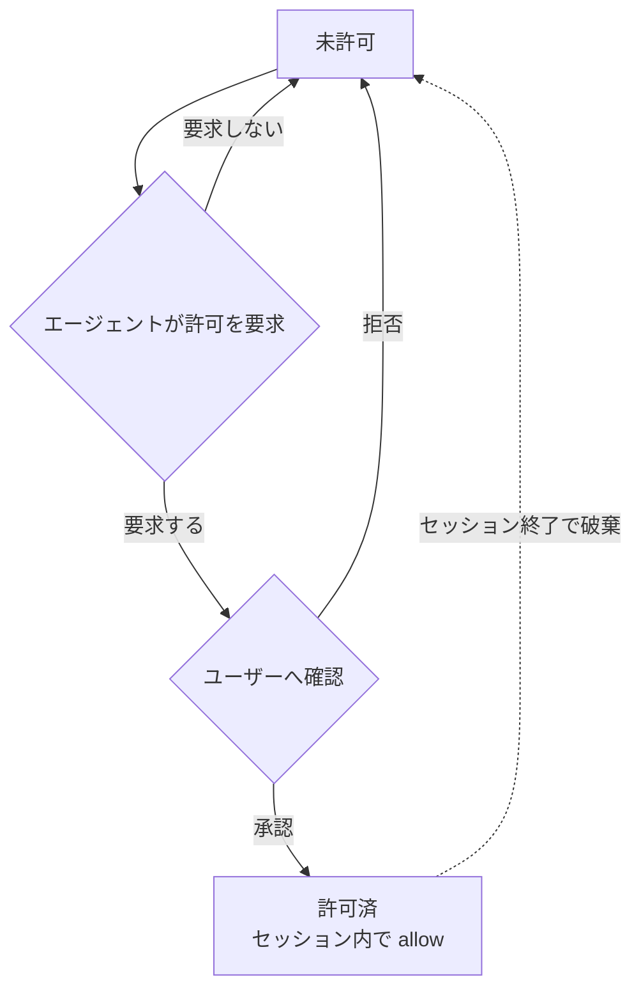

# bwrap-tools — 仕様書

pi の全 built-in fs ツール（read / write / edit / grep / find / ls / bash）を置き換え、**パスの読み書きと bash コマンドを `allow` / `deny` / `ask` で制限**しつつ、network 系は自由に使う拡張機能。

---

## 1. ツールごとの扱い

| pi ツール | 本拡張での扱い | fs 読み書き制限 | network |
| --- | --- | --- | --- |
| `read` `write` `edit` `grep` `find` `ls` | 置き換え | あり | — |
| `bash` | 置き換え | あり | 開放 |
| `web_fetch` `web_search` | 対象外（そのまま） | — | 開放 |
| LLM API / pi プロセス本体 | 対象外 | — | 開放 |

置き換え対象は pi の **全 built-in fs ツール**（`read` `write` `edit` `grep` `find` `ls` `bash`）。

---

## 2. パスのアクセス結果（全 fs ツール共通）

パスごとにアクション（`allow` / `deny` / `ask`）を解決し（§3）、読み書きともに結果が決まる。

| パスのアクション | 結果 |
| --- | --- |
| `allow` | 成功 |
| `ask` | ユーザー確認。承認で成功、拒否で失敗 |
| `deny`（明示） | 拒否。許可要求も不可 |
| 未設定（= `deny`） | 拒否。ただし agent は許可要求を出せる（§3） |

- 秘密ファイル（`~/.ssh`, `~/.aws`, `~/.gnupg` 等）は `allow` に入れないことで読み出しを制限する。
- `web_fetch` / `web_search` は fs 制限の対象外。

---

## 3. パスの解決

### パス文字列の解決

`config.yaml` のパスエントリは以下の規則で絶対パスに解決し、その絶対パスでアクション判定（下記）・ bwrap の bind（§6.1）を行う。

| 記述 | 解決先 |
| --- | --- |
| 相対パス（`.` `./...` `../...`） | セッションの cwd を起点 |
| `~` | ホームディレクトリ |
| それ以外 | 絶対パス（そのまま） |

### glob パターン

`paths` のエントリに glob（`*` `?` `**` `[...]`）を含められる。パターンは絶対パスへ解決（上記）した後に展開し、マッチした実パスそれぞれをアクション判定・ bind 対象とする。

| パターン | 意味 |
| --- | --- |
| `*` | パス区切り（`/`）以外の任意文字列 |
| `**` | パス区切りを含む任意文字列（再帰） |
| `?` | 任意1文字 |
| `[...]` | 文字クラス |

例: `~/.cache/*` → `~/.cache/uv` `~/.cache/pip` `~/.cache/go-build` ... に展開される。

glob は起動時に既存パスへ展開され、セッション中の新規パスは対象外。§6.1 の `mkdir -p` は固定パスのみで、glob には適用しない。

### アクションの決定

`config.yaml`（§6）の `paths` から、優先度 `deny` > `ask` > `allow` でアクションを決める。いずれにもマッチしなければ未設定（= `deny`）。

### 動的拡張のライフサイクル

未設定パスは `deny` だが、agent がユーザーへ許可要求を出せる（明示 `deny` は不可）。承認されるとセッション内で `allow` になり、セッション終了で破棄される。

---

## 4. bash コマンドの実行結果

`bash` コマンドは `config.yaml`（§6）の `commands` からアクションを解決する（優先度・未設定の扱いは §3 と同じ）。

| コマンドのアクション | 結果 |
| --- | --- |
| `allow` | そのまま実行 |
| `ask` | 実行前にユーザー確認。承認で実行、拒否でブロック |
| `deny` / 未設定 | ブロック（実行されない） |

---

## 5. network

network は開放。fs 制限の対象外。

| 経路 | network |
| --- | --- |
| `bash` 内のネットワーク操作 | 開放 |
| `web_fetch` / `web_search` | 開放 |
| LLM API / pi プロセス本体 | 開放 |

---

## 6. 設定（`config.yaml`）

ユーザーが `dotfiles/.pi/agent/extensions.exact/bwrap-tools/config.yaml` で制御。パスもコマンドも `allow` / `deny` / `ask` の3アクションで指定する。

| 項目 | 意味 |
| --- | --- |
| `paths.allow` / `.ask` / `.deny` | パスのアクション（§2・§3）。パスの記述形式は §3（相対パスは cwd から解決）。実在しないパスは起動時に作成される（§6.1） |
| `commands.allow` / `.ask` / `.deny` | コマンドのアクション（§4）。`"*"` は全コマンドにマッチ |

- 優先度 `deny` > `ask` > `allow`。いずれにもマッチしないパス・コマンドは `deny`。
- 実値（既定エントリ）は `config.yaml` を参照。

> パス・コマンドの照合ルール（前置一致・トークン一致・`"*"` の扱い等）は実装で決定する。本 spec は「何が設定可能か」のみを規定する。

### 6.1 許可パスの実在保証

`allow` 中のパスは bwrap で bind するため実在が必須。ホワイトリスト方式（§2）なので未 bind のパスはサンドボックス内に存在せず、PM がキャッシュディレクトリを自前作成できない。よって起動時に pi プロセス本体（フェンス外）が `allow` の全パスを `mkdir -p` し、bwrap は `--bind-try` で存在を気にせず bind する。
