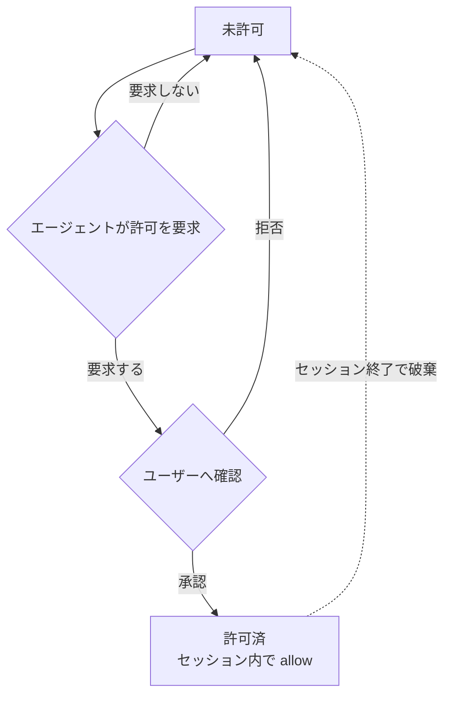

# guardrails — 仕様書

pi の全 built-in fs ツール（read / write / edit / grep / find / ls / bash）を置き換え、**パスの読み書きと bash コマンドを `allow` / `deny` / `ask` で制限**しつつ、network 系は自由に使う拡張機能。

---

## 1. ツールごとの扱い

| pi ツール | 本拡張での扱い | fs 読み書き制限 | network |
| --- | --- | --- | --- |
| `read` `write` `edit` `grep` `find` `ls` | 置き換え | あり | — |
| `bash` | 置き換え | あり | 開放 |
| `web_fetch` `web_search` | 対象外（そのまま） | — | 開放 |
| LLM API / pi プロセス本体 | 対象外 | — | 開放 |

置き換え対象は pi の **全 built-in fs ツール**（`read` `write` `edit` `grep` `find` `ls` `bash`）。

---

## 2. パスのアクセス結果（通常の fs ツール共通）
read / write の各操作ごとに、対応する設定セクションからパスのアクション（`allow` / `deny` / `ask`）を解決し（§3）、結果が決まる。edit は対象パスに対して read と write の両方を確認する。`credentials` に指定されたパスは §2.1 の例外に従う。

| パスのアクション | 結果 |
| --- | --- |
| `allow` | 成功 |
| `ask` | ユーザー確認。承認で成功、拒否で失敗 |
| `deny`（明示） | 拒否。許可要求も不可 |
| 未設定（= `deny`） | 拒否。ただし agent は許可要求を出せる（§3） |

- 秘密ファイル（`~/.ssh`, `~/.aws`, `~/.gnupg` 等）は `allow` に入れないことで読み出しを制限する。
- `web_fetch` / `web_search` は fs 制限の対象外。

### credentials の例外

`credentials` は、bash コマンドが利用する必要はあるが、pi の fs ツールからは扱わせないファイルパスパターンを指定する。

- `credentials` のパスは bash の sandbox に read-only で bind される。bash からの読み取りは `commands` のアクションに従う。
- `read` `write` `edit` `grep` `find` `ls` からは常に拒否される。`read` / `write` の設定で `allow` または動的許可になっていても、この拒否を上書きできない。
- `credentials` のパスは `read` / `write` のアクション判定および動的許可の対象外とする。
- `credentials` に glob を指定した場合の絶対パス解決・起動時展開は、`read` / `write` と同じ規則（§3）に従う。
- `credentials` は秘密情報を agent から秘匿する機能ではない。bash は読み取った内容を標準出力や network 経由で漏洩させられる。

---

## 3. パスの解決

### パス文字列の解決

`config.yaml` の `read` / `write` および `credentials` のパスエントリは以下の規則で絶対パスに解決する。`read` / `write` はそれぞれの設定でアクション判定を行い、`read` / `write` と `credentials` は bwrap の bind 対象（§6.1）とする。

| 記述 | 解決先 |
| --- | --- |
| 相対パス（`.` `./...` `../...`） | セッションの cwd を起点 |
| `~` | ホームディレクトリ |
| それ以外 | 絶対パス（そのまま） |

### glob パターン

`read` / `write` と `credentials` のエントリに glob（`*` `?` `**` `[...]`）を含められる。パターンは絶対パスへ解決（上記）した後に展開する。`read` / `write` はマッチした実パスそれぞれを対応する操作のアクション判定・bind 対象とし、`credentials` は bind 対象とする。

| パターン | 意味 |
| --- | --- |
| `*` | パス区切り（`/`）以外の任意文字列 |
| `**` | パス区切りを含む任意文字列（再帰） |
| `?` | 任意1文字 |
| `[...]` | 文字クラス |

例: `~/.cache/*` → `~/.cache/uv` `~/.cache/pip` `~/.cache/go-build` ... に展開される。

glob は起動時に既存パスへ展開され、セッション中の新規パスは対象外。§6.1 の `mkdir -p` は固定パスのみで、glob には適用しない。

### アクションの決定

`config.yaml`（§6）の操作ごとのパス設定から、優先度 `deny` > `ask` > `allow` でアクションを決める。いずれにもマッチしなければ未設定（= `deny`）。

### 動的拡張のライフサイクル

未設定パスは `deny` だが、agent がユーザーへ許可要求を出せる（明示 `deny` は不可）。承認されると、承認した操作（`read` または `write`）についてセッション内で `allow` になり、セッション終了で破棄される。`read` と `write` の動的許可は別々に管理する。

動的許可はパスと操作（`read` / `write`）の組み合わせで管理する。

---

## 4. bash コマンドの実行結果

`bash` コマンドは `config.yaml`（§6）の `commands` からアクションを解決する（優先度・未設定の扱いは §3 と同じ）。

| コマンドのアクション | 結果 |
| --- | --- |
| `allow` | そのまま実行 |
| `ask` | 実行前にユーザー確認。承認で実行、拒否でブロック |
| `deny` / 未設定 | ブロック（実行されない） |

---

## 5. network

network は開放。fs 制限の対象外。

| 経路 | network |
| --- | --- |
| `bash` 内のネットワーク操作 | 開放 |
| `web_fetch` / `web_search` | 開放 |
| LLM API / pi プロセス本体 | 開放 |

---

## 6. 設定（`config.yaml`）

ユーザーが `dotfiles/.pi/agent/extensions.exact/guardrails/config.yaml` で制御。通常のパスとコマンドは `allow` / `deny` / `ask` の3アクションで指定し、bash 専用パスは `credentials` で指定する。

| 項目 | 意味 |
| --- | --- |
| `read.allow` / `.ask` / `.deny` | read / grep / find / ls のパスアクション（§2・§3）。パスの記述形式は §3（相対パスは cwd から解決） |
| `write.allow` / `.ask` / `.deny` | write / edit のパスアクション（§2・§3）。allow の固定パスは起動時に作成される（§6.1） |
| `credentials` | bash の sandbox に read-only で bind するパスパターン。`read` `write` `edit` `grep` `find` `ls` からは常に拒否され、read / write のアクション判定・動的許可の対象外（§2.1・§3） |
| `commands.allow` / `.ask` / `.deny` | コマンドのアクション（§4）。`"*"` は全コマンドにマッチ |

- 優先度 `deny` > `ask` > `allow`。いずれにもマッチしないパス・コマンドは `deny`。
- 実値（既定エントリ）は `config.yaml` を参照。

> パス・コマンドの照合ルール（前置一致・トークン一致・`"*"` の扱い等）は実装で決定する。本 spec は「何が設定可能か」のみを規定する。

### 6.1 bind とパスの実在保証

`read` / `write` の allow 中のパスは bwrap で bind するため実在が必須。ホワイトリスト方式（§2）なので未 bind のパスはサンドボックス内に存在せず、PM がキャッシュディレクトリを自前作成できない。よって起動時に pi プロセス本体（フェンス外）が `write.allow` の固定パスを `mkdir -p` し、bwrap は `--bind-try` で存在を気にせず bind する。

`credentials` のパスは bash の sandbox にのみ `--ro-bind` する。credentials のファイル自体や glob のマッチ先は作成せず、存在するパスだけを起動時に bind する。

---

## 7. Operations による fs IO

本拡張は pi の標準 tool factory を利用し、テキスト処理は pi 標準に委譲する。各 factory の `operations` に bwrap バックエンドを渡し、低レベル fs IO だけを bwrap CLI 経由にする。

| ツール | 標準 factory | bwrap 経由の operations |
| --- | --- | --- |
| `read` | `createReadTool` | `access`, `readFile` |
| `write` | `createWriteTool` | `mkdir`, `writeFile` |
| `edit` | `createEditTool` | `access`, `readFile`, `writeFile` |
| `grep` | `createGrepTool`（execute のみ上書き、§7.1） | rg 実行は sandbox 内で自前、truncation は pi ヘルパ再利用、context は標準ロジックを移植 |
| `find` | `createFindTool` | `exists`, `glob` |
| `ls` | `createLsTool` | `exists`, `stat`, `readdir` |
| `bash` | `createBashTool` | `BashOperations.exec` |

標準 factory が担当する offset/limit、oldText/newText 置換、diff、結果の truncation、glob の結果整形、画像判定などは本拡張で再実装しない。`edit` は pi 標準の `oldText` / `newText` 形式を使い、行ハッシュアンカー形式は使わない。

### 7.1 `grep` の例外

`GrepOperations` は `isDirectory` / `readFile` のみで、rg の実行方法をカスタマイズできない。`createGrepTool` の factory は内部で直接 `spawn(rg)` するため、operations を差し替えても rg が sandbox 外の fs 全体を走査し、§2 のパス制限が無意味になる。

よって `grep` だけは `createGrepTool` の schema と定義を利用しつつ **execute を上書き** し、rg を sandbox 内で実行する。この上書きで失われる factory 機能は pi の `truncateLine` / `truncateHead` / `DEFAULT_MAX_BYTES` を再利用しつつ、標準 grep と同一の出力になるよう移植して互換性を担保する:

- **context 表示**: マッチ行の前後 N 行を `path-行番号-` 形式で出力（標準 `formatBlock` と同一）
- **行長 truncation**: pi の `truncateLine`（500字）を再利用
- **バイト truncation**: pi の `truncateHead`（50KB）を再利用
- **マッチリミット通知**: 標準と同一の notices 文言を生成

実行互換性（出力が標準 grep と一致する）を最優先とする。rg の match-limit 到達時の早期 kill は性能最適化であり結果には影響しないため、本拡張では省略する（巨大リポジトリで rg が最後まで走る分遅くなる可能性がある）。

### bwrap 起動

各 operation は次の構成で `bwrap` を起動する。

1. `--die-with-parent`、`--proc /proc`、`--dev /dev` を設定する。
2. 設定済みの allow パスを `--bind-try`、read-only パスと credentials を `--ro-bind-try` で bind する。
3. NixOS で実行ファイルと共有ライブラリを解決できるよう `/nix` 等の runtime path を read-only で bind する。
4. `bash` は `bash -c <command>` を bwrap 内で実行し、network namespace は分離しない。
5. abort と timeout は child process を停止し、標準出力・標準エラーを pi 標準の tool result へ渡す。

---

## 8. 表示

全ツールの実行中表示は `Running...`、エラー表示はエラーメッセージ全体、成功時の折りたたみ表示は次のサマリーとする。展開時は結果本体を表示する。

| ツール | コール行 | 折りたたみ時の成功サマリー | 展開時 |
| --- | --- | --- | --- |
| `bash` | `$ <command>`（80文字で切り詰め） | 実行秒数（例: `1.2s`） | stdout/stderr |
| `write` | `write <path>` | `wrote <size>` | 書き込んだ内容 |
| `edit` | `edit <path>` | `edited N block(s)` | diff |
| `read` | `read <path>`（SKILL.md のとき `[skill] <name>`） | `N lines` | ファイル内容 |
| `grep` | `grep <pattern>` | `N matches`（context 行を含まない純マッチ数） | マッチ結果（context 行を含む） |
| `find` | `find <pattern>` | `N files` | パス一覧 |
| `ls` | `ls <path>`（未指定は `.`） | `N entries` | エントリ一覧 |

表示はツールの実行結果を変更せず、pi TUI の renderer だけを置き換える。
