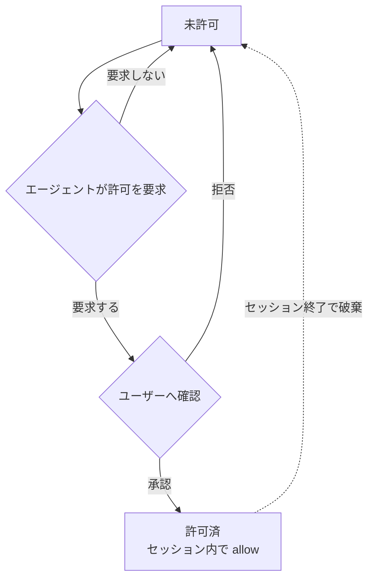

# guardrails — 仕様書

pi の全 built-in fs ツール（read / write / edit / grep / find / ls / bash）を置き換え、**パスの読み書きと bash コマンドを `allow` / `deny` / `ask` で制限**しつつ、network 系は自由に使う拡張機能。

---

## 1. ツールごとの扱い

| pi ツール | 本拡張での扱い | fs 読み書き制限 | network |
| --- | --- | --- | --- |
| `read` `write` `edit` `grep` `find` `ls` | 置き換え | あり | — |
| `bash` | 置き換え | あり | 開放 |
| `web_fetch` `web_search` | 対象外（そのまま） | — | 開放 |
| LLM API / pi プロセス本体 | 対象外 | — | 開放 |

置き換え対象は pi の **全 built-in fs ツール**（`read` `write` `edit` `grep` `find` `ls` `bash`）。

---

## 2. パスのアクセス結果（通常の fs ツール共通）
read / write の各操作ごとに、対応する設定セクションからパスのアクション（`allow` / `deny` / `ask`）を解決し（§3）、結果が決まる。edit は対象パスに対して read と write の両方を確認する。許可された画像ファイルの `read` は §2.1 に従う。`credentials` に指定されたパスは §2.2 の例外に従う。

| パスのアクション | 結果 |
| --- | --- |
| `allow` | 成功 |
| `ask` | ユーザー確認。承認で成功、拒否で失敗 |
| `deny`（明示） | 拒否。許可要求も不可 |
| 未設定（= `deny`） | 拒否。ただし agent は許可要求を出せる（§3） |

- 秘密ファイル（`~/.ssh`, `~/.aws`, `~/.gnupg` 等）は `allow` に入れないことで読み出しを制限する。
- `web_fetch` / `web_search` は fs 制限の対象外。

### 2.1 画像ファイルの read

画像ファイルは、MIMEタイプが `image/*` のファイルである。MIMEタイプを判定できないときだけ、拡張子を補助的に使う。`.png`、`.jpg`、`.jpeg`、`.webp`、`.gif`、`.bmp`、`.tiff`、`.tif` は画像ファイルとして扱う。

画像ファイルのパスに対する `read` アクセスが許可された後、画像本体を返さずにブロックする。対応するOCRファイルは、元画像のパスに `.ocr.md` を付加したパスである。

| OCRファイル | `read` の結果 |
| --- | --- |
| 存在する | 「OCRファイルが存在する場合」のエラーメッセージを返す。 |
| 存在しない | 「OCRファイルが存在しない場合」のエラーメッセージを返す。 |

エラーメッセージの `<image-path>` は、`read` に渡された元画像のパスで置き換える。

OCRファイルが存在する場合:

```text
IMAGE_BINARY_BLOCKED

画像は直接読み込めない。
抽出済みのOCRファイルを読み込むこと:

<image-path>.ocr.md
```

OCRファイルが存在しない場合:

```text
IMAGE_BINARY_BLOCKED

画像バイナリの直接読み込みは禁止されている。
画像の内容を読む場合は、AGENTS.mdの画像OCR手順に従うこと。

1. 対応するOCRファイルを確認する:
   <image-path>.ocr.md

2. OCRファイルが存在しない場合:
   AGENTS.mdに記載されたMinerU CLIを実行して作成する。

3. 作成済みのOCRファイルをread toolで読み込む。

元画像をVision入力へ自動添付してはならない。
```

ブロック結果は元画像のバイナリまたは画像コンテンツを含まない。OCRファイルを自動生成・上書き・代読せず、Vision入力へ元画像を自動添付しない。MinerUが失敗しても同じ規則を維持する。

画像以外のファイルは、既存の `read` の振る舞いを維持する。

### 2.2 credentials の例外

`credentials` は、bash コマンドが利用する必要はあるが、pi の fs ツールからは扱わせないファイルパスパターンを指定する。

- `credentials` のパスは bash の sandbox に read-only で bind される。bash からの読み取りは `commands` のアクションに従う。
- `read` `write` `edit` `grep` `find` `ls` からは常に拒否される。`read` / `write` の設定で `allow` または動的許可になっていても、この拒否を上書きできない。
- `credentials` のパスは `read` / `write` のアクション判定および動的許可の対象外とする。
- `credentials` に glob を指定した場合の絶対パス解決・起動時展開は、`read` / `write` と同じ規則（§3）に従う。
- `credentials` は秘密情報を agent から秘匿する機能ではない。bash は読み取った内容を標準出力や network 経由で漏洩させられる。

---

## 3. パスの解決

### パス文字列の解決

`config.yaml` の `read` / `write` および `credentials` のパスエントリは以下の規則で絶対パスに解決する。`read` / `write` はそれぞれの設定でアクション判定を行い、`read` / `write` と `credentials` は bwrap の bind 対象（§6.1）とする。

| 記述 | 解決先 |
| --- | --- |
| 相対パス（`.` `./...` `../...`） | セッションの cwd を起点 |
| `~` | ホームディレクトリ |
| それ以外 | 絶対パス（そのまま） |

### glob パターン

`read` / `write` と `credentials` のエントリに glob（`*` `?` `**` `[...]`）を含められる。パターンは絶対パスへ解決（上記）した後に展開する。`read` / `write` はマッチした実パスそれぞれを対応する操作のアクション判定・bind 対象とし、`credentials` は bind 対象とする。

| パターン | 意味 |
| --- | --- |
| `*` | パス区切り（`/`）以外の任意文字列 |
| `**` | パス区切りを含む任意文字列（再帰） |
| `?` | 任意1文字 |
| `[...]` | 文字クラス |
| `{a,b}` | カンマ区切りの選択肢のいずれかに展開（ブレース展開） |
| `"*"` 単体（`read.allow` のみ） | すべてのパスにマッチする。全パスの read を許可し、ルート全体を read-only bind の対象とする（§6.1） |

例: `~/.cache/*` → `~/.cache/uv` `~/.cache/pip` `~/.cache/go-build` ... に展開される。`~/.config/{git,npm}` → `~/.config/git` `~/.config/npm` に展開される。

glob は起動時に既存パスへ展開され、セッション中の新規パスは対象外。§6.1 の `mkdir -p` は固定パスのみで、glob には適用しない。

### アクションの決定

`config.yaml`（§6）の操作ごとのパス設定から、優先度 `deny` > `ask` > `allow` でアクションを決める。いずれにもマッチしなければ未設定（= `deny`）。

### 動的拡張のライフサイクル

未設定パスは `deny` だが、agent がユーザーへ許可要求を出せる（明示 `deny` は不可）。承認されると、承認した操作（`read` または `write`）についてセッション内で `allow` になり、セッション終了で破棄される。`read` と `write` の動的許可は別々に管理する。



動的許可はパスと操作（`read` / `write`）の組み合わせで管理し、次の規則に従う。

- 許可パスがディレクトリのときは配下のパスにも適用される（ファイルのときはそのファイル単体）。
- 明示 `deny` は動的許可より優先する。
- `write` の許可要求では、スコープを「ファイル単体 / 親ディレクトリ配下」から選択できる。
- `write` の許可パスは §6.1 の実在保証の対象とする（承認時にフェンス外で作成する）。`read` の許可でパスは作成しない。

---

## 4. bash コマンドの実行結果

`bash` コマンドは `config.yaml`（§6）の `commands` からアクションを解決する（優先度・未設定の扱いは §3 と同じ）。

| コマンドのアクション | 結果 |
| --- | --- |
| `allow` | そのまま実行 |
| `ask` | 実行前にユーザー確認。承認で実行、拒否でブロック |
| `deny` / 未設定 | ブロック（実行されない） |

---

## 5. network

network は開放。fs 制限の対象外。

| 経路 | network |
| --- | --- |
| `bash` 内のネットワーク操作 | 開放 |
| `web_fetch` / `web_search` | 開放 |
| LLM API / pi プロセス本体 | 開放 |

---

## 6. 設定（`config.yaml`）

ユーザーが `dotfiles/.pi/agent/extensions.exact/guardrails/config.yaml` で制御。通常のパスとコマンドは `allow` / `deny` / `ask` の3アクションで指定し、bash 専用パスは `credentials` で指定する。

| 項目 | 意味 |
| --- | --- |
| `read.allow` / `.ask` / `.deny` | read / grep / find / ls のパスアクション（§2・§3）。パスの記述形式は §3（相対パスは cwd から解決） |
| `write.allow` / `.ask` / `.deny` | write / edit のパスアクション（§2・§3）。allow の固定パスは起動時に作成される（§6.1） |
| `credentials` | bash の sandbox に read-only で bind するパスパターン。`read` `write` `edit` `grep` `find` `ls` からは常に拒否され、read / write のアクション判定・動的許可の対象外（§2.2・§3） |
| `commands.allow` / `.ask` / `.deny` | コマンドのアクション（§4）。`"*"` は全コマンドにマッチ |

- 優先度 `deny` > `ask` > `allow`。いずれにもマッチしないパス・コマンドは `deny`。
- 実値（既定エントリ）は `config.yaml` を参照。

> パス・コマンドの照合ルール（前置一致・トークン一致・`"*"` の扱い等）は実装で決定する。本 spec は「何が設定可能か」のみを規定する。

### 6.1 bind とパスの実在保証

`read` / `write` の allow 中のパスは bwrap で bind するため実在が必須。ホワイトリスト方式（§2）なので未 bind のパスはサンドボックス内に存在せず、PM がキャッシュディレクトリを自前作成できない。よって起動時に pi プロセス本体（フェンス外）が `write.allow` の固定パスを `mkdir -p` し、bwrap は `--bind-try` で存在を気にせず bind する。

`write` の動的許可パスも同じ実在保証の対象とし、承認時にフェンス外で作成する（ファイル単体スコープは親ディレクトリの `mkdir -p` と空ファイル作成、ディレクトリスコープは対象ディレクトリの `mkdir -p`）。`read` の動的許可でパスは作成しない。

`credentials` のパスは bash の sandbox にのみ `--ro-bind` する。credentials のファイル自体や glob のマッチ先は作成せず、存在するパスだけを起動時に bind する。

### fs sandbox での deny パス・credentials パスの隠蔽

fs 系ツール（`read` `write` `edit` `grep` `find` `ls`）用の sandbox では、`read.deny` と `credentials` に指定されたパス（glob 展開後・実在するもののみ）は実体が見えないようマスクされる。

| 対象パスの種類 | fs sandbox 内での見え方 |
| --- | --- |
| ディレクトリ | 空のディレクトリ（tmpfs マウント） |
| ファイル | 空のファイル（`/dev/null` を read-only bind） |

bash コマンドの sandbox ではこのマスクを行わない。`credentials` のパスは §2.2 のとおり read-only で bind される。

---

## 7. run-tools CLI による fs IO

本拡張は pi の標準 tool factory からツール定義（schema・説明文）を取り込み、execute を差し替える。取り込んだ説明文にはサンドボックスの挙動ガイドを追記する: `bash` には書き込み失敗（read-only file system）時に `write` / `edit` での許可要求へ誘導する文を、`write` / `edit` には未許可パスへの書き込みで許可ダイアログが出て承認後にセッション内（bash 含む）で書き込み可能になる旨を追記する。認可（§2〜§4）を通ったツール呼び出しは、ツールごとに 1 回の bwrap 起動で execute 全体を実行する。sandbox 内では `bun run-tools.ts <tool-name>` が pi 標準の tool definition を呼び出し、標準の fs・fd・rg・shell を使う。

| ツール | sandbox 内での実行 |
| --- | --- |
| `read` `write` `edit` `grep` `find` `ls` `bash` | `bun run-tools.ts <tool-name>` → pi 標準 tool definition の execute |

bash のツール結果（stdout/stderr）に `Read-only file system` が含まれるとき、結果の末尾に `write` / `edit` での許可要求へ誘導するヒント文を追記してモデルへ返す。

- **入力**: stdin に tool call パラメータの JSON を渡す。bash は `PI_*` 環境変数用のセッション情報も受け取る。
- **出力**: stdout に tool result の JSON（`ok: true` なら `result`、`ok: false` なら `error`）。失敗時は非 0 で終了する。
- 標準 tool definition が担当する処理（offset/limit、`oldText` / `newText` 置換、diff、結果の truncation、glob 結果整形、rg 実行、shell 実行と timeout）は本拡張で再実装しない。
- `edit` は pi 標準の `oldText` / `newText` 形式を使い、行ハッシュアンカー形式は使わない。
- ツールの実行結果はコマンド完了時に一度に返る。bash のストリーミング部分表示は行わない。

### bwrap 起動

各ツール呼び出しは次の構成で `bwrap` を起動する。

1. `--die-with-parent`、`--proc /proc`、`--dev /dev` を設定する。
2. 設定済みの allow パスを `--bind-try`、read-only パスと credentials を `--ro-bind-try` で bind する。
3. NixOS で `bun`・実行ファイル・共有ライブラリを解決できるよう `/nix` 等の runtime path（`~/.nix-profile` を含む）を read-only で bind する。pi パッケージ自体は `/nix` 配下のため追加の bind 不要。
4. sandbox 内で `bun run-tools.ts <tool-name>` を実行し、network namespace は分離しない。
5. abort は bwrap ごと child process を停止する。bash の timeout は sandbox 内の tool definition が処理する。

---

## 8. 表示

全ツールの実行中表示は `Running...`、エラー表示はエラーメッセージ全体、成功時の折りたたみ表示は次のサマリーとする。展開時は結果本体を表示する。

| ツール | コール行 | 折りたたみ時の成功サマリー | 展開時 |
| --- | --- | --- | --- |
| `bash` | `$ <command>`（80文字で切り詰め） | 実行秒数（例: `1.2s`） | stdout/stderr |
| `write` | `write <path>` | `wrote <size>` | 書き込んだ内容 |
| `edit` | `edit <path>` | `edited N block(s)` | diff |
| `read` | `read <path>`（SKILL.md のとき `[skill] <name>`） | `N lines` | ファイル内容 |
| `grep` | `grep <pattern>` | `N matches`（context 行を含まない純マッチ数） | マッチ結果（context 行を含む） |
| `find` | `find <pattern>` | `N files` | パス一覧 |
| `ls` | `ls <path>`（未指定は `.`） | `N entries` | エントリ一覧 |

表示はツールの実行結果を変更せず、pi TUI の renderer だけを置き換える。
