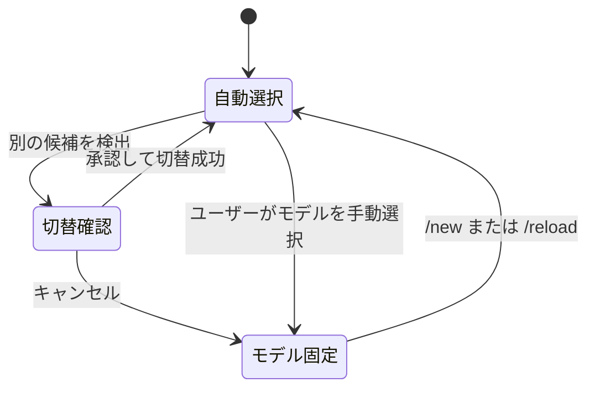
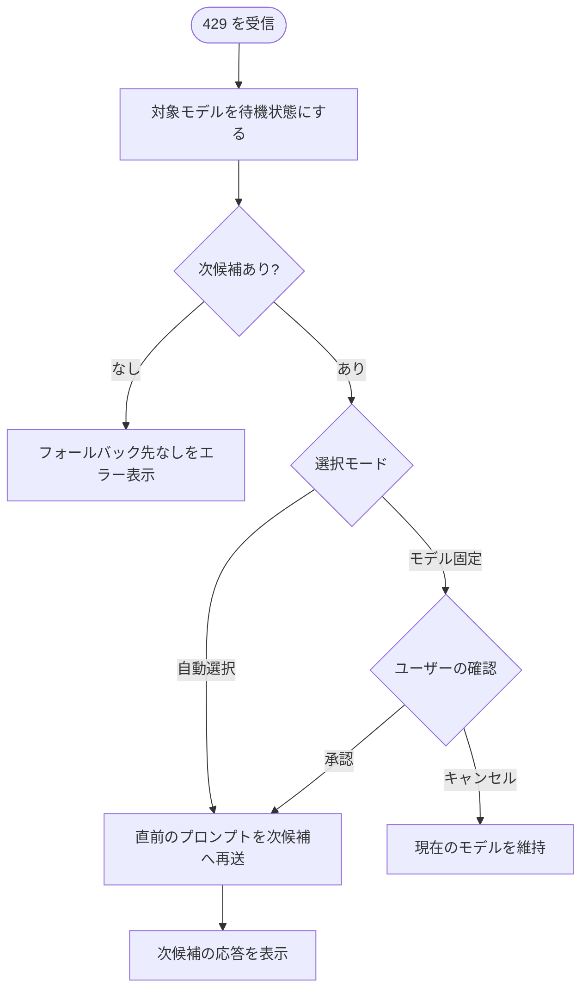

# モデル自動ルーティング

## 目的

設定した優先順位と条件に従って利用するモデルを自動で選び、レート制限されたら利用可能な次候補へ切り替える。

## 設定

上から順にモデル候補を指定する。

| 項目 | 必須 | 意味 |
| --- | --- | --- |
| `provider` | 必須 | モデルを提供するプロバイダー |
| `model` | 必須 | 利用するモデル |
| `when` | 任意 | 終了コード `0` のときだけ有効になる条件。省略・空文字なら常に有効。5秒でタイムアウトし、タイムアウト・失敗時は終了コード非 `0` と同じく無効 |

```yaml
rules:
  - provider: zai
    model: glm-5.2
    when: 'h=$(date -u +%H); [ "$h" -ge 06 ] && [ "$h" -lt 10 ]'
  - provider: commandcode
    model: gpt-5.6-luna
```

| 設定の状態 | 結果 |
| --- | --- |
| `rules` が空配列 | 自動ルーティングを無効にする |
| `rules` が配列でない（例: スカラー値） | 自動ルーティングを無効にする |
| ファイルがない・空・読めない | 自動ルーティングを無効にする |
| 必須項目がない、`when` が文字列でない | 全ルールを無効にし `invalid rule(s); routing disabled` を通知（UI がある場合） |
| モデルがレジストリに存在しない | そのルールだけ飛ばして次へ（設定全体は無効にしない） |

## どのモデルが選ばれるか

リストの上から順に評価し、**利用可能で `when` を満たし、レート制限の待機中でない**最初の候補を選ぶ。該当する候補がなければ現在のモデルを維持する。

## 自動切り替え



任意の状態で `/new`・`/reload` すると自動選択に戻り、待機状態も破棄される。

切り替えの評価タイミング:

| タイミング | 動作 |
| --- | --- |
| 初回のセッション開始時 | 設定を読み込み、確認なしで候補へ切り替える |
| `/new` | 設定と待機状態を読み直し、候補が変われば確認なしで切り替える |
| `/reload`・セッション復元後 | 設定と待機状態を読み直し、候補が変われば確認して切り替える |
| 各プロンプト送信前 | 候補を再評価し、候補が変われば確認して切り替える |

候補が現在のモデルと違う場合の切替結果:

| 操作 | 結果 |
| --- | --- |
| 確認の承認 | 選んだモデルへ切り替え、成功時に切替先を通知 |
| 確認のキャンセル | 現在のモデルを維持、自動切替を停止して `manual` 状態へ |
| 確認なしの切替（初回のセッション開始時・`/new`） | 選んだモデルへ切り替え、成功時に切替先を通知 |
| 切替先に API キーがない | 切り替えず警告を表示。ただし 429 フォールバック時の再送は「レート制限（429）時のフォールバック」に従う |

## モデル固定

| 操作 | 結果 |
| --- | --- |
| ユーザーがモデルを選択・循環選択 | モデル固定状態になり、自動切替を停止する |
| 自動切替・セッション復元による変更 | モデル固定状態にはならない |
| `/new`・`/reload` | モデル固定状態を解除する |

## レート制限（429）時のフォールバック

対象モデルの待機期間:

| `Retry-After` の内容 | 待機期間 |
| --- | --- |
| 秒数 | その秒数 |
| HTTP-date | その日時までの残り時間 |
| ない・解釈不能 | 30 分 |



- 429 に対しては再試行せず次候補へ進む。429 以外の再試行はプロバイダー側の再試行設定に従う。
- 自動フォールバック後の再送は直前のユーザープロンプトを1回だけ行う。直前のプロンプトがなければ再送しない。
- フォールバック時の切替（確認あり・なしの両方）は、切り替えに失敗しても（API キーがないなど）再送を実行する。

## 待機状態（クールダウン）

| 状況 | 結果 |
| --- | --- |
| 待機期間中に同じモデルが候補になる | 飛ばして次候補を探す |
| 待機期間が終了 | そのモデルを再び候補にする |
| プロセス再起動・`/new`・`/reload` | 待機状態を破棄する |

## ヘッドレス（TUI なし）で動いている場合

SDK・非対話・パイプなどで pi が TUI を持たず、切替確認ダイアログや通知を出せない環境での振る舞い:

| 状況 | 結果 |
| --- | --- |
| 自動切替・自動フォールバック | 確認なしで切り替える |
| モデル固定中のフォールバック | 確認できないためフォールバックしない |
| 通知・エラー | 表示しない |
