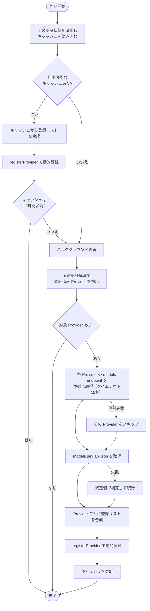

# model-sync 拡張機能 Spec

pi が公式対応する Provider の現在のモデル一覧を Provider の models endpoint から取得し、models.dev のメタデータで補完して、pi の ModelRegistry へ動的登録する拡張機能。pi 本体の静的なモデル定義（models.json ファイルと組み込みカタログ）は書き換えない。

## 同期の全体フロー



失敗時とキャッシュの詳細な扱いは、それぞれ「失敗時の扱い」「キャッシュ」で定める。

## 対象 Provider

同期対象は次の表の Provider。表に無い Provider（Custom Provider、OAuth 専用の Provider、クラウドアカウント紐付けの Provider 等）は同期しない。

| pi provider | endpoint（既定 baseUrl + path） | 認証 | 応答形式 | 既定 api | models.dev |
| --- | --- | --- | --- | --- | --- |
| openai | `https://api.openai.com/v1` + `/models` | Bearer | OpenAI | openai-responses | openai |
| openrouter | `https://openrouter.ai/api/v1` + `/models` | Bearer | OpenAI | openai-completions | openrouter |
| deepseek | `https://api.deepseek.com` + `/models` | Bearer | OpenAI | openai-completions | deepseek |
| xai | `https://api.x.ai/v1` + `/models` | Bearer | OpenAI | openai-responses | xai |
| groq | `https://api.groq.com/openai/v1` + `/models` | Bearer | OpenAI | openai-completions | groq |
| mistral | `https://api.mistral.ai` + `/v1/models` | Bearer | OpenAI | mistral-conversations | mistral |
| together | `https://api.together.ai/v1` + `/models` | Bearer | OpenAI | openai-completions | - |
| fireworks | `https://api.fireworks.ai/inference` + `/v1/models` | Bearer | OpenAI | openai-completions | - |
| cerebras | `https://api.cerebras.ai/v1` + `/models` | Bearer | OpenAI | openai-completions | cerebras |
| nvidia | `https://integrate.api.nvidia.com/v1` + `/models` | Bearer | OpenAI | openai-completions | nvidia |
| moonshotai | `https://api.moonshot.ai/v1` + `/models` | Bearer | OpenAI | openai-completions | moonshotai |
| moonshotai-cn | `https://api.moonshot.cn/v1` + `/models` | Bearer | OpenAI | openai-completions | moonshotai-cn |
| huggingface | `https://router.huggingface.co/v1` + `/models` | Bearer | OpenAI | openai-completions | huggingface |
| zai | `https://api.z.ai/api/coding/paas/v4` + `/models` | Bearer | OpenAI | openai-completions | zai |
| zai-coding-cn | `https://open.bigmodel.cn/api/coding/paas/v4` + `/models` | Bearer | OpenAI | openai-completions | - |
| baseten | `https://inference.baseten.co/v1` + `/models` | Bearer | OpenAI | openai-completions | baseten |
| ant-ling | `https://api.ant-ling.com/v1` + `/models` | Bearer | OpenAI | openai-completions | - |
| xiaomi | `https://api.xiaomimimo.com/v1` + `/models` | Bearer | OpenAI | openai-completions | xiaomi |
| qwen-token-plan | `https://token-plan.ap-southeast-1.maas.aliyuncs.com/compatible-mode/v1` + `/models` | Bearer | OpenAI | openai-completions | - |
| qwen-token-plan-cn | `https://token-plan.cn-beijing.maas.aliyuncs.com/compatible-mode/v1` + `/models` | Bearer | OpenAI | openai-completions | - |
| qwen-token-plan-individual | `https://token-plan.ap-southeast-1.maas.aliyuncs.com/compatible-mode/v1` + `/models` | Bearer | OpenAI | openai-completions | - |
| vercel-ai-gateway | `https://ai-gateway.vercel.sh` + `/v1/models` | Bearer | OpenAI | anthropic-messages | - |
| anthropic | `https://api.anthropic.com` + `/v1/models` | x-api-key | Anthropic | anthropic-messages | anthropic |
| minimax | `https://api.minimax.io/anthropic` + `/v1/models` | x-api-key | Anthropic | anthropic-messages | minimax |
| minimax-cn | `https://api.minimaxi.com/anthropic` + `/v1/models` | x-api-key | Anthropic | anthropic-messages | minimax-cn |
| google | `https://generativelanguage.googleapis.com/v1beta` + `/models?pageSize=1000` | x-goog-api-key | Google | google-generative-ai | google |

models.dev 列が `-` の Provider は models.dev に該当エントリが無く、メタデータは endpoint と既定値のみで構成する。

## 同期の起点

| 起点 | 動作 |
| --- | --- |
| pi 起動（session_start、reason が `startup` または `reload`） | キャッシュを読み、利用可能な登録リストを直ちに反映する。キャッシュが欠損または12時間より古い場合だけ、ネットワーク同期をバックグラウンドで開始する |
| セッション切替（reason が `new` / `resume` / `fork`） | 同期しない（同一プロセス内のため） |
| `/model-sync` コマンド | キャッシュ鮮度にかかわらずネットワーク同期を実行し、完了を待って結果を通知する |

同期の実行は常に単一。実行中に新しい同期が要求された場合、後続の要求は実行中の同期に合流し、その結果を共有する。

期限内のキャッシュがある起動では、キャッシュの登録リストが `/model` に直ちに反映される。キャッシュが無い場合または期限切れの場合は、バックグラウンド同期が完了した時点で反映される。

## Provider の選択と endpoint URL

1. キャッシュ起動時は、pi の認証状態（`ctx.modelRegistry.getProviderAuthStatus`）が configured の Provider だけを使う。現在の baseUrl とキャッシュの baseUrl が一致しない Provider のキャッシュは使わない。
2. バックグラウンド同期と `/model-sync` では、対象表の Provider のうち pi の認証解決（`ctx.modelRegistry.getProviderAuth`）で API key が解決できた Provider だけを同期する。解決できない Provider の endpoint は呼ばない。
3. endpoint URL は「pi が解決した baseUrl」に表の path を連結したものを使う。models.json で baseUrl を上書きしている場合（プロキシ運用等）はその URL へ向かう。解決した認証ヘッダ（`auth.headers`）があればリクエストに付与する。

拡張は `auth.json` や環境変数を独自に走査しない。pi の認証状態・認証解決の結果だけを使う。

## リクエストの認証ヘッダ

| 認証方式 | ヘッダー |
| --- | --- |
| Bearer | `Authorization: Bearer <API key>` |
| x-api-key | `x-api-key: <API key>` ＋ `anthropic-version: 2023-06-01` |
| x-api-key（anthropic のみ、key が `sk-ant-oat` で始まる場合） | `Authorization: Bearer <token>` ＋ `anthropic-version: 2023-06-01` ＋ `anthropic-beta: oauth-2025-04-20` |
| x-goog-api-key | `x-goog-api-key: <API key>` |

1リクエストのタイムアウトは15秒。Provider 間は並列に実行する。

## モデル一覧の抽出

### 応答形式ごとの抽出規則

| 応答形式 | 配列 | model ID | provider 側メタデータ |
| --- | --- | --- | --- |
| OpenAI | `data[]` | `id` | OpenRouter のみ後述のフルセット、他は `name`（あれば） |
| Anthropic | `data[]` | `id` | `display_name`（表示名） |
| Google | `models[]` | `name` から `models/` 接頭辞を除去 | `displayName`（表示名）、`supportedGenerationMethods` |

### チャットモデルのフィルタ

抽出後、モデル ID（小文字比較）に次の文字列を含むモデルを除外する。

```text
embed, whisper, tts, dall-e, gpt-image, imagen, sora, flux,
stable-diffusion, diffusion, moderation, guardrail, rerank,
babbage, davinci, transcribe, asr, ocr, speech
```

Google はこの汎用フィルタに加えて、`supportedGenerationMethods` に `generateContent` を含むモデルだけを残す。

フィルタ後のモデルが0件になった Provider は失敗扱いとし、登録をスキップする。

## メタデータの正規化

各フィールドは次の優先順位で決める。上書きのないフィールドは下位の情報源の値を使う。

```text
Provider models endpoint ＞ models.dev ＞ pi の現在の定義 ＞ 既定値
```

| フィールド | Provider endpoint（OpenRouter のフィールド。表示名は Anthropic `display_name` / Google `displayName` を `name` として使う） | models.dev | 既定値 |
| --- | --- | --- | --- |
| name | `name` | `name` | model ID |
| reasoning | `supported_parameters` が `reasoning` または `include_reasoning` を含む | `reasoning` | `false` |
| input | `architecture.input_modalities` に `image` を含むなら `["text","image"]` | `modalities.input` に `image` を含むなら `["text","image"]` | `["text"]` |
| contextWindow | `context_length` | `limit.context` | `128000` |
| maxTokens | `top_provider.max_completion_tokens` | `limit.output` | `16384` |
| cost | `pricing`（per-token 文字列を per-million 数値へ変換し小数第4位で丸める。`prompt`→`input`、`completion`→`output`、`input_cache_read`→`cacheRead`、`input_cache_write`→`cacheWrite`） | `cost.input` / `cost.output` / `cost.cache_read` / `cost.cache_write`（per-million のまま） | 全項目 `0` |

OpenRouter 以外の Provider の endpoint は表示名のみを提供し、残りは models.dev と既定値で補完する。

## 登録リストの合成

Provider ごとに、次の入力から登録リストを組み立てる。

- 抽出した remote のモデル一覧
- pi の現在のモデル定義（`ctx.modelRegistry.getAll()` の当該 Provider 分）
- `~/.pi/agent/models.json`（pi が models.json を置くパス）の `providers.<provider>.models[].id`

| モデル ID の所在 | 登録する定義 |
| --- | --- |
| models.json のカスタムモデル（remote にある・ない両方） | pi の現在の定義をそのまま使う |
| remote にあり、pi に既存定義がある | 既存定義をベースに、正規化メタデータで `name` / `reasoning` / `input` / `contextWindow` / `maxTokens` / `cost` を上書き。`api` / `baseUrl` / `compat` / `thinkingLevelMap` / `samplingParams` は既存の値を保持 |
| remote にのみある（新規） | 正規化メタデータと既定値で構成 |
| remote になく、pi に組み込み定義だけある | 登録リストに入れない |
| remote になく、どこにもない | 登録リストに入れない |

新規モデルの `api` と `baseUrl` は、pi の当該 Provider の既存モデルの値を引き継ぐ。既存モデルが1つもない場合は表の「既定 api」と「endpoint（既定 baseUrl）」を使う。

models.json の `modelOverrides` は pi が登録結果の上へ自動適用する（ユーザー設定が常に最優先）。上書き対象のモデルが登録リストから外れた場合、その `modelOverride` は適用されない。

合成したリストを `pi.registerProvider(providerId, { models })` で登録する。登録は remote の取得に成功した Provider だけが行う。

## 失敗時の扱い

| 状況 | 扱い |
| --- | --- |
| Provider の endpoint 取得失敗（HTTPエラー・タイムアウト・JSONパース失敗・フィルタ後に0件） | その Provider の登録をスキップする。キャッシュと前回の同期で登録した内容がある場合はそれを維持する |
| models.dev の取得失敗 | 同期を続行し、メタデータは endpoint・期限内または最後に取得した models.dev キャッシュ・既定値の順で補完する |
| キャッシュの読み取り・検証失敗 | キャッシュを無いものとして扱い、バックグラウンド同期を開始する |
| キャッシュの書き込み失敗 | 同期済みの登録は維持する。`/model-sync` の結果に注意行を出す |
| models.json の読み取り失敗 | 同期を続行する。カスタムモデルの保護（上表1行目）は適用されず、`/model-sync` の結果に注意行を出す |

## キャッシュ

キャッシュは pi の agent directory にある `model-sync-cache.json` に保存する。キャッシュファイルには、Provider ごとの endpoint から抽出したモデル一覧・その endpoint の baseUrl・取得時刻と、models.dev の Provider metadata・取得時刻だけを保存する。models.json、pi の既存定義、認証情報、最終的に登録したモデル定義は保存しない。

| 条件 | 動作 |
| --- | --- |
| キャッシュがあり、Provider の baseUrl が現在のものと一致 | キャッシュの endpoint 結果を現在の pi 定義と models.json へ合成して直ちに登録する |
| 同期に必要な Provider endpoint と models.dev のキャッシュがあり、各取得時刻が12時間以内 | endpoint と models.dev へのネットワーク取得を行わない |
| Provider endpoint または models.dev のキャッシュが無い、または取得時刻が12時間より古い | 起動を待たせず、該当する endpoint と models.dev をバックグラウンドで更新する |
| `/model-sync` | 期限内のキャッシュがあっても endpoint と models.dev を取得して更新する |

Provider endpoint と models.dev はそれぞれの取得時刻で鮮度を判定する。更新に失敗したデータは上書きせず、次の起動で再試行する。キャッシュの書き込みは同じ directory の一時ファイルを rename して原子的に行う。

## 表示

### 通常の同期（session_start 起点）

| 状態 | 表示 |
| --- | --- |
| 期限切れ・未作成キャッシュのバックグラウンド更新中 | footer status（`model-sync` キー）に `model-sync: syncing…` を表示 |
| 期限内キャッシュの起動 | footer status を表示しない |
| 更新完了 | footer status を消す |
| 同期対象の Provider が全て失敗 | warning 通知 `model-sync: all providers failed` |
| 一部失敗・成功 | 通知しない |

footer status は TUI / RPC モードのときだけ表示する。

### `/model-sync` コマンド

キャッシュ鮮度にかかわらずネットワーク同期を実行して完了を待ち、Provider ごとに1行ずつ通知する。

| 状態 | 行 |
| --- | --- |
| 成功 | `✓ <provider>: <モデル数> models (<新規数> new)` |
| 未認証でスキップ | `- <provider>: no auth` |
| 失敗 | `✗ <provider>: <エラーメッセージ>` |
| models.json またはキャッシュ書き込み失敗 | 冒頭に `! <対象>: <エラーメッセージ>` |

## セッション中の models.json 編集

同期は各セッション開始時の models.json の内容でリストを合成する。セッション中に models.json を編集しても、`/model-sync` の再実行か pi の再起動まで、同期済み Provider の一覧には反映されない。
