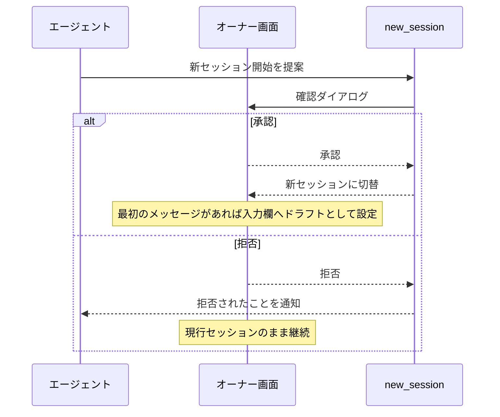

# new-session 拡張機能 Spec

pi に **新セッション開始ツール** を1つ追加する。エージェントが現行セッションから新セッションへの切り替えを提案し、ユーザーの承認を得て切り替える。ユーザーが `/new` を直接打つ操作と違い、エージェント経由のときは必ず**確認ダイアログ**で承認を求める。

## ツール一覧

| ツール      | 入力                   | 出力                           |
| ----------- | ---------------------- | ------------------------------ |
| new_session | 最初のメッセージ(任意) | 新セッションへの切替とその結果 |

## 実行の流れ

## 確認ダイアログ

| 項目   | 値                                                    |
| ------ | ----------------------------------------------------- |
| タイトル | `Start a new session?`                              |
| 本文   | `The agent is about to start a new session. Proceed?` |

## 応答と結果

| ユーザー操作 | 結果                                                   |
| ------------ | ------------------------------------------------------ |
| 承認         | 新セッションに切り替わる                               |
| 拒否         | 現行セッションのまま継続。エージェントは拒否を認識する |

## 承認時の新セッション初期状態

最初のメッセージの有無で開幕が決まる。

| 最初のメッセージ | 新セッションの状態                     |
| ---------------- | -------------------------------------- |
| あり             | 入力欄にドラフトとして設定され、未送信で開く |
| なし             | 空のセッションとして開く               |

## 前セッションからの引き継ぎ

新セッションは**完全にクリーン**に開かれる。前セッションの会話・要約・ファイルパスなどは一切引き継がれない。

## エージェント提案とユーザー直接操作の違い

| 起点                         | 確認ダイアログ | 引き継ぎ |
| ---------------------------- | -------------- | -------- |
| エージェントが new_session   | **表示される** | なし     |
| ユーザーが `/new` を直接入力 | 表示されない   | なし     |

## ユーザーの prompt command

`/new-session` はユーザーが直接入力する prompt command としても利用できる。

| 入力 | 結果 |
| ---- | ---- |
| `/new-session` | 空の新セッションに切り替わる |
| `/new-session hi` | 新セッションへ切り替わり、入力欄に `hi` が未送信ドラフトとして設定される |
| `/new-session   ` | 空の新セッションに切り替わる |

ユーザーが command 引数を指定した場合、ツールから保留された初回メッセージより command 引数を優先する。
