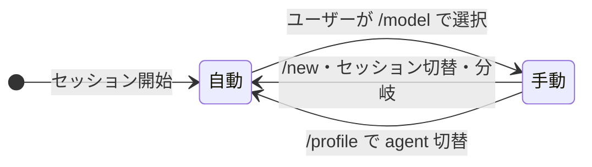
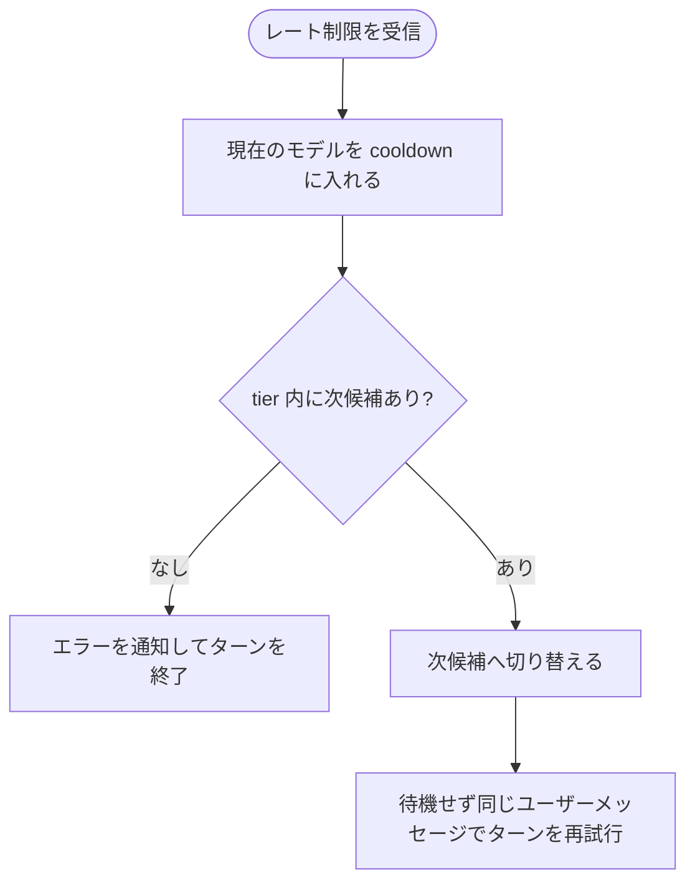
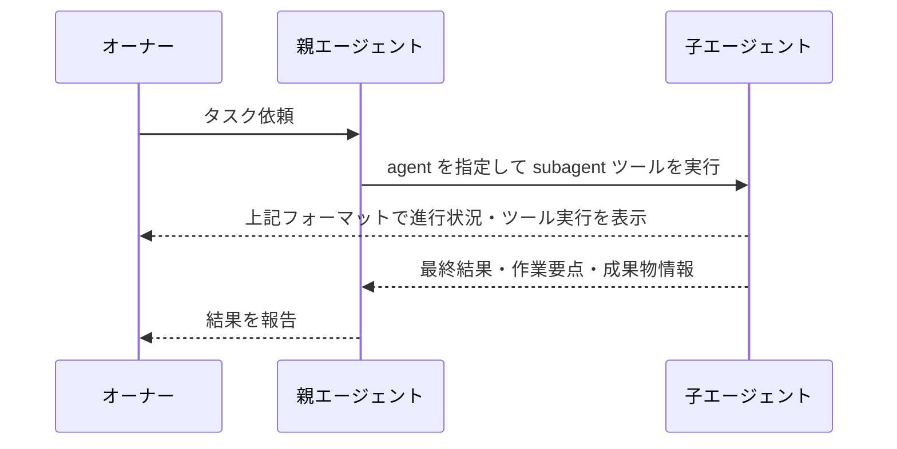

# Agent Profile 拡張機能 Spec

## 概要

セッションは **agent** を実行する。agent は tier によるモデル選択、利用できるツール、委譲できる子 agent、システムプロンプトを持つ実行主体である。profile は Pi が agent を選択する操作とフラグである。

モデルの自動選択と切り替えはこの拡張だけが行う。ユーザーは `config.yaml` で tier と agent を管理し、`/profile:<agent>` で実行する agent を切り替えられる。

## 設定

設定ファイル: `~/.pi/agent/extensions/profile/config.yaml`

```yaml
default: main

tiers:
  high:
    - provider: zai
      model: glm-5.3
      # z.ai peak hours 14:00-18:00 (UTC+8) => 06:00-10:00 UTC
      when: 'd=$(date -u +%u); h=$(date -u +%H); ! { [ "$d" -le 5 ] && [ "$h" -ge 06 ] && [ "$h" -lt 10 ]; }'
    - provider: zai
      model: glm-5.2
  middle:
    - provider: zai
      model: glm-5.2
    - provider: commandcode
      model: deepseek/deepseek-v4-flash
  low:
    - provider: commandcode
      model: deepseek/deepseek-v4-flash
    - provider: deepseek
      model: deepseek-v4-flash

agents:
  main:
    tier: high
    tools: ["*"]
    subagents: [manager, worker]
    systemPrompt: ["...", "..."]
  manager:
    tier: middle
    tools: ["*"]
    subagents: [worker]
    systemPrompt: ["...", "..."]
```

| 項目・操作 | 内容と振る舞い |
| --- | --- |
| 設定ファイル | 起動時に検証する。有効な場合は agent を利用でき、不正な場合はエラーを通知する（後述） |
| `default` | 新規セッションと保存済みセッションで開始する agent |
| `agents.<name>` | agent の定義 |
| `tiers.<name>` | tier のモデル候補の配列。配列の先頭から fallback 順序として評価する |
| 候補の `provider` / `model` | 候補のモデル |
| 候補の `when` | bash コマンド。終了コード `0` のときだけ候補が有効になる。省略・空文字なら常に有効。5 秒でタイムアウトし、タイムアウト・失敗時は無効 |
| `tier` | agent が使う tier。必須 |
| `tools` | pi 標準ツールと拡張機能の allowlist。指定したツールを実行し、未指定のツールを拒否してセッションを継続する。`["*"]` はすべてのツール、`[]` はツールなしを許可する |
| `subagents` | subagent ツールでの起動を許可する子 agent の一覧。定義済みの agent が一覧に含まれる場合は起動し、含まれない場合や一覧が空の場合は起動せずセッションを継続する |
| `systemPrompt` | 次回のエージェント実行時に、配列要素を記載順で結合して追記する agent 固有のシステムプロンプト。YAML のアンカーとエイリアスで複数 agent 間で要素を共有できる |
| `/profile:<name> [message]` | 指定した agent を即時に有効にする。モデルは切替先 agent の tier の候補を適用し、ツール・agent 表示も切り替える。`message` を続けた場合は agent 切り替え完了後にそのテキスト（前後の空白を除く）をユーザーメッセージとして送信し、切替先 agent の設定で直ちにターンを開始する。`message` を省略した場合は切り替えのみ行う |

## 設定の検証

起動時に設定ファイルを検証する。次のいずれかに該当する場合はエラーを通知し、拡張のすべての機能（agent 切替、ツール制限、subagent、モデルルーティング）を無効にする。不正な設定を一部分だけ適用することはない。

- 設定ファイルがない・読めない・YAML として不正
- `default` か `agents` がない、型が違う
- `agents` の各定義がオブジェクトでない
- agent の `tier` がない、文字列でない
- agent が `tiers` に定義されていない tier を参照している
- `tiers` がない・オブジェクトでない、tier の値が配列でない
- 候補の `provider` か `model` がない・文字列でない、`when` が文字列でない
- `tools`・`subagents`・`systemPrompt` が配列でない、要素が文字列でない
- `default` が未定義の agent を指している
- `subagents` が未定義の agent を含む

## tier によるモデル選択

tier の候補配列を先頭から順に評価し、最初に成立した候補を選ぶ。

| 候補の状態 | 扱い |
| --- | --- |
| モデルがモデルレジストリに存在しない | 除外して次へ |
| cooldown 待機中（後述） | 除外して次へ |
| `when` が終了コード `0` を返さない | 除外して次へ |
| 上記いずれにも該当しない | その候補を選ぶ |

| 状態 | 結果 |
| --- | --- |
| 候補モデルの適用に失敗した（API キーがないなど） | その候補を除外して次候補へ進む |
| tier 内の全候補が不成立、または全候補で適用に失敗 | 「モデルの適用タイミング」の該当行に従う |

tier をまたいだ降格は行わない。

## モデルの適用タイミング

| タイミング | 動作 |
| --- | --- |
| セッション開始 | 初期 agent（`--profile` フラグで指定された定義済みの agent、指定なしまたは未定義なら `default`）の tier の候補を適用する |
| `/new` | 手動選択を解除し、cooldown をすべて破棄し、初期 agent の tier の候補を適用する |
| セッション切替・分岐（`/resume`・`/fork`） | 手動選択を解除し、初期 agent の tier の候補を適用する |
| `/reload` | 設定を読み込み直す。手動選択状態と cooldown は維持する |
| 各プロンプト送信前（自動状態のとき） | 現在の agent の tier の候補を再評価し、現在のモデルと異なる候補が成立したら切り替える。全候補が不成立の場合はエラーを通知し、プロンプトを実行しない |
| `/profile:<name>` | agent を切り替え、手動選択を解除し、切替先 agent の tier の候補を適用してから後続メッセージを送信する |
| 429 受信時 | 「レート制限（429）時のフォールバック」に従う |

モデルの切り替えに成功したら `agent model → <provider>/<model>` を info で通知する。

| 全候補が不成立になる場面 | 結果 |
| --- | --- |
| セッション開始・`/new`・セッション切替・分岐・`/profile:<name>` | 現在のモデルを維持し、`no available model for agent <name>: tier <tier-name>` を warning で通知する |
| プロンプト送信前 | `no available model for agent <name>: tier <tier-name>` を error で通知し、プロンプトを実行しない |
| 429 受信時 | 「レート制限（429）時のフォールバック」に従う |

## 手動モデル選択



| 状態 | 振る舞い |
| --- | --- |
| 自動 | 各プロンプト送信前に tier の候補を再評価する |
| 手動 | ユーザーが選んだモデルを使い続ける。プロンプト送信前の再評価を行わない |

状態を変える操作とその時の全動作は「モデルの適用タイミング」の表が定め、この図は手動状態の遷移だけを示す。手動状態中の 429 フォールバック後も手動状態を維持する。

## レート制限（429）時のフォールバック

次のいずれかを受けたモデルは cooldown（待機状態）に入る。

| 入力 | レート制限として扱う条件 | 待機期間 |
| --- | --- | --- |
| HTTPレスポンス | status が `429` | `Retry-After` ヘッダーに従う |
| 最終assistantエラー | `stopReason` が `error` で、`errorMessage` に `429`、`code":"1310"`、`Weekly Limit Exhausted`、または `Monthly Limit Exhausted` を含む | 30分 |

HTTPレスポンスの `Retry-After` は次のように解釈する。

| `Retry-After` の内容 | 待機期間 |
| --- | --- |
| 秒数 | その秒数 |
| HTTP-date | その日時までの残り時間 |
| ない・解釈不能 | 30 分 |



- 手動状態でも同じ流れでフォールバックする。
- 次候補への切替後、Pi は追加の待機を入れず、現在のユーザーメッセージを追加せずにターンを再試行する。ユーザーメッセージの履歴件数は増えない。
- 現在の agent の tier の候補数を N とすると、1ターンで最大 N-1 回再試行し、最大 N 候補を順に試行する。再試行回数は `~/.pi/agent/settings.json` の `retry.maxRetries`（候補数以上を推奨）が上限となる
- フォールバックで切り替えに成功したら `rate limited on <provider>/<model>; switched to <provider>/<model>` を warning で通知する。
- 次候補がない場合は `rate limited on <provider>/<model>; no fallback available` を error で通知し、再試行しない。

### pi の再試行設定

429 フォールバックでは Pi の agent-level retry を使い、provider-level retry は使わない。`~/.pi/agent/settings.json` には次を設定する。

```json
{
  "retry": {
    "enabled": true,
    "maxRetries": 5,
    "baseDelayMs": 0,
    "provider": {
      "maxRetries": 0
    }
  }
}
```

429、`code":"1310"`、`Weekly Limit Exhausted`、`Monthly Limit Exhausted` を含む最終assistantエラーは、次候補への切替後に待機せず再試行する。

### cooldown（待機状態）

| 状況 | 結果 |
| --- | --- |
| 待機期間中のモデルが候補になる | 除外して次候補を探す |
| 待機期間の終了 | そのモデルを再び候補にする |

cooldown の破棄・維持は、発生タイミングごとに「モデルの適用タイミング」の表が定める。

## Agent 表示

セッション開始時と agent 切り替え時に、現在の agent を表示する。

```text
🤖 agent: <currentAgent>
```

手動状態のときは `🤖 agent: <currentAgent> (manual)` と表示する。表示のテキスト色はグレーとする。

## 通知のない環境

UI を持たない環境（`--mode json`、パイプ、SDK、subagent の子セッション）では通知を表示しない。モデルルーティング・フォールバック・再送は同じように動作する。ただしプロンプト送信前の全候補不成立でプロンプトを実行しないときは、エラーメッセージを stderr へ出力し、プロセスの終了コードを 1 にする。

## subagent ツール

subagent ツールは常に利用できる。子セッションを起動できるかは、現在の agent の `subagents` で決まる。

subagent ツールは子セッションを起動するとき `--profile <name>` だけを渡し、モデルを指定しない。子セッションは指定された agent の tier から候補を選んで適用する。子セッションでもこの spec のモデルルーティング（自動選択、429 フォールバック）が同じように働く。

### subagent ツールの入力

| パラメータ | 必須 | 内容 |
| --- | --- | --- |
| `task` | 必須 | 子エージェントへ渡すタスク |
| `profile` | 必須 | `config.yaml` に定義された子 agent 名 |
| `cwd` | 任意 | 子エージェントの作業ディレクトリ。省略時は親と同じ |
| `model` | 使用不可 | モデルは指定した子 agent の tier から解決される |

subagent ツールで起動した子エージェントには、指定された agent の設定が適用される。子エージェントの `default` は適用されない。子エージェントは自身の `subagents` に従って、さらに subagent ツールを実行できる。

| 設定 | 子セッションへの適用 |
| --- | --- |
| スキル自動発見 | 親と同じルール |
| モデル | 指定された子 agent の tier から、子セッションが解決する |
| ツール | 指定された子 agent の `tools` |
| システムプロンプト | 指定された子 agent の `systemPrompt` を追記 |
| さらなる subagent 実行 | 子エージェントの `subagents` で判定 |

## subagent 実行中の表示フォーマット

subagent の呼び出し時と実行結果を、次の形式で表示する。実行結果は subagent ツールの結果欄に子エージェントごとの実行ブロックとして表示する。折りたたみは行わず、実行中は `message_end` またはツール実行の更新を受け取るたびに表示を更新する。

### 呼び出し時の表示

```text
subagent <child-agent>
```

### 実行結果の表示形式

```text
─── Task ───
<task>

─── Actions ───（ツール利用がある場合のみ表示）
<actions>

─── Output ───（出力が確定したときに表示）
<output>
```

| 項目 | 形式・条件 |
| --- | --- |
| `child-agent` | 実行した子 agent 名 |
| `task` | subagent ツールに渡したタスク全文 |
| `<actions>` | 子エージェントがツールを利用した場合のみ、受け取った時系列順ですべて表示する |
| `<output>` | 最終アシスタントテキストが確定した場合のみ Markdown として表示する |
| 待機行 | 子エージェントの実行が確定するまでブロックの末尾に表示する（後述） |
| 更新 | 子から新しいメッセージまたはツール実行を受け取るたびに同じブロックを更新する |

### Actions の行形式

ツール呼び出しは「コール行」と、その下の「結果行」で構成する。コール行はツールごとに整形した表示、結果行はツールの実行結果のサマリーとする。

| ツール | コール行 | 結果行（成功時） |
| --- | --- | --- |
| `bash` | `→ $ <command>`（80 文字で切り詰め） | 実行秒数（例: `1.2s`）。計測できないときは `done` |
| `write` | `→ write <path>` | `wrote <size>` |
| `edit` | `→ edit <path>` | `edited N block(s)` |
| `read` | `→ read <path>`（SKILL.md のとき `[skill] <name>`） | `N lines` |
| `grep` | `→ grep <pattern>` | `N matches` |
| `find` | `→ find <pattern>` | `N files` |
| `ls` | `→ ls <path>`（未指定は `.`） | `N entries` |
| 上記以外のツール | `→ <toolName> <args-preview>`。引数は JSON の先頭 100 文字までを表示し、超過時は `...` を付ける。引数がない場合は `{}` と表示する | 表示しない |

結果行はコール行の下に半角スペース 2 文字分のインデントを付けて表示する。

| 条件 | 結果行の内容 |
| --- | --- |
| ツールがエラーを返したとき | エラーメッセージ全体 |
| ツールの結果を受け取る前 | 表示しない |

### 待機スピナー

subagent の呼び出しを受け付けた直後から子エージェントの実行が確定するまで、ブロックの末尾に待機行を表示する。

```text
<frame> <child-agent>
```

| 項目 | 振る舞い |
| --- | --- |
| フレーム | titlebar と同じ `⠋` `⠙` `⠹` `⠸` `⠼` `⠴` `⠦` `⠧` `⠇` `⠏` の 10 文字をこの順で循環させる |
| 切り替え | 0.1 秒間隔でフレーム文字を切り替える。行を増やさず同じ位置で更新する |
| テキスト色 | セクション区切りと同じグレー系とする |
| 消去 | 子エージェントの実行が確定した時点で待機行を消す |

subagent 完了時に親エージェントへ渡すのは、最終結果・作業要点・成果物情報であり、子の中間ログは親へ渡さない。



## 実行できない場合の報告

エージェントがタスクを遂行できない場合は、理由（権限不足、力量・情報不足など）を添えて報告する。報告先（subagent 実行中は委譲元エージェント、直接実行時はオーナー）の指定は拡張コードで強制せず、各 agent の systemPrompt の規範に委ねる。

## 停止

| 状況 | 動作 |
| --- | --- |
| 親がキャンセル | 子セッションへ停止を伝播する |
| 子の停止 | SIGTERM を送信し、5 秒後も停止しなければ SIGKILL を送信する |
| タイムアウト | 設定しない。親のキャンセル時に停止する |
| 子の異常終了 | 子プロセスの終了コードが 0 以外、シグナルによる終了、子がエラーで停止した場合、または終了コード 0 で最終アシスタントテキストが空の場合、subagent ツールの結果をエラーとして親へ返す。結果は `Child <停止理由|failed>: <出力>` の形式で、出力は子のエラーメッセージ・stderr・最終アシスタントテキストの順に採用し、いずれもなければ `(no output)` とする。シグナルによる終了の停止理由は `killed`、エラーメッセージは `Child process was killed by a signal` とする |
| 子終了後の残留出力 | 子プロセスの終了後も標準出力・標準エラーへの書き込みが続く間は読み取りを続け、最後の書き込みから 0.1 秒途切れた時点で結果を確定する。ストリームが閉じた場合は直ちに確定する |
