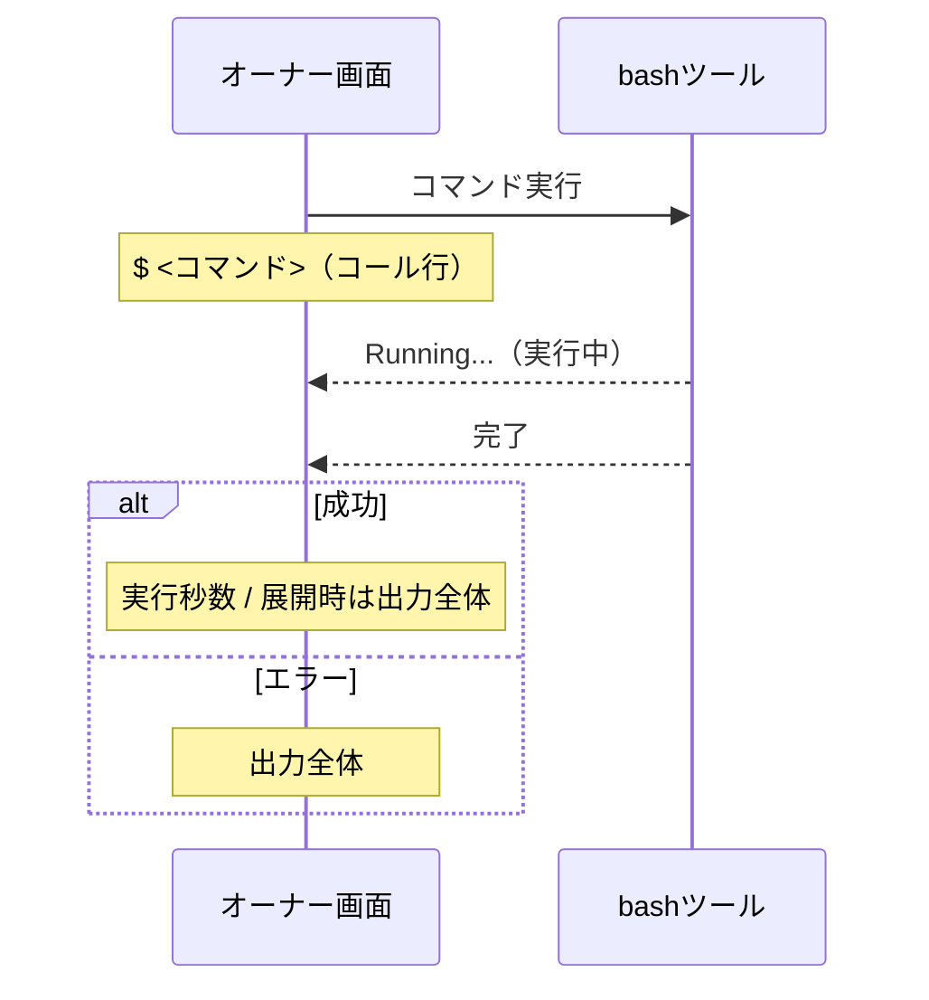

# quiet-bash 拡張機能 Behaviors

pi の **bash ツールの表示** を差し替える。コマンドの実行そのもの（終了コード・標準出力・標準エラー・タイムアウト）は pi 標準の bash ツールと変わらず、画面への表示だけが変わる。

## コール行（コマンド実行開始時）

`$ ` に続けてコマンドを表示する。コマンドが長い場合は末尾を `...` で切り詰める。

| コマンドの文字数 | 表示                 |
| ---------------- | -------------------- |
| 80文字以下       | `$ <コマンド全体>`   |
| 81文字以上       | `$ <先頭77文字>...`  |

コマンド本体（`$ ` を含まない部分）が80文字になるよう切り詰める。

## 結果行（コマンド実行中・完了時）

実行状態と、結果の展開設定の組み合わせで表示が決まる。

| 実行状態 | 展開設定         | 表示                 |
| -------- | ---------------- | -------------------- |
| 実行中   | —                | `Running...`         |
| 成功     | 折りたたみ       | `1.2s`（実行秒数）   |
| 成功     | 展開             | コマンドの出力全体   |
| エラー   | 折りたたみ / 展開 | コマンドの出力全体   |

- 実行中は他の状態より優先され、常に `Running...`。
- エラー時は展開設定によらず出力全体を表示する。
- 成功かつ折りたたみでは実行秒数だけが見え、本当の出力は隠れる。結果行を展開すると出力全体が見える。

各表示には状態に応じたテーマ色が付く（成功・実行中・エラー・通常で配色が変わる）。

## 実行の流れ

