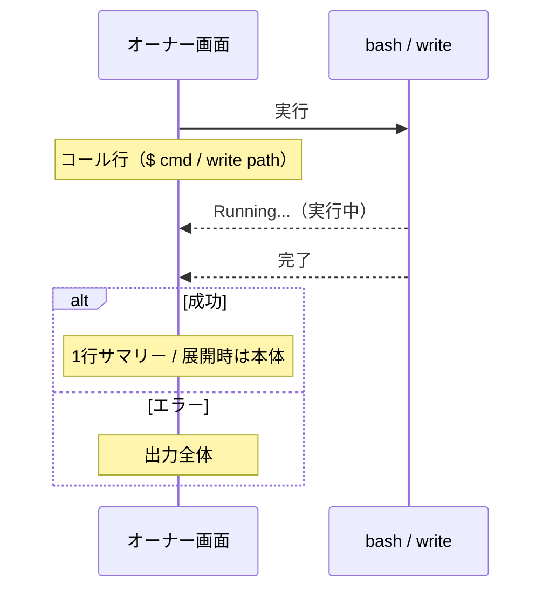

# quiet-tools 拡張機能 Behaviors

pi の **bash / write ツールの表示** を差し替える。ツールの実行そのもの（終了コード・標準出力・ファイル書き込みなど）は pi 標準と変わらず、画面への表示だけが変わる。どちらも、デフォルトでは結果を1行のサマリーに折りたたみ、結果行を展開すると本体が見える。

## 結果行（bash・write 共通）

実行状態と展開設定の組み合わせで表示が決まる。

| 実行状態 | 展開設定         | bash の表示                  | write の表示                    |
| -------- | ---------------- | ---------------------------- | ------------------------------- |
| 実行中   | —                | `Running...`                 | `Running...`                    |
| 成功     | 折りたたみ       | `1.2s`（実行秒数）           | `wrote 1.2KB`（書き込んだサイズ） |
| 成功     | 展開             | コマンドの出力全体           | 書き込んだ内容全体              |
| エラー   | 折りたたみ / 展開 | コマンドの出力全体           | エラーメッセージ全体            |

- 実行中は他の状態より優先され、常に `Running...`。
- エラー時は展開設定によらず出力全体を表示する。
- 成功かつ折りたたみでは1行のサマリーだけが見え、本体は隠れる。結果行を展開すると本体が見える。
- 各表示には状態に応じたテーマ色が付く（成功・実行中・エラー・通常で配色が変わる）。

## コール行

### bash

`$ ` に続けてコマンドを表示する。コマンドが長い場合は末尾を `...` で切り詰める。

| コマンドの文字数 | 表示                |
| ---------------- | ------------------- |
| 80文字以下       | `$ <コマンド全体>`  |
| 81文字以上       | `$ <先頭77文字>...` |

コマンド本体（`$ ` を含まない部分）が80文字になるよう切り詰める。

### write

`write` に続けてパスだけを表示する。書き込む内容はコール行には出さず、結果行を展開したときにだけ見せる。

```
write src/main.ts
```

## 実行の流れ


