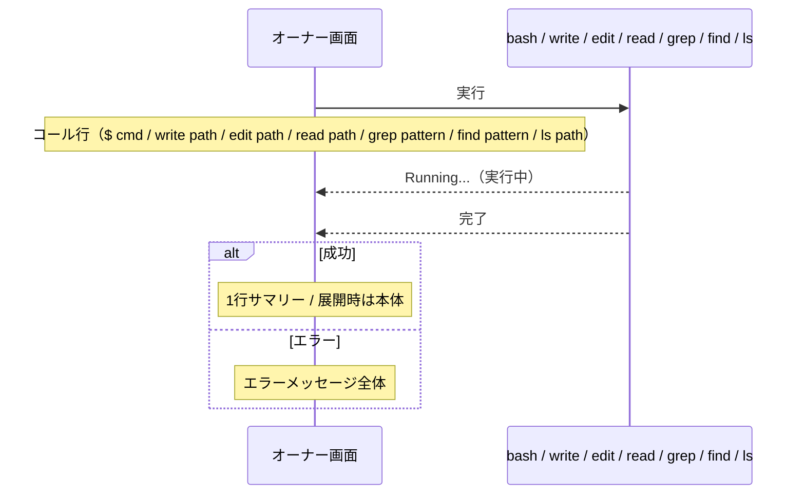

# quiet-tools 拡張機能 Spec

pi の **bash / write / edit / read / grep / find / ls ツールの表示** を差し替える。ツールの実行そのもの（終了コード・標準出力・ファイル読み書き・検索結果など）は pi 標準と変わらず、画面への表示だけが変わる。どのツールも、デフォルトでは結果を1行のサマリーに折りたたみ、結果行を展開すると本体が見える。

## 結果行（全ツール共通）

実行状態と展開設定の組み合わせで表示が決まる。

| 実行状態 | 展開設定         | 表示                          |
| -------- | ---------------- | ----------------------------- |
| 実行中   | —                | `Running...`                  |
| 成功     | 折りたたみ       | ツール別の1行サマリー（下表） |
| 成功     | 展開             | 結果の本体（下表）            |
| エラー   | 折りたたみ / 展開 | エラーメッセージ全体          |

- 実行中は他の状態より優先され、常に `Running...`。
- エラー時は展開設定によらずエラーメッセージ全体を表示する。
- 成功かつ折りたたみでは1行のサマリーだけが見え、本体は隠れる。結果行を展開すると本体が見える。
- 各表示には状態に応じたテーマ色が付く（成功・実行中・エラー・通常で配色が変わる）。

### ツール別のサマリーと本体

| ツール | 折りたたみ時のサマリー              | 展開時の本体              |
| ------ | ----------------------------------- | ------------------------- |
| bash   | `1.2s`（実行秒数）                  | コマンドの出力全体        |
| write  | `wrote 1.2KB`（書き込んだサイズ）   | 書き込んだ内容全体        |
| edit   | `edited 3 block(s)`（置換ブロック数） | 適用された差分（diff）全体 |
| read   | `N lines`（読み込んだ行数）         | ファイル内容全体          |
| grep   | `N matches`（マッチ数）             | マッチした行全体          |
| find   | `N files`（見つかったファイル数）   | ファイルパス一覧全体      |
| ls     | `N entries`（エントリ数）           | エントリ一覧全体          |

- read / grep / find / ls のサマリー件数は、結果のテキストを行単位で数えた値。

## コール行

### bash

`$ ` に続けてコマンドを表示する。コマンドが長い場合は末尾を `...` で切り詰める。

| コマンドの文字数 | 表示                |
| ---------------- | ------------------- |
| 80文字以下       | `$ <コマンド全体>`  |
| 81文字以上       | `$ <先頭77文字>...` |

コマンド本体（`$ ` を含まない部分）が80文字になるよう切り詰める。

### write

`write` に続けてパスだけを表示する。書き込む内容はコール行には出さず、結果行を展開したときにだけ見せる。

```
write src/main.ts
```

### edit

`edit` に続けてパスだけを表示する。編集内容（edits[].oldText / newText）はコール行には出さず、結果行を展開したときにだけ差分が見える。

```
edit src/main.ts
```

### read

`read` に続けてパスだけを表示する。

```
read src/main.ts
```

### grep

`grep` に続けて検索パターンだけを表示する。検索対象パスは結果行を見れば分かるため出さない。

```
grep TODO
```

### find

`find` に続けて検索パターンだけを表示する。

```
find *.ts
```

### ls

`ls` に続けてパスを表示する。未指定のときは `.`（カレントディレクトリ）を表示する。

```
ls src
```

## 実行の流れ


