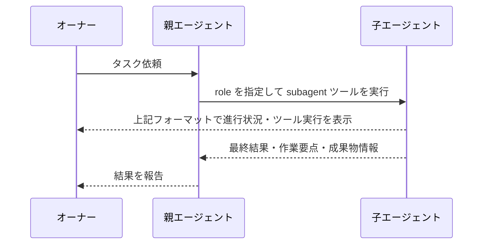

# Role 拡張機能 Spec

## 概要

セッションは **role** を持つ。role は、エージェントのモデル、利用できるツール、subagent ツールで起動できる子エージェント、システムプロンプト追記をまとめた実行プロファイルである。

ユーザーは `config.yaml` で role を管理し、セッション中に role を切り替えられる。

## 設定

設定ファイル: `~/.pi/agent/extensions/role/config.yaml`

```yaml
default: <role-name>
roles:
  <name>:
    model: <model-id>
    tools: [<tool-name>, ...]   # ["*"] allows every tool
    subagents: [<role-name>, ...]
    systemPrompt: <string>
```

| 項目・操作 | 内容と振る舞い |
| --- | --- |
| 設定ファイル | 起動時に検証する。有効な場合は role を利用でき、不正な場合はエラーを通知する |
| `default` | 新規セッションと保存済みセッションで開始する role |
| `model` | role のモデル。role 切り替え時に適用し、ユーザーの手動選択には干渉しない |
| `tools` | pi 標準ツールと拡張機能の allowlist。指定したツールを実行し、未指定のツールを拒否してセッションを継続する。`["*"]` はすべてのツール、`[]` はツールなしを許可する |
| `subagents` | subagent ツールでの起動を許可する子エージェントの一覧。定義済みの role が一覧に含まれる場合は起動し、含まれない場合や一覧が空の場合は起動せずセッションを継続する。未定義の role を指定した場合は理由を報告する |
| `systemPrompt` | 次回のエージェント実行時に追記するシステムプロンプト |
| `/role:<name>` | 指定した role を即時に有効にする。次のユーザーメッセージの実行時から切り替え先の設定を適用し、role 表示も更新する |


## Role 表示

セッション開始時と role 切り替え時に、現在の role を表示する。

```text
🤖 role: <currentRole>
```

## subagent ツール

subagent ツールは常に利用できる。子セッションを起動できるかは、現在の role の `subagents` で決まる。

### subagent ツールの入力

| パラメータ | 必須 | 内容 |
| --- | --- | --- |
| `task` | 必須 | 子エージェントへ渡すタスク |
| `role` | 必須 | `config.yaml` に定義された子エージェントの role 名 |
| `cwd` | 任意 | 子エージェントの作業ディレクトリ。省略時は親と同じ |
| `model` | 使用不可 | モデルは指定した子エージェントの `model` で決まる |

subagent ツールで起動した子エージェントには、指定された role の設定が適用される。子エージェントの `default` は適用されない。子エージェントは自身の `subagents` に従って、さらに subagent ツールを実行できる。

| 設定 | 子セッションへの適用 |
| --- | --- |
| スキル自動発見 | 親と同じルール |
| モデル | 指定された子エージェントの `model` |
| ツール | 指定された子エージェントの `tools` |
| システムプロンプト | 指定された子エージェントの `systemPrompt` を追記 |
| さらなる subagent 実行 | 子エージェントの `subagents` で判定 |

## subagent 実行中の表示フォーマット

subagent の呼び出し時と実行結果を、次の形式で表示する。実行結果は subagent ツールの結果欄に子エージェントごとの実行ブロックとして表示する。折りたたみは行わず、実行中は `message_end` またはツール実行の更新を受け取るたびに表示を更新する。

### 呼び出し時の表示

```text
subagent <child-agent>
```

### 実行結果の表示形式

```text
─── Task ───
<task>

─── Actions ───（ツール利用がある場合のみ表示）
<actions>

─── Output ───（出力が確定したときに表示）
<output>
```

| 項目 | 形式・条件 |
| --- | --- |
| `child-agent` | 実行した子エージェントの role 名 |
| `task` | subagent ツールに渡したタスク全文 |
| ツール実行 | `→ <toolName> <args-preview>`。引数は JSON の先頭 100 文字までを表示し、超過時は `...` を付ける |
| 引数がない場合 | `→ <toolName> {}` と表示する |
| `<actions>` | 子エージェントがツールを利用した場合のみ、受け取った時系列順ですべて表示する |
| `<output>` | 最終アシスタントテキストが確定した場合のみ Markdown として表示する |
| 更新 | 子から新しいメッセージまたはツール実行を受け取るたびに同じブロックを更新する |


subagent 完了時に親エージェントへ渡すのは、最終結果・作業要点・成果物情報であり、子の中間ログは親へ渡さない。



## 実行できない場合の報告

role がタスクを遂行できない場合は、理由を次のいずれかとして報告する。

| 区分 | 条件 | 報告先 |
| --- | --- | --- |
| 権限不足 | `tools` または `subagents` の制限により実行できない | subagent 実行中は委譲元 role、直接実行時はオーナー |
| 力量・情報不足 | 権限はあるが、知識・能力・情報が不足して解決できない | subagent 実行中は委譲元 role、直接実行時はオーナー |

## 停止

| 状況 | 動作 |
| --- | --- |
| 親がキャンセル | 子セッションへ停止を伝播する |
| 子の停止 | SIGTERM を送信し、5 秒後も停止しなければ SIGKILL を送信する |
| タイムアウト | 設定しない。親のキャンセル時に停止する |
