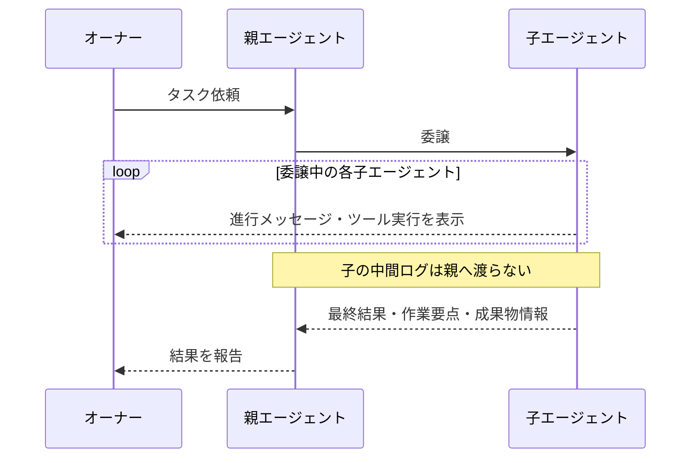

# role 拡張機能 Spec

セッションに **ロール** を導入し、そのロールごとに **ファイル操作** と **委譲（子エージェント起動）** の可否を変える。ロールは `orch` / `manager` / `worker` / `chat` の4種類。

## ロール一覧

| ロール   | read/write/edit | 委譲できる相手   |
| -------- | --------------- | ---------------- |
| orch     | 不可            | manager          |
| manager  | 可              | worker           |
| worker   | 可              | なし（委譲不可） |
| chat     | 不可            | なし（委譲不可） |

## セッションのロール遷移

新規セッションも、保存済みセッションの再開も、保存前のロールによらず **manager** で始まる。オーナーのロール切り替え操作で、orch / manager / worker / chat のいずれにも切り替えられる。

## ファイル操作の権限

orch では、read / write / edit を **ハードブロック** する。bash などそれ以外のツールは実行される。chat のツール制限は「chat ロール」で別途定める。併せて、orch / chat ではファイル操作を控えるよう **システムプロンプトで指定** する。

| セッションのロール | read / write / edit | bash など  | セッション |
| ------------------ | ------------------- | ---------- | ---------- |
| orch               | ハードブロック      | 実行される | 継続する   |
| manager / worker   | 実行される          | 実行される | 継続する   |

orch は read / write / edit を拒否してもセッションは止まらず、引き続き対話できる。

## 委譲の可否

委譲元のロール × 委譲先のロールで、子セッションが起動するかどうかが決まる。起動しない場合は委譲元のセッションがそのまま継続する。

| 委譲元 \ 委譲先 | orch               | manager            | worker             | chat               |
| --------------- | ------------------ | ------------------ | ------------------ | ------------------ |
| **orch**        | × 子起動せず・継続 | 〇 manager子が起動 | × 子起動せず・継続 | × 子起動せず・継続 |
| **manager**     | × 子起動せず・継続 | × 子起動せず・継続 | 〇 worker子が起動  | × 子起動せず・継続 |
| **worker**      | × 子起動せず・継続 | × 子起動せず・継続 | × 子起動せず・継続 | × 子起動せず・継続 |
| **chat**        | × 子起動せず・継続 | × 子起動せず・継続 | × 子起動せず・継続 | × 子起動せず・継続 |

- 起動する子セッションは、指定されたロール（manager または worker）で始まる。
- orch が呼べるのは manager だけ。manager が呼べるのは worker だけ。

## chat ロール

chat は **チャット専用** で、作業は行えない。利用できるツールは web_search / web_fetch のみで、ファイル操作・bash・委譲を含むそれ以外のすべてのツールは実行されない。ツールを拒否してもセッションは止まらず、引き続き対話できる。

## 委譲結果の観測

委譲中は、子エージェントの進行状況が **オーナーに表示** され、完了時には **親エージェントへ要約だけが渡る**。

親エージェントに返るのは以下の3つだけ。中間ログは含まれない。

- 最終結果
- 作業要点
- 成果物情報

## 報告

タスクを遂行できないとき、理由を **権限不足** と **力量・情報不足** で区別して報告する。報告先は報告元のロールと、誰に呼ばれたかで決まる。

| 報告元のロール | 報告先                                          |
| -------------- | ----------------------------------------------- |
| worker         | 呼び出し元（manager、またはオーナー直下ならオーナー） |
| manager        | 呼び出し元の orch、またはオーナー               |
| orch           | オーナー                                        |
| chat           | オーナー                                        |
