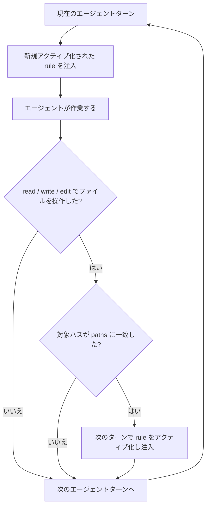

# Rules 仕様

## 目的

Claude Code の rules 仕様に準拠し、対象ファイルに応じた Markdown ルールをエージェントへ適用する。この拡張は Claude Code の rules に次を追加する:

- pi / Cursor / Windsurf など他エージェントの rules ファイルも読み込む（「対象となる rules」参照）
- アクティブな rules を UI に表示する（「ルールの適用状況表示」参照）

## 対象となる rules

プロジェクトルートとグローバルの両方から、次の rules 相当のファイルを対象とする。エージェントの優先順位は上から下とし、ローカルの全エージェントを探索してからグローバルを探索する。

| 順序 | エージェント | プロジェクト | グローバル |
| ---: | --- | --- | --- |
| 1 | pi | `./.pi/agent/rules/**/*.md` | `~/.pi/agent/rules/**/*.md` |
| 2 | Claude Code | `./.claude/rules/**/*.md` | `~/.claude/rules/**/*.md` |
| 3 | Cursor | `./.cursor/rules/**/*.mdc` | —（User Rules は UI 管理） |
| 4 | Windsurf | `./.devin/rules/**/*.md`（優先）、`./.windsurf/rules/**/*.md`（旧形式） | `~/.codeium/windsurf/memories/global_rules.md` |

Codex には rules ディレクトリ相当の仕組みがないため対象外とする。Codex の `AGENTS.md` はエージェントへのコンテキストファイルであり、この rules 探索の対象には含めない。

プロジェクト側の rules はサブディレクトリまで再帰的に探索する。Cursor は `.mdc`、それ以外のディレクトリ形式は `.md` のファイルだけを対象とする。Windsurf のグローバルルールはディレクトリではなく単一ファイルである。

Cursor の User Rules や Windsurf のシステムルールなど、ファイルパスから直接探索できないルールは対象外とする。

## ルールの形式

各ルールは Markdown と YAML frontmatter で記述する。Claude Code と同じく、適用対象は `paths` で指定する。

```markdown
---
paths:
  - src/**/*.ts
  - tests/**/*.ts
---

# TypeScript rules

Use the repository's existing TypeScript conventions.
```

| `paths` の状態 | 適用条件 |
| --- | --- |
| 未指定 | セッション開始時に適用する |
| 空の配列 | セッション開始時に適用する |
| 1つ以上の glob | glob のいずれかが対象ファイルのパスに一致した操作の次のターンに適用する |

`paths` のないルールは、対象ファイルを操作していなくてもセッション開始時から適用する。

## ルールの解決順

同じ相対パスのルールが複数の場所に存在する場合は、探索順の先にあるルールを採用し、後のルールを重複適用しない。異なる相対パスのルールはすべて独立したルールとして扱う。

解決順は次のとおりとする。ローカルのエージェント優先順位を維持したまま、すべてのローカルをグローバルより先に解決する。

1. プロジェクトの `.pi/agent/rules/`
2. プロジェクトの `.claude/rules/`
3. プロジェクトの `.cursor/rules/`
4. プロジェクトの `.devin/rules/` または `.windsurf/rules/`
5. グローバルの `~/.pi/agent/rules/`
6. グローバルの `~/.claude/rules/`
7. グローバルの Cursor User Rules（ファイル探索対象外）
8. グローバルの `~/.codeium/windsurf/memories/global_rules.md`

同じ相対パスでないルールについては、解決順によって他のルールを除外しない。

## 自動適用

### 判定対象

対象ファイルのパスを持つ操作が完了した後、その対象ファイルに一致する rules を次のエージェントターンで適用する。対象とする操作は次のとおりとする。

| 操作 | パス一致による自動適用 |
| --- | --- |
| `read` | する |
| `write` | する |
| `edit` | する |
| 上記以外の操作 | しない |

対象ファイルのパスが相対パスの場合はプロジェクトルートからの相対パスとして判定する。絶対パスの場合も、プロジェクト内のファイルであればプロジェクトルートからの相対パスとして判定する。

### 適用フロー

rules の観測と適用は、次のフローで行う。



- `paths` がない rule は、セッション開始時に適用する。
- `paths` がある rule は、対象パスに一致した操作の次のターンに適用する。
- 一度適用された rule は、同じセッション中はアクティブ状態を維持する。
- 複数の rules は、解決順にすべて適用する。
- 新しいセッション、fork、resume では、`paths` 付き rule の適用状態を引き継がない。

## エージェントへのコンテキスト注入

Claude Code の rules と同じ方式で、rules をシステムプロンプトには加えず、エージェントへ送るユーザーメッセージとして注入する。システムプロンプトは変更しない。

新しくアクティブになった rule は、その Markdown 本文をユーザーメッセージとして1回だけ注入する。同じセッション中に同じ rule を再注入しない。ルールのファイルパスも提示し、どの rules が適用されたかを識別できるようにする。適用対象の rules がない場合は、メッセージを注入しない。注入したメッセージはエージェントへ送るだけで UI には表示せず、ルール名は「ルールの適用状況表示」で示す。

## ルールの適用状況表示

現在適用中の rules を、`aboveEditor` の widget に次の形式で表示する。文字色はグレーにする。

```text
📜 rules: <ルール名>, <ルール名>
```

適用中の rules がない場合は widget を消去する。表示順は解決順とし、同名の rules はファイルパスを付けて区別する。新しい rule が適用されると、次のターンの開始時に widget を更新する。

