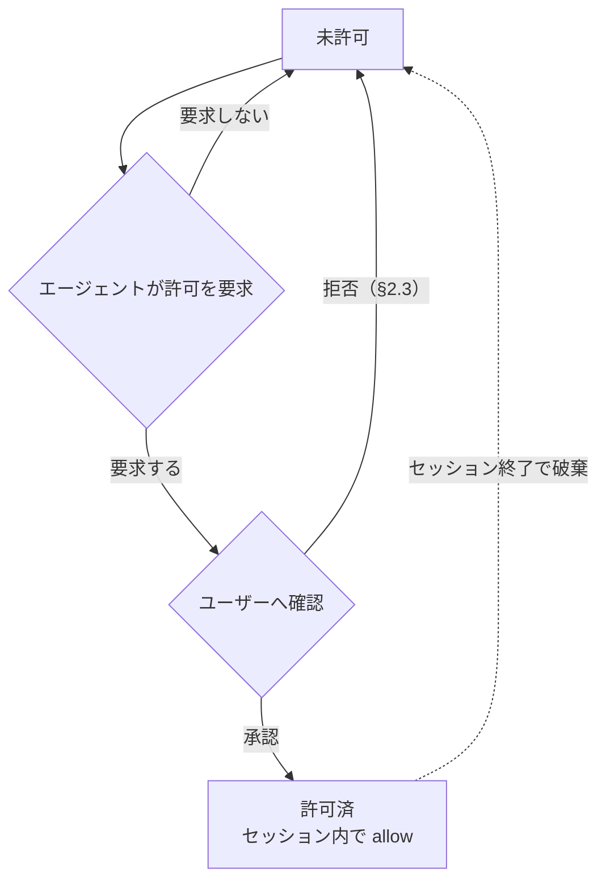

# sandboxed-tools — 仕様書

pi の全 built-in fs ツール（read / write / edit / grep / find / ls / bash）を置き換え、**パスの読み書きと bash コマンドを `allow` / `deny` / `ask` で制限**しつつ、network 系は自由に使う拡張機能。

---

## 1. ツールごとの扱い

| pi ツール                                | 本拡張での扱い     | fs 読み書き制限 | network |
| ---------------------------------------- | ------------------ | --------------- | ------- |
| `read` `write` `edit` `grep` `find` `ls` | 置き換え           | あり            | —       |
| `bash`                                   | 置き換え           | あり            | 開放    |
| `web_fetch` `web_search`                 | 対象外（そのまま） | —               | 開放    |
| LLM API / pi プロセス本体                | 対象外             | —               | 開放    |

置き換え対象は pi の **全 built-in fs ツール**（`read` `write` `edit` `grep` `find` `ls` `bash`）。

---

## 2. パスのアクセス結果（通常の fs ツール共通）

read / write の各操作ごとに、対応する設定セクションからパスのアクション（`allow` / `deny` / `ask`）を解決し（§3）、結果が決まる。edit は対象パスに対して read と write の両方を確認する。許可された画像ファイルの `read` は §2.1 に従う。`credentials` に指定されたパスは §2.2 の例外に従う。

| パスのアクション   | 結果                                                      |
| ------------------ | --------------------------------------------------------- |
| `allow`            | 成功                                                      |
| `ask`              | ユーザー確認（§2.3 のダイアログ）。承認で成功（`write`・`edit` の承認ノートは §2.3）、拒否で失敗 |
| `deny`（明示）     | 拒否。許可要求も不可                                      |
| 未設定（= `deny`） | 拒否。ただし agent は許可要求を出せる（§3）               |

- 秘密ファイル（`~/.ssh`, `~/.aws`, `~/.gnupg` 等）は `allow` に入れないことで読み出しを制限する。
- `web_fetch` / `web_search` は fs 制限の対象外。
- 複数のツール呼び出しが並行して確認を要求するときも、確認は一度に1つずつ表示して順に解決する。待機中に他の呼び出しの承認で動的許可（§3）が追加されたパスは、あらためて確認しない。このとき確認なしで通った呼び出しの結果には、承認ノート（§2.3）を付けない。

### 2.1 画像ファイルの read

画像ファイルは、MIMEタイプが `image/*` のファイルである。MIMEタイプを判定できないときだけ、拡張子を補助的に使う。`.png`、`.jpg`、`.jpeg`、`.webp`、`.gif`、`.bmp`、`.tiff`、`.tif` は画像ファイルとして扱う。

画像ファイルのパスに対する `read` は、パスのアクセス制御（§2・§3）を通った後、画像内の文字情報を抽出してテキストだけを返す。画像以外のファイルは、既存の `read` の振る舞いを維持する。

`read` の説明文は、画像の結果が内部OCRまたは画像解析によるテキストであり、レイアウト・見た目・色など文字以外の情報は得られないことを明記する。

抽出結果は、プロジェクト配下および元画像の隣に作成しない隠しキャッシュへ保存して、同じ画像内容にだけ再利用できる。画像内容が変わると再抽出する。`read` の公開インターフェースは、抽出器を別の画像AIへ置き換えても変えない。

| 状態                                   | `read` の結果                                          |
| -------------------------------------- | ------------------------------------------------------ |
| パスが画像でない                       | 既存の `read` の結果を返す                             |
| パスの read が許可されない             | §2 のとおり拒否                                        |
| 抽出結果をキャッシュから再利用できる   | キャッシュしたテキストを返す                           |
| 抽出結果をキャッシュから再利用できない | 画像内の文字情報を抽出してテキストを返す               |
| 文字情報の抽出に失敗する               | エラー。抽出器をインストールせず、エラー内容を報告する |

画像に対する `read` の結果はテキストだけであり、画像バイナリや画像コンテンツを含まない。元画像をVision入力へ自動添付しない。

文字情報を新規に抽出した直後の結果には、抽出誤りを含みうる旨と、金額・日付・固有名詞・契約・法的文言のいずれかを含む場合は原画像との照合をオーナーに依頼する旨を添える。キャッシュしたテキストを返すだけのときは添えない。

### 2.2 credentials の例外

`credentials` は、bash コマンドが利用する必要はあるが、pi の fs ツールからは扱わせないファイルパスパターンを指定する。

- `credentials` のパスは bash の sandbox に read-only で bind される。bash からの読み取りは `commands` のアクションに従う。
- `read` `write` `edit` `grep` `find` `ls` からは常に拒否される。`read` / `write` の設定で `allow` または動的許可になっていても、この拒否を上書きできない。
- `credentials` のパスは `read` / `write` のアクション判定および動的許可の対象外とする。
- `credentials` に glob を指定した場合の絶対パス解決・起動時展開は、`read` / `write` と同じ規則（§3）に従う。
- `credentials` は秘密情報を agent から秘匿する機能ではない。bash は読み取った内容を標準出力や network 経由で漏洩させられる。

### 2.3 確認ダイアログと拒否理由

ユーザー確認（§2 の `ask`、§3 の許可要求、§4 の `ask`）は、まず選択ダイアログを表示する。選択肢は次の通り。選択ダイアログのキャンセルも拒否として扱う。

| 確認対象         | 選択肢                                                         |
| ---------------- | -------------------------------------------------------------- |
| read と commands | `Yes, allow` / `No, deny (reason next)`                        |
| write            | `File only` / `Directory (subtree)` / `No, deny (reason next)` |

選択ダイアログ（および `confirm` に置き換わる場合のメッセージ）には、確認対象に続けて確認の原因となった設定パターンを示す行を表示する。`ask` のパターンに一致したときは `matched: <一致したパターン>`、設定に一致するパターンがなく未設定（= deny）による許可要求のときは `no matching pattern (default ask)` を表示する。パスは glob 展開後の絶対パスを、コマンドはブレース展開後のパターンを表示する。複合コマンドで ask になったときは、ask と判定されたセグメントのパターンを示す。

コマンドの確認ダイアログでは、コマンド文字列の中で一致が起こった範囲を色付きで強調表示する。強調位置は、判定に使ったセグメントの再構築文字列（クォート除去・先頭語読み飛ばし済み）をコマンド文字列中の語境界から探すことで決め、見つからないとき（クォートされたコマンド等）と `NO_COLOR` 環境変数が設定されているときは強調しない。

拒否を選択・キャンセルしたとき、拡張は理由入力ダイアログを続けて表示する。入力は任意で、空欄またはキャンセルなら理由なしとして扱う。理由が入力されたときは、拒否のエラーメッセージ（`Access denied by user: <path>` / `Command denied by user: <command>`）に `User reason: <入力>` の行を追記して agent へ返す。

承認を選択したときは、承認の事実を agent へ伝える。承認された確認ダイアログごとに、そのツール呼び出しの最終結果の最終行へ承認ノートを1行追記して返す。ノートを付けるのは `write` / `edit` / `bash` の呼び出しに限り、`read` / `grep` / `find` / `ls` の呼び出しと read の許可の承認にはノートを付けない。ノートは最終結果のみに付き、bash の逐次表示（§7）には含まれない。ヒント文（§7）など他の追記文があるときは、その後に追記する。ノートの形式は確認対象ごとに次のとおり（`<path>` は許可されたパス）。

| 確認対象 | 承認ノート |
| --- | --- |
| write の許可（ファイル単体） | `User approved write access via confirmation (scope: file <path>); writable for the rest of the session, including via bash.` |
| write の許可（ディレクトリ配下） | `User approved write access via confirmation (scope: directory <path>); the subtree is writable for the rest of the session, including via bash.` |
| コマンドの実行 | `User approved this command via confirmation.` |
| read の許可 | なし |

選択ダイアログを提供できない UI では確認ダイアログ（`confirm`）に置き換え、拒否時の理由入力はテキスト入力ダイアログを提供できる場合のみ行う。理由は agent への伝達のみに使い、以降のアクセス判定には影響しない。確認・理由入力のダイアログは §2 の直列化に従う。

---

## 3. パスの解決

### ツール引数パスの正規化（authorize 前）

fs 系ツール（`read` `write` `edit` `grep` `find` `ls`）が引数に受け取るパスは、アクション判定（authorize）の前に共有ヘルパーで正規化する。承認（§2.3 のダイアログ・許可要求）と実行（§7 の run-tools へ渡すパス）は同一の正規化結果を用い、審査したパスと実行するパスを一致させる。

| 引数の記述 | 正規化 |
| --- | --- |
| `@` 接頭（`@/abs/path` 等） | 接頭 `@` を取り除く |
| `~`・`~/...` | ホームディレクトリへ展開する |

### パス文字列の解決

`config.yaml` の `read` / `write` および `credentials` のパスエントリは以下の規則で絶対パスに解決する。`read` / `write` はそれぞれの設定でアクション判定を行い、`read` / `write` と `credentials` は bwrap の bind 対象（§6.1）とする。

| 記述                             | 解決先                                                |
| -------------------------------- | ----------------------------------------------------- |
| `${GIT_MAIN_WORKTREE_PATH}`      | cwd を含む Git repository の main worktree の絶対パス |
| 相対パス（`.` `./...` `../...`） | セッションの cwd を起点                               |
| `~`                              | ホームディレクトリ                                    |
| それ以外                         | 絶対パス（そのまま）                                  |

`${GIT_MAIN_WORKTREE_PATH}` はパスエントリ内の任意の位置に記述できる。Git repository 外では、この変数を含むエントリはパスを許可・bind・作成しない。

### glob パターン

`read` / `write` と `credentials` のエントリに glob（`*` `?` `**` `[...]`）を含められる。パターンは変数展開と絶対パス解決（上記）の後に展開する。`read` / `write` はマッチした実パスそれぞれを対応する操作のアクション判定・bind 対象とし、`credentials` は bind 対象とする。

| パターン                        | 意味                                                                                               |
| ------------------------------- | -------------------------------------------------------------------------------------------------- |
| `*`                             | パス区切り（`/`）以外の任意文字列                                                                  |
| `**`                            | パス区切りを含む任意文字列（再帰）                                                                 |
| `?`                             | 任意1文字                                                                                          |
| `[...]`                         | 文字クラス                                                                                         |
| `{a,b}`                         | カンマ区切りの選択肢のいずれかに展開（ブレース展開）                                               |
| `"*"` 単体（`read.allow` のみ） | すべてのパスにマッチする。全パスの read を許可し、ルート全体を read-only bind の対象とする（§6.1） |

例: `~/.cache/*` → `~/.cache/uv` `~/.cache/pip` `~/.cache/go-build` ... に展開される。`~/.config/{git,npm}` → `~/.config/git` `~/.config/npm` に展開される。

glob は起動時に既存パスへ展開され、セッション中の新規パスは対象外。§6.1 の `mkdir -p` は固定パスのみで、glob には適用しない。

### アクションの決定

`config.yaml`（§6）の操作ごとのパス設定から、優先度 `deny` > `ask` > `allow` でアクションを決める。いずれにもマッチしなければ未設定（= `deny`）。

### 動的拡張のライフサイクル

未設定パスは `deny` だが、agent がユーザーへ許可要求を出せる（明示 `deny` は不可）。承認されると、承認した操作（`read` または `write`）についてセッション内で `allow` になり、セッション終了で破棄される。`read` と `write` の動的許可は別々に管理する。

動的許可はパスと操作（`read` / `write`）の組み合わせで管理し、次の規則に従う。

- 許可パスがディレクトリのときは配下のパスにも適用される（ファイルのときはそのファイル単体）。
- 明示 `deny` は動的許可より優先する。
- `write` の許可要求では、スコープを「ファイル単体 / 親ディレクトリ配下」から選択できる。
- `write` の許可パスは §6.1 の実在保証の対象とする（承認時にフェンス外で作成する）。`read` の許可でパスは作成しない。

---

## 4. bash コマンドの実行結果

`bash` コマンドは `config.yaml`（§6）の `commands` からアクションを解決する（優先度・未設定の扱いは §3 と同じ）。

複合コマンドは、`;` `&&` `||` `|` `|&` `&` `;;` 改行で区切られた各コマンドと、サブシェル `()`・コマンド置換 `$(...)`・プロセス置換 `<(...)` / `>(...)` の中身それぞれを判定する。全体には最も厳しいアクション（`deny` > `ask` > `allow`）を適用する。heredoc の本文とコメントはコマンドとして判定しない。先頭の `env` と `VAR=value` 形式の語はコマンド名の判定から読み飛ばす。

| コマンドのアクション | 結果                                                                  |
| -------------------- | --------------------------------------------------------------------- |
| `allow`              | そのまま実行                                                          |
| `ask`                | 実行前のユーザー確認（§2.3 のダイアログ）。承認で実行（承認ノートは §2.3）、拒否でブロック |
| `deny` / 未設定      | ブロック（実行されない）                                              |

`ask` の確認も一度に1つずつ表示する（§2 と同じ直列化）。

---

## 5. network

network は開放。fs 制限の対象外。

| 経路                        | network |
| --------------------------- | ------- |
| `bash` 内のネットワーク操作 | 開放    |
| `web_fetch` / `web_search`  | 開放    |
| LLM API / pi プロセス本体   | 開放    |

---

## 6. 設定（`config.yaml`）

ユーザーが `dotfiles/.pi/agent/extensions.exact/sandboxed-tools/config.yaml` で制御。通常のパスとコマンドは `allow` / `deny` / `ask` の3アクションで指定し、bash 専用パスは `credentials` で指定する。

| 項目                                | 意味                                                                                                                                                                            |
| ----------------------------------- | ------------------------------------------------------------------------------------------------------------------------------------------------------------------------------- |
| `read.allow` / `.ask` / `.deny`     | read / grep / find / ls のパスアクション（§2・§3）。パスの記述形式は §3（相対パスは cwd から解決）                                                                              |
| `write.allow` / `.ask` / `.deny`    | write / edit のパスアクション（§2・§3）。allow の固定パスは起動時に作成される（§6.1）                                                                                           |
| `credentials`                       | bash の sandbox に read-only で bind するパスパターン。`read` `write` `edit` `grep` `find` `ls` からは常に拒否され、read / write のアクション判定・動的許可の対象外（§2.2・§3） |
| `commands.allow` / `.ask` / `.deny` | コマンドのアクション（§4）。`"*"` は全コマンドにマッチ                                                                                                                          |

- 優先度 `deny` > `ask` > `allow`。いずれにもマッチしないパス・コマンドは `deny`。
- 実値（既定エントリ）は `config.yaml` を参照。

> パス・コマンドの照合ルール（前置一致・トークン一致・`"*"` の扱い等）は実装で決定する。本 spec は「何が設定可能か」のみを規定する。

### 6.1 bind とパスの実在保証

`read` / `write` の allow 中のパスは bwrap で bind するため実在が必須。ホワイトリスト方式（§2）なので未 bind のパスはサンドボックス内に存在せず、PM がキャッシュディレクトリを自前作成できない。よって起動時に pi プロセス本体（フェンス外）が `write.allow` の固定パスを `mkdir -p` し、bwrap は `--bind-try` で存在を気にせず bind する。

`write` の動的許可パスも同じ実在保証の対象とし、承認時にフェンス外で作成する（ファイル単体スコープは親ディレクトリの `mkdir -p` と空ファイル作成、ディレクトリスコープは対象ディレクトリの `mkdir -p`）。`read` の動的許可でパスは作成しない。

`credentials` のパスは bash の sandbox にのみ `--ro-bind` する。credentials のファイル自体や glob のマッチ先は作成せず、存在するパスだけを起動時に bind する。

### fs sandbox での deny パス・credentials パスの隠蔽

fs 系ツール（`read` `write` `edit` `grep` `find` `ls`）用の sandbox では、`read.deny` と `credentials` に指定されたパス（glob 展開後・実在するもののみ）は実体が見えないようマスクされる。

| 対象パスの種類 | fs sandbox 内での見え方                       |
| -------------- | --------------------------------------------- |
| ディレクトリ   | 空のディレクトリ（tmpfs マウント）            |
| ファイル       | 空のファイル（`/dev/null` を read-only bind） |

bash コマンドの sandbox ではこのマスクを行わない。`credentials` のパスは §2.2 のとおり read-only で bind される。

---

## 7. run-tools CLI による fs IO

本拡張は pi の標準 tool factory からツール定義（schema・説明文）を取り込み、execute を差し替える。取り込んだ説明文にはサンドボックスの挙動ガイドを追記する: `read` には画像が内部OCRまたは画像解析でテキストとして返り、レイアウト・見た目・色など文字以外の情報は得られない旨を、`bash` には書き込み失敗（read-only file system）時に `write` / `edit` での許可要求へ誘導する文を、`write` / `edit` には未許可パスへの書き込みで許可ダイアログが出て承認後にセッション内（bash 含む）で書き込み可能になる旨を追記する。認可（§2〜§4）を通ったツール呼び出しは、ツールごとに 1 回の bwrap 起動で execute 全体を実行する。sandbox 内では `bun run-tools.ts <tool-name>` が pi 標準の tool definition を呼び出し、標準の fs・fd・rg・shell を使う。

| ツール                                          | sandbox 内での実行                                                  |
| ----------------------------------------------- | ------------------------------------------------------------------- |
| `read` `write` `edit` `grep` `find` `ls` `bash` | `bun run-tools.ts <tool-name>` → pi 標準 tool definition の execute |

bash のツール結果（stdout/stderr）に `Read-only file system` が含まれるとき、結果の末尾に `write` / `edit` での許可要求へ誘導するヒント文を追記してモデルへ返す。

- **入力**: stdin に tool call パラメータの JSON を渡す。bash は `PI_*` 環境変数用のセッション情報も受け取る。
- **出力**: stdout に tool result の JSON（`ok: true` なら `result`、`ok: false` なら `error`）。失敗時は非 0 で終了する。
- 標準 tool definition が担当する処理（offset/limit、`oldText` / `newText` 置換、diff、結果の truncation、glob 結果整形、rg 実行、shell 実行と timeout）は本拡張で再実装しない。
- `edit` は pi 標準の `oldText` / `newText` 形式を使い、行ハッシュアンカー形式は使わない。
- ツールの最終結果はコマンド完了時に一度に返る。bash では、コマンド実行中に子プロセスの stderr への書き出しを行単位で逐次表示し、進行を可視化する。stdout は run-tools CLI の JSON envelope に使うため、逐次表示の対象外である。逐次表示はツールの最終結果を変えず、最終結果は完了時に一度に返る。

### bwrap 起動

各ツール呼び出しは次の構成で `bwrap` を起動する。

1. `--die-with-parent`、`--proc /proc`、`--dev /dev` を設定する。
2. 設定済みの allow パスを `--bind-try`、read-only パスと credentials を `--ro-bind-try` で bind する。
3. NixOS で `bun`・実行ファイル・共有ライブラリを解決できるよう `/nix` 等の runtime path（`~/.nix-profile` を含む）を read-only で bind する。pi パッケージ自体は `/nix` 配下のため追加の bind 不要。
4. sandbox 内で `bun run-tools.ts <tool-name>` を実行し、network namespace は分離しない。
5. abort は bwrap ごと child process を停止する。bash の timeout は sandbox 内の tool definition が処理する。

---

## 8. 表示

全ツールの実行中表示は `Running...`、エラー表示はエラーメッセージの先頭3行とする。4行目以降がある場合は、3行目の後に `…` を表示する。成功時の折りたたみ表示は次のサマリーとする。展開時は結果本体を表示する。

| ツール  | コール行                                          | 折りたたみ時の成功サマリー                                     | 展開時                         |
| ------- | ------------------------------------------------- | -------------------------------------------------------------- | ------------------------------ |
| `bash`  | `$ <command>`（80文字で切り詰め）                 | 実行秒数（例: `1.2s`）                                         | stdout/stderr                  |
| `write` | `write <path>`                                    | `wrote <size>`                                                 | 書き込んだ内容                 |
| `edit`  | `edit <path>`                                     | `edited N block(s)`                                            | diff                           |
| `read`  | `read <path>`（SKILL.md のとき `[skill] <name>`） | `N lines`（画像を新規抽出したときは `OCR extracted, N lines`） | ファイル内容または抽出テキスト |
| `grep`  | `grep <pattern>`                                  | `N matches`（context 行を含まない純マッチ数）                  | マッチ結果（context 行を含む） |
| `find`  | `find <pattern>`                                  | `N files`                                                      | パス一覧                       |
| `ls`    | `ls <path>`（未指定は `.`）                       | `N entries`                                                    | エントリ一覧                   |

表示はツールの実行結果を変更せず、pi TUI の renderer だけを置き換える。
