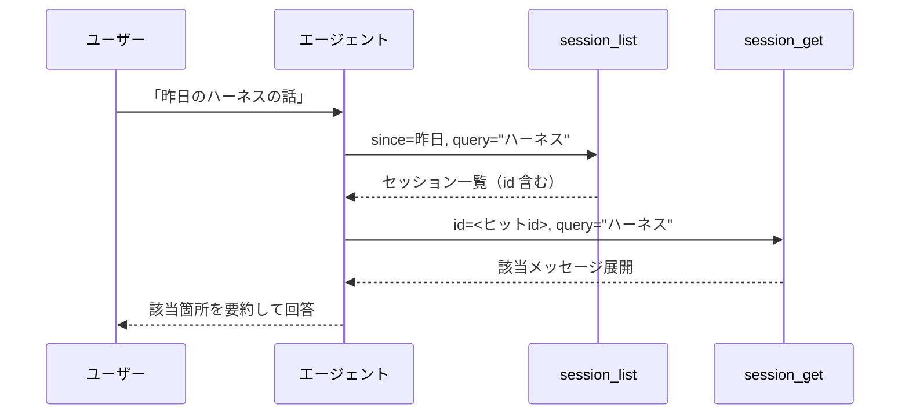

# session-search 拡張機能 Spec

pi に **過去セッション検索** の2つのツールを追加する。エージェントがユーザーの指示に応じて、自身の過去のやりとりを「探す」「見る」。ワークフローは web_search（リストを得る）→ web_fetch（1件を取得）と同じ2ステップ構成。

## ツール一覧

| ツール          | 入力                                  | 出力                                    |
| --------------- | ------------------------------------- | --------------------------------------- |
| session_list    | クエリ(任意) + フィルタ群(任意)       | セッション一覧（id 含むメタ）           |
| session_get     | id + クエリ/範囲/ロール(いずれも任意) | 1セッションの該当メッセージ展開         |

## ワークフロー



`session_list` は「**どのセッション**か」を特定し、`session_get` は「**セッション内のどこ**か」を展開する。

## session_list — 探す

### フィルタ

| パラメータ | 効果                                   | 省略時         |
| ---------- | -------------------------------------- | -------------- |
| query      | キーワードで絞る（詳細後述）           | 全セッション   |
| cwd        | プロジェクトパスへの部分一致で絞る     | 全プロジェクト |
| since      | この日時以降（ISO date）               | 制限なし       |
| until      | この日時以前（ISO date）               | 制限なし       |
| limit      | 返すセッション数の上限                 | 20             |

`query` と `cwd` の使い分け: `cwd=dotfiles` はプロジェクトで確実に絞る。`query=dotfiles` は本文含めて広く拾う。両方同時にも指定できる（AND）。

`since` / `until` に不正な ISO date を指定した場合はエラーを返す。

### 検索対象（query がヒットする箇所）

`query` は以下をまとめて検索する。どこかに語が現れればヒット。

| 対象               | 例                                      | ヒットすると分かること         |
| ------------------ | --------------------------------------- | ------------------------------ |
| プロジェクト(cwd)  | `.../projects/dotfiles`                 | どのプロジェクトか             |
| 表示名(name)       | `ハーネスエンジニアリング kwsk`         | セッションの表題               |
| 最初の発言         | firstMessage                            | セッションの主題               |
| 全メッセージ本文   | allMessagesText                         | 発言のどこかに語が含まれる     |

### 検索のヒット条件とフォールバック

`query` のマッチは2段階。L1 で1件以上あればそこで確定し、L2 は走らない。この2段階フォールバックは `session_list` と `session_get` の両方の `query` に適用する。

| 段階        | 条件                                                          | ヒット0件のとき     |
| ----------- | ------------------------------------------------------------- | ------------------- |
| L1（既定）  | 大文字小文字を区別しない + ひらがな↔カタカナを同一視して部分一致 | L2 へフォールバック |
| L2（予備）  | クエリの文字が順に出現すればヒット（fzf風）                   | 0件をそのまま返す   |

- `ハーネス` → L1 で `はーねす` 本文にもヒットする
- `hrns` → L1 は0件、L2 で `harness` 等にヒットする

タイポ許容（Levenshtein距離）は導入しない。日本語では1字違うだけで別語になる誤爆が増えるため。

### 戻り値

セッションごとに1エントリ。各エントリに `id`（get 呼び出しに使う識別子）を含む。一覧は作成日時の新しい順に並ぶ。

| 項目           | 内容                              |
| -------------- | --------------------------------- |
| id             | get 呼び出し用の識別子            |
| 日付           | 作成日                            |
| プロジェクト   | cwd                               |
| 表示名         | name（あれば）                    |
| 最初の発言     | firstMessage                      |
| メッセージ件数 | そのセッションの総メッセージ数    |

## session_get — 見る

`id` で1セッションを指定し、3モードのいずれかで展開する。

### 3モード（query / offset・limit の有無）

| query | offset・limit | モード       | 挙動                                                 |
| ----- | ------------- | ------------ | ---------------------------------------------------- |
| 省略  | 省略          | 全文         | 先頭から limit 件、続きはページネーション             |
| あり  | 省略          | 検索周辺     | query のヒット箇所の前後数メッセージ                 |
| 省略  | あり          | 範囲指定     | offset から limit 件                                 |
| あり  | あり          | —            | 併用不可（query を優先し、offset・limit は無視）     |

### パラメータ

| パラメータ | 効果                                   | 省略時     |
| ---------- | -------------------------------------- | ---------- |
| id         | 展開対象のセッション（必須）           | —          |
| query      | セッション内の文字列検索               | 全文/範囲  |
| offset     | 開始メッセージ位置（1-based）          | 1          |
| limit      | 取得メッセージ数上限                   | 50         |
| role       | user / assistant 絞り込み              | any        |

`role` は offset・limit を掛ける前に適用する（user 発言だけ拾う、等で実質的にサイズを減らせる）。

### 長大セッションのページネーション

全文・検索周辺モードとも、戻り値が limit を超えると切り詰め、「全N件中 offset〜を表示。続きは `offset=X`」と案内する。長大セッション（数千メッセージ）でも、これを繰り返せば全件を読める。一度の呼び出しで全文を返して呼び出し元のコンテキストを圧迫することはない。

検索周辺モードで複数ヒット時は、ヒット箇所ごとに前後数メッセージを順に返し、サイズ上限で切れたら続きをページネーションする。

### 戻り値

該当メッセージを時系列で展開。各メッセージに role（user/assistant 等）と本文。

```
## 2026-08-07 dotfiles — "ハーネスエンジニアリング kwsk"
[user] 中間レイヤーの出現 kwsk
[assistant] Claude Agent SDK でワークフローを...
```

本文はメッセージの内容に応じて次のようにレンダリングする。

| メッセージの内容        | 本文                                                       |
| ----------------------- | ---------------------------------------------------------- |
| テキスト                | そのままのテキスト                                          |
| thinking ブロック       | thinking のテキスト                                         |
| toolCall ブロック       | ツール名と引数（JSON）                                      |
| bashExecution メッセージ | command と output を改行で連結したもの                       |

## ツールの表示

`session_list` / `session_get` のツール呼び出し時は、TUI 上にツール名と引数（`key=value` 形式、例: `session_list query="ハーネス"`）を表示する。

## ツール結果の表示

`session_list` / `session_get` のツール実行結果は、TUI 上では以下のように表示する。

| 状態 | 表示 |
| ---- | ---- |
| 折りたたみ（既定） | `session_list` は `4 sessions`、`session_get` は `3 messages` のように件数を表示し、本文は表示しない |
| 展開（Ctrl+O） | ツール実行結果の全文を表示 |
| エラー時の折りたたみ | `error` のみ表示 |

折りたたみは TUI 上の表示だけに適用する。ツールの戻り値自体には、従来どおり検索結果または展開対象のメッセージを含める。

## 自然言語の解釈（エージェントがパラメータへ翻訳）

| ユーザー発話                         | エージェントの呼び方                                              |
| ------------------------------------ | ----------------------------------------------------------------- |
| 「昨日のセッション一覧」             | list: `since=昨日`, query 省略                                    |
| 「昨日話してたハーネスの話」         | list: `since=昨日`, `query=ハーネス` → get: id, `query=ハーネス` |
| 「dotfiles の作業、最近」            | list: `cwd=dotfiles`, `until=今日`                               |
| 「あのセッションの中身全部見せて」   | list で特定 → get: id（全文）                                  |
| 「ハーネスの箇所だけ見せて」         | list で特定 → get: id, `query=ハーネス`                       |

「昨日」「最近」等の時間表現は `since`/`until`（ISO date）で表現する。`query`（テキスト部分一致）では扱わない。

## 0件・エラー

| 状況                              | 挙動                                       |
| --------------------------------- | ------------------------------------------ |
| list でヒット0件                  | 空の一覧を返す                             |
| get で id が存在しない           | エラー                                     |
| get で query がヒットしない      | 「ヒットなし」を返す（全文は返さない）     |
