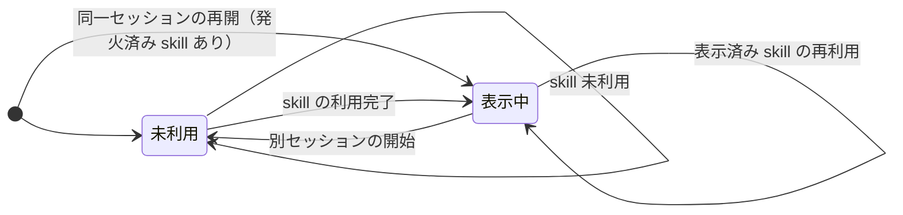

# skill-status 仕様

## 対象と目的

skill-status は、pi を利用するユーザーに、現在のセッションで正常に利用された skill 名を入力エディタの上で知らせる。

この仕様は、skill-status が表示する内容、表示の更新条件、およびセッションをまたいだ表示の扱いを定める。

## 表示

発火済み skill が1つ以上あるとき、入力エディタの上に照準の絵文字と skill 名を次の形式で表示する。

```text
🎯 skills: <skill名>, <skill名>
```

skill 名は、各 skill が現在のセッションで初めて利用された順に並べ、`, ` で区切る。同じ skill が複数回利用されても、名前は1回だけ表示する。

表示のテキスト色はグレーとする。

表示領域に収まらないときは、行末を `...` で省略して、表示領域の幅を超えないようにする。

発火済み skill がないときは、表示を消す。

## 表示の更新

skill の利用結果と表示は、次のように対応する。

| ユーザーまたは pi の動作 | 表示 |
| --- | --- |
| skill を利用していない | 表示しない |
| 明示的な skill コマンドで skill の利用が完了した | 利用された skill 名を追加して表示する |
| pi が自動的に skill を選択し、その利用が完了した | 利用された skill 名を追加して表示する |
| skill の利用に失敗した | 発火済み skill の表示を変更しない |
| skill 名を通常の入力文に含めただけ | 発火済み skill の表示を変更しない |
| 発火済み skill を再度利用した | 表示順と表示名を変更しない |

明示的な skill コマンドは、次のいずれかの形式で入力する。`<name>` は空白と `/` を含まない skill 名を表し、末尾には空白で始まる引数を付けられる。

- `/skill:<name>`
- `/<name>`

pi がその入力を skill コマンドとして受け付けない場合、skill の利用は完了せず、発火済み skill の表示を変更しない。

## セッション間の表示

発火済み skill の表示は現在のセッションだけに属する。



新しいセッションを開始したときは、前のセッションで表示されていた skill 名を表示しない。新しいセッションでは、skill が利用されるまで表示しない。

pi の起動時または拡張の再読み込み時に同じセッションを再開したときは、そのセッションで発火済みの skill 名を、それまでの順序と内容のまま表示する。

## UI が表示できない場合

入力エディタ上の表示を利用できない環境では、skill-status は画面への表示を行わない。表示できる環境に戻った後、skill の利用が完了した時点で、そのセッションの発火済み skill を表示する。
