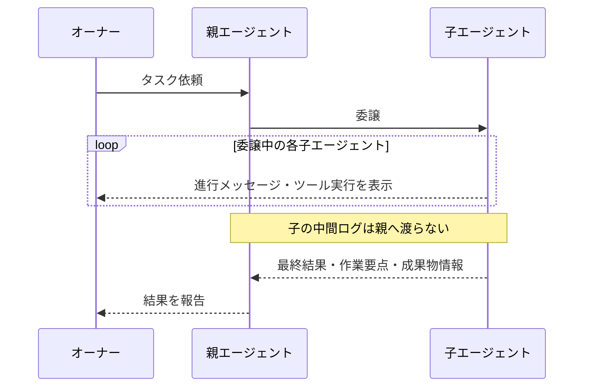

# Subagent Extension — ミニマル化仕様

本ファイルは `index.ts` を「子エージェントを安全に呼び出すための最小限のツール」へ
縮小するための仕様。新機能の追加ではなく減らす方向。実装者は本ファイルを元に
`index.ts` / `index.test.ts` / `README.md` を書き直す。

## 設計方針（合意事項）

- **最小限の機能**におさめる。ペルソナ機能・役割付け系は廃止。
- 委譲中の子の進行はオーナーに表示し、親には最終結果のみ渡す（詳細は「委譲結果の観測」節）。
- 親がキャンセルされたら**子にキャンセル伝播**。

## ツール interface

**single モードのみ。** parallel / chain は廃止。

| パラメータ | 型 | CLI フラグ | 備考 |
|---|---|---|---|
| `task` | string（必須） | — | 子に渡すタスク |
| `model` | string? | `--model` | モデルオーバーライド |
| `cwd` | string? | — | 省略時は親の `ctx.cwd` |

## 子プロセス起動

```
pi --mode json -p --no-session [--model X]
```

最終引数として `Task: <task>` を渡す（現状どおり）。

- 子は**スキル自動発見あり**（親と同じルール）。
- `--no-skills` / `--skill` / `--append-system-prompt` は渡さない。
- 一時ファイル経由の systemPrompt 処理（`writePromptToTempFile`）は廃止。

## 委譲結果の観測

委譲中は子エージェントの進行状況が **オーナーに表示** され、完了時には **親エージェントへ要約だけが渡る**。実装は現状の `onUpdate`（ユーザー向けストリーミング）／ `content`（親向け最終テキスト）の分離で成立する。



親エージェントに返るのは以下の3つだけ。中間ログは含まれない。

- 最終結果
- 作業要点
- 成果物情報

## 表示

- **collapsed / expanded（Ctrl+O）の 2 モードを維持。**
- **usage 表示は廃止** → `formatUsageStats` / `formatTokens` / usage tracking ごと削除。
- **ツールコールは汎用 1 行表示**（`→ toolName {args preview}`）。
  - `formatToolCall` の個別ケース（`bash` / `read` / `write` / `edit` / `ls` / `find` / `grep`）は全削除。
  - 汎用フォールバックのみ残す。
- **ラベル**は `deriveLabel` を `config.model ?? "task"` の 1 行に簡略化（`step` 引数は廃止）。
- ストリーミング（`onUpdate` で思考テキスト + ツールコールをリアルタイム表示）は維持。

## 安全・停止

- **abort 伝播**: SIGTERM → 5 秒 → SIGKILL（現状維持）。
- **タイムアウト**: なし（親が Ctrl+C したときのみ停止）。
