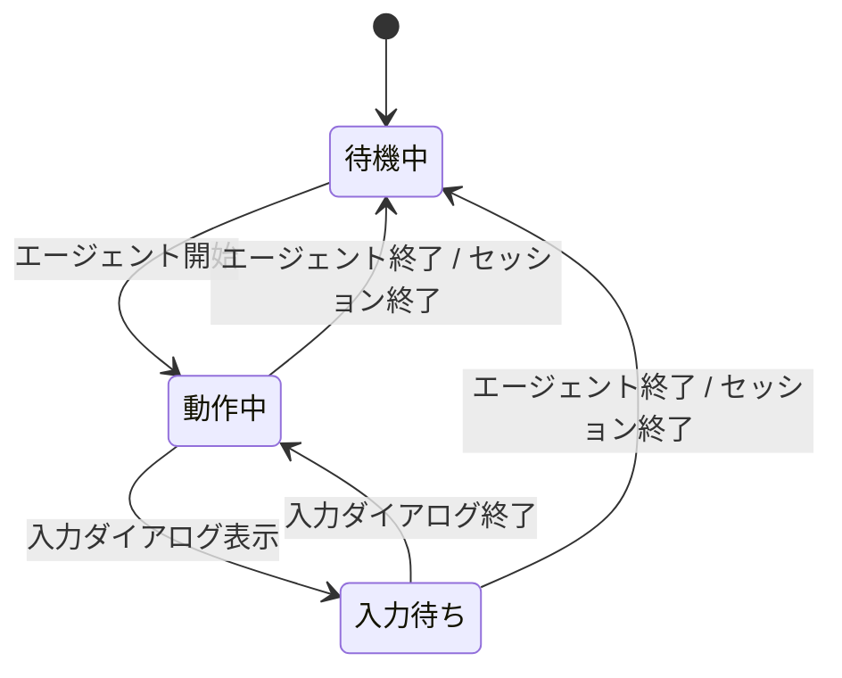

# titlebar 拡張機能 Spec

エージェントの動作状態に合わせて、ターミナルのタイトルを切り替える。

## 実行条件（モード）

タイトルの制御は TUI モード（`ctx.mode` が `"tui"`）で動作しているセッションだけで行う。rpc・json・print モードではタイトルを設定する通知（`setTitle`）を送らない。

## タイトルの状態遷移

## 各状態のタイトル表示

| 状態   | 表示内容                                                 | アニメーション |
| ------ | -------------------------------------------------------- | -------------- |
| 待機中 | `π - {セッション名}` / `π`                               | なし           |
| 動作中 | `{スピナー} π - {セッション名}` / `{スピナー} π`          | スピナー       |
| 入力待ち | `⏸ π - {セッション名}` / `⏸ π`                         | なし           |

## スピナー

動作中、タイトル先頭に点字ブロックの `⠋` `⠙` `⠹` `⠸` `⠼` `⠴` `⠦` `⠧` `⠇` `⠏` の10文字を0.1 秒間隔でこの順で循環させ、エージェントが処理中であることを示す。

## 入力待ち

エージェント動作中に拡張がユーザー入力を求めるダイアログを表示している間、タイトルは `⏸` を先頭に付けた静止した表示へ切り替え、エージェントがユーザーの入力を待っていることを示す。プロンプトの種別は表示しない。ダイアログが閉じられると動作中のスピナーへ戻る。

## タイトルの構成要素

| 要素         | 内容                                                       |
| ------------ | ---------------------------------------------------------- |
| セッション名 | セッションに名前があるときだけ `π - ` に続けて付く（名前がない場合は `π` のみ） |
