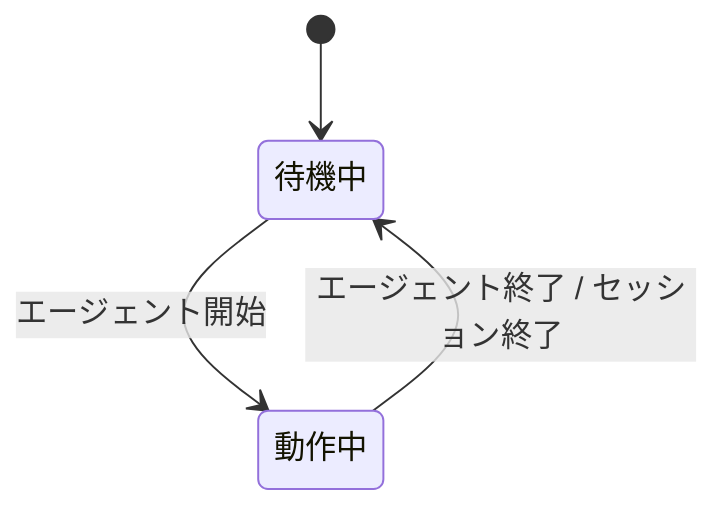

# titlebar 拡張機能 Spec

エージェントの動作状態に合わせて、ターミナルのタイトルを切り替える。

## タイトルの状態遷移

## 各状態のタイトル表示

| 状態   | 表示内容                                                            | アニメーション   |
| ------ | ------------------------------------------------------------------- | ---------------- |
| 待機中 | `π - {セッション名} - {ディレクトリ名}` / `π - {ディレクトリ名}`    | なし             |
| 動作中 | `{スピナー} π - {セッション名} - {ディレクトリ名}` / `{スピナー} π - {ディレクトリ名}` | 点字スピナー |

## スピナー

動作中、タイトル先頭に 10 種類の点字（`⠋ ⠙ ⠹ ⠸ ⠼ ⠴ ⠦ ⠧ ⠇ ⠏`）を **80ms ごとに順番に切り替えて** 表示し、エージェントが処理中であることを示す。

## タイトルの構成要素

| 要素         | 内容                                                       |
| ------------ | ---------------------------------------------------------- |
| ディレクトリ名 | 現在の作業ディレクトリの末尾（動作中も毎フレーム更新）     |
| セッション名 | セッションに名前があるときだけ先頭に付く（名前がない場合は省略） |
