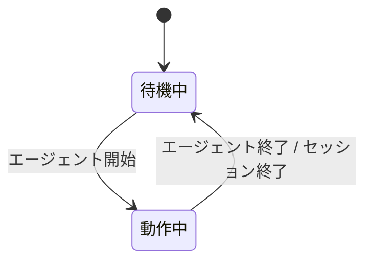

# titlebar 拡張機能 Spec

エージェントの動作状態に合わせて、ターミナルのタイトルを切り替える。

## タイトルの状態遷移

## 各状態のタイトル表示

| 状態   | 表示内容                                                 | アニメーション |
| ------ | -------------------------------------------------------- | -------------- |
| 待機中 | `π - {セッション名}` / `π`                               | なし           |
| 動作中 | `{スピナー} π - {セッション名}` / `{スピナー} π`          | スピナー       |

## スピナー

動作中、タイトル先頭に `-` `\` `|` `/` の 4文字を0.1 秒間隔でこの順で循環させ、エージェントが処理中であることを示す。

## タイトルの構成要素

| 要素         | 内容                                                       |
| ------------ | ---------------------------------------------------------- |
| セッション名 | セッションに名前があるときだけ `π - ` に続けて付く（名前がない場合は `π` のみ） |
