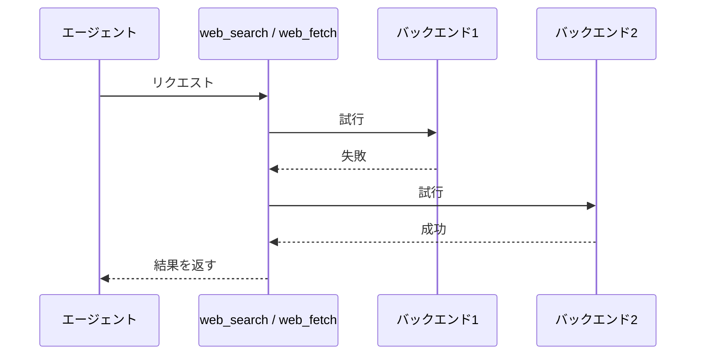

# web-search 拡張機能 Spec

pi に **Web検索** と **URL取得** の2つのツールを追加する。両ツールとも複数の取得先（バックエンド）を順に試し、最初に成功したものの結果を返す。

## ツール一覧

| ツール     | 入力                          | 出力                                                                                                |
| ---------- | ----------------------------- | --------------------------------------------------------------------------------------------------- |
| web_search | 検索クエリ1つ ＋ lang（任意） | 検索結果（最大10件・Markdown）                                                                      |
| web_fetch  | URL1つ                        | ページ本文（Markdown）＋タイトル（タイトルはTUIの結果行表示のみに使い、ツール出力本文には含めない） |

## 同一ツールのリクエスト順序

同一ツールへの複数リクエストは、受付順に1件ずつバックエンド処理を開始する。先行リクエストが成功または失敗して完了するまで、後続リクエストはバックエンドへアクセスしない。

| 同時に受け付けたリクエスト | バックエンド処理の開始                 |
| -------------------------- | -------------------------------------- |
| web_search と web_search   | 先行リクエストの完了後に後続リクエスト |
| web_fetch と web_fetch     | 先行リクエストの完了後に後続リクエスト |
| web_search と web_fetch    | 両リクエストがそれぞれ開始可能         |

## 共通のフォールバック挙動



バックエンドが空の本文を返した場合も失敗として扱い、次のバックエンドへフォールバックする。空とは、空白・改行のみを含め有意な文字を含まない本文のことである。

全バックエンドが失敗した場合、ツールは例外となりエージェントへエラーとして伝わる。結果本文は返さない。
ツールが例外となる場合でも、TUIの結果行には試したすべてのバックエンドについて `✗ <バックエンド> - "<エラー>"` を1行ずつ出力する。

## 常駐サーバー

両ツールは2つのローカル常駐サーバーを使う。

### セッション開始時の先行起動

セッションが開始されるたび（pi の起動・新規セッション・再開を含む）に、各サーバーのヘルスチェックを行い、成功しないサーバーをバックグラウンドで起動する。この先行起動は起動の完了を待たないため、pi の起動時間に影響しない。先行起動の成否が後続のツール実行の成否に影響することもない（ツール実行時の起動処理が改めて行われる）。

### ツール実行時の起動

ツール実行時は、リクエストのたびにヘルスチェックを行い、成功しないときはバックグラウンドで起動し、成功するまで待ってから処理を続ける。すでに動いているサーバーは起動しない。タイムアウトまでにヘルスチェックが成功しない場合はバックエンドの失敗となるが、起動したサーバープロセスは残るため、次のリクエストでは成功しうる。起動コマンドの実行に失敗した場合（実行ファイルが PATH にない等）もバックエンドの失敗として扱い、pi プロセス自体は終了しない。

| サーバー        | 用途                   | 既定の接続先                   | ヘルスチェック           | 起動コマンド                                                        |
| --------------- | ---------------------- | ------------------------------ | ------------------------ | ------------------------------------------------------------------- |
| camoufox server | ページの描画とHTML取得 | `ws://127.0.0.1:9378/camoufox` | websocket 接続が成功する | `bun server.mjs`（拡張ディレクトリ内）                              |
| openserp        | SERP HTML のパース     | `http://127.0.0.1:7000` | `GET /ready` が 2xx  | `openserp serve -a <host> -p <port> --quiet`（logs.txt を書かない） |

openserp の起動アドレスとポートは接続先（`OPENSERP_BASE_URL`）の host・port を使う。openserp はパース専用として使うためブラウザを起動せず、Chrome のインストール状態に依存しない。

## バックエンドの順序

### web_search のバックエンド

| 順序 | バックエンド                 |
| ---- | ---------------------------- |
| 1    | camoufox+openserp(google)     |
| 2    | camoufox+openserp(duckduckgo) |
| 3    | camoufox+openserp(bing)       |

### web_fetch のバックエンド

バックエンドの構成は URL が Reddit 投稿パーマリンク（§Reddit バックエンド）か StackOverflow 質問パーマリンク（§StackOverflow バックエンド）かどうかで変わる。いずれの専用 URL でもその専用バックエンドのみを試行し、汎用バックエンドへのフォールバックは行わない。

| 条件（URL）             | バックエンド順序         |
| ----------------------- | ------------------------ |
| Reddit 投稿パーマリンク | Reddit のみ              |
| StackOverflow 質問パーマリンク | StackOverflow のみ |
| その他                  | camoufox+trafilatura のみ |

Reddit・StackOverflow バックエンドが失敗した場合も通常どおりバックエンド失敗として扱い、web_fetch 全体が例外となる。

## タイムアウト

段階ごとの最大待ち時間は次のとおり。

| 段階                           | 対象                                          | 最大待ち時間 |
| ------------------------------ | --------------------------------------------- | ------------ |
| サーバー起動待ち（両サーバー） | ヘルスチェックのポーリングを含む              | 15秒         |
| camoufox による描画            | ページの open・ナビゲーション・描画待ち（networkidle・チャレンジ検出）・描画済み DOM の取得 | 30秒    |
| openserp へのパース要求        | `POST /<engine>/parse` の往復                 | 15秒         |
| trafilatura による変換         | HTML → Markdown 変換                          | 15秒         |
| Reddit の各取得                | フィード・埋め込み・oEmbed の1要求ごと        | 15秒         |
| StackOverflow の各取得         | SE API・質問フィードの1リクエストごと        | 15秒         |

## camoufox+openserp バックエンド（web_search）

検索クエリから検索結果リストを得るまでの経路:

1. 検索エンジンごとの SERP URL を構築する。クエリは URL エンコードする。`lang` 指定時は各エンジンの言語パラメータへ反映する（bing: `mkt`、duckduckgo: `kl`、google: `hl`・`gl`）。未指定時は各エンジンの既定ロケールになる。bing の `mkt` と duckduckgo の `kl` は対応値のない lang を指定なしとして扱う。google は `hl` に lang を常に設定し、`gl` は対応国の定義された lang のみ設定する
2. 常駐 camoufox server でその URL を描画し、描画済み DOM（`document.documentElement.outerHTML`）を取得する（§camoufox による描画）
3. HTML を openserp の `POST /<engine>/parse?format=json` へリクエストボディとして送り、応答を JSON として受け取る。検索結果は応答の `results[]`（`rank`・`title`・`url`・`display_url`・`type`・`snippet`）から拡張が Markdown エントリを生成し、openserp が返すテキスト表現には依存しない
4. `results[]` を `rank` 順に並べ替え、先頭から最大10件までをエントリとして返す。各エントリは `### <番号>. <タイトル>`、`**<表示URL>** - <type>`、スニペット、`-> <URL>` の順のブロックで、欠損フィールドの行は省略する

openserp が CAPTCHA・チャレンジ・空結果を検出した場合はパース要求が 4xx エラーとなり、バックエンドの失敗として次のエンジンを試す。検索エンジンの固定ページ（チャレンジページ）はその前に描画段階で検出し、待ちを切り上げて失敗とする（§チャレンジページ検出）。results が空（検索結果ゼロ）の場合と、応答が JSON として解釈できない場合も失敗として扱う。

エンジンごとの SERP URL とパスは次のとおり。

| エンジン   | SERP URL                                                              |
| ---------- | --------------------------------------------------------------------- |
| bing       | `https://www.bing.com/search`                                         |
| duckduckgo | `https://duckduckgo.com/`                                             |
| google     | `https://www.google.com/search`（TLD は言語により既定から変更しない） |

## camoufox による描画

常駐 camoufox server に接続した playwright-cli セッションでページを描画し、HTML を取得する。web_search と web_fetch の両方から使う共通の取得経路である。

1. web_search ではセッション `web-search`、web_fetch ではセッション `web-fetch` として server に接続し、URL を開く。各リクエストは独立しており、cookie やページ状態はリクエスト間で共有されない
2. networkidle とハイドレーションの完了待ちと、描画済み DOM に対するチャレンジページ判定（§チャレンジページ検出）のポーリングを並行に実行し、どちらか早い方で待ちを切り上げる。この待ちに失敗しても処理は続行する。チャレンジページを検出したときは描画を失敗とし、エラー `render: challenge detected` を返す
3. 待ちの中で取得した描画済み DOM（`document.documentElement.outerHTML`）を結果とする
4. ページを閉じる（成否に関わらず。閉鎖失敗は結果に影響させない）

## camoufox+trafilatura バックエンド（web_fetch）

URL のページ本文を Markdown で得る経路:

1. 常駐 camoufox server で URL を描画し、HTML を取得する（§camoufox による描画。チャレンジページは描画段階で失敗する）
2. HTML を trafilatura で Markdown 化する

本文が空の場合は失敗として扱う。

## チャレンジページ検出

描画済み HTML がボット検証のチャレンジページ、または検索エンジンがボットとして要求を拒否した固定ページのとき、描画段階で失敗として扱う（camoufox+openserp・camoufox+trafilatura ともに）。失敗時のエラー文言は `render: challenge detected` とする。web_search ではこの検出により、openserp へのパース要求と networkidle 待ちを待たずに次のエンジンへ切り替える。

チャレンジページは HTML の構造シグナルで判定し、ロケール依存の表示文言は使わない。次のシグナルのいずれか1つでも含まれる HTML をチャレンジページとする:

| シグナル | 意味 |
| --- | --- |
| `cdn-cgi/challenge-platform/` | Cloudflare チャレンジスクリプトの読み込みパス |
| `id="challenge-running"`・`id="challenge-form"`・`id="challenge-stage"`・`id="challenge-error-text"` | Cloudflare チャレンジページの固定 DOM 構造 |
| `<title>` が `Just a moment...` | Cloudflare チャレンジページの固定タイトル |
| `cf-turnstile` | Cloudflare Turnstile ウィジェット |
| `<form id="captcha-form">` | Google CAPTCHA 固定ページのフォーム |
| `<form action="…/sorry/…">` | Google の sorry 固定ページへのフォーム |
| `<body onload="…captcha…">` | Google CAPTCHA 固定ページの onload ハンドラ |
| Google の結果ブロック（`class="tF2Cxc"`・`data-hveid`）を含まず `httpservice/retry/enablejs` を含む | Google の JS リトライ固定ページ（soft block） |

`data-sitekey`・`recaptcha` は reCAPTCHA 埋め込みの通常ページにも現れるためシグナルに含めない。描画段階で検出漏れとなったチャレンジは、openserp のパース要求の 4xx エラーとして後段で失敗になる（§camoufox+openserp バックエンド）。

## Reddit バックエンド

Reddit 投稿パーマリンクを、Reddit 公式の匿名アクセス用エンドポイントから取得する。投稿ページ HTML は JavaScript シェルでスクレイピング系バックエンドが抽出できないため、この専用経路のみを使う。

対象 URL は `https://<host>/r/<subreddit>/comments/<投稿ID>/[<slug>]` 形式とする。`<host>` は `reddit.com`、または `*.reddit.com` に一致するサブドメイン（ホスト名の末尾一致。`www.reddit.com`・`old.reddit.com` 等を含む）とする。末尾スラッシュの有無は問わない。それ以外の Reddit URL（サブレディット一覧・ユーザーページ等）は対象外とし、Reddit バックエンドを構成しない。

### 取得経路

次の順に試行し、成功した時点で以降を省略する。

1. 投稿パーマリンクに `.rss` を付けた Atom フィード（コメント上限 500 件・top ソート指定）
2. `embed.reddit.com` の埋め込みページ（フィードが 429 等で失敗したとき）
3. `reddit.com/oembed`

すべて失敗した場合は Reddit バックエンドの失敗とし、web_fetch 全体が例外となる。

### 出力（Markdown）

| 要素                           | 内容                                                                       |
| ------------------------------ | -------------------------------------------------------------------------- |
| タイトル・投稿者・パーマリンク | 取得した投稿のもの                                                         |
| 更新時刻                       | フィードから取得できた場合、投稿の更新時刻                                 |
| コメント数                     | フィード成功時は取得したコメント数。embed 成功時は Reddit の表示数も併記   |
| 投稿本文                       | フィード配信範囲の本文を Markdown 化したもの                               |
| コメント                       | top ソートで最大約 500 件を `### N. <投稿者>` 形式で列挙                   |
| 注記                           | スコア・返信階層は取得できないこと。フィード失敗時にコメント本文が無いこと |

非公開・削除済み・年齢制限の投稿は取得できず、通常のバックエンド失敗として扱う。

結果行のタイトルは投稿タイトルを使い、Reddit ページシェルの汎用タイトル（例: `"Reddit - Dive into anything"`）は使わない。

## StackOverflow バックエンド

StackOverflow の質問ページを、匿名でアクセスできる StackExchange のエンドポイントから取得する。質問ページ HTML は Cloudflare のチャレンジで取得できないため、この専用経路のみを使う。

対象 URL は `https://[www.]stackoverflow.com/questions/<質問ID>/[<slug>]` 形式とする（末尾スラッシュ・クエリ・フラグメントは任意）。それ以外の StackOverflow URL（一覧・タグ・ユーザーページ等）や他の Stack Exchange サイトは対象外とし、StackOverflow バックエンドを構成しない。

### 取得経路

次の順に試行し、成功した時点で以降を省略する。

1. StackExchange API
   - `GET https://api.stackexchange.com/2.3/questions/<質問ID>?site=stackoverflow&filter=withbody` で質問（タイトル・本文・スコア・回答数・タグ・質問者）を取得する
   - `GET https://api.stackexchange.com/2.3/questions/<質問ID>/answers?site=stackoverflow&filter=withbody&order=desc&sort=votes&pagesize=100&page=<n>` で回答を取得する。`has_more` が true の間はページを進め、投票順で最大500件まで取得する
   - レスポンスが `backoff` を含むときは、その秒数待ってから次のリクエストを送る
   - quota 超過・エラー・質問が見つからない場合はこの経路の失敗とし、質問フィードへフォールバックする
2. 質問フィード `https://stackoverflow.com/feeds/question/<質問ID>`（Atom）。先頭 entry を質問、以降の entry を回答として扱う

両方失敗した場合は StackOverflow バックエンドの失敗とし、web_fetch 全体が例外となる。

### 出力（Markdown）

| 要素                     | 内容                                                                     |
| ------------------------ | ------------------------------------------------------------------------ |
| タイトル・質問者・パーマリンク | 取得した質問のもの                                               |
| スコア・回答数・タグ       | API 成功時のみ。フィード利用時は省略する                                 |
| 質問本文                 | 取得した HTML を Markdown 化したもの                                     |
| 回答                     | `### N. <回答者>` 形式で列挙。API では投票順、フィードでは掲載順         |
| 注記                     | フィード利用時にスコア・accepted・投票順が取れないこと                   |

API の回答は `### N. <回答者> (score <n>)`、accepted 回答は `(accepted)` を追加して表示する。
結果行のタイトルは質問タイトルを使う。

## クールダウン

web_search / web_fetch のいずれにもクールダウンを設けない。過去のリクエストで失敗したバックエンドも、次のリクエストでは通常どおり記載された順序で試行する。

## web_search の出力（Markdown）

成功したバックエンドの結果本文は、先頭に次の 1 行のメタデータ行を付けた Markdown である:

```text
**Query:** "<クエリ>" - **Engines:** <engine> - **Took:** <実測秒>
```

メタデータ行の値はすべて拡張が持つもの（ツール引数のクエリ・成功したエンジン・当該バックエンド試行の実測所要時間）から生成し、openserp の応答内容には依存しない。秒表記は TUI の結果行と同じ `(1.2s)` 形式の `1.2s` を使う。

## 言語ヒント（web_search のみ）

`lang`（任意）を指定すると、SERP URL 構築時に各エンジンの言語パラメータへ反映する（§camoufox+openserp バックエンド）。未指定時は各エンジンの既定ロケールになる。

## 表示（TUI）

### コール行（実行開始時）

ツール名に続けて入力を記載：`web_search - "<クエリ>"`（`lang` 指定時は末尾に ` [lang=<lang>]`）/ `web_fetch - "<URL>"`。

### 結果行（実行完了時）

成功した場合は、試したバックエンドごとに1行ずつ出力し、成功した時点で終了する。全バックエンドが失敗した場合は、例外として扱いながらも、試したすべてのバックエンドの失敗行を出力する。先頭に成否マーク（`✓` / `✗`）、続けてバックエンド名。web_fetch 成功時は `-` で区切ってタイトルを続ける（タイトルがある場合）。各行の末尾に、そのバックエンドの試行にかかった所要時間を ` (1.2s)` の形式で付ける。

| 状態                            | 出力                                     |
| ------------------------------- | ---------------------------------------- |
| 成功（web_search）              | `✓ <バックエンド> (1.2s)`                |
| 成功（web_fetch、タイトルあり） | `✓ <バックエンド> - "<タイトル>" (1.2s)` |
| 成功（web_fetch、タイトルなし） | `✓ <バックエンド> (1.2s)`                |
| 失敗                            | `✗ <バックエンド> - "<エラー>" (1.2s)`   |

web_fetch のタイトルは、取得済みの本文（Markdown）の見出しから取り出したものだけを使い、タイトルのためのネットワーク再取得は行わない。見出しは `# <タイトル>`（h1）に加えて、`## <数字>. <タイトル>`・`### <数字>. <タイトル>` の形式（`^#{2,3} \d+\.` に一致する見出し）もタイトルとして扱う。本文からタイトルを取り出せない場合は、タイトルなしとして扱う。

エラーメッセージには失敗した段階が分かる文言を含める。段階ラベルを付けるのはサーバー起動待ち・描画・パースの3段階とし、Reddit 取得と trafilatura 変換には付けない。

例（web_search で google/duckduckgo が失敗し bing が成功）：

```
web_search - "<クエリ>"
✗ camoufox+openserp(google) - "render: challenge detected" (2.1s)
✗ camoufox+openserp(duckduckgo) - "render: navigation timeout" (30.0s)
✓ camoufox+openserp(bing) (2.1s)
```

## 環境変数

| 変数                | 影響                                                                    |
| ------------------- | ----------------------------------------------------------------------- |
| `CAMOUFOX_BASE_URL` | camoufox server の接続先（既定 `ws://127.0.0.1:9378/camoufox`）         |
| `OPENSERP_BASE_URL` | openserp の接続先と起動アドレス・ポート（既定 `http://127.0.0.1:7000`） |
