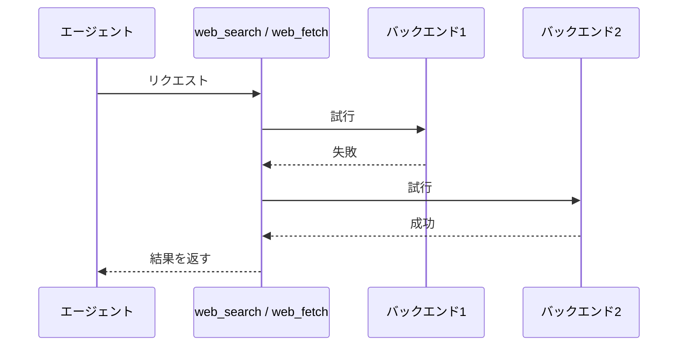

# web-search 拡張機能 Spec

pi に **Web検索** と **URL取得** の2つのツールを追加する。両ツールとも複数の取得先（バックエンド）を順に試し、最初に成功したものの結果を返す。

## ツール一覧

| ツール     | 入力                          | 出力                                                                                                |
| ---------- | ----------------------------- | --------------------------------------------------------------------------------------------------- |
| web_search | 検索クエリ1つ ＋ lang（任意） | 検索結果（最大10件・Markdown）                                                                      |
| web_fetch  | URL1つ                        | ページ本文（Markdown）＋タイトル（タイトルはTUIの結果行表示のみに使い、ツール出力本文には含めない） |

## 同一ツールのリクエスト順序

同一ツールへの複数リクエストは、受付順に1件ずつバックエンド処理を開始する。先行リクエストが成功または失敗して完了するまで、後続リクエストはバックエンドへアクセスしない。

| 同時に受け付けたリクエスト | バックエンド処理の開始                 |
| -------------------------- | -------------------------------------- |
| web_search と web_search   | 先行リクエストの完了後に後続リクエスト |
| web_fetch と web_fetch     | 先行リクエストの完了後に後続リクエスト |
| web_search と web_fetch    | 両リクエストがそれぞれ開始可能         |

## 共通のフォールバック挙動



バックエンドが空の本文を返した場合も失敗として扱い、次のバックエンドへフォールバックする。空とは、空白・改行のみを含め有意な文字を含まない本文のことである。

全バックエンドが失敗した場合、ツールは例外となりエージェントへエラーとして伝わる。結果本文は返さない。
ツールが例外となる場合でも、TUIの結果行には試したすべてのバックエンドについて `✗ <バックエンド> - "<エラー>"` を1行ずつ出力する。

## 常駐サーバー

両ツールは2つのローカル常駐サーバーを使う。いずれもリクエストのたびにヘルスチェックを行い、成功しないときはバックグラウンドで起動し、成功するまで待ってから処理を続ける。すでに動いているサーバーは起動しない。タイムアウトまでにヘルスチェックが成功しない場合はバックエンドの失敗となるが、起動したサーバープロセスは残るため、次のリクエストでは成功しうる。

| サーバー        | 用途                   | 既定の接続先            | ヘルスチェック       | 起動コマンド                                                        |
| --------------- | ---------------------- | ----------------------- | -------------------- | ------------------------------------------------------------------- |
| camofox-browser | ページの描画とHTML取得 | `http://127.0.0.1:9377` | `GET /health` が 2xx | `npx @askjo/camofox-browser@1.14.0`                                 |
| openserp        | SERP HTML のパース     | `http://127.0.0.1:7000` | `GET /ready` が 2xx  | `openserp serve -a <host> -p <port> --quiet`（logs.txt を書かない） |

camofox-browser 起動時に拡張が設定する環境変数は次のとおり。利用者の環境変数があればそちらを優先し、それ以外の環境変数も引き継ぐ。

| 変数                           | 設定値      | 意味                                 |
| ------------------------------ | ----------- | ------------------------------------ |
| `CAMOFOX_BIND_HOST`            | `127.0.0.1` | ローカルホスト以外へのバインドを防ぐ |
| `CAMOFOX_CRASH_REPORT_ENABLED` | `false`     | テレメトリ送信を無効化する           |

openserp の起動アドレスとポートは接続先（`OPENSERP_BASE_URL`）の host・port を使う。openserp はパース専用として使うためブラウザを起動せず、Chrome のインストール状態に依存しない。

## バックエンドの順序

### web_search のバックエンド

| 順序 | バックエンド                 |
| ---- | ---------------------------- |
| 1    | camofox+openserp(google)     |
| 2    | camofox+openserp(duckduckgo) |
| 3    | camofox+openserp(bing)       |

### web_fetch のバックエンド

バックエンドの構成は URL が Reddit 投稿パーマリンク（§Reddit バックエンド）かどうかで変わる。Reddit 投稿パーマリンクでは Reddit バックエンドのみを試行し、汎用バックエンドへのフォールバックは行わない。

| 条件（URL）             | バックエンド順序         |
| ----------------------- | ------------------------ |
| Reddit 投稿パーマリンク | Reddit のみ              |
| その他                  | camofox+trafilatura のみ |

Reddit バックエンドが失敗した場合も通常どおりバックエンド失敗として扱い、web_fetch 全体が例外となる。

## タイムアウト

段階ごとの最大待ち時間は次のとおり。

| 段階                           | 対象                                          | 最大待ち時間 |
| ------------------------------ | --------------------------------------------- | ------------ |
| サーバー起動待ち（両サーバー） | ヘルスチェックのポーリングを含む              | 15秒         |
| camofox による描画             | タブ生成・ナビゲーション・描画済み DOM の取得 | 30秒         |
| openserp へのパース要求        | `POST /<engine>/parse` の往復                 | 15秒         |
| trafilatura による変換         | HTML → Markdown 変換                          | 15秒         |
| Reddit の各取得                | フィード・埋め込み・oEmbed の1要求ごと        | 15秒         |

## camofox+openserp バックエンド（web_search）

検索クエリから検索結果リストを得るまでの経路:

1. 検索エンジンごとの SERP URL を構築する。クエリは URL エンコードする。`lang` 指定時は各エンジンの言語パラメータへ反映する（bing: `mkt`、duckduckgo: `kl`、google: `hl`・`gl`）。未指定時は各エンジンの既定ロケールになる。bing の `mkt` と duckduckgo の `kl` は対応値のない lang を指定なしとして扱う。google は `hl` に lang を常に設定し、`gl` は対応国の定義された lang のみ設定する
2. camofox-browser でその URL を描画し、描画済み DOM（`document.documentElement.outerHTML`）を取得する（§camofox による描画）
3. HTML を openserp の `POST /<engine>/parse?format=markdown` へリクエストボディとして送り、Markdown 形式の検索結果を得る
4. 先頭から最大10件までを結果として返す（`### <数字>.` 見出し単位で数える）

openserp が CAPTCHA・チャレンジ・空結果を検出した場合はパース要求が 4xx エラーとなり、バックエンドの失敗として次のエンジンを試す。パース結果の本文が空の場合も失敗として扱う。

エンジンごとの SERP URL とパスは次のとおり。

| エンジン   | SERP URL                                                              |
| ---------- | --------------------------------------------------------------------- |
| bing       | `https://www.bing.com/search`                                         |
| duckduckgo | `https://duckduckgo.com/`                                             |
| google     | `https://www.google.com/search`（TLD は言語により既定から変更しない） |

## camofox による描画

camofox-browser のタブAPIでページを描画し、HTML を取得する。web_search と web_fetch の両方から使う共通の取得経路である。

1. タブを作成して URL へ移動する（userId は全リクエストで共通の `pi`。sessionKey は web_search では `web-search`、web_fetch では `web-fetch`。cookie などのセッション状態は sessionKey 単位で共有される）
2. ページの描画が落ち着くまで待つ（networkidle とハイドレーションの完了を確認）。この待ちに失敗しても処理は続行する
3. 描画済み DOM（`document.documentElement.outerHTML`）を取得する
4. タブを閉じる（成否に関わらず。閉鎖失敗は結果に影響させない）

## camofox+trafilatura バックエンド（web_fetch）

URL のページ本文を Markdown で得る経路:

1. camofox-browser で URL を描画し、HTML を取得する（§camofox による描画）
2. HTML を trafilatura で Markdown 化する

本文が空の場合は失敗として扱う。

## Reddit バックエンド

Reddit 投稿パーマリンクを、Reddit 公式の匿名アクセス用エンドポイントから取得する。投稿ページ HTML は JavaScript シェルでスクレイピング系バックエンドが抽出できないため、この専用経路のみを使う。

対象 URL は `https://<host>/r/<subreddit>/comments/<投稿ID>/[<slug>]` 形式とする。`<host>` は `reddit.com`、または `*.reddit.com` に一致するサブドメイン（ホスト名の末尾一致。`www.reddit.com`・`old.reddit.com` 等を含む）とする。末尾スラッシュの有無は問わない。それ以外の Reddit URL（サブレディット一覧・ユーザーページ等）は対象外とし、Reddit バックエンドを構成しない。

### 取得経路

次の順に試行し、成功した時点で以降を省略する。

1. 投稿パーマリンクに `.rss` を付けた Atom フィード（コメント上限 500 件・top ソート指定）
2. `embed.reddit.com` の埋め込みページ（フィードが 429 等で失敗したとき）
3. `reddit.com/oembed`

すべて失敗した場合は Reddit バックエンドの失敗とし、web_fetch 全体が例外となる。

### 出力（Markdown）

| 要素                           | 内容                                                                       |
| ------------------------------ | -------------------------------------------------------------------------- |
| タイトル・投稿者・パーマリンク | 取得した投稿のもの                                                         |
| 更新時刻                       | フィードから取得できた場合、投稿の更新時刻                                 |
| コメント数                     | フィード成功時は取得したコメント数。embed 成功時は Reddit の表示数も併記   |
| 投稿本文                       | フィード配信範囲の本文を Markdown 化したもの                               |
| コメント                       | top ソートで最大約 500 件を `### N. <投稿者>` 形式で列挙                   |
| 注記                           | スコア・返信階層は取得できないこと。フィード失敗時にコメント本文が無いこと |

非公開・削除済み・年齢制限の投稿は取得できず、通常のバックエンド失敗として扱う。

結果行のタイトルは投稿タイトルを使い、Reddit ページシェルの汎用タイトル（例: `"Reddit - Dive into anything"`）は使わない。

## クールダウン

web_search / web_fetch のいずれにもクールダウンを設けない。過去のリクエストで失敗したバックエンドも、次のリクエストでは通常どおり記載された順序で試行する。

## 言語ヒント（web_search のみ）

`lang`（任意）を指定すると、SERP URL 構築時に各エンジンの言語パラメータへ反映する（§camofox+openserp バックエンド）。未指定時は各エンジンの既定ロケールになる。

## 表示（TUI）

### コール行（実行開始時）

ツール名に続けて入力を記載：`web_search - "<クエリ>"`（`lang` 指定時は末尾に ` [lang=<lang>]`）/ `web_fetch - "<URL>"`。

### 結果行（実行完了時）

成功した場合は、試したバックエンドごとに1行ずつ出力し、成功した時点で終了する。全バックエンドが失敗した場合は、例外として扱いながらも、試したすべてのバックエンドの失敗行を出力する。先頭に成否マーク（`✓` / `✗`）、続けてバックエンド名。web_fetch 成功時は `-` で区切ってタイトルを続ける（タイトルがある場合）。

| 状態                            | 出力                              |
| ------------------------------- | --------------------------------- |
| 成功（web_search）              | `✓ <バックエンド>`                |
| 成功（web_fetch、タイトルあり） | `✓ <バックエンド> - "<タイトル>"` |
| 成功（web_fetch、タイトルなし） | `✓ <バックエンド>`                |
| 失敗                            | `✗ <バックエンド> - "<エラー>"`   |

web_fetch のタイトルは、取得済みの本文（Markdown）の見出しから取り出したものだけを使い、タイトルのためのネットワーク再取得は行わない。見出しは `# <タイトル>`（h1）に加えて、`## <数字>. <タイトル>`・`### <数字>. <タイトル>` の形式（`^#{2,3} \d+\.` に一致する見出し）もタイトルとして扱う。本文からタイトルを取り出せない場合は、タイトルなしとして扱う。

エラーメッセージには失敗した段階が分かる文言を含める。段階ラベルを付けるのはサーバー起動待ち・描画・パースの3段階とし、Reddit 取得と trafilatura 変換には付けない。

例（web_search で google/duckduckgo が失敗し bing が成功）：

```
web_search - "<クエリ>"
✗ camofox+openserp(google) - "parse: captcha detected"
✗ camofox+openserp(duckduckgo) - "render: navigation timeout"
✓ camofox+openserp(bing)
```

## 環境変数

| 変数                | 影響                                                                    |
| ------------------- | ----------------------------------------------------------------------- |
| `CAMOFOX_BASE_URL`  | camofox-browser の接続先（既定 `http://127.0.0.1:9377`）                |
| `OPENSERP_BASE_URL` | openserp の接続先と起動アドレス・ポート（既定 `http://127.0.0.1:7000`） |
