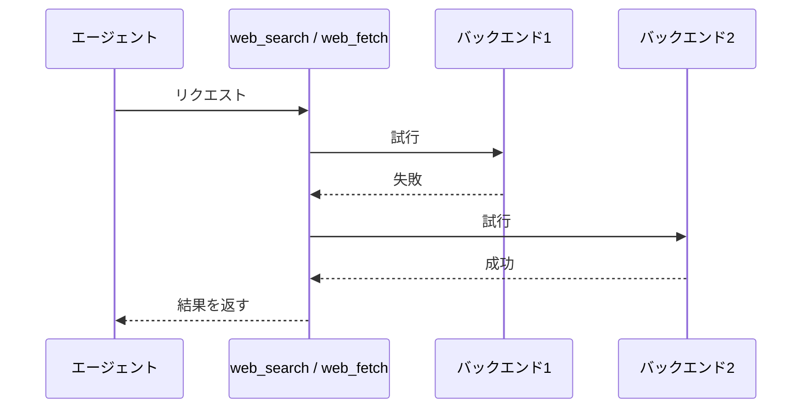

# web-search 拡張機能 Spec

pi に **Web検索** と **URL取得** の2つのツールを追加する。両ツールとも複数の取得先（バックエンド）を順に試し、最初に成功したものの結果を返す。

## ツール一覧

| ツール     | 入力          | 出力                             |
| ---------- | ------------- | -------------------------------- |
| web_search | 検索クエリ1つ ＋ lang（任意） | 検索結果（10件・Markdown）       |
| web_fetch  | URL1つ        | ページ本文（Markdown）＋タイトル |

## 共通のフォールバック挙動



全バックエンドが失敗した場合、ツールは例外となりエージェントへエラーとして伝わる。結果本文は返さない。
ツールが例外となる場合でも、TUIの結果行には試したすべてのバックエンドについて `✗ <バックエンド> - "<エラー>"` を1行ずつ出力する。

## バックエンドの順序とタイムアウト

1バックエンドあたりの最大待ち時間は全バックエンド一律 **15秒**。

### web_search のバックエンド

| 順序 | バックエンド         |
| ---- | -------------------- |
| 1    | openserp(google)     |
| 2    | openserp(duckduckgo) |
| 3    | openserp(bing)       |
| 4    | markdown.new         |

### web_fetch のバックエンド

| 順序 | バックエンド |
| ---- | ------------ |
| 1    | trafilatura  |
| 2    | Jina Reader  |
| 3    | md.dhr.wtf   |

## クールダウン

web_search / web_fetch のいずれにもクールダウンを設けない。過去のリクエストで失敗したバックエンドも、次のリクエストでは通常どおり記載された順序で試行する。

## 言語ヒント（web_search のみ）

`lang`（任意）を指定すると、openserp バックエンドに `--lang` を渡す（例: `EN`, `DE`, `JA`）。markdown.new には伝わらず無視される。未指定時は openserp 既定の挙動になる。

## 表示（TUI）

### コール行（実行開始時）

ツール名に続けて入力を記載：`web_search - "<クエリ>"`（`lang` 指定時は末尾に ` [lang=<lang>]`）/ `web_fetch - "<URL>"`。

### 結果行（実行完了時）

成功した場合は、試したバックエンドごとに1行ずつ出力し、成功した時点で終了する。全バックエンドが失敗した場合は、例外として扱いながらも、試したすべてのバックエンドの失敗行を出力する。先頭に成否マーク（`✓` / `✗`）、続けてバックエンド名。web_fetch 成功時は `-` で区切ってタイトルを続ける（タイトルがある場合）。

| 状態 | 出力 |
| ---- | ---- |
| 成功（web_search） | `✓ <バックエンド>` |
| 成功（web_fetch、タイトルあり） | `✓ <バックエンド> - "<タイトル>"` |
| 成功（web_fetch、タイトルなし） | `✓ <バックエンド>` |
| 失敗 | `✗ <バックエンド> - "<エラー>"` |

例（web_search で google/duckduckgo が失敗し bing が成功）：

```
web_search - "<クエリ>"
✗ openserp(google) - "google search: captcha detected"
✗ openserp(duckduckgo) - "duckduckgo search: timeout."
✓ openserp(bing)
```

## 環境変数

| 変数         | 影響                                                                |
| ------------ | ------------------------------------------------------------------- |
| JINA_API_KEY | 設定すると Jina Reader が認証付きリクエストになる（未設定でも動作） |
