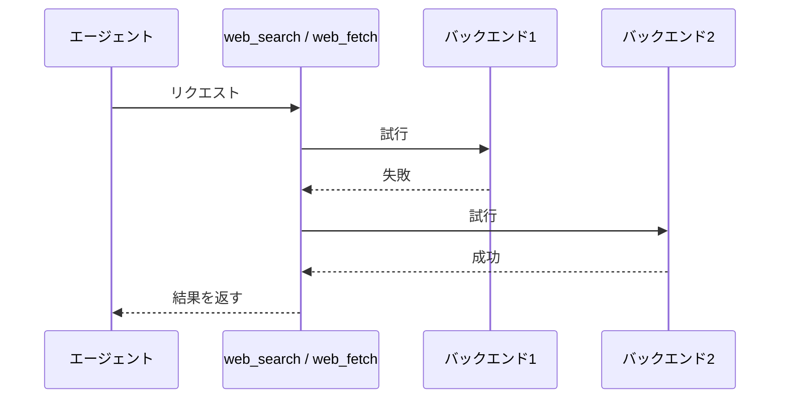

# web-search 拡張機能 Spec

pi に **Web検索** と **URL取得** の2つのツールを追加する。両ツールとも複数の取得先（バックエンド）を順に試し、最初に成功したものの結果を返す。

## ツール一覧

| ツール     | 入力          | 出力                             |
| ---------- | ------------- | -------------------------------- |
| web_search | 検索クエリ1つ ＋ lang（任意） | 検索結果（最大10件・Markdown）       |
| web_fetch  | URL1つ        | ページ本文（Markdown）＋タイトル |

## 同一ツールのリクエスト順序

同一ツールへの複数リクエストは、受付順に1件ずつバックエンド処理を開始する。先行リクエストが成功または失敗して完了するまで、後続リクエストはバックエンドへアクセスしない。

| 同時に受け付けたリクエスト | バックエンド処理の開始 |
| --- | --- |
| web_search と web_search | 先行リクエストの完了後に後続リクエスト |
| web_fetch と web_fetch | 先行リクエストの完了後に後続リクエスト |
| web_search と web_fetch | 両リクエストがそれぞれ開始可能 |

## 共通のフォールバック挙動



バックエンドが空の本文を返した場合も失敗として扱い、次のバックエンドへフォールバックする。

全バックエンドが失敗した場合、ツールは例外となりエージェントへエラーとして伝わる。結果本文は返さない。
ツールが例外となる場合でも、TUIの結果行には試したすべてのバックエンドについて `✗ <バックエンド> - "<エラー>"` を1行ずつ出力する。

## バックエンドの順序とタイムアウト

1バックエンドあたりの最大待ち時間は全バックエンド一律 **15秒**。ただし camofox+trafilatura は、サーバーへの HTTP 操作（サーバー起動待ちを含む）と trafilatura 変換の各段に 15秒を適用する。

### web_search のバックエンド

| 順序 | バックエンド         |
| ---- | -------------------- |
| 1    | openserp(bing)       |
| 2    | openserp(duckduckgo) |
| 3    | openserp(google)     |
| 4    | markdown.new         |

### openserp のブラウザ起動

openserp は Chrome を起動して検索するが、nix 由来の Chrome は NixOS 以外のホストで SUID sandbox エラーになり起動に失敗する。そのため拡張同梱の `scripts/google-chrome-nosandbox`（`--no-sandbox` 付きで nix の Chrome を起動するラッパー）が存在するときは、openserp に `--browser-path` で指定する。ラッパーが存在しない環境では指定せず、openserp 既定のブラウザ探索に従う。

### web_fetch のバックエンド

バックエンドの構成は URL が Reddit 投稿パーマリンク（§Reddit バックエンド）かどうかで変わる。Reddit 投稿パーマリンクでは Reddit バックエンドのみを試行し、汎用バックエンドへのフォールバックは行わない。

| 条件（URL） | バックエンド順序 |
| ----------- | ---------------- |
| Reddit 投稿パーマリンク | Reddit のみ |
| その他      | trafilatura → camofox+trafilatura |

Reddit バックエンドが失敗した場合も通常どおりバックエンド失敗として扱い、web_fetch 全体が例外となる。

### 各バックエンドの取得方法

| バックエンド       | 取得方法                                                              |
| ------------------ | --------------------------------------------------------------------- |
| trafilatura        | trafilatura 自身のダウンローダで URL を直接取得                        |
| camofox+trafilatura | camofox-browser サーバーで描画した DOM を trafilatura で Markdown 化（§camofox+trafilatura バックエンド参照） |
| Reddit             | §Reddit バックエンド参照                                               |

## camofox+trafilatura バックエンド

常駐する camofox-browser サーバー（REST API）でページを描画し、得られた HTML を trafilatura で Markdown 化する。JavaScript での描画が必要なページや、Bot 検出で素の HTTP 取得が弾かれるページの受け皿。

### サーバー

| 項目             | 値                                 |
| ---------------- | ---------------------------------- |
| 既定の接続先     | `http://127.0.0.1:9377`            |
| 接続先の変更     | 環境変数 `CAMOFOX_BASE_URL`        |
| サーバー実行形式 | `npx @askjo/camofox-browser@1.14.0` |

リクエストのたびにサーバーのヘルスチェック（`GET /health`）を行う。成功しないときはサーバーをバックグラウンドで起動し、ヘルスチェックが成功するまで待ってから処理を続ける。起動時に拡張が設定する環境変数は次のとおりで、利用者の環境変数があればそちらを優先し、それ以外の環境変数も引き継ぐ。

| 変数                            | 設定値    | 意味                                   |
| ------------------------------- | --------- | -------------------------------------- |
| `CAMOFOX_BIND_HOST`             | `127.0.0.1` | ローカルホスト以外へのバインドを防ぐ   |
| `CAMOFOX_CRASH_REPORT_ENABLED`  | `false`   | テレメトリ送信を無効化する             |

すでにヘルスチェックが成功するサーバーがあるときは起動しない。複数の pi セッションが同時に起動を試みても、サーバー側のポート確保により1つだけが残る。タイムアウトまでにヘルスチェックが成功しない場合はバックエンドの失敗となるが、起動したサーバープロセスは残るため、次のリクエストでは成功しうる。

### 取得経路

1. タブを作成して URL へ移動する（`userId=pi`・`sessionKey=web-fetch`。userId は全リクエストで共通のため、cookie などのセッション状態は web_fetch の利用全体で共有される）
2. 描画済み DOM（`document.documentElement.outerHTML`）を取得する
3. タブを閉じる（成否に関わらず）
4. HTML を trafilatura で Markdown 化する

## Reddit バックエンド

Reddit 投稿パーマリンクを、Reddit 公式の匿名アクセス用エンドポイントから取得する。投稿ページ HTML は JavaScript シェルでスクレイピング系バックエンドが抽出できないため、この専用経路のみを使う。

対象 URL は `https://<host>/r/<subreddit>/comments/<投稿ID>/[<slug>]` 形式とする。`<host>` は `reddit.com`、または `*.reddit.com` に一致するサブドメイン（ホスト名の末尾一致。`www.reddit.com`・`old.reddit.com` 等を含む）とする。末尾スラッシュの有無は問わない。それ以外の Reddit URL（サブレディット一覧・ユーザーページ等）は対象外とし、Reddit バックエンドを構成しない。

### 取得経路

次の順に試行し、成功した時点で以降を省略する。

1. 投稿パーマリンクに `.rss` を付けた Atom フィード（コメント上限 500 件・top ソート指定）
2. `embed.reddit.com` の埋め込みページ（フィードが 429 等で失敗したとき）
3. `reddit.com/oembed`

すべて失敗した場合は Reddit バックエンドの失敗とし、web_fetch 全体が例外となる。

### 出力（Markdown）

| 要素                     | 内容                                                                 |
| ------------------------ | -------------------------------------------------------------------- |
| タイトル・投稿者・パーマリンク | 取得した投稿のもの                                           |
| 投稿本文                 | フィード配信範囲の本文を Markdown 化したもの                          |
| コメント                 | top ソートで最大約 500 件を `### N. <投稿者>` 形式で列挙              |
| 注記                     | スコア・返信階層は取得できないこと。フィード失敗時にコメント本文が無いこと |

非公開・削除済み・年齢制限の投稿は取得できず、通常のバックエンド失敗として扱う。

結果行のタイトルは投稿タイトルを使い、Reddit ページシェルの汎用タイトル（例: `"Reddit - Dive into anything"`）は使わない。

## クールダウン

web_search / web_fetch のいずれにもクールダウンを設けない。過去のリクエストで失敗したバックエンドも、次のリクエストでは通常どおり記載された順序で試行する。

## 言語ヒント（web_search のみ）

`lang`（任意）を指定すると、openserp バックエンドに `--lang` を渡す（例: `EN`, `DE`, `JA`）。markdown.new には伝わらず無視される。未指定時は openserp 既定の挙動になる。

## 表示（TUI）

### コール行（実行開始時）

ツール名に続けて入力を記載：`web_search - "<クエリ>"`（`lang` 指定時は末尾に ` [lang=<lang>]`）/ `web_fetch - "<URL>"`。

### 結果行（実行完了時）

成功した場合は、試したバックエンドごとに1行ずつ出力し、成功した時点で終了する。全バックエンドが失敗した場合は、例外として扱いながらも、試したすべてのバックエンドの失敗行を出力する。先頭に成否マーク（`✓` / `✗`）、続けてバックエンド名。web_fetch 成功時は `-` で区切ってタイトルを続ける（タイトルがある場合）。

| 状態 | 出力 |
| ---- | ---- |
| 成功（web_search） | `✓ <バックエンド>` |
| 成功（web_fetch、タイトルあり） | `✓ <バックエンド> - "<タイトル>"` |
| 成功（web_fetch、タイトルなし） | `✓ <バックエンド>` |
| 失敗 | `✗ <バックエンド> - "<エラー>"` |

web_fetch のタイトルは、取得済みの本文（Markdown）の見出しから取り出したものだけを使い、タイトルのためのネットワーク再取得は行わない。見出しは `# <タイトル>`（h1）に加えて、`## <数字>. <タイトル>`・`### <数字>. <タイトル>` の形式（`^#{2,3} \d+\.` に一致する見出し）もタイトルとして扱う。本文からタイトルを取り出せない場合は、タイトルなしとして扱う。

openserp バックエンドの失敗行の `<エラー>` は、openserp の stderr にある `Error:` で始まる行（複数あれば最後）から `Error:` プレフィックスを除いたものとする。該当行がなければ、発生したエラーの元のメッセージを使う。

例（web_search で bing/duckduckgo が失敗し google が成功）：

```
web_search - "<クエリ>"
✗ openserp(bing) - "bing search: timeout."
✗ openserp(duckduckgo) - "duckduckgo search: timeout."
✓ openserp(google)
```

## 環境変数

| 変数             | 影響                                                                    |
| ------------ | ------------------------------------------------------------------- |
| CAMOFOX_BASE_URL | camofox+trafilatura バックエンドの接続先（既定 `http://127.0.0.1:9377`） |
