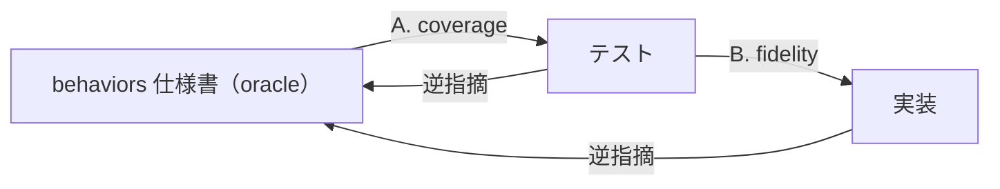

# Behaviors Conformance Audit

behaviors 仕様書（to-behaviors の出力）を **oracle（真実の基準）** とし、既存のテストと実装がそれに適合しているかを監査する。出力はギャップレポート（指摘のみ）。テストも本番コードも編集しない、実行もしない。

## 監査の3軸

3者（behaviors / テスト / 実装）の間を、矢印の向きごとに3つの軸で照合する。



| 軸 | 照合する2者 | 問うこと | 出力する種別 |
| --- | --- | --- | --- |
| **A. coverage** | behaviors ↔ テスト | 振る舞いに対応テストが在るか・仕様書と同じ順序で並んでいるか | 漏れ / 過剰 / 順序ズレ |
| **B. fidelity** | テスト ↔ 実装 | テストは本当に振る舞いを叩いているか | 偽陽性 / 主語ズレ |
| **逆指摘** | 実装・テスト → behaviors | behaviors は一意か・網羅的か | 曖昧 / 欠落 |

behaviors を第一 oracle とするが、実装/テスト側から behaviors の曖昧さ・欠落も逆指摘する（両方向）。behaviors 仕様書が静的で完璧であることは前提としない — 監査の過程で仕様書側の不備も浮かび上がる。

## 入力

3つ必須:

1. **behaviors 仕様書**（`behaviors/<feature-name>.md` または `BEHAVIORS.md`）。マトリクステーブル・状態遷移図・シーケンス図で構造化済みの前提。
2. **既存テスト**。`tests/` 配下を検出して読む。FW 混在（vitest/pytest 等）も許容する。
3. **既存本番コード**。テストが参照する実装。`src/` `lib/` 等の慣習を検出して読む。

いずれかが欠けていれば、監査ではなくその旨を返して止まる。実装詳細（関数/クラス名・DB・エンドポイント）は behaviors 作成時点で切り捨て済みのため、behaviors に書かれていないものを推測で補完しない。足りなければ質問するか、情報不足として指摘する。

## 振る舞いの分解（照合の単位）

behaviors 仕様書の視覚的構造を振る舞いの単位へ分解し、それぞれへ対応テストが在るか・忠実かを問う:

| behaviors の構造 | 振る舞いの単位 | Given / When / Then の読み替え |
| --- | --- | --- |
| **マトリクステーブル** | 1行 = 1振る舞い | 列を Given（条件・状態・入力）・When（操作）・Then（結果）へ読み替える。結果を変える行は別振る舞い。 |
| **状態遷移図**（`stateDiagram-v2`） | 1遷移 = 1振る舞い | `A --> B: イベント` を Given=A / When=イベント / Then=B にする。 |
| **シーケンス図**（`sequenceDiagram`） | 観測点群 | 時系列の観測可能な検証点を振る舞い単位へ割り当てる（1シーケンス=1振る舞い、または観測点ごとに分割）。1テスト=1振る舞いの原則に従う。 |

## A. coverage（behaviors ↔ テスト）

behaviors を oracle にしてテストを問う:

- **漏れ（blocking）**: behaviors にある振る舞いでテストが存在しないもの。実装はあっても検証が無ければ漏れ。
- **過剰（informational）**: テストが検証しているが behaviors に無い振る舞い。実装詳細への過干渉、または behaviors への追記候補。過剰 = 即バグではなく「behaviors に書くべきか削るべきか」の判断材料。

### 順序の一致

behaviors に現れる振る舞いの順序を基準に、対応するテストパターンも同じ順序で並んでいるか確認する。レビュー時に仕様書とテストを上下に見比べたとき、対応箇所が同じ位置関係になることを目的とする。

- behaviors の構造ごとに、文書上の出現順を振る舞いの順序とする。マトリクスは行順、状態遷移図は遷移の記載順、シーケンス図は観測点の時系列順。
- 対応テストは、同じ Feature / `describe` / テストクラス内で behaviors と同じ順序に置く。
- behaviors に対応しない追加テストは、対応テスト群の後ろに置く。対応テストの間に割り込んでいる場合も順序ズレとして指摘する。
- 対応関係と内容が正しくても順序だけが異なる場合は、**順序ズレ（informational）** とする。

## B. fidelity（テスト ↔ 実装）

テストの Then と実装の責務を実装を読みながら問う（テストだけでは判定できない）:

- **偽陽性（blocking）**: テストが通るのに振る舞いを検証していないもの。
  - モック/stub で実装を叩いていない（依存を潰して結果を固定している）
  - Then が `expect(true).toBe(true)` 的な恒真
  - テストが通る経路と、behaviors が要求する経路が違う
- **主語のズレ（blocking）**: Then に置く値の主語が実装でないもの。Then には実装が保証する値のみ置ける。
  - 例: 「検索すると10件返る」— 10件は外部バックエンドが決める（実装の責務外）。実装が保証できる形（「件数10を指定してバックエンドへ問い合わせる」）を主語にすべき箇所として指摘する。

## 逆指摘（実装/テスト → behaviors）

behaviors を第一 oracle とするが、監査の過程で以下が見えた場合は behaviors 側の不備として指摘する:

- **曖昧（informational）**: 複数テスト/実装が異なる解釈で動いている箇所。仕様書が一意に定まっていない。
- **欠落（informational）**: 実装やテストが存在するが、behaviors に対応する振る舞い記述が無い。

過剰（A）との切り分け: 実装/テストの意図が明白で behaviors 側に書き漏れと思える場合は欠落（逆指摘）、テストが実装詳細に過干渉しているだけなら過剰（A）。どちらも informational。

これらは behaviors 仕様書の修正を促す指摘であり、出力は指摘のみ。仕様書自体は編集しない。

## 種別マトリクス

指摘の全種別を一覧（軸 × 重要度）:

| 種別 | 軸 | 重要度 | 一言でいうと |
| --- | --- | --- | --- |
| **漏れ** | coverage | blocking | behaviors にある振る舞いにテストが無い |
| **過剰** | coverage | informational | テストが behaviors 外の振る舞いを検証している |
| **順序ズレ** | coverage | informational | 対応テストが behaviors と同じ順序で並んでいない |
| **偽陽性** | fidelity | blocking | 通るが振る舞いを検証していない（モック潰し・恒真・経路違い） |
| **主語ズレ** | fidelity | blocking | Then の主語が実装でなく外部依存値 |
| **曖昧** | 逆指摘 | informational | behaviors が一意に定まっていない |
| **欠落** | 逆指摘 | informational | 実装/テストがあるが behaviors に記述が無い |

## 出力形式

ギャップレポート。指摘のみ、編集しない。各指摘を次の1行フォーマットで:

```
- [軸 / 種別 / 重要度] 場所 — 指摘内容（一文）
```

| 項目 | 内容 |
| --- | --- |
| **軸** | coverage / fidelity / 逆指摘 |
| **種別** | 漏れ / 過剰 / 順序ズレ / 偽陽性 / 主語ズレ / 曖昧 / 欠落 |
| **重要度** | blocking / informational |
| **場所** | behaviors の該当箇所 + テスト/実装の該当箇所（ファイル:行 or テストタイトル） |
| **指摘内容** | 一文で。修正案は出さない（ユーザーが判断する）。 |

指摘が0件の場合は「適合している」と明示して終わる。

## セルフチェック

監査を終える前に、以下をすべて満たすか。1つでも漏れていれば続きを行う:

- [ ] behaviors の構造（マトリクス/状態遷移/シーケンス）のすべての振る舞いを、テストの有無まで確認したか
- [ ] 漏れ（coverage）をすべて挙げたか
- [ ] behaviors の振る舞い順と、対応テストの順序が一致しているか
- [ ] fidelity で、モック/stub で実装を叩いていないテストを見逃していないか
- [ ] Then の主語が実装でないテスト（外部依存値を claim）を見つけたか
- [ ] 過剰（coverage）のうち、behaviors 不備（逆指摘）に切り分けるべきものを見逃していないか
- [ ] 指摘に場所と種別と重要度が付いているか

## 完成イメージ

入力（behaviors のマトリクス抜粋）:

| 入力           | 状態      | 結果                                     |
| -------------- | --------- | ---------------------------------------- |
| 未登録のメール | 初回      | 登録成功、その後サインイン可能           |
| 既存のメール   | 2回目以降 | 拒否（状態409・エラーコード email_taken）|
| 空文字/@なし   | 任意      | 拒否（状態400・エラーコード invalid_email）|

既存テスト（vitest）:

```ts
describe("ユーザー登録", () => {
  it("未登録のメールアドレスで登録すると、その後サインインできる", () => {
    /* 本物のDBへ書き込み、サインインAPI を叩いて検証 */
  });
  it("既存のメールアドレスで登録すると状態409になる", () => {
    /* バックエンドをモックし、常に409を返すよう固定 */
  });
});
```

出力（ギャップレポート）:

- **[coverage / 漏れ / blocking]** behaviors「空文字/@なし → 状態400・invalid_email」— 対応するテストが存在しない。
- **[fidelity / 主語ズレ / blocking]** 既存メール登録テスト — behaviors は「状態409・エラーコード email_taken」を要求するが、テストは状態409のみ検証し email_taken を含まない。Then の具体値が欠落。
- **[fidelity / 偽陽性 / blocking]** 既存メール登録テスト — バックエンドをモックで409固定にしており、実装のエラーマッピング経路を叩いていない。通っても実装の振る舞いを検証していない。
- 残りの振る舞いは適合。

## このスキルがやらないこと

- テストを書き換えない・追加しない（指摘のみ）。
- 本番コード（src/ 等）を編集しない。
- behaviors 仕様書を編集しない（不備は指摘として出すだけで、修正しない）。
- テストを実行しない（通る/通らないは実装とテストを読んで判定する）。
- behaviors に無い実装詳細を推測で補完しない。足りなければ質問するか、情報不足として指摘する。
- コードの可読性・設計品質を審査しない（readable-code / ponytail の領域）。本スキルは振る舞いの適合性のみを扱う。
