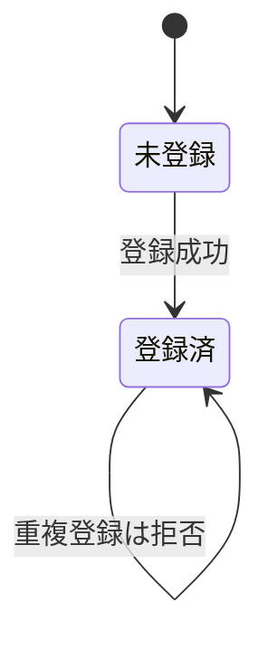

# To Behaviors

合意した要件を **behaviors 仕様書** に変換する。behaviors ＝ ユーザーが観測可能な振る舞い。オーナー（人間）はこの仕様書だけ読んで go/no-go を出し、実装コードの詳細は読まない前提で動く。ゆえに仕様書は実装に依存せず、ユーザーに影響する振る舞いのみを、視覚的に構造化して記載する。これが本スキルの出力契約の核である。

## 記載基準（核心）

ユーザーに影響する behaviors のみ記載する。

- **書く**：ユーザーが直接・間接に観測できるもの（入出力・状態・エラー・振る舞い・パフォーマンス特性）
- **書かない**：観測不能な内部最適化（結果が同じもの）
- 内部処理でも結果に現れるなら書く

## 入力

会話で合意した内容から **ユーザーが観測する振る舞いのみ** を抽出する。実装の詳細（関数/クラス名・モジュール構造・DBスキーマ・内部データ構造・APIエンドポイント/シグネチャ）は切り捨てる。

要件が曖昧・欠落している場合はユーザーへ追加質問する。**観測可能な具体値が定まらない振る舞いは推測せず質問に戻る。**

## フォーマット

- markdown で記述する
- **テーブル・mermaid で視覚的に**。フラットな自然言語による分岐羅列は避ける
- 構造を図に預ける —
  - 分岐 ＝ マトリクステーブル
  - 状態遷移 ＝ 状態遷移図（mermaid `stateDiagram-v2`）
  - 時系列 ＝ シーケンス図（mermaid `sequenceDiagram`）

## 配置

- **複数機能**：`behaviors/<feature-name>.md`
- **単一機能・小規模**：`BEHAVIORS.md` 1個
- **混在禁止**。1プロジェクトでどちらかに統一する。インデックスが必要なら `behaviors/README.md`
- 機能の切り方は **ユーザーが認識する単位**。実装のモジュール境界で切らない
- 既存の配置（`behaviors/` or `BEHAVIORS.md`）があれば、それに従って追記する

## セルフチェック

各セクションを書き終えたら、次のすべてを満たすか。1つでも満たさなければ修正するかユーザーへ質問する:

- [ ] 記載内容はすべてユーザーが観測可能な振る舞い（入出力・状態・エラー・振る舞い・パフォーマンス特性）か
- [ ] 観測不能な内部最適化（結果が同じもの）を書いていないか
- [ ] 実装の内部構造（クラス名・DBスキーマ・モジュール構成・APIシグネチャ）が紛れ込んでいないか
- [ ] 分岐はマトリクステーブル、状態遷移は状態遷移図、時系列はシーケンス図に預けているか（フラットな自然言語の羅列でないか）
- [ ] 機能の切り方がユーザー認識単位で、実装モジュール境界でないか
- [ ] 配置がプロジェクト内で統一されているか（`behaviors/` と `BEHAVIORS.md` の混在がないか）
- [ ] 要件文書と別管理せず、behaviors が唯一の仕様ソースになっているか

## 完成イメージ

マトリクステーブル（分岐を預ける）:

```markdown
### メールアドレス登録の結果

| 入力              | 状態       | 結果                                    |
| ----------------- | ---------- | --------------------------------------- |
| 未登録のメール    | 初回       | 登録成功、その後サインイン可能           |
| 既存のメール      | 2回目以降  | 拒否（状態409・エラーコード email_taken）|
| 空文字 / `@` なし | 任意       | 拒否（状態400・エラーコード invalid_email）|
```

状態遷移図（mermaid に預ける）:



## このスキルがやらないこと

- 実装コード（src/ 等）は一切触らない。
- テストは書かない。テストは AI の収束作業用で、仕様書とは別物。
- 要件文書・設計書を別ファイルで作らない。behaviors ＝ 唯一の仕様ソース。
- 観測不能な内部最適化（リファクタ等価・アルゴリズム選択など）を記載しない。
- 乖離検知・レビュー手順など運用ルールは、このスキルの対象外。
