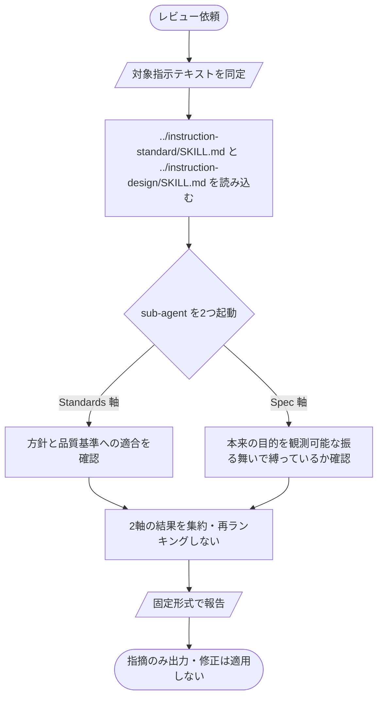

# Instruction Review

AI に与える指示テキストのうち、**ファイルとして残るもの**（AGENTS.md / CLAUDE.md / SKILL.md / プロンプトテンプレート等）をレビューで収束させる。書いた本人のコンテキストから離れ、別コンテキストで2軸を確認する。使い捨てプロンプト（チャットで1回限り）は対象外 — こちらは instruction-design の Verify で自己チェックする。

## 入力

| 入力 | 必須/任意 | 内容 |
| --- | --- | --- |
| 対象指示テキスト | 必須 | ファイルパスまたはテキスト本文 |
| 本来の目的 | 任意 | Spec 軸の評価基準。欠如時は対象テキストから書かれている目的を推定し、推定不能な項目は skip 報告する |

## 実行プロセス



1. **対象を同定** — 残る指示テキスト（ファイル）か確認する。使い捨てプロンプト・コード・spec・設定ファイルは対象外。
2. **基準を読み込む** — `../instruction-standard/SKILL.md`（品質基準: Forbidden / Output Contract / Verify）と `../instruction-design/SKILL.md`（書き方の方針: Trigger / Allowed / Decision Ladder / 地図 / 自己完結 等）を read する。
3. **2軸で評価** — sub-agent を2つ独立コンテキストで起動し、書いた本人のバイアスを抜く。レビュー実行コンテキストには書く時の判断経緯を持ち込まない。
   - **Standards 軸** — 対象テキストが instruction-standard の品質基準と design の書き方の方針を満たすか。違反ごとに出典（instruction-standard / design のセクション名）と対象テキストの該当箇所を引用する。
   - **Spec 軸** — 対象テキストが本来の目的を観測可能な振る舞いとして縛っているか。目的が入力にない場合は対象テキストから推定し、推定不能な項目は skip 報告する。
4. **集約して報告** — 2軸を併記し、軸間で統合・再ランキングしない。修正は適用せず、指摘のリストアップまで。

## 出力形式

2軸を併記する。指摘がない軸は「指摘なし」と記載する。

````markdown
## Standards

[instruction-standard / design の方針への違反。出典（セクション名）と対象テキストの該当箇所を引用]

## Spec

[本来の目的に対する観測可能な振る舞いの欠落・ズレ・過剰。目的の根拠を明示]

## サマリ

- Standards: <指摘数>件（最重度: <内容>）
- Spec: <指摘数>件（最重度: <内容>）
````

## 境界（やらないこと）

- **修正を適用しない** — 指摘のリストアップまで。対象テキストの編集は依頼元が行う。
- **方針を再定義しない** — `../instruction-design/SKILL.md` と `../instruction-standard/SKILL.md` を正とする。方針自体の変更提案は出さない。
- **コード・spec・設定は対象外** — 残る指示テキスト以外は review しない。
- **使い捨てプロンプトは対象外** — 収束の必要がないため design の Verify で完結する。
