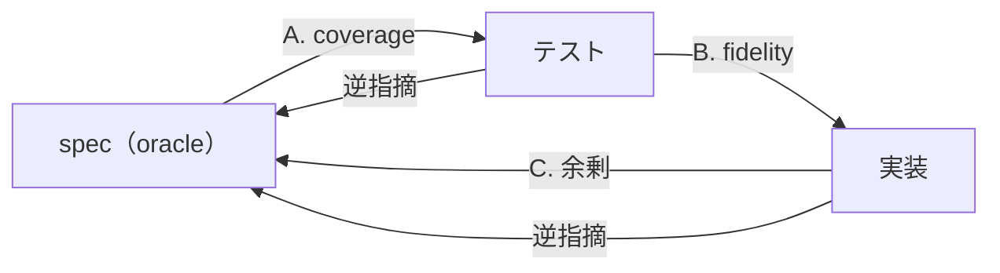

# SDD Review

spec を **oracle（真実の基準）** とし、既存のテストと実装がそれに適合しているかをレビューする。出力はギャップレポート（指摘のみ）。spec、テスト、本番コードを編集せず、テストも実行しない。

## レビューの4軸

3者（spec / テスト / 実装）の間を、矢印の向きごとに4つの軸で照合する。spec が oracle だが、**実装起点の照合（C. 余剰）を独立した軸として必ず回す** — spec 起点だけでは「spec にない実装」が見えない。



| 軸 | 照合する2者 | 問うこと | 出力する種別 |
| --- | --- | --- | --- |
| **A. coverage** | spec ↔ テスト | 振る舞いに対応テストが在るか・仕様書と同じ順序で並んでいるか | 漏れ / 過剰 / 順序ズレ |
| **B. fidelity** | テスト ↔ 実装 | テストは本当に振る舞いを叩いているか | 偽陽性 / 主語ズレ |
| **C. 余剰** | 実装 → spec | 実装の観測可能な振る舞いはすべて spec に書いてあるか | 余剰実装 |
| **逆指摘** | 実装・テスト → spec | spec は一意か | 曖昧 |

spec を第一 oracle とするが、実装/テスト側から spec の曖昧さも逆指摘する（両方向）。spec が静的で完璧であることは前提としない — レビューの過程で仕様書側の不備も浮かび上がる。「実装にあって spec にない」は余剰（C）で実装起点に網羅的に拾う。

## 入力

3つ必須:

1. **spec**（`spec/<feature-name>.md` または `SPEC.md`）。マトリクステーブル・状態遷移図・シーケンス図で構造化済みの前提。
2. **既存テスト**。`tests/` 配下を検出して読む。FW 混在（vitest/pytest 等）も許容する。
3. **既存本番コード**。テストが参照する実装。`src/` `lib/` 等の慣習を検出して読む。

いずれかが欠けていれば、レビューを完了せず、その旨を返して止まる。実装詳細（関数/クラス名・DB・エンドポイント）は spec で切り捨てられているため、spec に書かれていないものを推測で補完しない。足りなければ質問するか、情報不足として指摘する。

## 振る舞いの分解（照合の単位）

spec の視覚的構造を振る舞いの単位へ分解し、それぞれへ対応テストが在るか・忠実かを問う:

| spec の構造 | 振る舞いの単位 | Given / When / Then の読み替え |
| --- | --- | --- |
| **マトリクステーブル** | 1行 = 1振る舞い | 列を Given（条件・状態・入力）・When（操作）・Then（結果）へ読み替える。結果を変える行は別振る舞い。 |
| **状態遷移図**（`stateDiagram-v2`） | 1遷移 = 1振る舞い | `A --> B: イベント` を Given=A / When=イベント / Then=B にする。 |
| **シーケンス図**（`sequenceDiagram`） | 観測点群 | 時系列の観測可能な検証点を振る舞い単位へ割り当てる（1シーケンス=1振る舞い、または観測点ごとに分割）。1テスト=1振る舞いの原則に従う。 |

### 実装の分解（C. 余剰用）

実装起点で照合するため、実装から観測可能な振る舞いを抽出する。spec と同じ「観測可能」の基準:

- **入口を拾う** — 公開エンドポイント・CLIコマンド・エクスポート関数・UI 要素など、ユーザーが触れる起点
- **入口ごとに分岐を拾う** — 入力・状態に対する結果の分岐（正常系・異常系・エラーコード・出力フォーマット）
- **拾わない** — 観測不能な内部最適化（アルゴリズム選択・リファクタ等価・キャッシュ等）。結果が同じなら spec に書かなくてよい

抽出した各振る舞いが spec のどこに対応するか確認する。対応する記述が無ければ **余剰実装（blocking）**。

## A. coverage（spec ↔ テスト）

spec を oracle にしてテストをレビューする:

- **漏れ（blocking）**: spec にある振る舞いでテストが存在しないもの。実装はあっても検証が無ければ漏れ。
- **過剰（informational）**: テストが検証しているが spec に無い振る舞い。実装詳細への過干渉、または spec への追記候補。過剰 = 即バグではなく「spec に書くべきか削るべきか」の判断材料。

### 順序の一致

spec に現れる振る舞いの順序を基準に、対応するテストパターンも同じ順序で並んでいるか確認する。レビュー時に仕様書とテストを上下に見比べたとき、対応箇所が同じ位置関係になることを目的とする。

- spec の構造ごとに、文書上の出現順を振る舞いの順序とする。マトリクスは行順、状態遷移図は遷移の記載順、シーケンス図は観測点の時系列順。
- 対応テストは、同じ Feature / `describe` / テストクラス内で spec と同じ順序に置く。
- spec に対応しない追加テストは、対応テスト群の後ろに置く。対応テストの間に割り込んでいる場合も順序ズレとして指摘する。
- 対応関係と内容が正しくても順序だけが異なる場合は、**順序ズレ（informational）** とする。

## B. fidelity（テスト ↔ 実装）

テストの Then と実装の責務を実装を読みながらレビューする（テストだけでは判定できない）:

- **偽陽性（blocking）**: テストが通るのに振る舞いを検証していないもの。
  - モック/stub で実装を叩いていない（依存を潰して結果を固定している）
  - Then が `expect(true).toBe(true)` 的な恒真
  - テストが通る経路と、spec が要求する経路が違う
- **主語のズレ（blocking）**: Then に置く値の主語が実装でないもの。Then には実装が保証する値のみ置ける。
  - 例: 「検索すると10件返る」— 10件は外部バックエンドが決める（実装の責務外）。実装が保証できる形（「件数10を指定してバックエンドへ問い合わせる」）を主語にすべき箇所として指摘する。

## C. 余剰（実装 → spec）

実装を読んで抽出した観測可能な振る舞い（前述「実装の分解」）が、spec に対応する記述を持つかをレビューする。**spec 起点の coverage（A）では「spec にない実装」は見えない。この実装起点の照合を独立して必ず回すことが、spec 外実装の1回検出に直結する。**

- **余剰実装（blocking）**: 実装にある観測可能な振る舞いが spec に書かれていない。レビューではこのギャップを指摘する。
  - エンドポイント・CLI・UI・公開関数など、ユーザーが触れる起点が spec に無い
  - 入力に対する結果の分岐（エラーコード・メッセージ・出力）が spec に無い
  - 「観測可能」なら blocking。観測不能な内部最適化は余剰に数えない（spec に書かなくてよい）

過剰（A）との切り分け: 過剰は「テストが spec 外を検証」、余剰は「実装が spec 外を実装」。過剰の根に実装の余剰があれば両方出るが、実装起点で網羅的に拾うのは余剰（C）の役割。spec の書き漏れ嫌疑（追記すべき）か実装の削除対象かは指摘には書かず、人間が判断する。

## 逆指摘（実装/テスト → spec）

spec を第一 oracle とするが、レビューの過程で以下が見えた場合は spec 側の不備として指摘する:

- **曖昧（informational）**: 複数テスト/実装が異なる解釈で動いている箇所。仕様書が一意に定まっていない。

これらは spec の修正を促す指摘であり、出力は指摘のみ。spec 自体は編集しない。

> 「実装/テストがあるが spec に記述が無い」は **C. 余剰（blocking）** として実装起点で網羅的に拾う。逆指摘（曖昧）とは別軸。

## 種別マトリクス

指摘の全種別を一覧（軸 × 重要度）:

| 種別 | 軸 | 重要度 | 一言でいうと |
| --- | --- | --- | --- |
| **漏れ** | coverage | blocking | spec にある振る舞いにテストが無い |
| **過剰** | coverage | informational | テストが spec 外の振る舞いを検証している |
| **順序ズレ** | coverage | informational | 対応テストが spec と同じ順序で並んでいない |
| **偽陽性** | fidelity | blocking | 通るが振る舞いを検証していない（モック潰し・恒真・経路違い） |
| **主語ズレ** | fidelity | blocking | Then の主語が実装でなく外部依存値 |
| **余剰実装** | 余剰 | blocking | 実装に観測可能な振る舞いがあるが spec に書かれていない |
| **曖昧** | 逆指摘 | informational | spec が一意に定まっていない |

## 出力形式

ギャップレポート。指摘のみ、編集しない。各指摘を次の1行フォーマットで:

```
- [軸 / 種別 / 重要度] 場所 — 指摘内容（一文）
```

| 項目 | 内容 |
| --- | --- |
| **軸** | coverage / fidelity / 余剰 / 逆指摘 |
| **種別** | 漏れ / 過剰 / 順序ズレ / 偽陽性 / 主語ズレ / 余剰実装 / 曖昧 |
| **重要度** | blocking / informational |
| **場所** | spec の該当箇所 + テスト/実装の該当箇所（ファイル:行 or テストタイトル） |
| **指摘内容** | 一文で。修正案は出さない（ユーザーが判断する）。 |

指摘が0件の場合は「適合している」と明示してレビューを終える。

## セルフチェック

レビューを終える前に、以下をすべて満たすか。1つでも漏れていれば続きを行う:

- [ ] **実装の観測可能な振る舞いをすべて抽出し、それぞれが spec に対応するか確認したか（spec 外実装 = 余剰を見逃していないか）** — spec 起点では見えないため必須
- [ ] spec の構造（マトリクス/状態遷移/シーケンス）のすべての振る舞いを、テストの有無まで確認したか
- [ ] 漏れ（coverage）をすべて挙げたか
- [ ] spec の振る舞い順と、対応テストの順序が一致しているか
- [ ] fidelity で、モック/stub で実装を叩いていないテストを見逃していないか
- [ ] Then の主語が実装でないテスト（外部依存値を claim）を見つけたか
- [ ] 指摘に場所と種別と重要度が付いているか

## 完成イメージ

入力（spec のマトリクス抜粋）:

| 入力           | 状態      | 結果                                     |
| -------------- | --------- | ---------------------------------------- |
| 未登録のメール | 初回      | 登録成功、その後サインイン可能           |
| 既存のメール   | 2回目以降 | 拒否（状態409・エラーコード email_taken）|
| 空文字/@なし   | 任意      | 拒否（状態400・エラーコード invalid_email）|

既存テスト（vitest）:

```ts
describe("ユーザー登録", () => {
  it("未登録のメールアドレスで登録すると、その後サインインできる", () => {
    /* 本物のDBへ書き込み、サインインAPI を叩いて検証 */
  });
  it("既存のメールアドレスで登録すると状態409になる", () => {
    /* バックエンドをモックし、常に409を返すよう固定 */
  });
});
```

既存実装（抜粋）:

```ts
export async function register(email: string) {
  if (!email.includes("@")) return { status: 400, code: "invalid_email" };
  if (await db.find(email)) return { status: 409, code: "email_taken" };
  await db.insert(email);
  await mailer.send(email, "confirm"); // ← spec に無い振る舞い
  return { status: 201 };
}
```

出力（ギャップレポート）:

- **[coverage / 漏れ / blocking]** spec「空文字/@なし → 状態400・invalid_email」— 対応するテストが存在しない。
- **[fidelity / 主語ズレ / blocking]** 既存メール登録テスト — spec は「状態409・エラーコード email_taken」を要求するが、テストは状態409のみ検証し email_taken を含まない。Then の具体値が欠落。
- **[fidelity / 偽陽性 / blocking]** 既存メール登録テスト — バックエンドをモックで409固定にしており、実装のエラーマッピング経路を叩いていない。通っても実装の振る舞いを検証していない。
- **[余剰 / 余剰実装 / blocking]** `register()` — 登録成功時に確認メールを送信するが、spec にこの振る舞いの記述が無い。
- 残りの振る舞いは適合。

## このスキルがやらないこと

- テストを書き換えない・追加しない（指摘のみ）。
- 本番コード（src/ 等）を編集しない。
- spec を編集しない（不備は指摘として出すだけで、修正しない）。
- テストを実行しない（通る/通らないは実装とテストを読んで判定する）。
- spec に無い実装詳細を推測で補完しない。足りなければ質問するか、情報不足として指摘する。
- コードの可読性・設計品質を審査しない（readable-code / ponytail の領域）。本スキルは振る舞いの適合性のみを扱う。
- レビュー中に spec、テスト、本番コードを編集しない。
