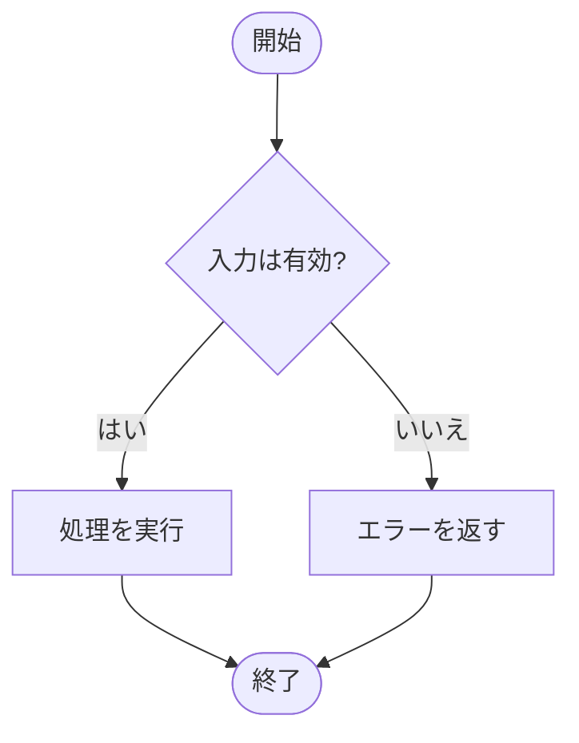
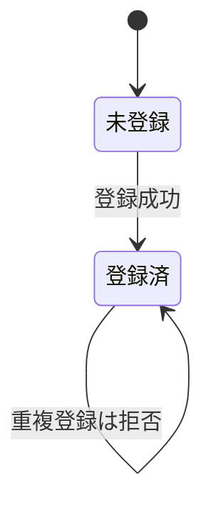

# SDD Spec

合意した要件から **spec（観測可能な振る舞いの仕様書）** を新規作成するか、既存の spec を修正・改善する。spec ＝ ユーザーが観測可能な振る舞いのみを記載したもの。オーナー（人間）はこの仕様書だけ読んで go/no-go を出し、実装コードの詳細は読まない前提で動く。ゆえに仕様書は実装に依存せず、ユーザーに影響する振る舞いのみを、視覚的に構造化して記載する。これが本スキルの出力契約の核である。

## 記載基準（核心）＝ spec の定義

spec とは **ユーザーが観測可能な振る舞いのみ** を記載したものである。これが spec を spec たらしめる唯一の制約であり、以下はその展開:

- **書く**：ユーザーが直接・間接に観測できるもの（入出力・状態・エラー・振る舞い・パフォーマンス特性）
- **書かない**：観測不能な内部最適化（結果が同じもの）
- 内部処理でも結果に現れるなら書く

## 独立した仕様書としての記述

spec は1ファイルで完結し、単独で読んで理解できること。読むために過去の仕様・要件文書・会話の履歴を前提としない。

- **現在形で書く** — 廃止・削除・変更前後・「新規に追加」などの履歴を書かない。spec が述べるのは「今どう振る舞うか」だけ。
- **比較で書かない** — 「A ではなく B」「parallel / chain は廃止」など、他の選択肢や過去形との対比で記述しない。振る舞いを肯定形で単独に述べる。
- **経緯を書かない** — 「ミニマル化のため」「リファクタの一環で」など、変更理由や意思決定の背景を書かない。それはコミットメッセージや ADR の役割。

既存 spec を修正するときも同じ。差分（何が変わったか）ではなく、書き直した後の姿をそのまま残す。

## 重複の排除（正規化）

各振る舞いは **1箇所にのみ** 書く（Single Source of Truth）。同じ振る舞いを複数のセクション・図・テーブルに重複して書かない。

- **1振る舞い1箇所** — ある振る舞いの定義は、いずれか1つの図/テーブル/段落にのみ置く
- **別角度から触れる場合は参照にする** — 例えば概要で「状態遷移は §状態遷移 の図の通り」と指すにとどめ、振る舞いを再掲しない
- **軸が違うなら切り分ける** — 似た内容が複数箇所に出るなら、軸（入力別/状態別/権限別 等）ごとに重複しないよう境界を切り直す
- **具体例・完成イメージは再掲してよい** — 同じファイル内で直近の具体例を示す目的の再掲は、定義の重複ではない

## 入力

会話で合意した内容から **ユーザーが観測する振る舞いのみ** を抽出する。実装の詳細（関数/クラス名・モジュール構造・DBスキーマ・内部データ構造・APIエンドポイント/シグネチャ）は切り捨てる。

既存の spec（`spec/<feature-name>.md` または `SPEC.md`）がある場合は、まず配置と内容を確認し、関連する既存ファイルを基準に修正・改善する。要件を満たすために既存の記載を置き換える必要がある場合も、別の仕様書を作らず同じファイルを更新する。

要件が曖昧・欠落している場合はユーザーへ追加質問する。**観測可能な具体値が定まらない振る舞いは推測せず質問に戻る。**

## フォーマット

- markdown で記述する
- **テーブル・mermaid で視覚的に**。フラットな自然言語による分岐羅列は避ける
- 構造を図に預ける —
  - 分岐 ＝ マトリクステーブル
  - 状態遷移 ＝ 状態遷移図（mermaid `stateDiagram-v2`）
  - 時系列 ＝ シーケンス図（mermaid `sequenceDiagram`）
  - 手続き（順序付きステップ）＝ フロー図（mermaid `flowchart`）

### mermaid 図の読みやすさ

図は一目で読めることが最優先:

- **1図1主題** — 複数の関心を1図に詰め込まない。分けられるなら分ける
- **ノード名は振る舞いを表す名詞/動詞句** — `S1` `nodeA` 等の無意味なIDにしない
- **矢印ラベルは短く** — 条件・イベント名のみ。長文は載せない
- **方向は内容に合わせる** — 状態遷移は `LR`、シーケンスは縦（既定）、フローは流れに合わせて `TD`/`LR`

### フロー図の形の規約

`flowchart` を使うときのノード形状。**分岐は必ずひし形** — 四角や丸で分岐を表現しない:

| 役割 | 形 | 記法 |
| --- | --- | --- |
| 開始 / 終了 | 丸（スタジアム） | `id([開始])` |
| 処理 | 四角 | `id[処理]` |
| 分岐（条件） | **ひし形** | `id{条件?}` |
| 入出力 | 平行四辺形 | `id[/入力/]` |



**分岐（条件で結果が変わる）は原則マトリクステーブルで預ける。** `flowchart` のひし形分岐は、手続きの途中で経路が分かれる場合のみ。条件→結果の表にできるものは表にする。

## 配置

- **複数機能**：`spec/<feature-name>.md`
- **単一機能・小規模**：`SPEC.md` 1個
- **混在禁止**。1プロジェクトでどちらかに統一する。インデックスが必要なら `spec/README.md`
- 機能の切り方は **ユーザーが認識する単位**。実装のモジュール境界で切らない
- 既存の配置（`spec/` または `SPEC.md`）があれば、その構成とファイルを維持して修正・改善する

## セルフチェック

各セクションを書き終えたら、次のすべてを満たすか。1つでも満たさなければ修正するかユーザーへ質問する:

- [ ] 記載内容はすべてユーザーが観測可能な振る舞い（入出力・状態・エラー・振る舞い・パフォーマンス特性）か
- [ ] 観測不能な内部最適化（結果が同じもの）を書いていないか
- [ ] 実装の内部構造（クラス名・DBスキーマ・モジュール構成・APIシグネチャ）が紛れ込んでいないか
- [ ] 分岐はマトリクステーブル、状態遷移は状態遷移図、時系列はシーケンス図に預けているか（フラットな自然言語の羅列でないか）
- [ ] 各振る舞いが1箇所にのみ書かれているか（複数セクション・図・テーブルへの重複が無いか）
- [ ] mermaid 図は1図1主題で、ノード名が振る舞いを表し、矢印ラベルが短いか
- [ ] flowchart の分岐はすべてひし形 `{条件}` か（四角や丸で分岐を表現していないか）
- [ ] 機能の切り方がユーザー認識単位で、実装モジュール境界でないか
- [ ] 配置がプロジェクト内で統一されているか（`spec/` と `SPEC.md` の混在がないか）
- [ ] 既存の spec がある場合、重複ファイルを作らず既存ファイルを修正・改善したか
- [ ] 要件文書と別管理せず、spec が唯一の仕様ソースになっているか
- [ ] 廃止・変更前後・「新規追加」など、履歴を表す言葉が混じっていないか
- [ ] 「A ではなく B」「〜は廃止」など、比較や対比で記述していないか
- [ ] 変更の理由・経緯（ミニマル化、リファクタ等）を記載していないか

## 完成イメージ

マトリクステーブル（分岐を預ける）:

```markdown
### メールアドレス登録の結果

| 入力              | 状態       | 結果                                    |
| ----------------- | ---------- | --------------------------------------- |
| 未登録のメール    | 初回       | 登録成功、その後サインイン可能           |
| 既存のメール      | 2回目以降  | 拒否（状態409・エラーコード email_taken）|
| 空文字 / `@` なし | 任意       | 拒否（状態400・エラーコード invalid_email）|
```

状態遷移図（mermaid に預ける）:



## このスキルがやらないこと

- 実装コード（src/ 等）は一切触らない。
- テストは書かない。テストは AI の収束作業用で、仕様書とは別物。
- 要件文書・設計書を別ファイルで作らない。spec ＝ 唯一の仕様ソース。
- 観測不能な内部最適化（リファクタ等価・アルゴリズム選択など）を記載しない。
- 乖離検知・レビュー手順など運用ルールは、このスキルの対象外。
