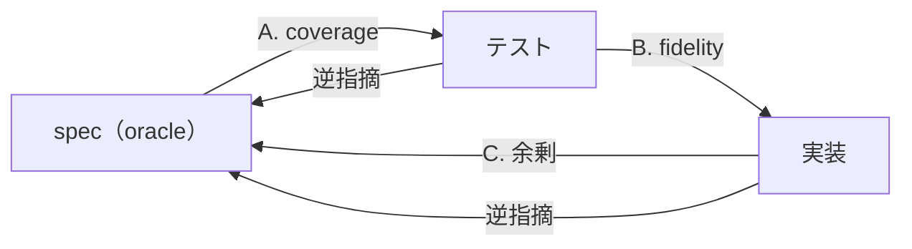

# SDD 適合性レビュー手続き（any-review 用）

any-review が sdd-standard と組み合わせるときに適用する、照合軸・指摘種別・出力形式。4軸は共有する入力（spec・テスト・実装の読解）が多いため1つのコンテキストで連続して照合し、書き手のバイアス対策は spec 起点（A）と実装起点（C）の双方向を必ず回すことで担保する。

既存のテストと実装が spec に適合しているかをレビューする。出力はギャップレポートと4軸の判定内訳で、テストは実行しない。

## レビューの4軸

3者（spec / テスト / 実装）の間を、矢印の向きごとに4つの軸で照合する。spec が oracle だが、**実装起点の照合（C. 余剰）を独立した軸として必ず回す** — spec 起点だけでは「spec にない実装」が見えない。



| 軸              | 照合する2者         | 問うこと                                                     | 出力する種別           |
| --------------- | ------------------- | ------------------------------------------------------------ | ---------------------- |
| **A. coverage** | spec ↔ テスト       | 振る舞いに対応テストが在るか・仕様書と同じ順序で並んでいるか | 漏れ / 過剰 / 順序ズレ |
| **B. fidelity** | テスト ↔ 実装       | テストは本当に振る舞いを叩いているか                         | 偽陽性 / 主語ズレ      |
| **C. 余剰**     | 実装 → spec         | 実装の観測可能な振る舞いはすべて spec に書いてあるか         | 余剰実装               |
| **逆指摘**      | 実装・テスト → spec | spec は一意か                                                | 曖昧                   |

spec を第一 oracle とするが、実装/テスト側から spec の曖昧さも逆指摘する（両方向）。spec が静的で完璧であることは前提としない — レビューの過程で仕様書側の不備も浮かび上がる。「実装にあって spec にない」は余剰（C）で実装起点に網羅的に拾う。

## 入力

1. **spec**（`spec/<feature-name>.md` または `SPEC.md`）。マトリクステーブル・状態遷移図・シーケンス図・フロー図で構造化済みの前提。
2. **既存テスト**。テストランナー設定と既存の命名規則を先に読み、`tests/`・`test/`・本番コードと同じディレクトリの `*.test.*` / `*.spec.*` を検出して読む。FW 混在（vitest/pytest 等）も許容する。
3. **既存本番コード**。テストが参照する実装と、公開入口を持つ `src/`・`lib/` 等の慣習上の本番コードを読む。

| 不足した入力 | 行動                                                                                                          | 出力                                                       |
| ------------ | ------------------------------------------------------------------------------------------------------------- | ---------------------------------------------------------- |
| spec         | レビューを停止し、spec の提示を質問する。                                                                     | `skip: spec がないため SDD 適合性レビューを開始できない。` |
| テスト       | テスト集合を空として coverage を照合し、全ての未テスト振る舞いを漏れとして報告する。fidelity は skip とする。 | 検出した場所と「テストなし」を判定内訳に記載する。         |
| 本番コード   | coverage を照合する。fidelity と余剰は skip とする。                                                          | 検出した場所と「本番コードなし」を判定内訳に記載する。     |

実装詳細（関数/クラス名・DB・エンドポイント）は spec で切り捨てられているため、spec に書かれていないものを推測で補完しない。

## 振る舞いの分解（照合の単位）

sdd-standard SKILL.md の「振る舞いの照合単位」に従い、spec のマトリクステーブル・状態遷移図・シーケンス図・フロー図を振る舞いの単位へ分解する。

### 実装の分解（C. 余剰用）

実装起点で照合するため、実装から観測可能な振る舞いを抽出する。spec と同じ「観測可能」の基準:

- **入口を拾う** — 公開エンドポイント・CLIコマンド・エクスポート関数・UI 要素など、ユーザーが触れる起点
- **入口ごとに分岐を拾う** — 入力・状態に対する結果の分岐（正常系・異常系・エラーコード・出力フォーマット）
- **拾わない** — 観測不能な内部最適化（アルゴリズム選択・リファクタ等価・キャッシュ等）。結果が同じなら spec に書かなくてよい

抽出した各振る舞いが spec のどこに対応するか確認する。対応する記述が無ければ **余剰実装（高）**。

## A. coverage（spec ↔ テスト）

spec を oracle にしてテストをレビューする:

- **漏れ（高）**: spec にある振る舞いでテストが存在しないもの。実装はあっても検証が無ければ漏れ。
- **過剰（低）**: テストが検証しているが spec に無い振る舞い。実装詳細への過干渉、または spec への追記候補。過剰 = 即バグではなく「spec に書くべきか削るべきか」の判断材料。

### 順序の一致

spec に現れる振る舞いの順序を基準に、対応するテストパターンも同じ順序で並んでいるか確認する。レビュー時に仕様書とテストを上下に見比べたとき、対応箇所が同じ位置関係になることを目的とする。

- spec の構造ごとに、文書上の出現順を振る舞いの順序とする。マトリクスは行順、状態遷移図は遷移の記載順、シーケンス図は観測点の時系列順。
- 対応テストは、同じ Feature / `describe` / テストクラス内で spec と同じ順序に置く。
- spec に対応しない追加テストは、対応テスト群の後ろに置く。対応テストの間に割り込んでいる場合も順序ズレとして指摘する。
- 対応関係と内容が正しくても順序だけが異なる場合は、**順序ズレ（低）** とする。

## B. fidelity（テスト ↔ 実装）

テストの Then と実装の責務を実装を読みながらレビューする（テストだけでは判定できない）:

- **偽陽性（高）**: テストが通るのに振る舞いを検証していないもの。
  - モック/stub で実装を叩いていない（依存を潰して結果を固定している）
  - Then が `expect(true).toBe(true)` 的な恒真
  - テストが通る経路と、spec が要求する経路が違う
- **主語のズレ（高）**: Then に置く値の主語が実装でないもの。Then には実装が保証する値のみ置ける。
  - 例: 「検索すると10件返る」— 10件は外部バックエンドが決める（実装の責務外）。実装が保証できる形（「件数10を指定してバックエンドへ問い合わせる」）を主語にすべき箇所として指摘する。

## C. 余剰（実装 → spec）

実装を読んで抽出した観測可能な振る舞い（前述「実装の分解」）が、spec に対応する記述を持つかをレビューする。**spec 起点の coverage（A）では「spec にない実装」は見えない。この実装起点の照合を独立して必ず回すことが、spec 外実装の1回検出に直結する。**

- **余剰実装（高）**: 実装にある観測可能な振る舞いが spec に書かれていない。レビューではこのギャップを指摘する。
  - エンドポイント・CLI・UI・公開関数など、ユーザーが触れる起点が spec に無い
  - 入力に対する結果の分岐（エラーコード・メッセージ・出力）が spec に無い
  - 「観測可能」なら高。観測不能な内部最適化は余剰に数えない（spec に書かなくてよい）

過剰（A）との切り分け: 過剰は「テストが spec 外を検証」、余剰は「実装が spec 外を実装」。過剰の根に実装の余剰があれば両方出るが、実装起点で網羅的に拾うのは余剰（C）の役割。修正案では spec への追記と実装の削除の選択肢を示せるが、どちらを採るかは人間が判断する。

## 逆指摘（実装/テスト → spec）

spec を第一 oracle とするが、レビューの過程で以下が見えた場合は spec 側の不備として指摘する:

- **曖昧（低）**: 複数テスト/実装が異なる解釈で動いている箇所。仕様書が一意に定まっていない。

これらは spec の修正を促す指摘として出力し、spec 自体は編集しない。

> 「実装/テストがあるが spec に記述が無い」は **C. 余剰（高）** として実装起点で網羅的に拾う。逆指摘（曖昧）とは別軸。

## 種別マトリクス

指摘の全種別を一覧（軸 × 重要度）:

| 種別         | 軸       | 重要度 | 一言でいうと                                                 |
| ------------ | -------- | ------ | ------------------------------------------------------------ |
| **漏れ**     | coverage | 高     | spec にある振る舞いにテストが無い                            |
| **過剰**     | coverage | 低     | テストが spec 外の振る舞いを検証している                     |
| **順序ズレ** | coverage | 低     | 対応テストが spec と同じ順序で並んでいない                   |
| **偽陽性**   | fidelity | 高     | 通るが振る舞いを検証していない（モック潰し・恒真・経路違い） |
| **主語ズレ** | fidelity | 高     | Then の主語が実装でなく外部依存値                            |
| **余剰実装** | 余剰     | 高     | 実装に観測可能な振る舞いがあるが spec に書かれていない       |
| **曖昧**     | 逆指摘   | 低     | spec が一意に定まっていない                                  |

## 出力形式

ギャップレポート。対象は編集しない。各指摘を次の形で出力し、問題・影響・修正案を分ける:

```markdown
### [軸 / 種別 / 重要度] 要約

- 場所: spec とテストまたは実装の該当箇所
- 問題: 現在の状態と規則・spec の不一致
- 影響: 放置したときに検証または振る舞いが失うもの
- 修正案: 不一致を解消する具体的な変更
```

| 項目       | 内容                                                                     |
| ---------- | ------------------------------------------------------------------------ |
| **軸**     | coverage / fidelity / 余剰 / 逆指摘                                      |
| **種別**   | 漏れ / 過剰 / 順序ズレ / 偽陽性 / 主語ズレ / 余剰実装 / 曖昧             |
| **重要度** | 高 / 低                                                                  |
| **場所**   | spec の該当箇所 + テスト/実装の該当箇所（ファイル:行 or テストタイトル） |
| **問題**   | spec または規則と不一致な観測可能な事実                                  |
| **影響**   | 不一致による具体的な検証漏れ・誤判定・仕様外振る舞い                     |
| **修正案** | 人間が採否を判断できる、対象と変更内容が明確な案。対象を編集しない。     |

指摘が0件の場合も、確認した各軸を省略せず、次の判定内訳を出力する。`n/n` や「適合している」だけで完了を報告しない。

| 軸       | 確認した観点                                            | 判定     | 根拠                         |
| -------- | ------------------------------------------------------- | -------- | ---------------------------- |
| coverage | spec の全振る舞いに対応テストがあり、順序が一致すること | 問題なし | 対応した spec とテストの場所 |
| fidelity | テストが実装の振る舞いを検証すること                    | 問題なし | 対応テストと実装の場所       |
| 余剰     | 実装の振る舞いが spec に対応すること                    | 問題なし | 対応した実装と spec の場所   |
| 逆指摘   | spec が一意に解釈できること                             | 問題なし | 対応した spec の場所         |

`判定` は `問題あり`、`問題なし`、`skip` のいずれかとし、`skip` には入力不足と未評価の軸を根拠へ記載する。

## セルフチェック

レビューを終える前に、以下をすべて満たすか。1つでも漏れていれば続きを行う:

- [ ] **実装の観測可能な振る舞いをすべて抽出し、それぞれが spec に対応するか確認したか（spec 外実装 = 余剰を見逃していないか）** — spec 起点では見えないため必須
- [ ] spec の構造（マトリクス/状態遷移/シーケンス/フロー図）のすべての振る舞いを、テストの有無まで確認したか
- [ ] 漏れ（coverage）をすべて挙げたか
- [ ] spec の振る舞い順と、対応テストの順序が一致しているか
- [ ] fidelity で、モック/stub で実装を叩いていないテストを見逃していないか
- [ ] Then の主語が実装でないテスト（外部依存値を claim）を見つけたか
- [ ] 各指摘に場所・問題・影響・修正案が付いているか
- [ ] 指摘がない軸も、確認した観点と根拠を判定内訳に記載したか

## 完成イメージ

入力（spec のマトリクス抜粋）:

| 入力           | 状態      | 結果                                        |
| -------------- | --------- | ------------------------------------------- |
| 未登録のメール | 初回      | 登録成功、その後サインイン可能              |
| 既存のメール   | 2回目以降 | 拒否（状態409・エラーコード email_taken）   |
| 空文字/@なし   | 任意      | 拒否（状態400・エラーコード invalid_email） |

既存テスト（vitest）:

```ts
describe("ユーザー登録", () => {
  it("未登録のメールアドレスで登録すると、その後サインインできる", () => {
    /* 本物のDBへ書き込み、サインインAPI を叩いて検証 */
  });
  it("既存のメールアドレスで登録すると状態409になる", () => {
    /* バックエンドをモックし、常に409を返すよう固定 */
  });
});
```

既存実装（抜粋）:

```ts
export async function register(email: string) {
  if (!email.includes("@")) return { status: 400, code: "invalid_email" };
  if (await db.find(email)) return { status: 409, code: "email_taken" };
  await db.insert(email);
  await mailer.send(email, "confirm"); // ← spec に無い振る舞い
  return { status: 201 };
}
```

出力（ギャップレポート）:

### [coverage / 漏れ / 高] 無効メール入力のテストがない

- 場所: spec「空文字/@なし → 状態400・invalid_email」
- 問題: 対応するテストが存在しない。
- 影響: `invalid_email` を返さない実装でも検証を通過できる。
- 修正案: 空文字と `@` を含まない入力で、状態400と `invalid_email` を確認するテストを追加する。

### [fidelity / 偽陽性 / 高] 既存メール登録テストが実装を検証していない

- 場所: 既存メール登録テスト
- 問題: バックエンドをモックで409固定にしており、実装のエラーマッピング経路を叩いていない。
- 影響: 実装が異なるエラーコードを返してもテストが通る。
- 修正案: 実装の既存メール判定を通し、状態409と `email_taken` を確認するテストに置き換える。

## 判定内訳

| 軸       | 確認した観点                   | 判定     | 根拠                          |
| -------- | ------------------------------ | -------- | ----------------------------- |
| coverage | 未登録メールの登録とサインイン | 問題なし | 対応テスト                    |
| fidelity | 未登録メールの登録経路         | 問題なし | 対応テストと `register()`     |
| 余剰     | `register()` の確認メール送信  | 問題あり | spec に対応する記述がない     |
| 逆指摘   | 既存メールのエラー結果         | 問題なし | spec の状態409・`email_taken` |

## この手続きがやらないこと

- テストを実行しない（通る/通らないは実装とテストを読んで判定する）。
- spec に無い実装詳細を推測で補完しない。足りなければ質問するか、情報不足として指摘する。
- コードの可読性・設計品質を審査しない（readable-code-standard / ponytail の領域）。本手続きは振る舞いの適合性のみを扱う。
- 対象（spec・テスト・本番コード）の編集は any-review の境界に従う。
