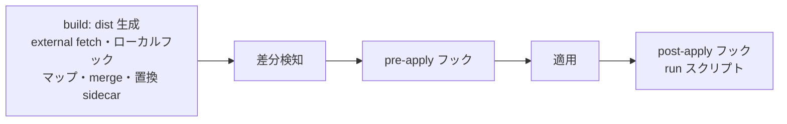

# dotfiles マネージャ spec

`dotfiles/` ツリーから `dist/` ツリーを生成し、dist の内容を home へ差分適用し、その前後でフックを実行するシステムの観測可能な振る舞いを定める。chezmoi を用いない構成における正本であり、読者はこの spec だけを読んで要件を go/no-go するユーザーと、実装・テストの担当者。

- 経路表記: 本文のパスは、build 側はリポジトリルートからの相対パス、差分検知と適用側は home 相対パスとする。
- 用語: home は展開先ディレクトリ（既定は `~`）。適用は dist の内容に home を一致させる処理。差分は dist と home の不一致。フックはライフサイクルの特定のポイントで実行されるリポジトリ内スクリプト。
- dist は home と同じ相対構造を持ち、人間向け記法（`.exact`・`.executable`・`.symlink`・`.run.<拡張子>`・置換 sidecar）は dist 上の名前のまま残る。これらの記法の解釈は適用処理が行う。
- chezmoi 命名（`dot_`・`exact_`・`executable_`・`symlink_` の source 名変換）は存在せず、dist に chezmoi の設定ファイル・state も現れない。

## ライフサイクル

`just apply` は次の順でステージを実行する。各ステージの失敗は終了コード非 0 で終了し、後続のステージを実行しない。



build ステージは、内部で次の順に処理する。

1. dist 再構築
2. マップによる除外（1 回目）
3. external fetch
4. ローカルフック実行
5. マップによる除外（2 回目）
6. マップ移動
7. merge 変換
8. 置換 sidecar

build が完了した dist が、差分検知の入力になる。

## コマンド

| コマンド | 結果 |
| --- | --- |
| `just apply` | ライフサイクル全体を実行し、home を dist の内容へ更新する |
| `just diff` | build と差分検知までを実行し、差分を表示する。home へ書き込まず、pre-apply 以降のフックと run スクリプトを実行しない |
| `just managed` | build を実行し、適用対象エントリの home 相対パス一覧を表示する。home を変更しない |

差分の表示は `scripts/diff.ts` が差分ありエントリごとに difftastic または git diff による 2 入力比較を表示する形式を維持する（§差分表示）。

## build: dist 再構築

dist を削除し、`dotfiles/` の完全なコピーとして作り直す。任意の階層の `node_modules/` はコピーしない。前回実行で dist にあった内容は残らない。

## build: マップ（.build-map.md）

`dotfiles/.build-map.md`（git 管理）は、dist 内のエントリの行き先を OS ごとに定める。先頭の Markdown table は `key`、`linux`、`windows`、`macos` の列をこの順で持ち、各行は一意なエントリのパスと 3 OS の値を表す。セルの前後の空白は無視する。値が空欄ならその OS ではマップせず、元の階層に置く。`-` は dist からの除外、それ以外の値は dist からの相対移動先である。

```md
| key | linux | windows | macos |
| --- | --- | --- | --- |
| docker | .docker/desktop | AppData/Roaming/Docker | - |
```

列名、列順、区切り行が不正なとき、行の列数が合わないとき、キーが空または重複するときは異常終了する。移動先が `/` で始まるときも異常終了する。キーが glob 文字（`*` `?` `[`）を含む場合、対応するセルには空欄または `-` のみを指定できる。これらの検査は実行 OS にかかわらず全セルへ行う。テーブルがない、または設定ファイルが存在しない場合も異常終了する。

`process.platform` が `win32` / `linux` / `darwin` のとき、`windows` / `linux` / `macos` の対応する列を使う。それ以外の値では異常終了する。空欄のセルと別 OS 列の値は合成せず、選択された OS の列だけを適用する。

### 除去

除去は 2 回行う。1 回目はコピーの直後・external fetch とローカルフックより前で、実行 OS の列で値が `-` のキーに一致するエントリを dist から取り除く。2 回目はローカルフック実行の直後で、フックが生成したエントリも除去の対象になる。除去は再帰的で、一致したディレクトリは配下ごと削除し、配下を走査しない。除去されたエントリは、移動の対象にならない。

キーの一致は、dist 内のパスを home 相対パスに見立てて判定する。見立ては、パスの各要素に次の規則を適用するものである。

| 項目 | 値 |
|---|---|
| 末尾が `.exact` のディレクトリ名 | `.exact` を取り除いた名前を使う |
| 末尾が `.exact` のファイル名 | そのまま使う |
| glob 文字を含まないキー（例: `.agents`、`.dsh/test`） | そのパスに一致する home 相対パスと、その配下のすべてのパス |
| glob 文字を含むキー（例: `**/sync_vscode_extensions.run.sh`） | 一致するパスと、一致したディレクトリ配下のすべてのパス |

glob は Bun の `Glob` と同じ方言で、`*` はセパレート 1 階層内、`**` は階層をまたいで一致する。キーはこの規則で home 相対パスに見立てたパスと照合されるため、`*.exact` 形式のキーはどのエントリにも一致しない。

### 移動

除去（2 回目）の後、実行 OS の列で値が空欄でも `-` でもないキーについて、移動元エントリ（ファイルまたはディレクトリ）を行き先へ移動する。配置先が既に存在するときは置き換える。移動元が dist に存在しないとき、そのキーは何もしない。

## build: ローカルフック

`dotfiles/` 以下に、名前が `.pre-build.ts` と完全一致する通常ファイルを置くと、ローカルフックとして扱う。ローカルフックは、フォルダ固有のファイルを dist へ生成するためのものである。

各フックを、独立した子プロセスとして `bun <フックファイルの絶対パス>` で実行する。

- `cwd`: マップ移動前の、フックを置いたフォルダに対応する dist 内のフォルダ
- 環境変数: 通常の親プロセス環境をそのまま継承する。追加の環境変数、専用 API、設定ファイルは提供しない
- フックは `process.cwd()` を生成物の出力先として使い、`import.meta.dir` から自身の source ファイルを参照できる

フックは対応する dist フォルダ以下へファイルを生成する。この出力範囲はフック作者が守る契約であり、システムはパス検証やサンドボックスを行わない。フック自身は dist へそのまま残るが、`.pre-build` で始まる名前は差分検知と適用の対象外である。フックが生成した `.pre-build.ts` も新しいフックとして検出・実行しない。

検出と順序:

1. `node_modules/` 以下を除き `dotfiles/` を再帰走査し、`.pre-build.ts` と完全一致する通常ファイルを検出する。
2. フックの親ディレクトリの相対パスでソートし、一つずつ実行する。比較はパスを `/` で分割した各要素の UTF-16 コード単位の昇順とし、片方が他方の接頭辞なら短い方を先にする。
3. 親フォルダのフックは子フォルダのフックより先に実行される。

フックの親ディレクトリ（`dotfiles/` からの相対パス）が、マップで値 `-` にマップされる home 相対パスのとき、そのフックを実行しない。スキップされたフックは起動されず、stdout・stderr にも何も出力しない。ルートのフックは常に実行する。

フックが終了コード非 0 で終了した、シグナルで終了した、またはエラーが発生したとき、エラーメッセージにフックの `dotfiles/` からの相対パスを含めて異常終了する。フックの stdout と stderr は親プロセスの同じ出力へ転送する。エラー発生後は後続のフックを実行しない。dist の rollback、build 間の lock、staging による原子的な置換は行わない。

## build: external fetch

設定ファイル `dotfiles/.build-external.yaml`（git 管理）に、Git リポジトリから取得して dist へ配置する外部エントリを定める。

```yaml
externalSkills:
  microsoft/playwright-cli:
    destination: .agents/skills.exact
    entries:
      - skills/playwright-cli
    ttlHours: 6
    run_after:
      - [node, packages/omo-codex/plugin/scripts/materialize-shared-upstreams.mjs, --strict]
    edit:
      "skills/playwright-cli/SKILL.md.$append": |
        追記するテキスト
```

キーは `<owner>/<repo>` 形式の GitHub リポジトリである。マップによる除外（1 回目）の後、ローカルフックの前に、各 repo についてミラーを同期し、その内容を配置する。

| 条件 | 操作 | 結果 |
| --- | --- | --- |
| ミラーが存在しない | リポジトリを shallow clone する | ミラーの内容が配置される |
| ミラーがあり、TTL 内 | 取得しない | ミラーの内容が配置される |
| ミラーがあり、TTL 超過 | pull する | 更新後の内容が配置される |
| pull が失敗した | pull を無視する | 既存ミラーの内容が配置され、警告が出る |
| clone が失敗した | — | 異常終了する |

- ミラーは `~/.mirrors/github.com/<owner>/<repo>` に保持する。
- TTL の既定は 6 時間で、`ttlHours` で上書きする。時間原点は、ミラーの `.git/build-pull-time` に記録した前回取得時刻であり、clone 成功時と pull 成功時に更新する。環境変数 `BUILD_FORCE_PULL=1` のときは TTL を無視して pull する。
- `entries` の各パスは、Bun Glob 方言でミラー内のディレクトリへ解決する。0 件または複数のディレクトリに一致したときは異常終了する。
- 配置先は `destination`（dist 相対パス）の直下である。既存ファイルは上書きせず、`.git` はコピーしない。
- `edit` の `<path>.$append` は、コピーする前に対応ファイルの末尾へテキストを追記する。`<path>` が `entries` のどのパスにも含まれないときは異常終了する。
- `run_after` は、ミラーの内容が更新されたときだけ、`git clean -fdX` の後に各コマンドをミラーを cwd として実行する。非 0 で終了したときは異常終了する。
- 配置されたエントリは、以後は通常のエントリとして差分検知・適用される。

## build: merge 変換

JSON/YAML/TOML の設定ファイルを、home 現状とリポジトリ側レイヤーから build 時に合成し、dist へ完成形を書き出す。

### 入力ファイルの種類

同一ディレクトリ内で、出力ファイル名 `<name>.{json,yaml,toml}` に対し、次の sidecar を使う。

| ファイル | 管理 | 役割 |
| --- | --- | --- |
| `<name>.{json,yaml,toml}` | git | plain base（リポジトリのベース本体。任意） |
| `<name>.merge.{json,yaml,toml}` | git | 共有 merge レイヤー（任意） |
| `<name>.machine.{json,yaml,toml}` | gitignore | マシン固有 merge レイヤー（任意） |

`<name>.merge.*` または `<name>.machine.*` のどちらかが存在するとき、その `<name>.{json,yaml,toml}` は merge ターゲットとなる。merge ターゲットでないファイルは、dist へそのまま残す。

### ターゲット解決

merge ターゲットごとに、次を決める。

- 出力パス: sidecar と同じディレクトリの `<name>.{json,yaml,toml}`
- home パス: 出力パスを、差分検知の対応関係（§差分検知）と同じ規則で home 相対パスへ変換したもの

sidecar 名から `<name>` への対応:

| sidecar | `<name>` |
| --- | --- |
| `foo.merge.json` | `foo.json` |
| `foo.machine.yaml` | `foo.yaml` |
| `foo.merge.toml` | `foo.toml` |
| `foo.machine.toml` | `foo.toml` |

同一 `<name>` に sidecar が複数あるときは 1 ターゲットにまとめる。

### レイヤーと適用順

merge ターゲットごとに、存在するレイヤーだけを次の順で合成する。合成の起点は `{}`（JSON・TOML。YAML パース結果が null/undefined のときも `{}` 扱い）。

| 順 | レイヤー | ソース |
| --- | --- | --- |
| 1 | home | 上記の home パス。ファイルが存在しない・空のとき `{}` |
| 2 | plain base | 同ディレクトリの `<name>.{json,yaml,toml}`（merge / machine ではないファイル） |
| 3 | merge | `<name>.merge.{json,yaml,toml}` |
| 4 | machine | `<name>.machine.{json,yaml,toml}` |

後段レイヤーほど優先される。各レイヤーへの適用は §パッチ適用 に従う。

### dist への出力

merge ターゲットごとに:

1. 合成結果を canonical 形式（§パッチ適用）で `<name>.{json,yaml,toml}` に書き出す。
2. 入力として使った sidecar（`*.merge.*`、`*.machine.*`）を dist から削除する。
3. plain base の `<name>.{json,yaml,toml}` が存在したとき、それも dist から削除する（完成形のみ残す）。

手書きの設定ファイルにも一般則が適用される。sidecar を置いたファイルは merge ターゲットとなり、その内容が plain base レイヤーとして合成され、完成形が dist に書き出される。sidecar を持たない plain ファイルは対象外で、dist にそのまま残る。

### 例

`rtk/config.merge.toml` のみ（plain base なし、マップ移動と組合せ）:

1. dist 再構築後: `dist/rtk/config.merge.toml`
2. マップ移動後: `dist/.config/rtk/config.merge.toml`
3. home パス: `~/.config/rtk/config.toml`
4. 合成: home → merge レイヤー
5. 出力: `dist/.config/rtk/config.toml`。`config.merge.toml` は削除

`.agents/config.exact/agents.yaml` + `agents.machine.yaml`（merge なし）:

1. 合成: home → plain base（`agents.yaml`）→ machine
2. 出力: `dist/.agents/config.exact/agents.yaml`。sidecar と plain base 生ファイルは削除

全レイヤー:

`foo.json` + `foo.merge.json` + `foo.machine.json` → 合成順 home → plain base → merge → machine → 出力 `foo.json`

## build: 置換 sidecar

`<name>.replace.yaml` で、home 現状への正規表現置換の列を宣言する。

```yaml
# dotfiles/<dir>/<name>.replace.yaml
replacements:
  - pattern: "(EnableAutoUpdates)=.*"
    replacement: "${1}=false"
```

merge 変換の後、`<name>.replace.yaml` があるとき次を処理する。

| 条件 | 操作 | 結果 |
| --- | --- | --- |
| home に `<name>` がある | その内容へ replacements を上から順に適用する | 置換結果を dist の `<name>` へ書き出す |
| home に `<name>` がない | 空文字列を入力として replacements を適用する | 置換結果を dist の `<name>` へ書き出す |

- pattern は JavaScript 正規表現、replacement は `${1}` 形式のキャプチャ参照を解釈する。pattern の一致箇所すべてを置換する。
- `<name>` の home パスは、§差分検知 の対応関係規則で完成形の dist 相対パスから解決する。
- どの pattern も一致しない入力は、変化せずそのまま出力になる。
- sidecar 自体は dist から削除され、dist には完成形 `<name>` だけが残る。
- 既存の `modify_` テンプレート 5 件（obs-studio 4、sharex 1）はこの形式へ書き替える。

## パッチ適用

merge 変換と置換 sidecar の入力となる構造化データ（JSON/YAML/TOML）は、ここで定義する 1 回分のパッチ適用に従う。

### 1 レイヤー内の処理順

1. 操作キー（下記）をレイヤー内の任意の深さから取り除く。
2. 残りのキーをベースへ深くマージする。
3. 取り除いた操作キーを下記の規則でベースへ適用する。

出力に操作キーは残らない。

### 深いマージ（通常キー）

同じキーが両方でプレーンオブジェクトのときだけ再帰し、それ以外（スカラー・配列・オブジェクトと非オブジェクトの組合せ）はレイヤー側の値で丸ごと置き換える。片側にだけあるキーの値は維持する。

### 操作キー（`$append` / `$remove` / `$replace` / `$unset`）

操作キーはレイヤー内の任意のオブジェクトに置ける。キー名が次の形式で、かつ認識条件を満たすものだけが操作キーになる。

```
<local>.$<op>
```

| 部分 | 内容 |
| --- | --- |
| `<local>` | そのオブジェクト内での操作対象の相対パス（例: `bundles`, `provider`） |
| `<op>` | `append` / `remove` / `replace` / `unset` のいずれか |

認識条件:

- `<op>` が上表の 4 種のいずれかである。
- `<local>` が空でない。
- `<local>` に `[` を含まない。

操作キーの `<path>` は、キーを置いたオブジェクトからレイヤーのルートまでの祖先キーを `.` で連結し、`<local>` を末尾に付けたものである。`<path>` に配列インデックス（`[0]` など）は書けない。

認識条件を満たさない `.$` を含むキー（例: `x.$nope`、`a[0].$replace`）は操作キーではなく通常キーとして扱い、深いマージでそのまま出力に残る。

操作キーの値は、その中をさらに走査せず、そのまま操作の値として扱う。

操作キーだけを含むオブジェクトは通常キーのマージに寄与せず、その祖先キーごと欠落として扱う。

### 操作の意味

| キー | `<path>` の値の型 | 値 | 結果 |
| --- | --- | --- | --- |
| `<path>.$append` | 配列 | 要素の配列 | 末尾に追加する。重複していても追加する |
| `<path>.$remove` | 配列 | マッチャの配列 | 一致する要素をすべて削除する（§配列要素の一致） |
| `<path>.$remove` | オブジェクト | キー名の配列 | 列挙されたキーを削除する |
| `<path>.$unset` | 任意 | `true` または値なし | `<path>` が指す値を親から削除する |
| `<path>.$replace` | 任意 | 任意 | `<path>` の値を値で丸ごと置き換える |

`$append` は配列にだけ適用できる。`$remove` は配列とオブジェクトに適用できる。`$replace` と `$unset` は任意の型に適用できる。

### 同一 `<path>` に複数操作があるとき

同じ `<path>` に対して複数の操作キーがあるとき、次の順で適用し、先に適用した結果を次の操作の入力とする。

1. `<path>.$replace` — 存在するとき、`<path>.$unset` / `<path>.$remove` / `<path>.$append` は無視する
2. `<path>.$unset`
3. `<path>.$remove`
4. `<path>.$append`

同じ `<path>.$<op>` のキーが複数あるとき（同一レイヤー内）、値は配列なら要素を連結し、それ以外は後勝ちで上書きする。

### 異なる `<path>` 間の適用順

同一レイヤー内に異なる `<path>` の操作キーが複数あるとき、レイヤー内での出現順に path を 1 つずつ処理し、ある path の操作適用結果を次の path の操作の入力とする。親 path と子 path の両方に操作を書いたとき、出力はレイヤー内での出現順に依存する。

### 配列要素の一致（`$remove` の削除対象）

マッチャと配列要素が次を満たすとき一致する。

| 配列要素の型 | 一致条件 |
| --- | --- |
| 文字列・数値・真偽・null | 値が等しい |
| 配列 | 長さが等しく、同じ位置の要素が一致する |
| オブジェクト | キー集合が等しく、各キーの値が一致する（キーの並びは問わない） |

### 出力形式（canonical）

merge ターゲットの完成形は、毎回同一形式で書き出す。

| 形式 | 規則 |
| --- | --- |
| JSON | 2 スペースインデント、末尾改行 1 つ、改行コード LF |
| YAML | YAML 形式、改行コード LF |
| TOML | TOML 形式、末尾改行 1 つ、改行コード LF |

JSON の merge / machine ファイルおよび plain base の JSON 入力にはコメント（JSONC）を書ける。TOML の merge / machine ファイルおよび plain base の TOML 入力にはコメントを書ける。

### 記述例

共有レイヤーで package を追加:

```jsonc
// settings.merge.json
{
  "packages.$append": [
    {
      "source": "https://github.com/makenotion/skills",
      "skills": ["skills/notion-cli"],
      "extensions": [],
      "prompts": [],
      "themes": []
    }
  ]
}
```

マシン固有で tiers を上書き:

```yaml
# config.machine.yaml
tiers:
  high:
    - provider: cursor
      model: grok-4.6:slow
```

ネストで操作キーを書く。次の 2 つは等価である:

```yaml
# config.machine.yaml
dsh:
  profile:
    "bundles.$replace":
      - provider: cursor
```

```yaml
# config.machine.yaml
"dsh.profile.bundles.$replace":
  - provider: cursor
```

TOML では `$` を含むキー名を quoted key で書く。次の 2 つは等価である:

```toml
# config.machine.toml
[dsh.profile]
"bundles.$replace" = [{ provider = "cursor" }]
```

```toml
# config.machine.toml
dsh.profile."bundles.$replace" = [{ provider = "cursor" }]
```

## 差分検知

dist を再帰走査し、home の対応するエントリと対照する。エントリの対応関係は、dist の相対パスを次の規則で home 相対パスへ変換したものとする。

| dist 上の名前 | 対応する home 相対パス |
| --- | --- |
| 通常の名前 | そのままの名前 |
| `<name>.exact`（ディレクトリ） | `<name>`（`.exact` を除いた名前） |
| `<name>.executable` | `<name>` |
| `<name>.symlink` | `<name>` |

内容の比較は次の正規化を行う。

- テキスト比較のとき、CR を除去した上で比較する（CRLF と LF を同一視する）。
- `.json` と `.jsonc` は、末尾カンマと空白の有無を無視して比較する。
- symlink は、リンク先（末尾改行 1 つを除いた内容）を比較する。
- 実行権は、linux と darwin で owner 実行権の有無を比較する。windows では実行権を比較しない。

dist の相対パスの各要素が、`.pre-build`・`.build`・`.pre-apply`・`.post-apply` のいずれかで始まるエントリは、差分検知と適用の対象外である。`.build` 接頭辞は build ステージの設定ファイル（マップ・external 設定）のための予約名である。

| dist | home | 分類 |
| --- | --- | --- |
| あり | あり・同種・内容と実行権が同一 | 変更なし |
| あり | あり・同種・内容または実行権が異なる | 変更 |
| あり | あり・種別が異なる（ファイル⇔ディレクトリ⇔symlink） | 種別不一致 |
| あり | なし | 追加 |
| なし | あり | 余剰 |

## 差分表示

`just diff` は、変更・種別不一致・追加・余剰（exact 対象）の各エントリごとに、difftastic または git diff による色付きの 2 入力比較を表示する。

| 条件（両ファイルの内容） | 表示 |
| --- | --- |
| 行末の違いのみが異なる | 出力しない |
| 両方が `.json` / `.jsonc` で、閉じ括弧直前の空白・末尾カンマの有無と行末の違いのみが異なる | 出力しない |
| それ以外の内容差分がある | diff を表示する |

- 行末の正規化: CR を除去し、末尾の `\n` を 1 個除去して比較する。CRLF と LF、末尾改行の有無の差分は表示しない
- 末尾カンマの正規化: 閉じ括弧（`}` と `]`）の直前に連続する空白・カンマを取り除いて比較する。文字列リテラル（`"..."`）の中は変更しない。JSONC コメントは解析せず、文字列外のテキストとして扱う
- `difft` が PATH にあり、両入力がファイルのときは `difft --color=always --display=inline --skip-unchanged --strip-cr=on --syntax-highlight=on` で、それ以外のときは `git diff --no-index --ignore-cr-at-eol --color=always` で表示する
- 追加エントリは dist 側を、削除エントリは home 側を、それぞれ空の入力として比較する
- diff ツールの終了コード（差分ありを表す 1 を含む）は `just diff` の終了コードに影響しない
- difftastic は構文木ベースで差分を取るため、JSON・JSONC の空白・コメント・カンマの差分は difftastic 使用時には表示されない

## 適用

分類ごとに次の操作を行う。操作順序は、削除伝播・種別不一致の解消を先に行い、その後ツリー順に追加・変更を適用する。

| 分類 | 操作 | 結果 |
| --- | --- | --- |
| 追加 | 親ディレクトリを必要に応じて作成し、エントリを配置する | home に dist と同じ内容のエントリが現れる |
| 変更（内容） | 一時ファイルへ書き出した後、rename で置換する | home の内容が dist と一致する。書き込み途中の状態が home に現れない |
| 変更（実行権） | 実行権を設定する | home の実行権が dist の規則と一致する |
| 変更（symlink のリンク先） | 既存リンクを削除し、改めて symlink を作成する | リンク先が一致する |
| 種別不一致 | home 側エントリを削除し、追加として処理する | home に dist と同種のエントリが現れる |
| 余剰（`.exact` ディレクトリ配下） | 削除する | home から消える |
| 余剰（それ以外） | 何もしない | home に残る |

適用処理の間、エラーが発生したときは後続のエントリを適用せず、終了コード非 0 で終了する。既に適用したエントリを元に戻さない。

### `.exact` の解釈

dist の `<name>.exact` ディレクトリは、home の `<name>` ディレクトリに対応し、直下の余剰エントリを常に削除する。余剰がディレクトリのときはその配下ごと消える。`.exact` ディレクトリの子ディレクトリの内部は余剰管理の対象外であり、home 側だけのファイルは残る。

### `.symlink` の解釈

dist の `<name>.symlink` ファイルは、home の `<name>` へ symlink として配置する。リンク先はファイル内容（末尾改行 1 つを除く）で、相対パスはリンクが置かれるディレクトリから解決する。既存 symlink のリンク先が一致するとき、再作成しない。

### `.executable` の解釈

dist の `<name>.executable` ファイルは、home の `<name>` に owner 実行権を付けて配置する。windows では実行権の処理を行わず、ファイル名はそのまま使う。

## フックシステム

フックはフォルダ置き型で、ポイントごとに決まった名前のファイルを `dotfiles/` の任意のフォルダへ置くことで宣言する。

| ポイント | 宣言ファイル | 実行タイミング | 標準入力 | 失敗時の結果 |
| --- | --- | --- | --- | --- |
| build | `.pre-build.ts` | dist 生成中（§build: ローカルフック のとおり） | なし | dist 生成を中断する |
| pre-apply | `.pre-apply.ts` | 差分検知の後、適用の前 | そのフォルダ配下の差分の JSON | 適用を実行せず、非 0 で終了する |
| post-apply | `.post-apply.ts` | 適用の後 | そのフォルダ配下の適用結果の JSON | 後続のフック・run スクリプトを実行せず、非 0 で終了する |

差分情報の JSON 形式:

```json
{ "added": ["home 相対パス"], "changed": ["home 相対パス"], "removed": ["home 相対パス"] }
```

- pre-apply には差分検知の結果（適用予定のうち追加・変更・削除となるパス）を渡す。
- post-apply には実際に適用したパスを渡す。変更なし・余剰（何もしない）は含まない。
- パスは home 相対で、フックを置いたフォルダ配下のものだけを含む。ルートに置いたフックは全体の差分を受け取る。

pre-apply・post-apply フックの実行方法はローカルフックと同じである。独立した子プロセスとして `bun <フックファイルの絶対パス>` で実行し、stdout と stderr は親プロセスへ転送する。実行順序はフォルダの相対パスによるソート順（親フォルダが先）で、pre-apply はすべての pre-apply フックが成功した後に適用を開始する。

pre-apply・post-apply フックの cwd は、フックを置いたフォルダに対応する home ディレクトリである。pre-apply の実行時点では home はまだ適用前の状態であり、post-apply の実行時点では適用後の状態である。

## run スクリプト

| 条件 | 操作 | 結果 |
| --- | --- | --- |
| dist に `.run.<拡張子>` で終わるファイルがある | home へ配置せず、post-apply ポイントで実行する | スクリプトの副作用が生じる |
| ファイルに shebang がある | その interpreter で実行する | |
| ファイルの拡張子が `.ps1` | pwsh で実行する | |
| 実行のたび | 実行ディレクトリは、そのファイルの位置（`.exact` を除いた名前）に対応する home ディレクトリである | 対応する home ディレクトリを cwd としてスクリプトが動く |
| 実行が非 0 で終了する | 後続の run スクリプトを実行せず、非 0 で終了する | |

実行順序は、フォルダの相対パス、次にファイル名の昇順とする。run スクリプトの実行は post-apply フックの後に続く post-apply ライフサイクルの一部であり、`just diff` では実行しない。

## エラーと終了コード

| ステージ | 失敗時の結果 |
| --- | --- |
| build（external fetch・ローカルフック・merge・置換 sidecar を含む） | 非 0 で終了する。後続ステージを実行しない |
| 差分検知 | 非 0 で終了する。適用しない |
| pre-apply フック | 非 0 で終了する。適用しない |
| 適用 | 後続のエントリを適用せず非 0 で終了する。既に適用した分を戻さない |
| post-apply フック・run スクリプト | 後続を実行せず非 0 で終了する |

build 内のデータ変換エラーのメッセージと振る舞い:

| 条件 | 振る舞い |
| --- | --- |
| `<path>.$append` の `<path>` が配列でない | `merge append requires array at path: <path>` を出力して異常終了 |
| `<path>.$remove` の `<path>` が配列でもオブジェクトでもない | `merge remove requires array or object at path: <path>` を出力して異常終了 |
| `<path>.$append` / `<path>.$remove` の値が配列でない | `merge <op> value must be array: <path>.$<op>` を出力して異常終了 |
| `<path>.$remove`（オブジェクト）の値の要素が文字列でない | `merge remove object keys must be strings: <path>.$<op>` を出力して異常終了 |
| `<path>` がベースに存在しない（`$unset` / `$remove` / `$replace`） | 何もしない（エラーにしない） |
| `<path>` がベースに存在しない（`$append`） | `merge append path not found: <path>` を出力して異常終了 |

エラーメッセージには、失敗したフックの相対パスまたはエントリの home 相対パスを含める。エラー発生後は後続の処理を行わず、dist の rollback や build 間の lock は行わない。
